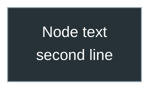

# CLAUDE.md — Agent-Oriented Guide: PY-Course-Victor-Nikoriak-22-09-2026

> Authoritative entry point for AI agents working in this repository.
> Read this file entirely before touching code, notebooks, or tooling.
> This repo is the **v5.0 migration target**, replacing `PY-Course-Victor-Nikoriak-23_02`. See `.claude/plan_md/migration_plan.md` for the full migration plan and current phase.

---

## Course Identity

| Field | Value |
|-------|-------|
| **Name** | PY Course — Viktor Nikoriak |
| **Language** | Ukrainian (primary), English (technical terms) |
| **Level** | Beginner → Intermediate Python |
| **Instructor** | Viktor Nikoriak (Hydrologist, PhD student, Python Developer) |
| **GitHub** | https://github.com/NikoriakViktot/PY-Course-Victor-Nikoriak-22-09-2026 |
| **Audience** | Ukrainian-speaking students, groups 1–4 |
| **Architecture** | Theory lives as an MkDocs "book" under `docs/` (see `mkdocs.yml`); lesson notebooks keep short in-context explanation + task, not full theory. |

---

## Repository Structure (current — not aspirational)

```
PY-Course-Victor-Nikoriak-22-09-2026/
├── CLAUDE.md                   ← this file
├── README.md                   ← short student-facing entry point (Ukrainian)
├── course.yaml                 ← Course/module config (source of truth; used by Django LMS sync)
├── course.json                 ← Course/module config (generated mirror of course.yaml)
├── mkdocs.yml                  ← book config (MkDocs Material)
├── requirements-docs.txt       ← deps for building the book (mkdocs-material)
├── architecture.md, instructor.md
│
├── docs/                       ← the book (docs_dir for mkdocs)
│   ├── index.md
│   ├── stylesheets/extra.css, javascripts/sidebars.js ← custom styles; header buttons that collapse the left nav / right TOC (state in localStorage)
│   ├── 00_getting_started/     ← git/environment/homework-workflow/troubleshooting + github/ subsection
│   ├── modules/                ← per-module stub pages (М1–М6 + AI bonus), content pending
│   └── 00_python_mental_model.md, 01_zen_of_python.md, git-cheatsheet.md
│
├── module_1/                   ← М1. Python Core
│   ├── docs/                   ← Module 1 reference notebooks (separate from the top-level docs/ book)
│   └── lessons/                ← lesson_01_… through lesson_17_… (v5.0 lessons 1–17)
├── module_2/
│   └── lessons/                ← lesson_18_functions_first_class/ … lesson_28_practicum_data_structures/ (all of М2)
├── module_3/
│   └── lessons/                ← lesson_29_sql_basics/, lesson_30_redis_overview/ (all of М3; bonus pandas lesson pending — see «Bonus lessons»)
│
├── tools/
│   ├── sync_notebook_metadata.py ← generates the Colab badge + metadata.lms of every notebook
│   └── lessons_v5.json         ← v5.0 lesson titles (1–52), stream slug
│
├── assignments/                ← empty — homework not migrated yet
├── certificates/                ← beetroot_python_2021.md only
│
├── .claude/plan_md/            ← migration plan + per-module audits (migration_plan.md, module_1_audit.md, …)
├── data/                       ← gitignored — source material, not published
│   ├── PY_UKR_Navigation_table_5 [UPDATE].xlsx   ← authoritative v5.0 curriculum source
│   └── v.5.0/, Модуль 1. Python core/            ← legacy raw source material
│
└── .github/workflows/
    ├── docs.yml                ← builds/publishes docs/ to GitHub Pages on push
    └── notebooks.yml           ← runs tools/sync_notebook_metadata.py --check on push/PR
```

**Not yet migrated from the old repo** (planned, not present): `module_4/`, `SETUP.md`, `install_course.*`/`start_course.*`, `dashboard.ipynb`, the old `tools/` scripts (`generate_student.py`, `qa_suite.py`, `client.py`, `config.json` — `tools/` currently holds only the notebook-metadata sync), `generator/`, `run_data/`, `docker-compose.yml`. The old `module_5` (Django/DevOps content) is **deliberately not migrated** — it isn't part of the v5.0 navigation table; see `.claude/plan_md/migration_plan.md` §0. Do not assume any of these exist without checking.

---

## Lesson Structure & Naming Convention

### Folder naming
```
module_<N>/lessons/lesson_<NN>_<topic_slug>/
```
`NN` is the **v5.0 lesson number** from the navigation table — numbering runs through the whole course (1–52) and does not restart per module.
Examples: `module_1/lessons/lesson_05_lists_tuples_sets/`, `module_2/lessons/lesson_18_functions_first_class/`.
`<topic_slug>` becomes the notebook's `metadata.lms.lesson_slug` (see LMS Metadata), so renaming a folder changes the slug.

Materials from the old 23_02 course live in the folder of the v5.0 lesson they belong to (mapping and rationale: `.claude/plan_md/module_1_audit.md`).

### Bonus lessons (outside the 1–52 numbering)

The instructor can add a lesson that is not in the v5.0 table without renumbering the course:

```
module_<N>/bonus/<slug>/        e.g. module_3/bonus/pandas_data_analysis/
docs/modules/mN/bonus_<topic>.md
```

- register it in `tools/lessons_v5.json` → `"bonus": {"<slug>": {"module": N, "after": <lesson it follows>, "title": "Бонус. …"}}`; `sync_notebook_metadata.py` rejects unknown bonus slugs;
- its notebooks get `metadata.lms.lesson_number: null` and `lesson_slug = <slug>`;
- in `mkdocs.yml` put it in its module's nav right after lesson `after`, titled «Бонус. …»;
- `course.yaml` / `course.json` are **not** changed (they list only v5.0 numbers).

Current bonus lessons: `pandas_data_analysis` (module 3, before lesson 29) — instructor's decision: Python is primarily data science today, so М3 opens with pandas, charts and Dash; databases follow.

### Files inside each lesson

| File pattern | Purpose |
|---|---|
| `note_lesson_NN_*.ipynb` | Main v5.0 lesson notebook (linked from the book page `docs/modules/mN/lesson_NN.md`) |
| `*_student.ipynb` | Student-facing notebook (solutions stripped) |
| `konspekt_*.ipynb` or `notes_*.ipynb` | Instructor lecture notes |
| `python_lesson_*_grup_N.ipynb` | Group-specific variant (groups 1–4) |
| `final_project_auto.ipynb` | Automated final project for the lesson |
| `*.py` modules | Example modules taught in the lesson |
| `<project>/` subfolder | Mini-project (e.g., `calculator_project/`) |

### Notebook cell conventions

```python
# Protected system cell (do NOT remove or reorder)
# Cell has metadata: {"tags": ["instructor"]} + {"hide_input": true}
SYSTEM_READY = True
COMPLETED_TASKS = []

def require_system():
    ...

def require_student(student_name):
    ...
```

- **🔒 protected cells** — `"tags": ["instructor"]` — students cannot edit
- **Solution blocks** — wrapped in `# BEGIN SOLUTION … # END SOLUTION`
- `tools/generate_student.py` strips solution blocks to produce `*_student.ipynb`

### Kernel metadata (all notebooks must use this)
```json
{
  "kernelspec": {
    "display_name": "Python Course (.venv)",
    "name": "python-course"
  },
  "language_info": { "name": "python", "version": "3.10.0" }
}
```

### Colab badge & `metadata.lms` — generated, never hand-edited

Every notebook under `module_*/` gets two things from `tools/sync_notebook_metadata.py`, derived from **where the file lives**:

- **cell 0** — markdown cell with `id: view-in-github` holding the "Open in Colab" badge →
  `https://colab.research.google.com/github/NikoriakViktot/PY-Course-Victor-Nikoriak-22-09-2026/blob/main/<path>`;
  plus `metadata.colab.include_colab_link: true`;
- **`metadata.lms`** — see LMS Metadata below.

It also rewrites relative links in markdown cells to absolute URLs (relative links don't resolve in Colab) and puts a Colab badge next to every GitHub notebook link in `docs/**/*.md`, failing on links to files that don't exist.

```bash
python tools/sync_notebook_metadata.py          # fix in place — run after adding/moving/renaming a notebook
python tools/sync_notebook_metadata.py --check  # report only, exit 1 on drift (CI: .github/workflows/notebooks.yml)
```

Why this exists: notebooks copied from 23_02 kept badges pointing at `PY-Course-Victor-Nikoriak-23_02/blob/main/<file>.ipynb` (old repo, repo root), so Colab failed with "Could not find … .ipynb". When saving from Colab ("File → Save a copy in GitHub"), always type the **full path** (`module_1/lessons/lesson_NN_…/file.ipynb`) — Colab defaults to the bare filename, i.e. the repo root. Student/teacher Colab guide: `docs/00_getting_started/colab.md`.

---

## Tools & Automation

> ⚠️ Apart from `tools/sync_notebook_metadata.py` (above), none of the old `tools/` scripts, `generator/` or `dashboard.ipynb` have been migrated into this repo yet — this section documents the intended tooling from the old repo for when that migration phase happens. Don't reference these paths as if they exist here.

### generate_student.py — Create student notebooks
```bash
# Strip solutions from all master notebooks
python tools/generate_student.py --all

# Strip a specific notebook
python tools/generate_student.py module_1/lessons/lesson_04_conditions_and_control/notes_bool_logic.ipynb
```
- Removes all `# BEGIN SOLUTION … # END SOLUTION` blocks
- Removes cells tagged `"instructor"`
- Output: `*_student.ipynb` in same folder

### qa_suite.py — QA & load testing
```bash
python tools/qa_suite.py --unit        # Unit tests for API
python tools/qa_suite.py --lesson4     # Tests for lesson 4
python tools/qa_suite.py --lesson5     # Tests for lesson 5
python tools/qa_suite.py --progress    # Progress tracking tests
python tools/qa_suite.py --load        # Simulate 20 concurrent students (10 workers)
```

### config.json — Active lesson control
```json
{
  "lessons": {
    "04_exam": { "active": true,  "task_ids": [...] },
    "05_exam": { "active": false, "task_ids": [...] }
  }
}
```
Set `active: true` to enable a lesson's API submission endpoint.

### dashboard.ipynb — Admin scoreboard
- Run with Jupyter (not Voila)
- Fetches live data from Google Apps Script
- Shows leaderboard with Bronze/Silver/Gold/Platinum levels
- Color coding: 🟢 ≥70% · 🟡 40–69% · 🔴 <40%

---

## Student GitHub Workflow (Submission Process)

```
Instructor repo (upstream)
        │  fork
        ▼
Student repo (origin)
        │  clone locally
        ▼
git checkout -b homework-04
        │  work on assignment
        ▼
git add . && git commit -m "Homework 04"
git push origin homework-04
        │  open PR: homework-04 → main
        ▼
Instructor reviews → comments in PR
        │  student fixes
        ▼
git add . && git commit -m "Fix after review"
(PR updates automatically)
```

---

## Environment Setup

```bash
# Install (creates .venv)
python install_course.py          # cross-platform
install_course.bat                # Windows shortcut

# Launch (Voila test mode)
python start_course.py            # interactive menu → opens http://localhost:8891
start_course.bat                  # Windows shortcut

# Manual Jupyter editing mode
.venv/Scripts/activate            # Windows
source .venv/bin/activate         # macOS/Linux
jupyter notebook
```

**Python version:** 3.10+
**Key dependencies:** voila, ipywidgets, numpy, pandas, matplotlib, seaborn, scikit-learn, requests, sympy

---

## API & Backend

- **Backend:** Google Apps Script (URL in `tools/config.json`)
- **Auth:** `ADMIN_KEY` from `.env` (64-char hash, keep secret)
- **Submission endpoint:** POST — student task results
- **Progress endpoint:** GET — per-student completion data
- **Client:** `tools/client.py` (token-based session management)

**Rule:** Never hardcode the `ADMIN_KEY` in notebooks or source files.

---

## Pedagogical Philosophy (for content generation)

### 5 Core Python Mental Model Concepts (from `module_1/docs/00_python_mental_model.md`)
1. **Interpreter** — Python is a program that runs `.py` files
2. **pip** — package manager; installs into the active environment
3. **venv** — isolated environment; always activate before installing
4. **IDE** — a tool, not the language (PyCharm, VS Code)
5. **Notebook** — interface to a running kernel (not a standalone program)

**Golden Rule for students:** Activate env → Install → Run

### Zen of Python (from `module_1/docs/01_zen_of_python.md`)
Integrate these principles in all new lesson content:
- Beautiful > ugly · Explicit > implicit · Simple > complex
- Readability counts · One obvious way · Errors should never pass silently

---

## LMS Metadata — Required in Every Notebook

> ⚠️ **Not connected yet.** The Django 5 LMS (`Python_Curse`) still points `GITHUB_COURSE_REPO` at the old repo (`PY-Course-Victor-Nikoriak-23_02`), not this one — switching it over is the last phase of the migration (see `.claude/plan_md/migration_plan.md`). The block below documents the metadata contract this repo must eventually satisfy, not something already wired up here.
>
> Once connected: this repository becomes a **Django 5 LMS** (Python_Curse project) source. Students log in via GitHub OAuth and access notebooks through the LMS. `main` branch is the **single source of truth** for the LMS sync.

### How sync works

```
GitHub push → webhook → Django server
    → sync_lessons  reads notebooks from repo → creates ContentNode per lesson
    → sync_exams    reads server-side JSON files → links Exam to ContentNode
```

`sync_lessons` uses `metadata.lms.lesson_slug` to set `ContentNode.slug`.
`sync_exams` matches `exam_json.lesson_id` to `ContentNode.slug`.
**These two must match for exams to work.**

### Required `lms` block in every notebook's metadata

Generated by `tools/sync_notebook_metadata.py` — don't write it by hand. Example
(`module_1/lessons/lesson_05_lists_tuples_sets/notes_lists_tuples_sets.ipynb`):

```json
{
  "lms": {
    "course": "python-course",
    "stream": "autumn-2026",
    "module_number": 1,
    "module_slug": "python-core",
    "module_title": "Module 1 — Python Core",
    "lesson_number": 5,
    "lesson_slug": "lists_tuples_sets",
    "lesson_title": "Списки, кортежі та множини",
    "notebook_type": "notes",
    "notebook_path": "module_1/lessons/lesson_05_lists_tuples_sets/notes_lists_tuples_sets.ipynb",
    "version": 1
  }
}
```

| Field | Value | Source |
|-------|-------|--------|
| `course` | `"python-course"` | `tools/lessons_v5.json` |
| `stream` | `"autumn-2026"` (stream 22_09) | `tools/lessons_v5.json` |
| `module_number` / `module_slug` / `module_title` | parent module | `module_N/` + `course.json` |
| `lesson_number` | v5.0 lesson number (1–52) | `NN` in `lesson_NN_<slug>/` (must be in the module's `lessons` in `course.json`) |
| `lesson_slug` | **folder slug** | `<slug>` in `lesson_NN_<slug>/` — must match `lesson_id` in the server-side exam JSON |
| `lesson_title` | Ukrainian v5.0 title | `tools/lessons_v5.json` |
| `notebook_type` | `"notes"` (`note_*`/`notes_*`), `"lesson"` (other), `"docs"` (`module_N/docs/`) | kept if already set |
| `notebook_path` | repo-relative path | file location |
| `version` | `1` | kept if already set |

Reference notebooks in `module_N/docs/` get `lesson_number: null` and keep their own `lesson_slug`/`lesson_title`.

### Exam JSON (`data/lesson_NN_exam.json`) — server-side

```json
{
  "lesson_id": "variables_and_data_types",
  "title": "Exam Title",
  "version": 2,
  "questions": [ ... ]
}
```

`lesson_id` MUST match `lms.lesson_slug` in the corresponding notebook.

### Current lesson slugs

`lesson_slug` is always the folder slug — no exceptions.

| Lesson | Directory | `lesson_slug` | Old 23_02 slug (exam JSON `lesson_id`) |
|--------|-----------|---------------|------------------------------|
| 1 | `module_1/lessons/lesson_01_intro_and_course_format` | `intro_and_course_format` | — |
| 2 | `module_1/lessons/lesson_02_first_steps_environment_setup` | `first_steps_environment_setup` | — |
| 3 | `module_1/lessons/lesson_03_variables_and_data_types` | `variables_and_data_types` | `variables_and_data_types` (same) |
| 4 | `module_1/lessons/lesson_04_conditions_and_control` | `conditions_and_control` | `boolean_logic_and_control` |
| 5 | `module_1/lessons/lesson_05_lists_tuples_sets` | `lists_tuples_sets` | `lists_tuples_sets` (same, was lesson 06) |
| 6 | `module_1/lessons/lesson_06_dicts_loops_comprehensions` | `dicts_loops_comprehensions` | `loops_dicts_comprehensions` |
| 7 | `module_1/lessons/lesson_07_functions` | `functions` | `functions` (same, was lesson 08) |
| 8 | `module_1/lessons/lesson_08_practicum_big_o` | `practicum_big_o` | — |
| 9 | `module_1/lessons/lesson_09_decorators` | `decorators` | — |
| 10 | `module_1/lessons/lesson_10_iterators_generators` | `iterators_generators` | — |
| 11 | `module_1/lessons/lesson_11_practicum_search` | `practicum_search` | — |
| 12 | `module_1/lessons/lesson_12_modules_stdlib` | `modules_stdlib` | `modules_standard_library`, `modules_imports_cli` |
| 13 | `module_1/lessons/lesson_13_exceptions` | `exceptions` | `exceptions_error_handling` |
| 14 | `module_1/lessons/lesson_14_file_io_json` | `file_io_json` | `file_io_json` (same, was lesson 11) |
| 15 | `module_1/lessons/lesson_15_git_github_system` | `git_github_system` | — |
| 16 | `module_1/lessons/lesson_16_practicum_hashing` | `practicum_hashing` | — |
| 17 | `module_1/lessons/lesson_17_module1_review` | `module1_review` | `module_01_final_exam` |
| 18 | `module_2/lessons/lesson_18_functions_first_class` | `functions_first_class` | — |
| 19 | `module_2/lessons/lesson_19_classes_namespace` | `classes_namespace` | — |
| 20 | `module_2/lessons/lesson_20_inheritance_polymorphism` | `inheritance_polymorphism` | — |
| 21 | `module_2/lessons/lesson_21_encapsulation_scope` | `encapsulation_scope` | — |
| 22 | `module_2/lessons/lesson_22_practicum_recursion` | `practicum_recursion` | — |
| 23 | `module_2/lessons/lesson_23_property_decorators_dunder` | `property_decorators_dunder` | — |
| 24 | `module_2/lessons/lesson_24_iterators_advanced` | `iterators_advanced` | — |
| 25 | `module_2/lessons/lesson_25_pytest_testing` | `pytest_testing` | — |
| 26 | `module_2/lessons/lesson_26_practicum_dp_greedy` | `practicum_dp_greedy` | — |
| 27 | `module_2/lessons/lesson_27_concurrency_intro` | `concurrency_intro` | — |
| 28 | `module_2/lessons/lesson_28_practicum_data_structures` | `practicum_data_structures` | — |
| 29 | `module_3/lessons/lesson_29_sql_basics` | `sql_basics` | — |
| 30 | `module_3/lessons/lesson_30_redis_overview` | `redis_overview` | — |

> ⚠️ When the LMS is switched to this repo, server-side exam JSONs from 23_02 whose `lesson_id` differs
> from the new slug (last column) must be renamed to the new slug, otherwise `sync_exams` reports
> "Lesson not found for lesson_id".

### After adding metadata — run on server

```bash
make sync-lessons   # creates/updates ContentNode in Django DB
make sync-exams     # links exam JSON to ContentNode
```

### Troubleshooting sync

If `sync_exams` says "Lesson not found for lesson_id":
1. Check `lesson_slug` in notebook metadata matches `lesson_id` in exam JSON
2. Run `make sync-lessons` first, then `make sync-exams`
3. Query actual slugs in DB:
   ```bash
   docker compose exec web python manage.py shell -c "
   from apps.courses.models import ContentNode
   print(list(ContentNode.objects.filter(type='lesson').values_list('slug', flat=True).order_by('order')))
   "
   ```

---

## Adding a New Lesson

1. Create `module_N/lessons/lesson_NN_topic_slug/` following the naming convention (`NN` = v5.0 lesson number; `topic_slug` becomes `lesson_slug`)
2. Create `__init__.py` (empty)
3. Write **master notebook** (instructor version with full solutions)
4. **Run `python tools/sync_notebook_metadata.py`** — adds the Colab badge and the full `lms` block (incl. `module_*` and `notebook_path`); required for Colab and Django sync. A lesson number outside `tools/lessons_v5.json` needs its title added there first
5. Add protected system cell with `SYSTEM_READY`, `COMPLETED_TASKS`, `require_system()`, `require_student()`
6. Wrap solutions in `# BEGIN SOLUTION … # END SOLUTION`
7. Tag instructor-only cells with `"tags": ["instructor"]`
8. Run `python tools/generate_student.py module_N/lessons/lesson_NN_topic_slug/` to produce `*_student.ipynb`
9. Add lesson config to `tools/config.json`
10. `course.yaml` / `course.json` already list all v5.0 lesson numbers per module — change them only for a lesson outside the v5.0 table
11. Run `python tools/qa_suite.py --unit` to verify API integration
12. Add a step-by-step Mermaid diagram for every algorithm the lesson teaches and an architecture diagram for its `{#architecture}` section (see Mermaid Diagram Standards)
13. Push to `main` → webhook triggers `sync_lessons` automatically

---

## Mermaid Diagram Standards

> Apply to every Mermaid block: book pages `docs/**/*.md`, `diagrams_lesson_NN_*.md` files, notebooks.

### Algorithm & architecture diagrams — mandatory

Students remember an algorithm when they **see it run**. So diagrams are not decoration — they are part of every lesson:

1. **Every algorithm or control-flow construct a lesson explains** (`if/elif`, loops, `break`/`continue`, `match`, search, sorting, recursion, greedy, DP, …) gets a **step-by-step execution diagram**, not only a generic flowchart:
   - one `subgraph` per step / iteration / pass, titled with what happens (`"ітерація 2: cooked = 1 → 2"`);
   - the **state** is shown in the nodes: loop variables, `lo/mid/hi`, `last_end`, `dp[i]`, the list after each pass;
   - classes carry meaning: `step` — neutral state, `warning` — the element/decision being processed now, `success` — taken / condition true / final result, `error` — rejected / condition false;
   - use the same concrete data as the code example next to it, so the diagram and the printed output can be compared line by line.
   - layout for traces: `flowchart TD` with `direction LR` inside each `subgraph`, and link **the subgraphs** (`P1 --> P2 --> P3`), not nodes inside them — Mermaid ignores a subgraph's `direction` when an edge crosses its border; a long single-row `flowchart LR` shrinks to unreadable on the page. Stack unlinked subgraphs with `A ~~~ B`.
2. **Several approaches in one lesson** (e.g. greedy vs DP, linear vs binary search) → end with a `flowchart TD` «як обрати».
3. **Architecture** — every M2+ `## Архітектура … { #architecture }` section, and later lessons on projects/Django/DB, gets a diagram of the architectural decision: components, who depends on whom, data flow; `classDiagram` / `graph LR` for structure, `sequenceDiagram` for calls over time.
4. **Reference for the style**: the old course `PY-Course-Victor-Nikoriak-23_02`, `module_3/lessons/lesson_27_sorting/diagrams_lesson_27_sorting.md` (a section per algorithm, a `subgraph` per pass, a final «how to choose» flowchart); also `lesson_25_search_hashing`, `lesson_26_trees`, `lesson_28_graphs`.
5. **Verify rendering**: `mkdocs build --strict` plus opening the page in a browser (Playwright) — no "Syntax error in text". A diagram that doesn't render is worse than none.

When editing an existing lesson, add a missing step-by-step diagram for the algorithm it teaches (status per lesson: `.claude/plan_md/diagram_audit.md`).

### Palettes: light on book pages, dark in notebooks and `diagrams_*.md`

The MkDocs theme is light, so **book pages (`docs/**/*.md`) use the light palette**:

```
classDef step     fill:#eceff1,stroke:#546e7a,stroke-width:1px;
classDef decision fill:#e3f2fd,stroke:#1565c0,stroke-width:2px;
classDef success  fill:#e8f5e9,stroke:#2e7d32,stroke-width:2px;
classDef error    fill:#ffebee,stroke:#c62828,stroke-width:3px;
classDef warning  fill:#fff8e1,stroke:#e65100,stroke-width:2px;
```

**Notebooks and `diagrams_lesson_NN_*.md` use the dark palette:**

### Dark-theme color system (notebooks, `diagrams_*.md`)

```
classDef step     fill:#263238,stroke:#90a4ae,color:#ffffff;
classDef decision fill:#37474f,stroke:#64b5f6,color:#ffffff;
classDef success  fill:#1b5e20,stroke:#4CAF50,color:#ffffff;
classDef error    fill:#4e1f1f,stroke:#f44336,color:#ffffff;
classDef warning  fill:#4a3b00,stroke:#ff9800,color:#ffffff;
```

**Semantic usage:**

| Class | Use when |
|-------|----------|
| `step` | Normal algorithm steps, neutral tree nodes, regular flow |
| `decision` | Condition/question nodes (`{...}`), neutral comparison panels |
| `success` | Correct result, valid structure, recommended approach |
| `error` | Mistake, invalid case, dangerous operation, deprecated pattern |
| `warning` | Important architectural rule, gotcha, critical note, trick |

### Absolute prohibitions

- **Never** use `style NodeID fill:#...` inline — only `classDef` + `class NodeID className`
- **Never** mix palettes: light backgrounds (`#e3f2fd`, `#ffebee`, `#e8f5e9`, …) only on book pages, dark ones only in notebooks / `diagrams_*.md`
- **Never** use `mindmap` — convert to `flowchart TD` (mindmap is unstable in renderers)
- **Never** use `\n` inside node labels — use `<br>` instead
- **Never** style subgraphs with `style SUBGRAPH_ID fill:#...`

### Text rules

- Max 2 lines per node
- Remove filler prefixes ("Крок 1:", "Step 2:") — use content directly
- Lowercase conditionals: `так` / `ні` (not `ТАК` / `НІ`)
- One node = one idea; split long sentences into chained nodes

### Diagram type conventions

| Use case | Diagram type |
|----------|-------------|
| Algorithm steps / flow | `flowchart TD` |
| Algorithm run on concrete data (step-by-step trace) | `flowchart LR`/`TD` with one `subgraph` per step |
| Calls over time (client → service → DB) | `sequenceDiagram` |
| Classes and their relations | `classDiagram` (escape dunders as `#95;#95;init#95;#95;`) |
| Component comparison (side by side) | `graph LR` |
| Tree / hierarchy structure | `graph TD` |
| Taxonomy / categories | `flowchart TD` (not mindmap) |

### Template — every diagram starts with (dark variant; on book pages swap in the light classDefs above)



---

## Agent Decision Guide

| Task | Where to start |
|------|----------------|
| Add new lesson content | `module_N/lessons/` → follow naming convention → `tools/sync_notebook_metadata.py` |
| Add / move / rename a notebook | `tools/sync_notebook_metadata.py` (CI fails otherwise) |
| Colab badge wrong / "Could not find … .ipynb" | `tools/sync_notebook_metadata.py`; guide in `docs/00_getting_started/colab.md` |
| v5.0 lesson numbers / titles / stream | `tools/lessons_v5.json` (+ `course.yaml`/`course.json` for modules) |
| Strip solutions from notebook | `tools/generate_student.py` |
| Check/change active lesson | `tools/config.json` |
| Test API backend | `tools/qa_suite.py --unit` |
| Load test (concurrent students) | `tools/qa_suite.py --load` |
| View student progress | `dashboard.ipynb` (run in Jupyter) |
| Explain an algorithm / control flow / architecture | Mermaid step-by-step diagram — see «Algorithm & architecture diagrams — mandatory»; status in `.claude/plan_md/diagram_audit.md` |
| Update repo/GitHub workflow docs | `architecture.md` |
| Update Python mental model doc | `module_1/docs/00_python_mental_model.md` |
| Add reference doc for a topic | `module_1/docs/<topic>_docs.ipynb` |
| Fix submission client | `tools/client.py` |
| Change launcher behavior | `start_course.py` |
| Update instructor bio | `instructor.md` |

---

## Critical Rules

- **Never** expose `ADMIN_KEY` from `.env` in notebooks or commits
- **Never** modify `*_student.ipynb` files manually — they are always generated via `tools/generate_student.py`
- **Always** use the `.venv` kernel (`python-course`) in notebooks — not the system Python
- **Never** remove or reorder the protected system cell (🔒) in lesson notebooks
- Lesson folder numbers **are** v5.0 lesson numbers (1–52, running across modules): `lesson_05_*` = v5.0 lesson 5
- **Never** hand-edit the Colab badge cell (`id: view-in-github`) or `metadata.lms` — run `tools/sync_notebook_metadata.py`
- After adding/moving/renaming a notebook, run `tools/sync_notebook_metadata.py` — otherwise the `notebooks.yml` CI check fails
- All lessons live under `module_N/lessons/` — **not** in a root-level `lessons/` folder
- `assignments/` folder structure mirrors lesson numbering (HW3 ↔ lesson 03)
- When adding a lesson, always update `course.yaml` and `course.json` module `lessons` arrays