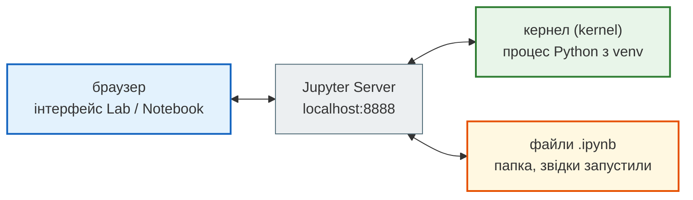

# Jupyter на своєму комп'ютері: Notebook і JupyterLab

Google Colab (див. [Ноутбуки в Google Colab](colab.md)) — це Jupyter у хмарі Google. Той самий ноутбук `.ipynb` можна відкрити й **на своєму комп'ютері**: без ліміту часу, з доступом до своїх файлів і з тим самим середовищем, що й у `.py`-проєктах курсу.

Ця сторінка — покрокова інструкція: що таке сервер і кернел, як встановити й запустити Jupyter, як підключити віртуальне середовище, як ставити бібліотеки, як працювати з терміналом і клавіатурою.

!!! note "Перед початком"
    Потрібен встановлений Python 3.10+ і вміння створювати та активувати venv — див. [Налаштування середовища](environment_setup.md).

## Як це влаштовано: браузер, сервер, кернел

Jupyter складається з трьох частин. Розуміти їх корисно: більшість «загадкових» помилок — це плутанина між ними.



- **Інтерфейс** у браузері — лише «пульт керування»: показує клітинки й результати.
- **Jupyter Server** — програма, яку ти запускаєш командою в терміналі. Вона відкриває й зберігає файли `.ipynb` і керує кернелами.
- **Кернел (kernel)** — окремий процес Python, який **справді виконує** код клітинок і тримає в пам'яті всі змінні. Від кернела залежить, **який саме Python** і **які бібліотеки** бачить ноутбук.

Звідси два важливі наслідки:

- змінні живуть у кернелі, а не у файлі: закрив ноутбук чи перезапустив кернел — змінні зникли, код треба виконати знову;
- `pip install` має потрапити в той Python, **на якому працює кернел**, — інакше буде `ModuleNotFoundError`, хоча «я ж встановлював».

## JupyterLab чи Jupyter Notebook

Обидва — інтерфейси до того самого сервера, і обидва відкривають ті самі `.ipynb`.

| | Jupyter Notebook 7 | JupyterLab |
|---|---|---|
| Вигляд | один ноутбук на вкладку, простий інтерфейс | робоче середовище: кілька ноутбуків, файли, термінал, консоль у вкладках і панелях |
| Коли | перші уроки, коли важлива простота | коли працюєш з кількома файлами одночасно |
| Команда | `jupyter notebook` | `jupyter lab` |

З версії 7 Jupyter Notebook побудований на компонентах JupyterLab, тому вони мають спільну основу й однакові гарячі клавіші. Для курсу рекомендуємо **JupyterLab**.

## Встановлення (один раз на проєкт)

Встановлюй Jupyter **у віртуальне середовище проєкту**, а не в системний Python.

=== "Windows (PowerShell)"

    ```bash
    cd шлях\до\PY-Course-Victor-Nikoriak-22-09-2026
    python -m venv .venv
    .venv\Scripts\activate
    python -m pip install --upgrade pip
    pip install jupyterlab notebook
    ```

=== "macOS / Linux"

    ```bash
    cd шлях/до/PY-Course-Victor-Nikoriak-22-09-2026
    python3 -m venv .venv
    source .venv/bin/activate
    python -m pip install --upgrade pip
    pip install jupyterlab notebook
    ```

Перевір:

```bash
jupyter lab --version
jupyter notebook --version
```

```text
4.6.4
7.6.3
```

Номери версій у тебе можуть бути новішими.

!!! note "Інші способи встановлення"
    - **conda / mamba**: `conda install -c conda-forge jupyterlab` (або `mamba install -c conda-forge jupyterlab`) — якщо ти користуєшся Anaconda/Miniconda замість venv.
    - **`pip install --user jupyterlab`** (без venv) ставить команду `jupyter` у папку користувача, якої може не бути в `PATH`. Тоді `jupyter lab` не знайдеться — див. «Типові проблеми». Для курсу краще venv.

JupyterLab офіційно перевірений в останніх версіях **Firefox**, **Chrome** і **Safari**.

## Запуск і зупинка

1. Відкрий термінал і **перейди в папку**, де лежать ноутбуки (наприклад, корінь репозиторію курсу). Сервер показує файли саме з цієї папки.
2. Активуй venv (`(.venv)` має з'явитися на початку рядка).
3. Запусти:

    ```bash
    jupyter lab
    ```

    Браузер відкриється сам. У терміналі з'являться рядки на кшталт:

    ```text
    [I ServerApp] Jupyter Server 2.21.1 is running at:
    [I ServerApp] http://localhost:8888/lab?token=…
    [I ServerApp] Use Control-C to stop this server and shut down all kernels (twice to skip confirmation).
    ```

    Якщо браузер не відкрився, скопіюй адресу з `token=…` і встав у браузер. **Токен** — пароль для входу, щоб до твого сервера не підключився ніхто інший; не пересилай цю адресу.

4. **Не закривай термінал**, поки працюєш: саме в ньому живе сервер. Закрив термінал — ноутбуки перестали виконуватися.
5. Щоб зупинити: у терміналі натисни **Ctrl+C** і підтверди `y` (або Ctrl+C двічі). Збережи ноутбуки перед цим.

Якщо порт 8888 уже зайнятий (запущений інший Jupyter), сервер візьме наступний вільний — 8889, 8890… Дивись адресу в терміналі.

## Інтерфейс JupyterLab

```text
┌ меню: File  Edit  View  Run  Kernel  Tabs  Settings  Help ────────────┐
│ ліва     │ робоча область: вкладки ноутбуків,        │ права          │
│ панель:  │ файлів, терміналів — можна ділити         │ панель:        │
│ файли,   │ на кілька панелей                         │ властивості,   │
│ запущені │                                           │ дебагер        │
│ кернели… │                                           │                │
└ рядок стану: перемикач Simple, кернел, повідомлення ───────────────────┘
```

- **Меню** угорі. Кожен пункт показує свою гарячу клавішу:
    - **File** — файли й папки;
    - **Edit** — редагування (зокрема очищення виводів);
    - **View** — вигляд;
    - **Run** — виконання клітинок;
    - **Kernel** — керування кернелами;
    - **Tabs** — відкриті вкладки;
    - **Settings** — налаштування;
    - **Help** — довідка.
- **Ліва бічна панель**: файловий браузер, список вкладок і **запущених кернелів і терміналів** (там же їх можна зупинити), **зміст** (table of contents) ноутбука, менеджер розширень.
- **Права бічна панель**: інспектор властивостей клітинки й **дебагер**.
- **Робоча область**: ноутбуки, текстові файли, термінали й консолі відкриваються у вкладках. Перетягни вкладку до краю іншої панелі — і область поділиться, наприклад ноутбук ліворуч, а термінал праворуч. Активна вкладка має кольорову (синю) смужку згори.
- **Simple Interface** — показати лише одну вкладку, не закриваючи решту. Вмикається перемикачем **Simple** у рядку стану внизу ліворуч або **View → Appearance → Simple Interface**. Коли вимкнеш, повернеться попереднє розташування.
- **Пошук у ноутбуці** — **Ctrl+F** (macOS **⌘F**). Це вбудований пошук JupyterLab: пошук браузера може не бачити весь ноутбук.
- **Контекстне меню** — правий клік на клітинці, файлі чи вкладці. Звичайне меню браузера — **Shift** + правий клік.

## Кернели: як підключити venv

Коли Jupyter встановлено **в той самий venv**, у списку кернелів є кернел `Python 3` — це Python цього venv. Для більшості задач цього досить.

Але буває інакше: Jupyter встановлено один раз (наприклад, глобально), а проєктів із різними venv кілька. Тоді кожен venv треба **зареєструвати як кернел**. Ноутбуки курсу використовують кернел з ім'ям `python-course`:

```bash
# у терміналі з АКТИВОВАНИМ venv проєкту
pip install ipykernel
python -m ipykernel install --user --name python-course --display-name "Python Course (.venv)"
```

- `--name` — внутрішнє ім'я кернела (латиницею, без пробілів); у кожного venv має бути **своє**, бо реєстрація з тим самим ім'ям перезапише попередню;
- `--display-name` — назва, яку видно в меню Jupyter;
- `--user` — реєстрація для поточного користувача, без прав адміністратора.

Керування зареєстрованими кернелами:

```bash
jupyter kernelspec list                        # усі кернели і де вони лежать
jupyter kernelspec uninstall python-course     # видалити непотрібний
```

```text
Available kernels:
  python3          …/.venv/share/jupyter/kernels/python3
  python-course    …/.local/share/jupyter/kernels/python-course
```

**Обрати кернел для ноутбука:** у JupyterLab — клікни назву кернела у верхньому правому куті ноутбука (або меню **Kernel → Change Kernel…**) і вибери `Python Course (.venv)`.

**Перевірити, який Python виконує код**, — найнадійніший тест, коли щось «не бачить» бібліотеку:

```python
import sys
print(sys.executable)
```

Шлях має вести в `.venv` твого проєкту.

## Встановлення бібліотек з ноутбука: `%pip`

Бібліотеки можна ставити в терміналі з активованим venv (`pip install pandas`) — або прямо з клітинки ноутбука:

```python
%pip install pandas
```

`%pip` — **magic-команда** IPython: вона встановлює пакет у той Python, **на якому працює поточний кернел**. Тому `%pip` надійніший за `!pip`: `!` запускає звичайну команду оболонки, а в оболонці `pip` може належати іншому Python.

Після встановлення `%pip` нагадує:

```text
Note: you may need to restart the kernel to use updated packages.
```

Перезапуск потрібен, якщо бібліотеку вже імпортували в цьому кернелі (наприклад, оновлюєш версію): кернел пам'ятає старий імпорт. Меню **Kernel → Restart Kernel…** (у командному режимі — **0, 0**).

Для проєкту зі списком залежностей:

```python
%pip install -r requirements.txt
```

## Порядок виконання і перезапуск

Кернел виконує клітинки **в тому порядку, в якому ти їх запускаєш**, а не згори донизу. Число в дужках зліва, `[5]`, — порядковий номер запуску. Якщо ти змінив клітинку вгорі й не перезапустив ті, що нижче, результати внизу — від старого коду.

Перед здачею домашки і коли «щось дивне» — **Kernel → Restart Kernel and Run All Cells…**: кернел почне з чистої пам'яті й виконає все згори донизу. Якщо ноутбук після цього працює — він справді працює.

## Режими й гарячі клавіші

У ноутбука два режими:

- **режим редагування** (edit mode) — курсор у клітинці, пишеш код. Увійти: **Enter** або клік у клітинку;
- **командний режим** (command mode) — клітинку виділено рамкою, клавіші керують клітинками. Увійти: **Esc** (або **Ctrl+M**).

| Клавіші | Режим | Дія |
|---|---|---|
| **Shift+Enter** | будь-який | виконати клітинку й перейти до наступної |
| **Ctrl+Enter** | будь-який | виконати клітинку й лишитися на ній |
| **A** / **B** | командний | нова клітинка вище / нижче |
| **D, D** (двічі) | командний | видалити клітинку |
| **M** / **Y** | командний | зробити клітинку Markdown / кодом |
| **Z** | командний | скасувати видалення клітинки |
| **I, I** (двічі) | командний | перервати виконання (Interrupt Kernel) |
| **0, 0** (двічі) | командний | перезапустити кернел (Restart Kernel) |
| **Ctrl+F** (⌘F) | будь-який | пошук у ноутбуці |
| **Ctrl+Shift+C** (⌘⇧C) | будь-який | палітра команд: пошук будь-якої дії за назвою |
| **Ctrl+S** (⌘S) | будь-який | зберегти |

Список клавіш для поточної вкладки — **Help → Show Keyboard Shortcuts…** (**Ctrl+Shift+H**). Переглянути всі й змінити — **Settings → Advanced Settings Editor → Keyboard Shortcuts**. Гарячі клавіші в меню показано поруч із кожним пунктом.

## Корисні magic-команди

Рядки, що починаються з `%` (для рядка) або `%%` (для всієї клітинки), — це команди IPython, а не Python.

| Команда | Що робить |
|---|---|
| `%pip install назва` | встановити пакет у Python кернела |
| `!команда` | виконати команду оболонки: `!ls`, `!dir`, `!python --version` |
| `%%writefile hello.py` | записати вміст клітинки у файл |
| `%run hello.py` | виконати `.py`-файл у кернелі |
| `%timeit вираз` | виміряти час виконання, повторивши вираз багато разів |
| `%pwd` / `%cd папка` | показати / змінити поточну папку кернела |

Приклад:

```python
%%writefile hello.py
print("Привіт з файлу!")
```

```python
%run hello.py
%timeit sum(range(1000))
```

## Файли й термінал у JupyterLab

- **Файловий браузер** (ліва панель): відкрити, перейменувати, створити папку, завантажити файл перетягуванням.
- **Термінал**: кнопка **+** над файловим браузером → у Launcher вибери **Terminal** (або **File → New → Terminal**). Це повноцінний термінал (bash на macOS/Linux, PowerShell на Windows), що відкривається в папці сервера. Venv у ньому може бути **не активований** — перевір `(.venv)` на початку рядка й за потреби активуй.
- **Console** у Launcher — інтерактивний Python, зручно швидко щось перевірити.

## Ноутбуки і Git

Файл `.ipynb` — це JSON, у якому зберігаються і код, і **результати виконання** (виводи, картинки). Через це:

- diff у Git показує зміни виводів, а не лише коду;
- перед комітом домашки корисно виконати **Restart Kernel and Run All** — щоб збережені виводи відповідали коду;
- якщо виводи не потрібні, очисти їх: **Edit → Clear Outputs of All Cells**.

Як здавати ноутбук через Pull Request — у розділі [Здача домашніх робіт](homework_workflow.md).

## Типові проблеми

| Симптом | Причина | Що робити |
|---|---|---|
| `jupyter: command not found` / «не є внутрішньою командою» | venv не активовано, Jupyter не встановлено в нього, або (після `pip install --user`) папка з командою не в `PATH` | активуй venv; або запусти `python -m jupyter lab`; на macOS/Linux після `--user` — `~/.local/bin/jupyter lab` |
| `ModuleNotFoundError`, хоча пакет встановлено | кернел працює на іншому Python | `import sys; print(sys.executable)`; постав пакет через `%pip install`; або зміни кернел |
| У меню немає кернела `Python Course (.venv)` | venv не зареєстровано | `python -m ipykernel install --user --name python-course --display-name "Python Course (.venv)"` з активованим venv |
| Після `%pip install` імпортується стара версія | кернел пам'ятає старий імпорт | Kernel → Restart Kernel… |
| Змінна «не визначена», хоча клітинка з нею є | клітинку не виконано в цьому сеансі кернела | виконай її або Restart Kernel and Run All |
| Ноутбук «завис», зірочка `[*]` не зникає | довгий чи нескінченний код | **Kernel → Interrupt Kernel** (у командному режимі — **I, I**) |
| Забагато відкритих ноутбуків, комп'ютер гальмує | кожен відкритий ноутбук тримає свій кернел | ліва панель → запущені кернели й термінали → зупини непотрібні |
| PowerShell: «виконання сценаріїв вимкнено» при активації venv | політика виконання Windows | див. [Налаштування середовища](environment_setup.md), розділ «Активація» |

## Джерела

- [JupyterLab на GitHub](https://github.com/jupyterlab/jupyterlab) — README: встановлення (pip, conda, mamba), запуск, `PATH`, підтримувані браузери
- JupyterLab: [Installation](https://jupyterlab.readthedocs.io/en/stable/getting_started/installation.html), [The JupyterLab Interface](https://jupyterlab.readthedocs.io/en/stable/user/interface.html) — меню, бічні панелі, робоча область, Simple Interface, пошук, гарячі клавіші; [Terminals](https://jupyterlab.readthedocs.io/en/stable/user/terminal.html)
- Назви пунктів меню й гарячі клавіші додатково звірено з налаштуваннями (schemas) встановленого JupyterLab 4.6
- Jupyter Notebook: [Notebook Basics](https://jupyter-notebook.readthedocs.io/en/stable/examples/Notebook/Notebook%20Basics.html) — режими й гарячі клавіші; [Announcing Jupyter Notebook 7](https://blog.jupyter.org/announcing-jupyter-notebook-7-8d6d66126dcf)
- IPython: [Installing the IPython kernel](https://ipython.readthedocs.io/en/stable/install/kernel_install.html) — кернели для різних середовищ
- Jake VanderPlas, [Installing Python Packages from a Jupyter Notebook](https://jakevdp.github.io/blog/2017/12/05/installing-python-packages-from-jupyter/) — чому `!pip` іноді ставить пакет «не туди» і звідки взявся `%pip`
