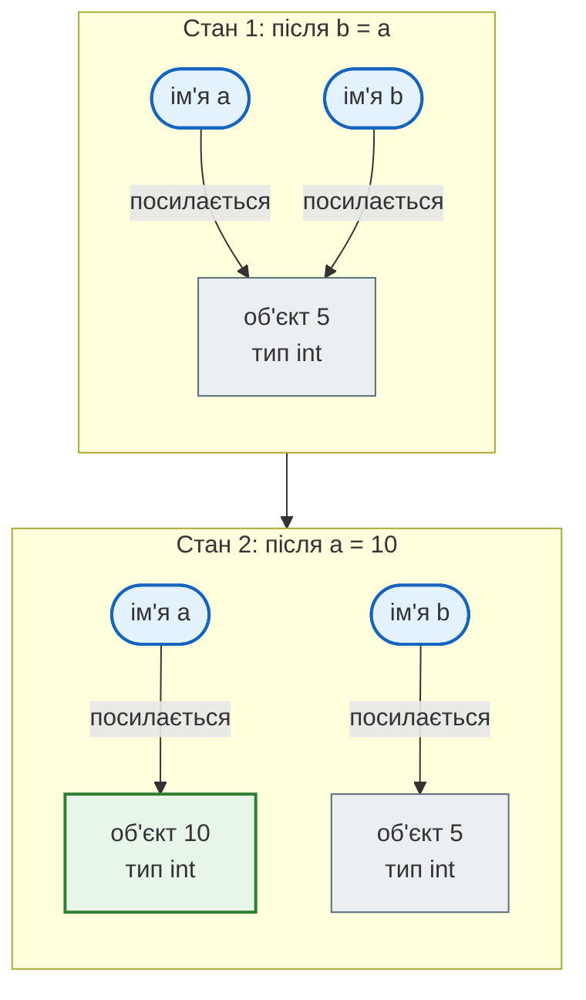
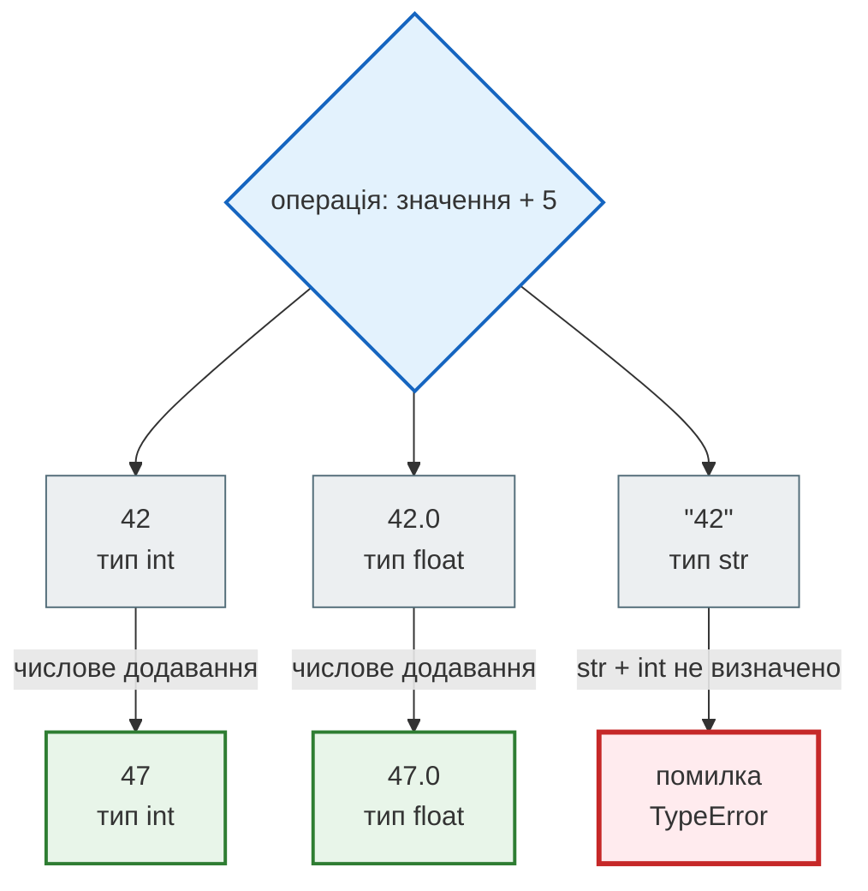
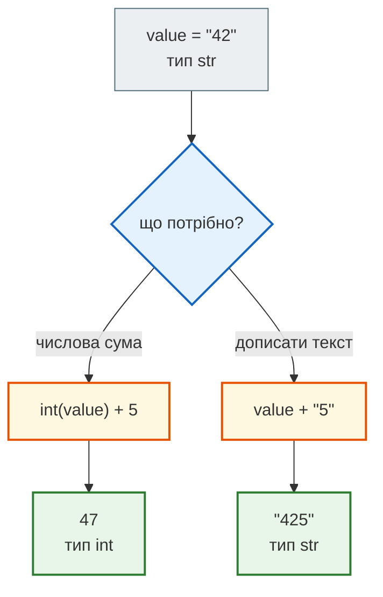
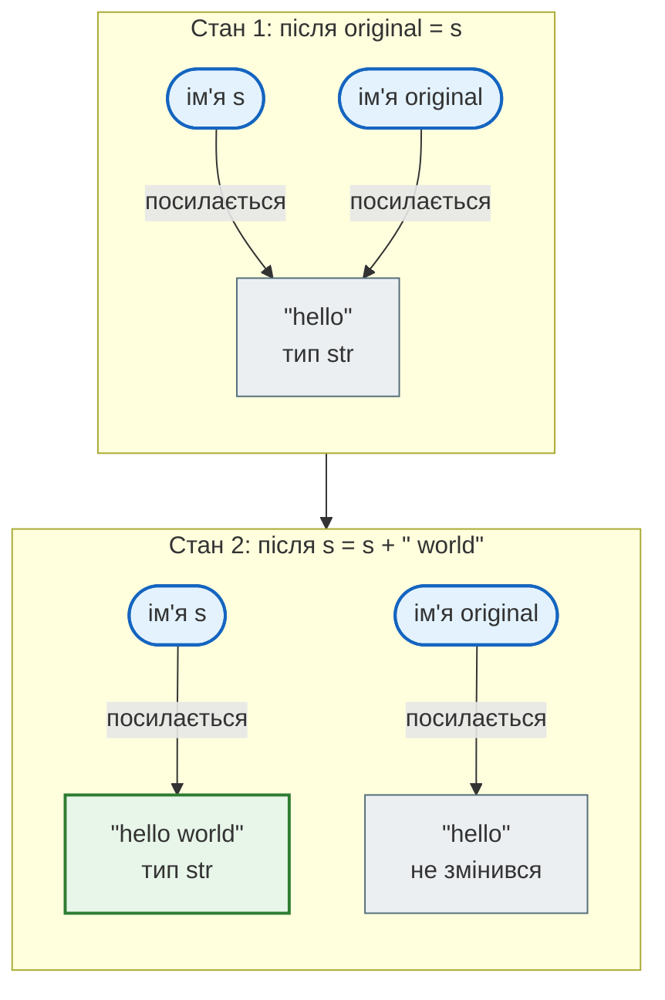
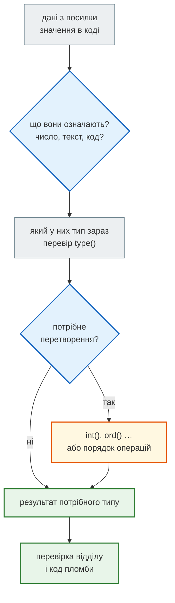

# Урок 3. Змінні та базові типи даних

Програма працює з даними: віком, ціною, назвою міста, кодом посилки. У цьому уроці ти навчишся бачити за кожним значенням чотири речі:

**які дані маємо → як Python їх представляє → які операції для них дозволені → який результат отримуємо.**

**Після уроку ти зможеш:**

- пояснити, що присвоювання `a = 5` зв'язує **ім'я** з **об'єктом**, а `b = a` нічого не копіює;
- назвати тип значення (`int`, `float`, `str`, `bool`, `NoneType`) і перевірити його через `type()`;
- передбачити, коли операція спрацює, а коли Python зупиниться з `TypeError`;
- свідомо вибрати перетворення: `"42"` як число `42` чи як текст.

**Передумови:** урок 2 — запуск `.py`-файлу, `print()`, читання простого `SyntaxError`.

**Ноутбук заняття:** [`note_lesson_variables.ipynb`](https://github.com/NikoriakViktot/PY-Course-Victor-Nikoriak-22-09-2026/blob/main/module_1/lessons/lesson_03_variables_and_data_types/note_lesson_variables.ipynb) [](https://colab.research.google.com/github/NikoriakViktot/PY-Course-Victor-Nikoriak-22-09-2026/blob/main/module_1/lessons/lesson_03_variables_and_data_types/note_lesson_variables.ipynb)

## Пригадай урок 2

Дай відповідь подумки або на папері, **не підглядаючи й нічого не запускаючи**. Потім відкрий відповідь.

1. Якою командою в терміналі запустити файл `hello.py`?
2. Що виведе `print("a", "b", sep="-")`?
3. Що станеться, якщо запустити рядок `print("Hello"`?

??? success "Відповіді"

    1. `python hello.py` (на macOS/Linux інколи `python3 hello.py`).
    2. `a-b` — параметр `sep` задає, чим розділяти значення.
    3. Програма не запуститься: `SyntaxError: '(' was never closed`. Python помітив незакриту дужку ще до виконання.

## Імена та об'єкти

### Присвоювання зв'язує ім'я з об'єктом

```python
a = 5
```

Це не «покласти 5 у коробку `a`». Python бере **об'єкт** — ціле число `5` — і зв'язує з ним **ім'я** `a`. Ім'я — це ярлик, який вказує на об'єкт.

!!! note "Уточнення"
    Python не зобов'язаний щоразу створювати новий об'єкт для `5`. Він може повторно використати вже наявний об'єкт із таким самим значенням. Для твого коду це не має значення: важливо лише, на який об'єкт вказує ім'я.

### Що відбувається при `b = a`?

Передбач результат, перш ніж відкривати відповідь:

```python
a = 5
b = a
a = 10
print(b)
```

??? question "Що виведе `print(b)`: 5 чи 10? Чому?"

    Спершу сформулюй свою відповідь одним реченням, потім відкрий пояснення нижче.

??? success "Відповідь і пояснення"

    Результат:

    ```text
    5
    ```

    - `b = a` **не копіює** об'єкт. Воно прив'язує ще одне ім'я, `b`, до того самого об'єкта `5`.
    - `a = 10` переприв'язує тільки ім'я `a` до іншого об'єкта. Ім'я `b` про це «не знає» і далі вказує на `5`.

Схема показує два стани програми. Стрілка означає «ім'я посилається на об'єкт», а не «значення кудись переїхало».



**Що змінилося:** лише стрілка від `a`. Об'єкт `5` нікуди не зник і не змінився, бо на нього досі посилається `b`.

??? question "Зміни умову: що виведе `print(a, b)`?"

    ```python
    a = 5
    b = a
    b = b + 1
    print(a, b)
    ```

    ??? success "Відповідь"

        ```text
        5 6
        ```

        `b + 1` обчислює новий результат `6`, і присвоювання прив'язує до нього ім'я `b`. Ім'я `a` як вказувало на `5`, так і вказує.

### Як називати змінні

Правила мови (порушиш — отримаєш `SyntaxError`):

- ім'я складається з літер, цифр і `_`, але **не починається з цифри**: `total_1` — можна, `1total` — ні;
- пробілів у імені немає: `user age` — помилка, `user_age` — так;
- **ключові слова** зайняті мовою: `if`, `for`, `class`, `None`, `True` тощо. Повний список — `import keyword; print(keyword.kwlist)`.

```python
class = 5
# SyntaxError: invalid syntax
```

Python **розрізняє регістр**: `spam` і `Spam` — два різні імена, і кожне може вказувати на своє значення.

```python
spam = 1
Spam = 2
print(spam, Spam)
```

```text
1 2
```

**Домовленість PEP 8:** імена змінних — малими літерами, слова через підкреслення: `user_age`, `total_sum`. Назва має пояснювати зміст: `price` краще за `p`.

!!! warning "Не затінюй вбудовані імена"
    Імена `str`, `int`, `list`, `input`, `print` уже зайняті вбудованими функціями. Якщо використати таке ім'я для своєї змінної, стара функція стане недоступною:

    ```python
    str = "hi"
    str(5)
    # TypeError: 'str' object is not callable
    ```

    Тепер `str` вказує на рядок `"hi"`, а рядок викликати не можна. Обирай інші назви: `text`, `numbers`, `user_input`.

## Базові вбудовані типи

Кожен об'єкт у Python має **тип**. Тип визначає, що це за дані й що з ними можна робити.

| Тип | Приклад значення | Що представляє |
|---|---|---|
| `int` | `42`, `-5`, `0` | ціле число |
| `float` | `3.14`, `-1.2`, `42.0` | число з дробовою частиною |
| `str` | `"text"`, `'42'` | текст, послідовність символів |
| `bool` | `True`, `False` | логічне значення: так / ні |
| `NoneType` | `None` | «значення немає» |

Зверни увагу на останній рядок: `None` — це **значення**, а `NoneType` — його **тип**. Так само як `42` — значення, а `int` — тип.

Перевірити тип можна функцією `type()`:

```python
print(type(42))
print(type(42.0))
print(type("42"))
print(type(True))
print(type(None))
```

```text
<class 'int'>
<class 'float'>
<class 'str'>
<class 'bool'>
<class 'NoneType'>
```

!!! note "Чому «примітивні» — це спрощення"
    Ці типи часто називають «примітивними», бо їхні значення прості й записуються прямо в коді. Але в Python усе, включно з `5` і `True`, — повноцінні об'єкти. А `str` — не «неподільне» значення, а **послідовність** символів: до кожного символу можна звернутися за індексом, наприклад `"Charkiv"[0]` дає `'C'`.

## Тип визначає, які операції дозволені

`42`, `42.0` і `"42"` на екрані схожі, але для Python це три різні об'єкти трьох різних типів. Перевір себе:

```python
value = "42"
print(value + 5)
```

??? question "Спрацює чи ні? Що буде виведено?"

    Подумай, якого типу `value` і що для цього типу означає `+`.

??? success "Відповідь і пояснення"

    Програма зупиниться з помилкою:

    ```text
    TypeError: can only concatenate str (not "int") to str
    ```

    Для рядків `+` означає **склеювання** (конкатенацію) і вимагає, щоб обидва операнди були рядками. `value` — рядок, `5` — число. Python не вгадує, чого ти хотів, і повідомляє про помилку.

Та сама операція `+ 5` для трьох схожих значень:



Зміст операції залежить від типів операндів: для чисел `+` — додавання, для рядків — склеювання, а для пари «рядок + число» дії не визначено.

### Динамічна і строга типізація

Це дві **різні** властивості Python.

**Динамічна:** тип має об'єкт, а не ім'я. Одне ім'я може по черзі вказувати на об'єкти різних типів, і оголошувати тип наперед не треба:

```python
x = 10
x = "hello"
print(x)
```

```text
hello
```

**Строга:** Python не змішує мовчки несумісні типи. Рядок не перетвориться на число сам по собі — саме тому `"42" + 5` дає `TypeError`.

!!! note "Уточнення"
    Строгість не означає, що перетворень немає взагалі. Для узгоджених числових типів Python робить їх сам: `1 + 2.5` дає `3.5` — ціле число бере участь в обчисленні як `float`. Автоматичного перетворення між текстом і числом немає.

Для порівняння: у JavaScript `"spam" + 5` мовчки дає рядок `"spam5"`. Python у такій ситуації зупиняється, щоб помилка не пішла далі програмою непоміченою.

### Явне перетворення: ти обираєш намір

Рядок `"42"` можна використати двома способами, і лише ти знаєш, який потрібен:



```python
value = "42"
print(int(value) + 5)   # намір: число
print(value + "5")      # намір: текст
```

```text
47
425
```

Це приклад принципу з Zen of Python: **явне краще за неявне**. Перетворення записане в коді, і кожен читач бачить твій намір.

Функції перетворення: `int()`, `float()`, `str()`.

```python
print(int(3.9))     # відкидає дробову частину
print(float("3.9"))
print(str(25) + " років")
```

```text
3
3.9
25 років
```

!!! warning "Типові помилки перетворення"
    - `int(3.9)` дає `3`, а не `4`: `int()` відкидає дробову частину (у бік нуля, тому `int(-3.9)` дає `-3`). Для округлення є `round()`.
    - `int("3.9")` дає `ValueError: invalid literal for int() with base 10: '3.9'`. Рядок із крапкою спершу перетворюють через `float()`.

## Рядки незмінні

Рядок — **незмінний** (immutable) об'єкт: після створення його не можна змінити на місці.

```python
s = "abc"
s[0] = "x"
# TypeError: 'str' object does not support item assignment
```

Як тоді працює код, який ніби «змінює» рядок?

```python
s = "hello"
original = s
s = s + " world"
print(original)
print(s)
```

??? question "Що виведе `print(original)`?"

    Згадай, що робить присвоювання і чи може змінитися сам рядок `"hello"`.

??? success "Відповідь і пояснення"

    ```text
    hello
    hello world
    ```

    Вираз `s + " world"` не змінює рядок `"hello"`, а обчислює результат — рядок `"hello world"`. Присвоювання прив'язує до нього ім'я `s`. Ім'я `original` і далі вказує на незмінний `"hello"`.



!!! tip "Висновок"
    Операції над рядками **не змінюють** рядок на місці — вони повертають результат, а присвоювання вирішує, яке ім'я на нього вказуватиме.

## Оператори

Для чисел `int` і `float`:

| Оператор | Що робить | Приклад → результат |
|---|---|---|
| `+`, `-`, `*` | додавання, віднімання, множення | `2 * 3` → `6` |
| `**` | піднесення до степеня | `2 ** 10` → `1024` |
| `/` | ділення | `10 / 4` → `2.5` |
| `//` | ділення з округленням униз | `10 // 4` → `2` |
| `%` | остача від ділення | `10 % 4` → `2` |

Для рядків:

| Оператор | Що робить | Приклад → результат |
|---|---|---|
| `+` | склеювання | `"Hi" + "!"` → `'Hi!'` |
| `*` | повторення | `"Hi" * 3` → `'HiHiHi'` |

!!! note "Уточнення про `/` і `//`"
    - Для `int` і `float` оператор `/` завжди дає `float`, навіть якщо ділиться націло: `4 / 2` дає `2.0`.
    - `//` округлює частку **вниз**, а не «відкидає хвіст». Для від'ємних чисел це помітно: `-7 / 2` дає `-3.5`, а `-7 // 2` дає `-4`.
    - `//` не завжди повертає `int`: `7.5 // 2` дає `3.0`, бо один з операндів — `float`.

**Порядок операцій.** Передбач результат:

```python
print(1 + 2 * 3)
```

??? success "Відповідь"

    ```text
    7
    ```

    Множення виконується раніше за додавання, як у математиці. Щоб отримати `9`, потрібні дужки: `(1 + 2) * 3`.

## Символи і їхні коди

Кожен символ у Unicode має номер — **кодову точку**. `ord()` повертає номер символу, `chr()` — символ за номером:

```python
print(ord("A"))
print(chr(66))
print(chr(ord("a") + 3))
print(ord("ї"))
```

```text
65
B
d
1111
```

!!! note "Кодова точка — це не байти"
    `ord()` і `chr()` працюють з номерами символів у Unicode, а не з тим, як текст записується в пам'ять чи файл. Наприклад, `"ї"` — один символ з кодовою точкою `1111`, а в кодуванні UTF-8 він займає два байти: `"ї".encode("utf-8")` дає `b'\xd1\x97'`.

Це основа роботи з текстом на рівні символів. **Повна вправа на шифр Цезаря — на практикумі П1 (урок 8)**; тут достатньо зрозуміти механіку `ord()` і `chr()`.

Більше прикладів з індексами символів, `ord()` і `chr()` — у ноутбуці [`lesson_ord_chr.ipynb`](https://github.com/NikoriakViktot/PY-Course-Victor-Nikoriak-22-09-2026/blob/main/module_1/lessons/lesson_03_variables_and_data_types/lesson_ord_chr.ipynb) [](https://colab.research.google.com/github/NikoriakViktot/PY-Course-Victor-Nikoriak-22-09-2026/blob/main/module_1/lessons/lesson_03_variables_and_data_types/lesson_ord_chr.ipynb).

## Міні-проєкт «Таємнича посилка Нової Пошти»

На склад приїхала коробка без зворотної адреси. Склад відкриє її, лише коли кожен із чотирьох відділів перевірить свою частину даних і поставить **пломбу**. Якщо хоч один відділ помилиться, коробка лишиться закритою.

**Ноутбук:** [`nova_poshta_parcel.ipynb`](https://github.com/NikoriakViktot/PY-Course-Victor-Nikoriak-22-09-2026/blob/main/module_1/lessons/lesson_03_variables_and_data_types/nova_poshta_parcel.ipynb) [](https://colab.research.google.com/github/NikoriakViktot/PY-Course-Victor-Nikoriak-22-09-2026/blob/main/module_1/lessons/lesson_03_variables_and_data_types/nova_poshta_parcel.ipynb)

| Група | Відділ | Про що задача |
|---|---|---|
| 1 | Адресний | прив'язування імен: на що вказує ім'я після переприсвоювання |
| 2 | Ваговий | вага прийшла рядком, а система приймає тільки `int` |
| 3 | Логістика | обчислення ціни, де важливий порядок операцій |
| 4 | Відправлення | назва міста прийшла кодами символів — прочитати її через `chr()` |

**Як це проходить на занятті.** Усі групи відкривають **той самий** ноутбук і розв'язують свій відділ. За правильну відповідь система видає двоцифровий код пломби, за типову помилку — підказку. Лідер групи називає код викладачу, а викладач вписує чотири коди в клітинку «Склад» на проєкторі. Для самої гри інтернет-сервіси не потрібні, і нічиї імена ніде не зберігаються. Коли всі чотири пломби правильні, коробка відкривається, а в ній — кнопка «📚 Матеріали уроку» з посиланням на папку з матеріалами в Google Drive. Удома той самий ноутбук можна пройти самостійно — усі чотири відділи по черзі.

Кожна задача проходить той самий шлях даних:



**Критерії успіху** — твоя група готова до перевірки, коли може:

1. **визначити**, які дані отримала і якого вони типу зараз;
2. **перетворити** їх у тип, який вимагає система, — або пояснити, чому перетворення не потрібне;
3. **пояснити** результат одним реченням: чому Python повернув саме це значення;
4. **вивести** результат і перевірити його тип через `type()` перед перевіркою.

## Перенеси навичку

Нова ситуація — каса магазину. Кількість товару прийшла з форми як текст, ціна — число:

```python
quantity = "3"
price = 45.5
```

Напиши код, який виведе:

```text
Разом: 136.5 грн
```

??? tip "Підказка 1"
    Спершу визнач тип кожного значення. Що станеться, якщо одразу написати `quantity * price`?

??? tip "Підказка 2"
    Кількість — ціле число. Перетвори її явно, а потім обчисли суму. Для виводу згадай, як `print()` розділяє кілька значень.

## Самоперевірка

1. Якого типу значення `"3.0"`?
2. Після `x = 7`, `y = x`, `x = 8` — на яке значення вказує `y`?
3. Чому `s[0] = "x"` для рядка дає помилку?
4. Що дадуть `7 // 2` і `-7 // 2`?
5. Чим відрізняються `None` і `NoneType`?

??? success "Відповіді"

    1. `str` — лапки роблять його текстом, навіть якщо всередині число.
    2. `7`. `y = x` прив'язало `y` до об'єкта `7`; `x = 8` переприв'язало тільки `x`.
    3. Рядки незмінні: об'єкт рядка не можна змінити на місці. Можна лише отримати новий результат і прив'язати до нього ім'я.
    4. `3` і `-4`: `//` округлює частку вниз.
    5. `None` — значення «нічого немає», `NoneType` — його тип: `type(None)` дає `<class 'NoneType'>`.

## Поглиблення (необов'язково)

Ці теми не потрібні для задач уроку. Повернися до них, коли основне стане зрозумілим.

??? note "`id()` та `is`: ідентичність об'єкта"
    `id(obj)` повертає ціле число — **ідентифікатор** об'єкта, унікальний, поки об'єкт існує. Це не значення об'єкта: `42` і `42.0` рівні за значенням (`42 == 42.0` дає `True`), але це різні об'єкти різних типів.

    ```python
    a = 5
    b = a
    print(id(a) == id(b))   # True — одне й те саме
    print(a is b)           # True — оператор is порівнює ідентичність
    ```

    У CPython (найпоширенішій реалізації Python) `id()` збігається з адресою об'єкта в пам'яті, але це деталь реалізації, а не гарантія мови.

??? note "Повторне використання об'єктів"
    Python може повторно використовувати незмінні об'єкти: наприклад, CPython тримає готові об'єкти для малих цілих чисел і може «інтернувати» деякі рядки. Тому `id()` двох однакових значень іноді збігається, а іноді ні. Покладатися на це не можна: для порівняння значень використовуй `==`, а не `is`.

??? note "Як `+` дізнається, що робити"
    Коли Python виконує `x + y`, він питає тип лівого операнда, чи вміє той додати `y` (спеціальний метод `__add__`). Якщо ні — питає правий (`__radd__`). Якщо жоден не вміє — виникає `TypeError`. Тому числа додаються, рядки склеюються, а `"42" + 5` дає помилку. Власні класи й спеціальні методи — тема модуля 2.

??? note "Duck typing"
    Python часто цікавить не «якого класу об'єкт», а «чи підтримує він потрібну операцію». Циклу `for item in obj:` підходить будь-який об'єкт, по якому можна ітерувати: `list`, `str`, `range` чи власний клас. Цей підхід називають duck typing. Перевірка при цьому є: якщо операція не підтримується, Python повідомить про помилку, як-от `TypeError` для `for x in 5:`.

??? note "Незмінність і ключі словника"
    Незмінні об'єкти, як-от рядки й числа, можуть бути ключами `dict` і елементами `set`: їхнє значення, а отже й хеш, не зміниться, поки об'єкт живий. Словники й множини — у наступних уроках.

## Практика

**Спробуйте самі — де практикуватись:** [`note_lesson_variables.ipynb`](https://github.com/NikoriakViktot/PY-Course-Victor-Nikoriak-22-09-2026/blob/main/module_1/lessons/lesson_03_variables_and_data_types/note_lesson_variables.ipynb) [](https://colab.research.google.com/github/NikoriakViktot/PY-Course-Victor-Nikoriak-22-09-2026/blob/main/module_1/lessons/lesson_03_variables_and_data_types/note_lesson_variables.ipynb) — передбачення з перевіркою на кожному кроці, тест на розуміння перетворення типів і міні-проєкт «Нова Пошта».

**Довідник-практикум методів:** [`str_int_float_methods.ipynb`](https://github.com/NikoriakViktot/PY-Course-Victor-Nikoriak-22-09-2026/blob/main/module_1/lessons/lesson_03_variables_and_data_types/str_int_float_methods.ipynb) [](https://colab.research.google.com/github/NikoriakViktot/PY-Course-Victor-Nikoriak-22-09-2026/blob/main/module_1/lessons/lesson_03_variables_and_data_types/str_int_float_methods.ipynb) — f-рядки й форматування чисел (`f"{x:.2f}"`, ширина, вирівнювання), індекси й зрізи, найуживаніші методи `str`, операції й функції для `int` і `float`, безпечне перетворення типів; 7 вправ з перевірками.

## Документація

- [Іменування і зв'язування (naming and binding)](https://docs.python.org/3/reference/executionmodel.html#naming-and-binding)
- [Ідентифікатори](https://docs.python.org/3/reference/lexical_analysis.html#identifiers) і [ключові слова](https://docs.python.org/3/reference/lexical_analysis.html#keywords)
- [Вбудовані типи](https://docs.python.org/3/library/stdtypes.html): [числові типи](https://docs.python.org/3/library/stdtypes.html#numeric-types-int-float-complex), [рядки `str`](https://docs.python.org/3/library/stdtypes.html#text-sequence-type-str), [`None`](https://docs.python.org/3/library/constants.html#None)
- [Методи рядків](https://docs.python.org/3/library/stdtypes.html#string-methods), [f-рядки](https://docs.python.org/3/reference/lexical_analysis.html#f-strings), [міні-мова форматування](https://docs.python.org/3/library/string.html#formatspec), [`math.isclose`](https://docs.python.org/3/library/math.html#math.isclose)
- Вбудовані функції: [`type()`](https://docs.python.org/3/library/functions.html#type), [`int()`](https://docs.python.org/3/library/functions.html#int), [`id()`](https://docs.python.org/3/library/functions.html#id), [`ord()`](https://docs.python.org/3/library/functions.html#ord), [`chr()`](https://docs.python.org/3/library/functions.html#chr)
- [Арифметичні оператори](https://docs.python.org/3/reference/expressions.html#binary-arithmetic-operations) і [пріоритет операторів](https://docs.python.org/3/reference/expressions.html#operator-precedence)
- Глосарій: [immutable](https://docs.python.org/3/glossary.html#term-immutable), [duck-typing](https://docs.python.org/3/glossary.html#term-duck-typing)
- [PEP 8 — іменування](https://peps.python.org/pep-0008/#naming-conventions), [PEP 20 — Zen of Python](https://peps.python.org/pep-0020/)
