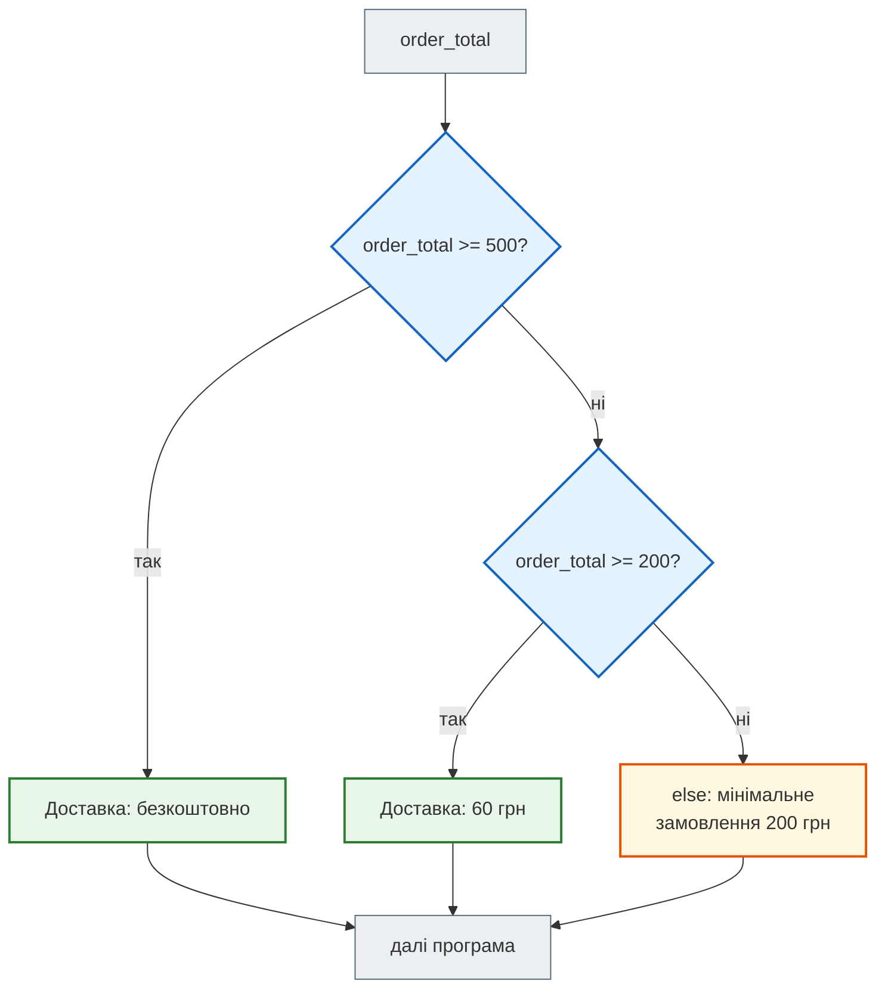
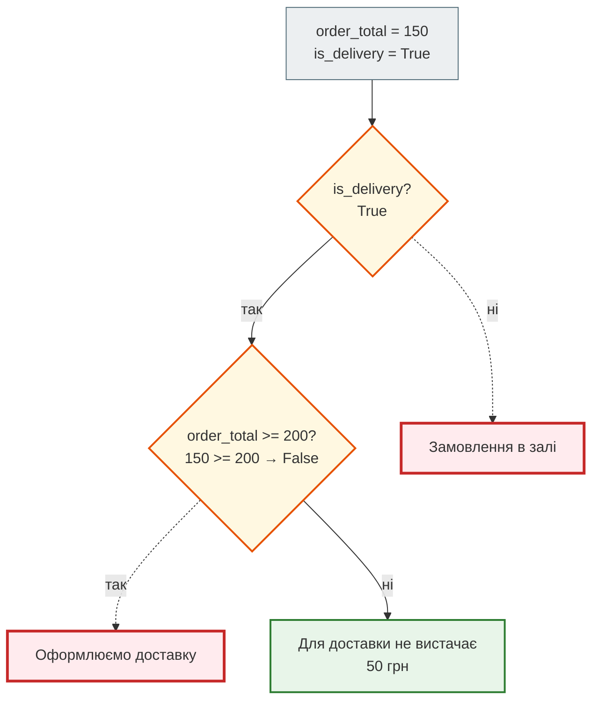
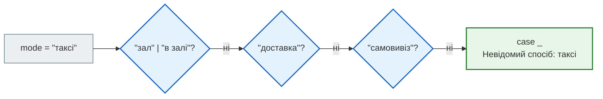
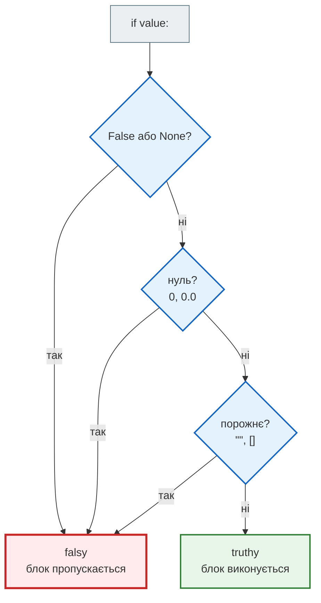
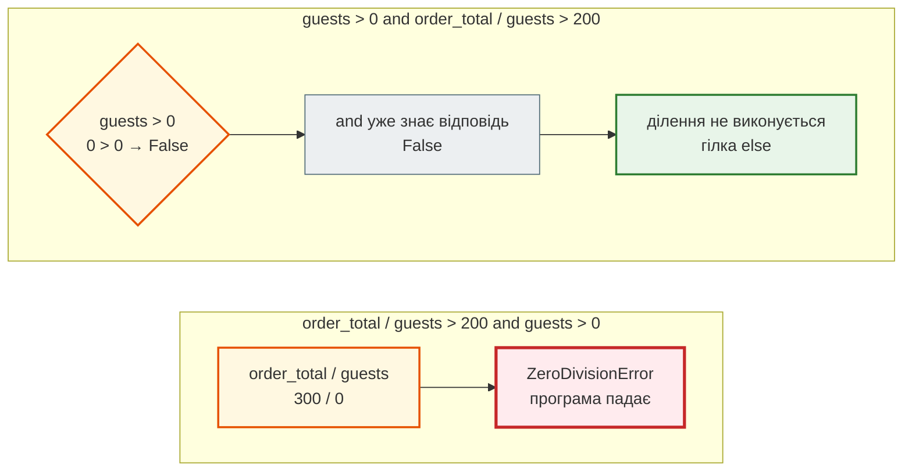
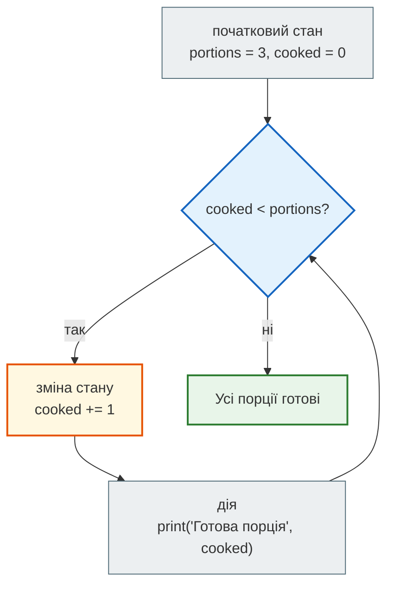
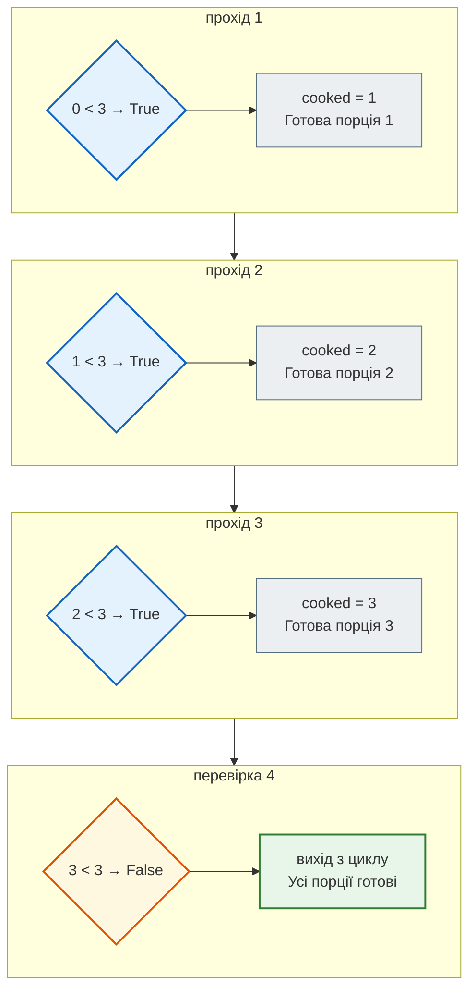
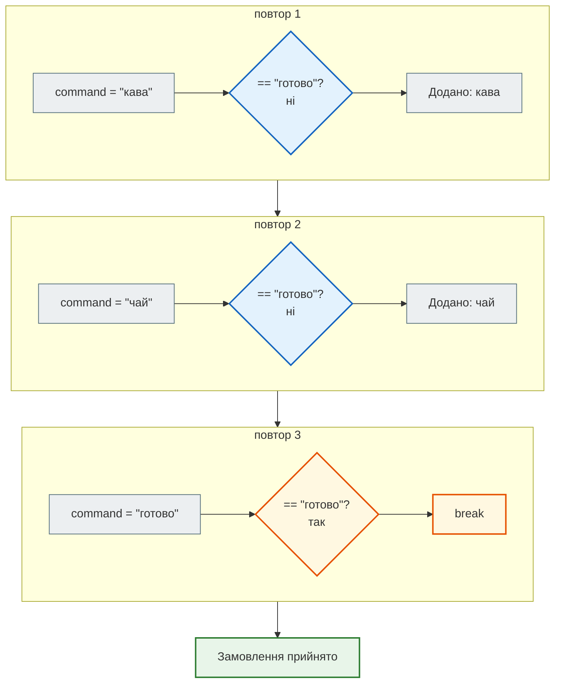
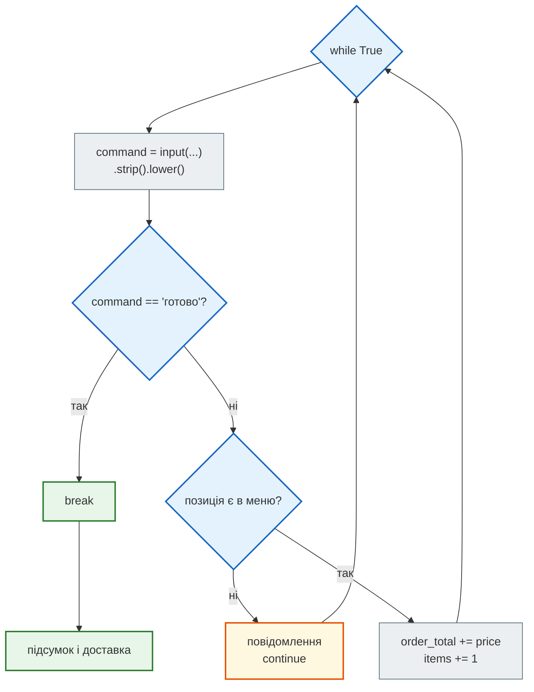

# Урок 4. Умови та цикли: як програма приймає рішення

Досі програма виконувала рядки один за одним, зверху вниз, і завжди робила те саме. Справжні програми поводяться інакше: вони **отримують дані, перевіряють умови, обирають дію і повторюють її, поки це потрібно**. Саме цього навчає цей урок.

**Що потрібно з уроку 3:** змінні, типи `int`, `float`, `str`, перетворення `int()` і `str()`, різниця між `42` і `"42"`.

**Після уроку ти зможеш:**

- записувати умови через порівняння `==`, `!=`, `<`, `<=`, `>`, `>=` і поєднувати їх через `and`, `or`, `not`;
- обирати одну дію з кількох через `if` / `elif` / `else` і пояснювати, чому порядок перевірок важливий;
- відрізняти «значення немає» (`None`) від нуля та порожнього рядка;
- отримувати дані від користувача через `input()` і готувати їх до перевірки;
- повторювати дії циклом `while`, змінювати стан і вчасно зупиняти цикл через `break` або `continue`.

**Задача розділу.** Кафе приймає замовлення. Офіціант вводить позиції з меню, програма рахує суму, а наприкінці вирішує, чи можлива доставка і скільки вона коштує. Ми зберемо цю програму крок за кроком, а повний код розберемо в розділі [«Практика»](#practice).

**Ноутбук заняття:** [`note_lesson_04_conditions.ipynb`](https://github.com/NikoriakViktot/PY-Course-Victor-Nikoriak-22-09-2026/blob/main/module_1/lessons/lesson_04_conditions_and_control/note_lesson_04_conditions.ipynb) [](https://colab.research.google.com/github/NikoriakViktot/PY-Course-Victor-Nikoriak-22-09-2026/blob/main/module_1/lessons/lesson_04_conditions_and_control/note_lesson_04_conditions.ipynb)

## Пригадай

Дай відповідь подумки або на папері, нічого не запускаючи:

1. Який тип поверне `type(3.14)`?
2. Скільки буде `int("7") + int("3")`?
3. `str(5) == "5"` — це `True` чи `False`?

??? success "Відповіді"

    1. `<class 'float'>` — у числа є дробова частина.
    2. `10`. Обидва рядки спершу перетворено на числа, тому `+` додає, а не склеює (без `int()` вийшло б `"73"`).
    3. `True`. `str(5)` дає рядок `"5"`, і порівнюються два однакові рядки.

## True, False і порівняння

Кожне рішення програми починається з питання, на яке є лише дві відповіді: так або ні. Для цього в Python є тип **`bool`** з двома значеннями: `True` (істина) і `False` (хиба). Пишуться вони з великої літери.

Такі значення найчастіше отримують **порівнянням**:

| Оператор | Значення | Приклад → результат |
|---|---|---|
| `==` | дорівнює | `500 == 500` → `True` |
| `!=` | не дорівнює | `"кава" != "чай"` → `True` |
| `<` | менше | `150 < 200` → `True` |
| `<=` | менше або дорівнює | `200 <= 200` → `True` |
| `>` | більше | `150 > 200` → `False` |
| `>=` | більше або дорівнює | `500 >= 500` → `True` |

```python
order_total = 220
print(order_total >= 200)
print(type(order_total >= 200))
```

```text
True
<class 'bool'>
```

Результат порівняння — звичайне значення типу `bool`. Його можна надрукувати, записати в змінну і, головне, використати в умові.

### `=` і `==` — різні речі

Один знак `=` **присвоює**: зв'язує ім'я зі значенням. Два знаки `==` **порівнюють** і повертають `True` або `False`. Якщо переплутати їх в умові, Python не запустить програму:

```python
if order_total = 500:
    print("Рівно 500")
```

```text
SyntaxError: invalid syntax. Maybe you meant '==' or ':=' instead of '='?
```

Порівняння рядків враховує регістр: `"Кава" == "кава"` дає `False`. Це знадобиться, коли будемо обробляти введення користувача.

### Ланцюжок порівнянь

Щоб перевірити, чи потрапляє значення в діапазон, у Python можна записати два порівняння одним ланцюжком:

```python
age = 30
print(18 <= age < 65)
```

```text
True
```

Запис `18 <= age < 65` означає те саме, що `18 <= age and age < 65`: Python порівнює кожну сусідню пару.

**Передбач результат**, перш ніж відкрити відповідь:

```python
print(1 == 2 < 3)
```

??? success "Відповідь"

    ```text
    False
    ```

    Ланцюжок читається як `1 == 2 and 2 < 3`. Перша частина `1 == 2` хибна, тому весь вираз — `False`. Це не `(1 == 2) < 3`.

!!! note "Два уточнення"
    - `bool` — підтип `int`: `True` поводиться як `1`, а `False` — як `0`. Тому `True + True` дає `2`, а `0 == False` дає `True`. У звичайному коді на цьому не будують логіку, але це пояснює деякі несподівані результати.
    - Не складай ланцюжки з `!=`. Вираз `"cat" != "dog" != "cat"` дає `True`, хоча перше і третє значення однакові: перевіряються лише сусідні пари.

## Умови: if, elif, else

### Одна умова

Повернімося до кафе. Доставка можлива лише для замовлень від 200 грн:

```python
order_total = 220

if order_total >= 200:
    print("Доставку можна оформити")

print("Перевірку завершено")
```

```text
Доставку можна оформити
Перевірку завершено
```

Як це виконується:

1. Python обчислює умову `order_total >= 200` і отримує `True`.
2. Оскільки умова істинна, виконується **блок** — рядки з відступом під `if`.
3. Рядок `print("Перевірку завершено")` не має відступу, тому він не належить до `if` і виконується завжди.

Якби `order_total` дорівнював `150`, програма надрукувала б лише «Перевірку завершено».

**Відступ** — це не оформлення, а частина мови: саме він показує, які рядки належать до блоку. Стандарт — 4 пробіли. Після двокрапки блок обов'язковий:

```python
if order_total >= 200:
print("Доставку можна оформити")
```

```text
IndentationError: expected an indented block after 'if' statement on line 1
```

### Кілька варіантів: elif і else

Тепер правило доставки складніше:

- від 500 грн — безкоштовно;
- від 200 грн — 60 грн;
- менше — доставка недоступна.

```python
order_total = 220

if order_total >= 500:
    print("Доставка: безкоштовно")
elif order_total >= 200:
    print("Доставка: 60 грн")
else:
    print("Мінімальне замовлення для доставки — 200 грн")
```

```text
Доставка: 60 грн
```

`elif` означає «інакше, якщо», `else` — «в усіх інших випадках». Python перевіряє умови **зверху вниз** і виконує **першу гілку, умова якої істинна**. Після цього решта гілок пропускається, їхні умови навіть не обчислюються. Якщо жодна умова не спрацювала, виконується `else`.



Схема показує, що з трьох гілок завжди виконується **рівно одна**: друга умова перевіряється лише тоді, коли перша хибна.

Ось як проходить той самий код для різних сум:

| `order_total` | Перевірки | Що виведе програма |
|---|---|---|
| `150` | `>= 500` — ні, `>= 200` — ні | Мінімальне замовлення для доставки — 200 грн |
| `200` | `>= 500` — ні, `>= 200` — так | Доставка: 60 грн |
| `499` | `>= 500` — ні, `>= 200` — так | Доставка: 60 грн |
| `500` | `>= 500` — так (далі не перевіряється) | Доставка: безкоштовно |
| `800` | `>= 500` — так (далі не перевіряється) | Доставка: безкоштовно |

Зверни увагу на межі `200` і `500`: оператор `>=` включає саму межу, тому замовлення рівно на 500 грн отримує безкоштовну доставку.

### Передбач результат: порядок перевірок

Хтось поміняв умови місцями:

```python hl_lines="3 5"
order_total = 800

if order_total >= 200:
    print("Доставка: 60 грн")
elif order_total >= 500:
    print("Доставка: безкоштовно")
else:
    print("Мінімальне замовлення для доставки — 200 грн")
```

??? question "Що виведе програма для 800 грн?"

    Пройди умови зверху вниз і зупинись на першій істинній.

??? success "Відповідь і пояснення"

    ```text
    Доставка: 60 грн
    ```

    `800 >= 200` істинна вже на першій перевірці, тому виконується перша гілка, а `elif order_total >= 500` не перевіряється зовсім. Гілка безкоштовної доставки стала недосяжною: будь-яке число, більше за 500, більше й за 200.

    **Правило:** коли умови перевіряють межі одного значення, починай із найвужчої (найбільшої межі) — або записуй кожен діапазон повністю: `200 <= order_total < 500`.

### Окремі if замість elif

Якщо написати кожну перевірку окремим `if`, Python перевірить **усі**:

```python
order_total = 600

if order_total >= 500:
    print("Безкоштовна доставка")
if order_total >= 200:
    print("Доставка 60 грн")
```

```text
Безкоштовна доставка
Доставка 60 грн
```

Клієнт отримав два суперечливі повідомлення. Окремі `if` доречні, коли перевірки незалежні (наприклад, «чи є коментар» і «чи потрібні прибори»). Якщо з кількох варіантів має спрацювати лише один — потрібен ланцюжок `if` / `elif` / `else`.

### Вкладені умови

Усередині блоку може бути ще одна умова. Тоді її блок має подвійний відступ:

```python
order_total = 150
is_delivery = True

if is_delivery:
    if order_total >= 200:
        print("Оформлюємо доставку")
    else:
        print("Для доставки не вистачає", 200 - order_total, "грн")
else:
    print("Замовлення в залі")
```

```text
Для доставки не вистачає 50 грн
```

Внутрішня умова перевіряється лише тоді, коли зовнішня (`is_delivery`) істинна. Кожен `else` належить тому `if`, під яким він стоїть з тим самим відступом.

Шлях виконання для `order_total = 150`, `is_delivery = True`. Помаранчеві вузли — перевірки, які справді виконались, зелений — гілка, що спрацювала, червоні — гілки, до яких виконання не дійшло:



Зовнішня перевірка відкриває або закриває вхід до внутрішньої: при `is_delivery = False` умова `order_total >= 200` навіть не обчислювалась би.

### match / case: вибір за значенням

Коли одна змінна порівнюється з кількома **конкретними значеннями**, довгий ланцюжок `elif command == ...` можна записати коротше. З Python 3.10 для цього є `match`:

```python
for mode in ["доставка", "в залі", "таксі"]:
    match mode:
        case "зал" | "в залі":
            print("Замовлення в залі")
        case "доставка":
            print("Оформлюємо доставку")
        case "самовивіз":
            print("Заберіть на касі")
        case _:
            print("Невідомий спосіб:", mode)
```

```text
Оформлюємо доставку
Замовлення в залі
Невідомий спосіб: таксі
```

Цикл `for` тут лише перебирає три приклади (його розберемо в уроці 6). Головне — блок `match`:

- `match mode:` — яке значення перевіряємо;
- `case "доставка":` — гілка спрацює, якщо `mode == "доставка"`;
- `|` — «або»: `case "зал" | "в залі":` спрацює на будь-якому з двох рядків;
- `case _:` — «усе інше», як `else`;
- виконується **перша** гілка, що підійшла, решта пропускається — як у ланцюжку `elif`.



!!! warning "`case _`, а не `case other`"
    Голе ім'я в `case` не порівнюється, а **захоплює** будь-яке значення: `case other:` спрацює завжди й запише значення у змінну `other`. Якщо після нього є ще гілки, Python не запустить програму: `SyntaxError: name capture 'other' makes remaining patterns unreachable`. Для «усього іншого» пиши `case _:`.

`match` уміє більше: розбирати списки й словники за формою, додавати умову `if` до гілки. Усе це — в окремому ноутбуці [`match_case.ipynb`](https://github.com/NikoriakViktot/PY-Course-Victor-Nikoriak-22-09-2026/blob/main/module_1/lessons/lesson_04_conditions_and_control/match_case.ipynb) [](https://colab.research.google.com/github/NikoriakViktot/PY-Course-Victor-Nikoriak-22-09-2026/blob/main/module_1/lessons/lesson_04_conditions_and_control/match_case.ipynb). Для порівнянь на кшталт `order_total >= 500` залишайся з `if` / `elif`: `match` — про збіг із конкретними значеннями та формою даних.

## Truthy, falsy і None

### Значення як умова

В `if` можна поставити не лише порівняння, а будь-яке значення. Тоді Python сам вирішує, вважати його істинним чи хибним. Хибними (**falsy**) вважаються:

- `False` і `None`;
- нуль будь-якого числового типу: `0`, `0.0`;
- порожні рядок і колекції: `""`, `[]` (списки — тема уроку 5).

Усе інше — **truthy**, тобто вважається істинним. Перевірити можна функцією `bool()`:

```python
print(bool(0), bool(0.0), bool(""), bool(None), bool([]))
print(bool("False"), bool("0"), bool(" "))
```

```text
False False False False False
True True True
```

Другий рядок часто дивує: `"False"`, `"0"` і навіть рядок з одного пробілу — **непорожні** рядки, тому вони істинні. Python не читає зміст рядка.

Як Python вирішує, чи виконати блок `if value:`:



Рядок `"0"` проходить усі три перевірки з відповіддю «ні»: це не `None`, не число і не порожній рядок.

Так зручно перевіряти, чи ввів користувач хоч щось:

```python
comment = ""

if comment:
    print("Коментар:", comment)
else:
    print("Без коментаря")
```

```text
Без коментаря
```

!!! warning "`bool()` не розуміє відповідь «так/ні»"
    Якщо користувач ввів `"ні"`, то `bool("ні")` дає `True`, бо рядок непорожній. Щоб перевірити відповідь, порівнюй текст: `answer == "так"`.

### None — «значення немає»

`None` — окреме значення, яке означає «значення відсутнє»: ще не відомо, не вказано. Це **не** нуль і **не** порожній рядок:

```python
print(None == 0, None == "")
```

```text
False False
```

Перевіряють `None` через `is None` або `is not None`.

У кафе це важливо для чайових: `0` означає «гість свідомо відмовився», а `None` — «гість ще нічого не вказав». Програма має відрізняти ці випадки:

```python
tip_percent = None

if tip_percent is None:
    print("Чайові не вказано")
elif tip_percent == 0:
    print("Гість відмовився від чайових")
else:
    print("Чайові:", tip_percent, "%")
```

| `tip_percent` | Результат |
|---|---|
| `None` | Чайові не вказано |
| `0` | Гість відмовився від чайових |
| `10` | Чайові: 10 % |

!!! warning "Типова помилка"
    Умова `if not tip_percent:` спрацює і для `None`, і для `0`, бо обидва значення falsy. Коли нуль — допустиме значення, перевіряй саме відсутність: `if tip_percent is None:`.

## and, or, not

### Поєднання умов

- `a and b` — істинно, коли істинні **обидві** умови;
- `a or b` — істинно, коли істинна **хоча б одна**;
- `not a` — заперечення: `True` стає `False` і навпаки.

Студентська знижка діє, лише коли гість — студент **і** сума від 300 грн:

```python
is_student = True
order_total = 320

if is_student and order_total >= 300:
    print("Знижка 10 %")
```

```text
Знижка 10 %
```

### Порядок обчислення

Спершу обчислюються порівняння, потім `not`, потім `and`, і лише потім `or`. Тому вираз

```python
not is_student or order_total > 1000 and guests > 4
```

Python читає як `(not is_student) or ((order_total > 1000) and (guests > 4))`. Щоб читачеві не доводилось згадувати цей порядок, став дужки явно — результат не зміниться, а намір стане очевидним.

### Коротке обчислення

Python зупиняє обчислення, щойно результат відомий. Для `and`: якщо ліва частина хибна, права не обчислюється. Для `or`: якщо ліва частина істинна, права не обчислюється.

Це дозволяє робити **захисну перевірку**. Порахуймо середній чек на гостя, коли гостей може бути нуль:

```python hl_lines="4"
guests = 0
order_total = 300

if guests > 0 and order_total / guests > 200:
    print("Великий чек на гостя")
else:
    print("Середній чек не рахуємо")
```

```text
Середній чек не рахуємо
```

`guests > 0` хибна, тому ділення `order_total / guests` не виконується взагалі. Якщо поміняти частини місцями (`order_total / guests > 200 and guests > 0`), ділення відбудеться першим і програма впаде: `ZeroDivisionError: division by zero`.

Обидва порядки поруч, при `guests = 0`:



Ліва частина `and` працює як охоронець: права частина обчислюється, лише коли ліва істинна.

### and і or повертають операнд

`not` завжди повертає `True` або `False`. А `and` і `or` повертають **один зі своїх операндів**, не обов'язково `bool`:

- `x or y` повертає `x`, якщо `x` truthy, інакше `y`;
- `x and y` повертає `x`, якщо `x` falsy, інакше `y`.

```python
print(2 and 3)
print(0 or 10)
print("" or "без коментаря")
print(not "")
```

```text
3
10
без коментаря
True
```

В умові `if` це непомітно: Python однаково перевіряє, truthy чи falsy результат. Але якщо записати результат у змінну, отримаєш саме операнд.

!!! warning "Дві поширені пастки"
    **1. `or` з голим рядком.** Це виглядає як «відповідь так або т», але працює інакше:

    ```python
    answer = "ні"
    if answer == "так" or "т":
        print("Підтверджено")
    ```

    Програма надрукує «Підтверджено». Вираз читається як `(answer == "так") or "т"`, а непорожній рядок `"т"` завжди truthy. Правильно — порівнювати обидва рази: `answer == "так" or answer == "т"`.

    **2. `or` як «значення за замовчуванням», коли 0 допустимий.**

    ```python
    supplied_tip = 0
    tip = supplied_tip or 10
    print(tip)
    ```

    Виведе `10`, хоча гість явно вказав `0`: `or` не відрізняє нуль від відсутнього значення. Якщо «немає» позначено `None`, перевіряй саме його:

    ```python
    if supplied_tip is None:
        tip = 10
    else:
        tip = supplied_tip
    ```

## Дані від користувача: input()

`input()` показує підказку, чекає, поки користувач введе текст і натисне Enter, і повертає введене. Результат **завжди рядок**, навіть якщо ввели цифри:

```python
guests_text = input("Скільки гостей? ")
print(type(guests_text))
```

```text
Скільки гостей? 3
<class 'str'>
```

Щоб рахувати, рядок треба явно перетворити через `int()` або `float()`. Інакше `+` склеїть текст: `"3" + "2"` дає `"32"`.

### Очищення тексту

Люди вводять з пробілами й різним регістром: `" Кава"`, `"КАВА "`. Перед порівнянням текст приводять до одного вигляду:

- `.strip()` прибирає пробіли на початку й у кінці;
- `.lower()` переводить у нижній регістр.

```python
command = input("Позиція: ").strip().lower()
print(command == "кава")
```

```text
Позиція:   КАВА
True
```

Методи виконуються зліва направо: спершу `input()` повертає `"  КАВА "`, потім `.strip()` дає `"КАВА"`, а `.lower()` — `"кава"`.

### Коли число не число

`int()` приймає лише рядок, схожий на ціле число (пробіли по краях він ігнорує: `int(" 3 ")` дає `3`). На іншому тексті програма зупиняється:

```python
int("два")    # ValueError: invalid literal for int() with base 10: 'два'
int("12.5")   # ValueError: invalid literal for int() with base 10: '12.5'
```

Кожен із цих рядків окремо зупиняє програму з `ValueError`: після першої помилки наступні рядки вже не виконуються.

Для `"12.5"` потрібен `float("12.5")`. Як перехоплювати такі помилки, розберемо в уроці 13. Поки що можна перевірити текст перед перетворенням:

```python
guests_text = input("Скільки гостей? ").strip()

if guests_text.isdecimal():
    guests = int(guests_text)
    print("Гостей:", guests)
else:
    print("Введи кількість цифрами, наприклад 3")
```

```text
Скільки гостей? три
Введи кількість цифрами, наприклад 3
```

!!! note "Межі цієї перевірки"
    `.isdecimal()` повертає `True`, лише якщо рядок непорожній і складається з цифр. Тому вона відкидає `"-3"` і `"12.5"`. Для кількості гостей це підходить, але це не універсальний спосіб перевірити будь-яке число.

## while і стан програми

### Цикл із лічильником

Кухня готує три порції. Програма має повторити дію «приготувати порцію» потрібну кількість разів:

```python
portions = 3
cooked = 0

while cooked < portions:
    cooked += 1
    print("Готова порція", cooked)

print("Усі порції готові")
```

```text
Готова порція 1
Готова порція 2
Готова порція 3
Усі порції готові
```

`cooked += 1` — коротший запис `cooked = cooked + 1`: збільшити значення на 1.

`while` перевіряє умову **перед кожним повтором** (ітерацією). Поки умова істинна, виконується блок; щойно вона стає хибною, програма переходить до першого рядка після циклу. Таблиця показує, як змінюється **стан** — значення змінних:

| `cooked` | Умова `cooked < portions` | Що відбувається |
|---|---|---|
| `0` | `0 < 3` → `True` | `cooked` стає `1`, друк «Готова порція 1» |
| `1` | `1 < 3` → `True` | `cooked` стає `2`, друк «Готова порція 2» |
| `2` | `2 < 3` → `True` | `cooked` стає `3`, друк «Готова порція 3» |
| `3` | `3 < 3` → `False` | вихід із циклу, друк «Усі порції готові» |

Кожен цикл `while` складається з чотирьох частин: **початковий стан → перевірка → дія → зміна стану**.



Стрілка від дії повертається до перевірки: після кожного повтору Python знову обчислює `cooked < portions`. Вийти з циклу можна лише гілкою «ні», тому зміна стану (`cooked += 1`) — обов'язкова частина.

Та сама програма покроково: кожен блок — один прохід, у вузлах — стан змінних:



Умова перевіряється **чотири** рази, а блок виконується **три**: остання перевірка лише вирішує, що час виходити.

### Нуль повторів

Якщо умова хибна з самого початку, блок не виконується **жодного разу**:

```python
portions = 0
cooked = 0

while cooked < portions:
    cooked += 1
    print("Готова порція", cooked)

print("Усі порції готові")
```

```text
Усі порції готові
```

`0 < 0` хибна вже на першій перевірці. На відміну від деяких інших мов, у Python немає циклу, який «завжди виконується хоча б раз».

### Помилка на одиницю

Один символ в умові змінює кількість повторів:

```python hl_lines="4"
portions = 3
cooked = 0

while cooked <= portions:
    cooked += 1
    print("Готова порція", cooked)
```

??? question "Скільки порцій приготує кухня?"

    Склади таблицю, як вище, і дійди до перевірки, яка поверне `False`.

??? success "Відповідь"

    ```text
    Готова порція 1
    Готова порція 2
    Готова порція 3
    Готова порція 4
    ```

    При `cooked = 3` умова `3 <= 3` ще істинна, тому виконується четвертий повтор. Така помилка на одиницю (off-by-one) — одна з найчастіших у циклах. Перевіряй межі: що станеться на останньому допустимому значенні і на першому недопустимому.

### Нескінченний цикл

!!! danger "Не запускай цей код без потреби"
    ```python
    portions = 3
    cooked = 0

    while cooked < portions:
        print("Готова порція", cooked)
    ```

    `cooked` ніколи не змінюється, тому `0 < 3` залишається істинною назавжди, і програма друкує той самий рядок без кінця. У терміналі зупини її клавішами Ctrl+C, у Jupyter чи Colab — кнопкою зупинки клітинки. Виправлення — повернути зміну стану `cooked += 1`.

Якщо цикл поводиться дивно, додай у блок тимчасовий `print()` зі значеннями змінних та умови. Так видно стан на кожному кроці.

## break і continue

### break — вийти з циклу

`break` негайно завершує **найближчий** цикл, у якому він стоїть. Програма продовжується з першого рядка після циклу.

Це зручно, коли кількість повторів заздалегідь невідома. Офіціант вводить позиції, доки не напише `готово`:

```python
while True:
    command = input("Позиція: ").strip().lower()
    if command == "готово":
        break
    print("Додано:", command)

print("Замовлення прийнято")
```

`while True` — умова, яка завжди істинна. Тому вийти з такого циклу можна лише через `break`. Без нього цикл був би нескінченним.

Нехай офіціант вводить `кава`, `чай`, `готово`. Програма виведе:

```text
Позиція: кава
Додано: кава
Позиція: чай
Додано: чай
Позиція: готово
Замовлення прийнято
```

Покроково:



Рядок `print("Додано:", command)` у третьому повторі вже не виконується: `break` виходить з циклу одразу.

### continue — до наступної перевірки

`continue` завершує **поточний** повтор: решта блоку пропускається, і `while` знову перевіряє умову. Коли офіціант вводить позицію, якої немає в меню, її не треба додавати до суми — лише попередити:



`continue` повертає виконання до перевірки циклу, минаючи додавання ціни. `break` виводить за межі циклу до підсумку. Повний код цієї програми — у розділі «Практика».

### Пастка: continue пропускає зміну стану

Кафе виводить вільні столики з 1 по 6. Столик 4 зарезервовано, його треба пропустити:

```python
table = 0

while table < 6:
    table += 1
    if table == 4:
        continue
    print("Столик", table, "вільний")
```

```text
Столик 1 вільний
Столик 2 вільний
Столик 3 вільний
Столик 5 вільний
Столик 6 вільний
```

Тепер той самий задум, але лічильник збільшується наприкінці блоку:

```python hl_lines="4 5 7"
table = 1

while table <= 6:
    if table == 4:
        continue
    print("Столик", table, "вільний")
    table += 1
```

??? question "Що станеться, коли `table` дорівнюватиме 4?"

    Простеж, чи дійде виконання до рядка `table += 1`.

??? success "Відповідь"

    Програма надрукує столики 1, 2, 3 і **зависне**. Коли `table == 4`, `continue` одразу повертає до перевірки `4 <= 6`, а рядок `table += 1` не виконується. Стан більше не змінюється, і цикл стає нескінченним.

    **Виправлення:** змінюй стан **до** `continue`, як у першій версії (`table += 1` на початку блоку). Загальне правило: перед кожним `continue` перевір, чи оновилися змінні, від яких залежить умова циклу.

## Мінімальний import

Іноді програмі потрібна готова функція, якої немає серед вбудованих. Наприклад, випадкове число для гри в розділі «Спробуй самостійно»:

```python
import random

secret = random.randint(1, 20)
```

`import random` підключає **модуль** `random` — файл із готовими функціями для випадкових значень. Після цього до його функцій звертаються через крапку: `random.randint(1, 20)` повертає випадкове ціле число від 1 до 20, **обидві межі включно**. Як улаштовані модулі, розберемо в уроці 12.

## Практика { #practice }

### Розібраний приклад: приймання замовлення

Зберемо все разом. Програма:

- приймає позиції меню (кава — 55 грн, круасан — 70 грн, чай — 40 грн), доки офіціант не введе `готово`;
- ігнорує регістр і пробіли, попереджає про невідомі позиції;
- наприкінці показує кількість позицій, суму і правило доставки.

```python linenums="1" hl_lines="6 10 20"
print("Приймаємо замовлення. Команди: кава, круасан, чай, готово")

order_total = 0
items = 0

while True:
    command = input("Позиція: ").strip().lower()

    if command == "готово":
        break

    if command == "кава":
        price = 55
    elif command == "круасан":
        price = 70
    elif command == "чай":
        price = 40
    else:
        print("Такої позиції немає:", command)
        continue

    order_total += price
    items += 1
    print("Додано:", command, "—", price, "грн. Разом:", order_total, "грн")

print("Позицій у замовленні:", items)
print("Сума:", order_total, "грн")

if order_total >= 500:
    print("Доставка: безкоштовно")
elif order_total >= 200:
    print("Доставка: 60 грн")
else:
    print("Мінімальне замовлення для доставки — 200 грн")
```

Приклад сеансу (після `Позиція:` — те, що ввів офіціант):

```text
Приймаємо замовлення. Команди: кава, круасан, чай, готово
Позиція: Кава
Додано: кава — 55 грн. Разом: 55 грн
Позиція:   чай
Додано: чай — 40 грн. Разом: 95 грн
Позиція: піца
Такої позиції немає: піца
Позиція: круасан
Додано: круасан — 70 грн. Разом: 165 грн
Позиція: кава
Додано: кава — 55 грн. Разом: 220 грн
Позиція: готово
Позицій у замовленні: 4
Сума: 220 грн
Доставка: 60 грн
```

Що відбувається в ключових рядках:

- **рядки 3–4** — початковий стан: сума й кількість позицій дорівнюють нулю;
- **рядок 6** — цикл без умови виходу; вихід лише через `break`;
- **рядок 7** — введення очищається, тому `"Кава"` і `"  чай "` розпізнаються;
- **рядок 10** — `break` на команді `готово`: цикл завершується, програма переходить до рядка 26;
- **рядки 12–20** — ланцюжок `if` / `elif` / `else` обирає ціну; для невідомої позиції спрацьовує `else`;
- **рядок 20** — `continue` не дає додати до суми позицію, якої немає в меню;
- **рядки 22–23** — зміна стану: сума і кількість позицій ростуть лише для справжніх позицій;
- **рядки 29–34** — рішення про доставку, яке ми розібрали на початку уроку.

Перевір граничний випадок: якщо одразу ввести `готово`, цикл завершиться на першому повторі, і програма виведе `Сума: 0 грн` та повідомлення про мінімальне замовлення.

### Зміни приклад

Додай до програми дві зміни. Меню, ціни й решту поведінки залиш як є.

1. Команда `рахунок` показує поточний стан і не завершує приймання: `Зараз у замовленні: 1 поз., 55 грн`.
2. Команда `готово` не спрацьовує, поки замовлення порожнє: програма виводить `Замовлення порожнє — додай хоча б одну позицію` і чекає далі.

**Приклад 1.** Введення: `готово`, `кава`, `рахунок`, `чай`, `готово`.

```text
Позиція: готово
Замовлення порожнє — додай хоча б одну позицію
Позиція: кава
Додано: кава — 55 грн. Разом: 55 грн
Позиція: рахунок
Зараз у замовленні: 1 поз., 55 грн
Позиція: чай
Додано: чай — 40 грн. Разом: 95 грн
Позиція: готово
Позицій у замовленні: 2
Сума: 95 грн
Мінімальне замовлення для доставки — 200 грн
```

**Приклад 2.** Введення: `рахунок`, ` Рахунок `, `круасан`, `готово` — `рахунок` працює і для порожнього замовлення, з пробілами й великою літерою.

**Критерії перевірки:**

- `рахунок` не змінює суму і кількість позицій;
- порожнє замовлення не завершується командою `готово`;
- непорожнє замовлення завершується з першої спроби;
- обидві команди розпізнаються незалежно від регістру й пробілів.

??? tip "Підказка"
    Обидві нові перевірки — це ще дві гілки перед вибором ціни. Подумай, де потрібен `continue`, а де `break`, і яка змінна вже знає, чи порожнє замовлення.

### Спробуй самостійно: «Вгадай число»

Інший контекст, ті самі інструменти. Програма загадує випадкове ціле число від 1 до 20 (`random.randint`), а гравець вгадує його щонайбільше за 5 спроб.

**Вимоги:**

- введення очищається через `.strip()`;
- якщо введено не ціле число або число поза межами 1–20, програма пише `Потрібне ціле число від 1 до 20`, і спроба **не рахується**;
- на кожну помилкову спробу програма підказує `Більше` або `Менше`;
- у разі вгадування програма пише `Вгадав за N спроб(и)!` і завершується;
- після 5 невдалих спроб: `Спроби закінчились. Було загадано: X`.

Для перевірки тимчасово заміни випадкове число фіксованим: `secret = 13`.

**Приклад сеансу з `secret = 13`:**

```text
Твоє число: 10
Більше
Твоє число: п'ять
Потрібне ціле число від 1 до 20
Твоє число: 15
Менше
Твоє число: 13
Вгадав за 3 спроб(и)!
```

**Критерії перевірки:**

- `13` з першої спроби → `Вгадав за 1 спроб(и)!`;
- `1`, `2`, `25`, `3`, `4`, `5` → п'ять підказок `Більше`, повідомлення про межі для `25`, потім `Спроби закінчились. Було загадано: 13`;
- `п'ять`, `-3` і порожній рядок не зменшують кількість спроб;
- програма не падає з `ValueError` на жодному введенні.

??? tip "Підказка"
    Тобі знадобляться лічильник спроб, умова циклу на основі цього лічильника і змінна-прапорець `guessed = False`, яку ти зміниш на `True` перед `break`. Після циклу за нею можна вирішити, яке повідомлення вивести.

## Підсумок

| Що потрібно | Як записати |
|---|---|
| порівняти значення | `==`, `!=`, `<`, `<=`, `>`, `>=` |
| перевірити діапазон | `200 <= order_total < 500` |
| обрати одну дію з кількох | `if` / `elif` / `else` — виконується перша істинна гілка |
| обрати дію за конкретним значенням | `match` + `case "значення":`, «усе інше» — `case _:` (Python 3.10+) |
| поєднати умови | `and`, `or`, `not`; дужки для ясності |
| перевірити, що значення немає | `value is None` |
| перевірити, що рядок непорожній | `if text:` |
| отримати дані | `input()` → завжди `str`; `.strip().lower()`, `int()` |
| повторювати, поки умова істинна | `while умова:` + зміна стану в блоці |
| вийти з циклу | `break` |
| перейти до наступної перевірки | `continue` (стан має змінитися до нього) |

### Самоперевірка

1. Що виведе `print(10 == 10.0, "10" == 10)`?
2. Чому для правила доставки не можна починати з умови `order_total >= 200`?
3. Що дає `bool("0")` і чому?
4. Чим `if tip is None:` відрізняється від `if not tip:`?
5. Скільки разів виконається блок `while count < 0:`, якщо `count = 0`?
6. Що робить `continue` у циклі `while` і чим він небезпечний?

??? success "Відповіді"

    1. `True False`. Числа `10` і `10.0` рівні за значенням, а рядок і число — ні.
    2. Будь-яка сума від 500 теж більша за 200, тому перша гілка перехопить її, і безкоштовна доставка стане недосяжною. Починай з найбільшої межі.
    3. `True`: рядок `"0"` непорожній, а Python не аналізує його зміст.
    4. `is None` спрацює лише для відсутнього значення. `not tip` спрацює ще й для `0` та `""`, тобто сплутає «не вказано» з «вказано нуль».
    5. Жодного: `0 < 0` хибна вже на першій перевірці.
    6. Пропускає решту поточного повтору і повертає до перевірки умови. Якщо зміна стану стоїть після `continue`, вона не виконається, і цикл може стати нескінченним.

### Що далі

- Ноутбук заняття з передбаченнями та вправами: [`note_lesson_04_conditions.ipynb`](https://github.com/NikoriakViktot/PY-Course-Victor-Nikoriak-22-09-2026/blob/main/module_1/lessons/lesson_04_conditions_and_control/note_lesson_04_conditions.ipynb) [](https://colab.research.google.com/github/NikoriakViktot/PY-Course-Victor-Nikoriak-22-09-2026/blob/main/module_1/lessons/lesson_04_conditions_and_control/note_lesson_04_conditions.ipynb)
- Окремий ноутбук про `match` / `case`: [`match_case.ipynb`](https://github.com/NikoriakViktot/PY-Course-Victor-Nikoriak-22-09-2026/blob/main/module_1/lessons/lesson_04_conditions_and_control/match_case.ipynb) [](https://colab.research.google.com/github/NikoriakViktot/PY-Course-Victor-Nikoriak-22-09-2026/blob/main/module_1/lessons/lesson_04_conditions_and_control/match_case.ipynb)
- Наступний урок: [Урок 5. Списки, кортежі та множини](lesson_05.md). Досі замовлення зберігало лише суму й кількість. Щоб пам'ятати самі позиції, потрібні колекції.

## Документація

- Туторіал: [`if`](https://docs.python.org/3/tutorial/controlflow.html#if-statements), [`match`](https://docs.python.org/3/tutorial/controlflow.html#match-statements), [`break` і `continue`](https://docs.python.org/3/tutorial/controlflow.html#break-and-continue-statements)
- [Перевірка істинності (truth value testing)](https://docs.python.org/3/library/stdtypes.html#truth-value-testing), [логічні операції `and`, `or`, `not`](https://docs.python.org/3/library/stdtypes.html#boolean-operations-and-or-not), [порівняння](https://docs.python.org/3/library/stdtypes.html#comparisons)
- Довідник мови: [порівняння й ланцюжки](https://docs.python.org/3/reference/expressions.html#comparisons), [логічні операції](https://docs.python.org/3/reference/expressions.html#boolean-operations), [пріоритет операторів](https://docs.python.org/3/reference/expressions.html#operator-precedence)
- Інструкції: [`if`](https://docs.python.org/3/reference/compound_stmts.html#the-if-statement), [`match`](https://docs.python.org/3/reference/compound_stmts.html#the-match-statement), [`while`](https://docs.python.org/3/reference/compound_stmts.html#the-while-statement), [`break`](https://docs.python.org/3/reference/simple_stmts.html#the-break-statement), [`continue`](https://docs.python.org/3/reference/simple_stmts.html#the-continue-statement)
- Функції й методи: [`input()`](https://docs.python.org/3/builtins/functions.html#input), [`int()`](https://docs.python.org/3/builtins/functions.html#int), [`bool()`](https://docs.python.org/3/builtins/functions.html#bool), [`str.strip()`](https://docs.python.org/3/library/stdtypes.html#str.strip), [`str.lower()`](https://docs.python.org/3/library/stdtypes.html#str.lower), [`str.isdecimal()`](https://docs.python.org/3/library/stdtypes.html#str.isdecimal), [`None`](https://docs.python.org/3/builtins/constants.html#None), [`random.randint()`](https://docs.python.org/3/library/random.html#random.randint)
- [PEP 636 — Structural Pattern Matching: Tutorial](https://peps.python.org/pep-0636/), [PEP 634 — специфікація](https://peps.python.org/pep-0634/)
