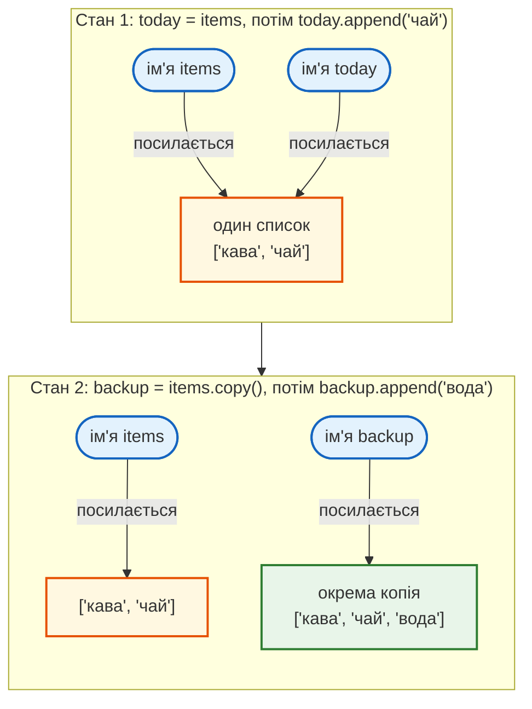
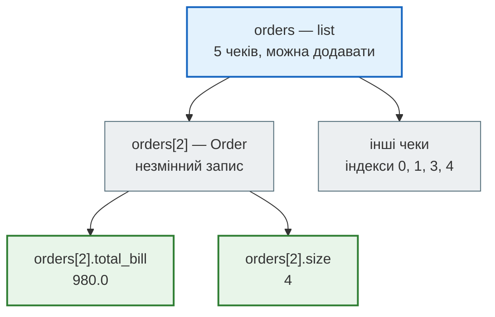
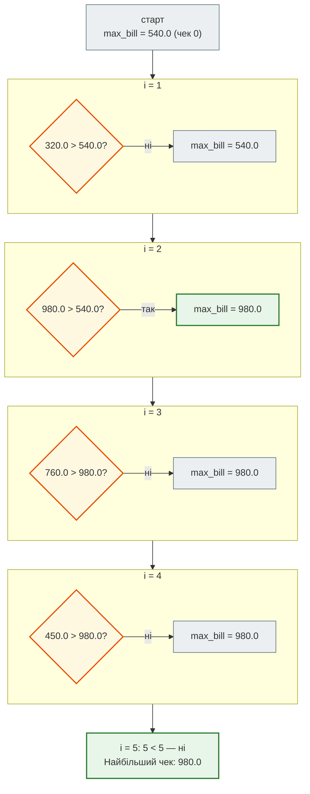
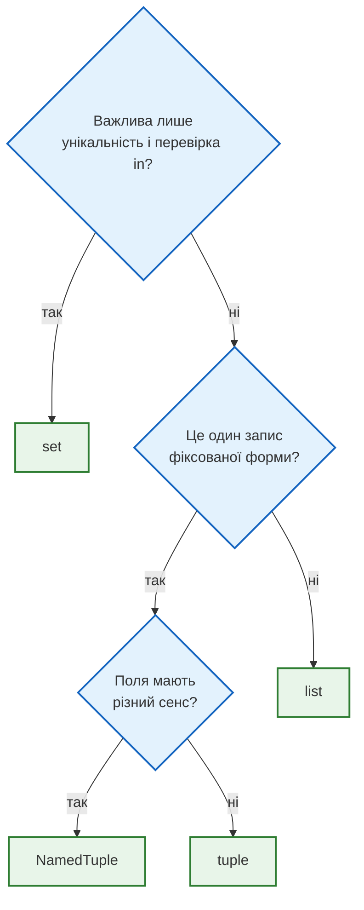

# Урок 5. Списки, кортежі та множини

В уроці 4 кафе приймало замовлення, але пам'ятало лише суму й кількість позицій. Які саме страви замовили, які чеки закрили за день, скільки різних гостей прийшло — цього програма не зберігала: кожне нове значення затирало попереднє.

Щоб програма пам'ятала **багато значень одразу**, потрібні **колекції**. У цьому уроці — три основні:

- **список** (`list`) — впорядкований набір, який можна змінювати;
- **кортеж** (`tuple`) — впорядкований запис, який після створення не змінюється;
- **множина** (`set`) — набір унікальних значень без дублікатів.

**Що потрібно з попередніх уроків:** змінні й типи (урок 3), індекси рядка (`"Charkiv"[0]`), цикл `while`, умови і `in` (урок 4).

**Після уроку ти зможеш:**

- створювати списки, читати елементи за індексом і зрізом, додавати й видаляти елементи;
- пояснювати, чому два імені можуть змінювати один і той самий список, і як зробити копію;
- зберігати фіксований запис у кортежі, розпаковувати його і давати полям імена через `NamedTuple`;
- проходити список циклом `while` і рахувати суму, середнє та максимум;
- прибирати дублікати і порівнювати набори значень через множини;
- обирати контейнер під задачу: `list`, `tuple` чи `set`.

**Задача розділу.** Кафе закриває день. Програма має зберегти позиції замовлень і всі чеки дня, а потім відповісти на запитання власника: скільки чеків, який виторг, який найбільший чек, у які дні працювали, які гості приходили двічі. Повну програму розберемо в розділі [«Практика»](#practice).

**Ноутбук заняття:** [`note_lesson_05_lists_tuples_sets.ipynb`](https://github.com/NikoriakViktot/PY-Course-Victor-Nikoriak-22-09-2026/blob/main/module_1/lessons/lesson_05_lists_tuples_sets/note_lesson_05_lists_tuples_sets.ipynb) [](https://colab.research.google.com/github/NikoriakViktot/PY-Course-Victor-Nikoriak-22-09-2026/blob/main/module_1/lessons/lesson_05_lists_tuples_sets/note_lesson_05_lists_tuples_sets.ipynb)

## Пригадай

Дай відповідь подумки, нічого не запускаючи:

1. Що поверне `5 > 3 and 2 > 10`?
2. Скільки разів виконається блок циклу `while count < 3:`, якщо `count = 0`, а в блоці є `count += 1`?
3. Що дасть `"Charkiv"[0]` і що — `"Charkiv"[-1]`?

??? success "Відповіді"

    1. `False`: `and` вимагає, щоб обидві частини були істинні, а `2 > 10` хибне.
    2. Три рази: для `count` = 0, 1, 2. На перевірці `3 < 3` цикл завершується.
    3. `'C'` — перший символ (індекс 0), `'v'` — останній (індекс -1). Так само, як у рядках, працюватимуть індекси списків.

## Список: набір, що змінюється

### Створення і читання

Список записують у квадратних дужках, елементи — через кому. Замовлення за столиком:

```python
items = ["кава", "круасан", "чай", "кава"]

print(items)
print(len(items))
```

```text
['кава', 'круасан', 'чай', 'кава']
4
```

Список **зберігає порядок** і **дозволяє повтори**: дві кави — два окремі елементи. `len()` повертає кількість елементів.

До елемента звертаються за **індексом** — номером позиції, який починається з 0. Від'ємний індекс рахує з кінця:

```python
print(items[0])
print(items[-1])
```

```text
кава
кава
```

| Елемент | Індекс | Від'ємний індекс |
|---|---|---|
| `"кава"` | `0` | `-4` |
| `"круасан"` | `1` | `-3` |
| `"чай"` | `2` | `-2` |
| `"кава"` | `3` | `-1` |

Індекс за межами списку — помилка:

```python
items[4]
```

```text
IndexError: list index out of range
```

Останній індекс завжди `len(items) - 1`, тобто тут `3`.

### Зрізи

**Зріз** `items[start:stop]` повертає новий список з елементів від `start` до `stop`, не включаючи `stop`:

```python
print(items[1:3])
print(items[:2])
print(items[2:])
print(items[::-1])
```

```text
['круасан', 'чай']
['кава', 'круасан']
['чай', 'кава']
['кава', 'чай', 'круасан', 'кава']
```

Пропущений `start` означає «з початку», пропущений `stop` — «до кінця», а `[::-1]` проходить список у зворотному порядку. На відміну від індексу, зріз за межами не дає помилки: `items[1:100]` просто поверне все від індексу 1 до кінця.

### Перевірка і зміна

`in` перевіряє, чи є значення в списку, а `.count()` рахує, скільки разів воно трапляється:

```python
print("чай" in items)
print("піца" in items)
print(items.count("кава"))
```

```text
True
False
2
```

Список **змінний**: той самий об'єкт можна змінювати на місці, не створюючи нового.

```python
items = ["кава", "круасан", "чай", "кава"]

items[2] = "какао"        # замінити елемент
items.append("чай")       # додати в кінець
items.insert(0, "вода")   # вставити на позицію 0
print(items)

items.remove("кава")      # видалити перше входження значення
print(items)

last = items.pop()        # забрати й повернути останній елемент
print(last, items)
```

```text
['вода', 'кава', 'круасан', 'какао', 'кава', 'чай']
['вода', 'круасан', 'какао', 'кава', 'чай']
чай ['вода', 'круасан', 'какао', 'кава']
```

Зверни увагу: `.remove("кава")` прибрав лише **першу** каву, друга лишилася. Якщо значення немає, `.remove()` зупиняє програму:

```python
items.remove("піца")
```

```text
ValueError: list.remove(x): x not in list
```

Тому перед видаленням значення, якого може не бути, перевіряй `if "піца" in items:`.

### Сортування: sorted() і .sort()

Для списку цін є два способи впорядкувати значення, і вони поводяться по-різному:

```python
prices = [55, 70, 40, 55]

print(sorted(prices))
print(prices)

prices.sort()
print(prices)
```

```text
[40, 55, 55, 70]
[55, 70, 40, 55]
[40, 55, 55, 70]
```

- `sorted(prices)` **повертає новий** відсортований список, а початковий не змінює.
- `prices.sort()` **змінює сам список** і повертає `None`.

!!! warning "Типова помилка"
    `prices = prices.sort()` записує в `prices` значення `None`, і список втрачається. Або `prices.sort()` окремим рядком, або `prices = sorted(prices)`.

Для числових списків корисні також `sum()`, `min()` і `max()`: для `[40, 55, 55, 70]` вони дадуть `220`, `40` і `70`.

### Два імені — один список

В уроці 3 ми бачили, що `b = a` не копіює значення, а прив'язує ще одне ім'я до того самого об'єкта. Для чисел і рядків це непомітно, бо вони незмінні. Зі списком це стає важливим. **Передбач результат:**

```python
items = ["кава"]
today = items
today.append("чай")
print(items)
```

??? question "Що надрукує `print(items)`?"

    Подумай, скільки списків існує після рядка `today = items`.

??? success "Відповідь і пояснення"

    ```text
    ['кава', 'чай']
    ```

    Список лише один. `today = items` прив'язало до нього друге ім'я, а `.append()` змінило **сам список**. Тому зміну видно через обидва імена.

    Щоб отримати незалежний список, його копіюють: `backup = items.copy()`.



У першому стані обидві стрілки ведуть до одного списку, тому зміна через `today` видна і через `items`. У другому `.copy()` створила новий список, і `.append()` змінює лише копію.

### Прохід списком через while

Щоб обробити кожен елемент, потрібен цикл. Поки що в нас є `while`: заводимо індекс `i`, починаємо з 0 і збільшуємо, доки він менший за довжину списку. Порахуймо кави в замовленні:

```python
items = ["кава", "чай", "кава"]

coffee = 0
i = 0
while i < len(items):
    if items[i] == "кава":
        coffee += 1
    i += 1

print("Кав у замовленні:", coffee)
```

```text
Кав у замовленні: 2
```

| `i` | `items[i]` | `coffee` після кроку |
|---|---|---|
| `0` | `"кава"` | `1` |
| `1` | `"чай"` | `1` |
| `2` | `"кава"` | `2` |
| `3` | — | `3 < 3` хибне, цикл завершено |

Умова `i < len(items)` гарантує, що індекс ніколи не вийде за межі: останній опрацьований індекс — `2`, тобто `len(items) - 1`.

??? question "Що станеться, якщо написати `while i <= len(items):`?"

    Дійди в таблиці до `i = 3`.

??? success "Відповідь"

    При `i = 3` умова `3 <= 3` ще істинна, і рядок `items[3]` зупинить програму з `IndexError: list index out of range`. Це та сама помилка на одиницю, що й в уроці 4, але тут вона не додає зайвий повтор, а ламає програму.

Для задачі «скільки разів трапляється значення» є готовий `items.count("кава")`. Але той самий цикл знадобиться для сум, середніх і максимумів, для яких готового методу немає. В уроці 6 цей цикл стане коротшим завдяки `for`, а поки що індекс керуємо вручну.

## Кортеж: запис, що не змінюється

### Закритий чек

Коли чек закрито, його дані не повинні змінюватися: номер столика, сума, чайові. Для такого фіксованого запису підходить **кортеж** — значення в круглих дужках через кому:

```python
receipt = (7, 540.0, 50.0)

print(receipt[0])
print(receipt[-1])
print(len(receipt))
```

```text
7
50.0
3
```

Індекси й зрізи працюють так само, як у списку. Але змінити кортеж не можна:

```python
receipt[1] = 600.0
```

```text
TypeError: 'tuple' object does not support item assignment
```

У кортежу немає `.append()`, `.remove()` та інших методів, що змінюють вміст. Щоб «змінити» кортеж, створюють новий.

### Пакування і розпакування

Значення через кому самі складаються в кортеж, навіть без дужок. Це **пакування**:

```python
point = 10, 20
print(type(point), point)
```

```text
<class 'tuple'> (10, 20)
```

Зворотна дія — **розпакування**: кортеж розкладають по змінних за одну дію.

```python
receipt = (7, 540.0, 50.0)
table, total, tip = receipt
print(table, total, tip)
```

```text
7 540.0 50.0
```

Так само працює обмін значень місцями без тимчасової змінної:

```python
x, y = 1, 2
x, y = y, x
print(x, y)
```

```text
2 1
```

Кількість змінних зліва має дорівнювати кількості значень:

```python
a, b = (7, 540.0, 50.0)          # ValueError: too many values to unpack (expected 2)
a, b, c, d = (7, 540.0, 50.0)    # ValueError: not enough values to unpack (expected 4, got 3)
```

!!! warning "Кортеж з одного елемента"
    Кортеж створюють **коми**, а не дужки. `(42)` — це просто число `42` у дужках, тип `int`. Кортеж з одного елемента потребує коми: `(42,)`.

!!! note "Незмінний — але що саме?"
    Кортеж не дає замінити свої елементи. Але якщо елемент сам є змінним об'єктом, наприклад списком, цей список можна змінити:

    ```python
    t = (1, [2, 3])
    t[1].append(4)
    print(t)       # (1, [2, 3, 4])
    ```

    Кортеж і далі посилається на той самий список, а змінився вміст списку. Для записів, які мають бути незмінними повністю, клади в кортеж незмінні значення: числа, рядки, інші кортежі.

### Коли кортеж, а коли список

| | `list` | `tuple` |
|---|---|---|
| Розмір змінюється? | так | ні, форма фіксована |
| Що означає позиція? | усі елементи рівноправні | кожна позиція має свій сенс |
| Приклад у кафе | позиції замовлення | один закритий чек |

## NamedTuple: поля з іменами

### Проблема індексів

У записі `receipt = (7, 540.0, 50.0)` доводиться пам'ятати, що `receipt[1]` — це сума, а `receipt[2]` — чайові. Через тиждень, або коли полів стане п'ять, легко переплутати індекс. Python нічого не помітить: код мовчки порахує не те.

**`NamedTuple`** дає кожному полю ім'я і при цьому лишається звичайним незмінним кортежем:

```python
from typing import NamedTuple


class Order(NamedTuple):
    total_bill: float
    tip: float
    day: str
    time: str
    size: int


order = Order(540.0, 50.0, "пт", "вечеря", 2)

print(order)
print(order.total_bill, order.tip)
```

```text
Order(total_bill=540.0, tip=50.0, day='пт', time='вечеря', size=2)
540.0 50.0
```

Як це читати:

- `from typing import NamedTuple` підключає інструмент з модуля `typing` (як `import random` в уроці 4);
- блок `class Order(NamedTuple):` — **шаблон запису**: назва `Order` і список полів. Після двокрапки в кожному рядку — назва поля і тип, який ми туди очікуємо;
- `Order(540.0, 50.0, "пт", "вечеря", 2)` створює один чек: значення розкладаються по полях у тому порядку, в якому поля оголошено.

Слово `class` належить до теми класів, яку розберемо в модулі 2. Поки що достатньо сприймати цей блок як опис полів запису. Поля ті самі, що й у ноутбуці заняття: сума чека, чайові, день, прийом їжі, кількість гостей.

`Order` досі кортеж: працюють індекси й розпакування, і змінити поле не можна.

```python
print(isinstance(order, tuple))
print(order[0])

total_bill, tip, day, time, size = order
print(day, size)

order.tip = 70.0
```

```text
True
540.0
пт 2
AttributeError: can't set attribute
```

!!! note "Типи в шаблоні — це підказка"
    Записи `total_bill: float` описують, що ми **очікуємо** в полі, але під час виконання Python їх не перевіряє. `Order("п'ятсот", 50.0, "пт", "вечеря", 2)` створиться без помилки, а проблема з'явиться пізніше, коли з полем спробують рахувати.

### Список чеків дня

Один чек — `Order`. Усі чеки дня — список таких записів:

```python
orders = [
    Order(540.0, 50.0, "пт", "вечеря", 2),
    Order(320.0, 30.0, "пт", "обід", 1),
    Order(980.0, 120.0, "сб", "вечеря", 4),
    Order(760.0, 70.0, "сб", "вечеря", 3),
    Order(450.0, 0.0, "нд", "обід", 5),
]

print(len(orders))
print(orders[2].total_bill)
```

```text
5
980.0
```

`orders[2]` — третій чек у списку (індекс 2), а `.total_bill` — поле цього чека, тобто його сума.



Схема показує два рівні: список змінний (чеки дня додаються), а кожен чек у ньому — незмінний запис з іменованими полями.

### Найбільший чек: поточний максимум

Щоб знайти найбільший чек, проходимо список і пам'ятаємо **найбільше значення, яке вже бачили**. Починаємо з першого чека, а далі оновлюємо максимум, лише коли знайшли більше:

```python
max_bill = orders[0].total_bill
i = 1
while i < len(orders):
    if orders[i].total_bill > max_bill:
        max_bill = orders[i].total_bill
    i += 1

print("Найбільший чек:", max_bill)
```

```text
Найбільший чек: 980.0
```

| `i` | Сума чека | `max_bill` після кроку |
|---|---|---|
| старт | `540.0` (чек 0) | `540.0` |
| `1` | `320.0` — не більше | `540.0` |
| `2` | `980.0` — більше | `980.0` |
| `3` | `760.0` — не більше | `980.0` |
| `4` | `450.0` — не більше | `980.0` |

Та сама таблиця покроково — помаранчевим позначено порівняння, зеленим — оновлення максимуму:



Максимум змінився лише один раз — на чеку 2. Усі інші кроки лише підтверджують, що більшого не знайшлося.

Цикл починається з `i = 1`, бо чек 0 уже взято як стартовий максимум. Чому стартують з першого елемента, а не з `0`? Якби всі чеки були від'ємні (наприклад, повернення коштів), нуль став би «максимумом», якого немає в даних.

## Множина: лише унікальні значення

### Дублікати зникають самі

Множину записують у фігурних дужках. Однакові значення в ній зберігаються лише один раз:

```python
tables = {3, 1, 2, 3}
print(tables)
print(len(tables))
```

```text
{1, 2, 3}
3
```

Порожню множину створюють лише через `set()`, бо `{}` — це порожній **словник** (тема уроку 6):

```python
days = {}
days.add("пт")
```

```text
AttributeError: 'dict' object has no attribute 'add'
```

Правильно: `days = set()`, а потім `days.add("пт")`. Додавання значення, яке вже є, нічого не змінює й помилки не дає.

### Що вміє множина, а чого ні

- `"пт" in days` — перевірка належності. Саме для цього множини найкорисніші: `in` для множини працює швидко навіть на мільйонах елементів, а список доводиться переглядати по одному.
- `days.remove("пн")` дає `KeyError: 'пн'`, якщо значення немає. `days.discard("пн")` тихо нічого не робить.
- **Індексів немає**: `days[0]` дає `TypeError: 'set' object is not subscriptable`. У множини немає «першого» елемента.
- **Порядок не гарантований**: Python показує елементи в зручному йому порядку, не в порядку додавання. Якщо порядок потрібен для виводу, використовуй `sorted(days)` — він поверне відсортований список.
- **Елементи мають бути незмінними**: числа, рядки, кортежі. Список у множину покласти не можна: `{[1, 2], 3}` дає `TypeError: unhashable type: 'list'`.

### Унікальні дні з чеків

Скільки різних днів працювало кафе? Проходимо чеки й додаємо день кожного в множину:

```python
days = set()
i = 0
while i < len(orders):
    days.add(orders[i].day)
    i += 1

print(len(days))
print(sorted(days))
```

```text
3
['нд', 'пт', 'сб']
```

П'ять чеків, але днів лише три: повторні `"пт"` і `"сб"` множина не додала. `sorted()` впорядкував назви за абеткою, а не за днями тижня: для множини порядок днів ніхто не зберігав.

Для простого списку значень те саме робить один рядок: `len(set(["кава", "чай", "кава"]))` дає `2`.

!!! warning "list(set(...)) губить порядок"
    `list(set(items))` прибирає дублікати, але порядок елементів у результаті може відрізнятися від початкового. Якщо порядок важливий, прибирай дублікати циклом: додавай елемент у новий список, лише якщо його там ще немає.

### Операції з множинами

Власник кафе хоче порівняти гостей двох днів:

```python
monday = {"Олена", "Богдан", "Марта"}
tuesday = {"Богдан", "Марта", "Петро"}
```

| Запис | Результат | Що означає |
|---|---|---|
| `monday | tuesday` | Богдан, Марта, Олена, Петро | **об'єднання**: хто приходив хоча б раз |
| `monday & tuesday` | Богдан, Марта | **перетин**: хто приходив обидва дні |
| `monday - tuesday` | Олена | **різниця**: був у понеділок, але не у вівторок |
| `monday ^ tuesday` | Олена, Петро | **симетрична різниця**: був лише в один із днів |

Кожен запис повертає нову множину. Python надрукує її у фігурних дужках і в довільному порядку: у таблиці імена впорядковано для зручності.

Оператори `|`, `&`, `-`, `^` працюють лише між двома множинами: `monday | ["Зоя"]` дає `TypeError: unsupported operand type(s) for |: 'set' and 'list'`. Методи з назвами (`.union()`, `.intersection()`, `.difference()`) приймають і список: `monday.union(["Зоя"])`.

## Як обрати контейнер

| | `list` | `tuple` | `set` |
|---|---|---|---|
| Змінний | так | ні | так |
| Порядок | так | так | ні |
| Дублікати | так | так | ні |
| Індекс | так | так | ні |

У кафе: `list` — позиції замовлення й чеки дня, `tuple` — один закритий чек, `set` — унікальні дні та гості.



Вибір — це не про синтаксис, а про те, що ти повідомляєш читачеві коду: «цей набір росте» (`list`), «цей запис не зміниться» (`tuple`), «тут важлива лише наявність» (`set`).

## Практика { #practice }

### Розібраний приклад: звіт за день

Програма бере чеки дня і друкує звіт для власника: кількість чеків, виторг, частку чайових, найбільший чек і дні роботи.

```python linenums="1" hl_lines="20 21 22 23 26 33"
from typing import NamedTuple


class Order(NamedTuple):
    total_bill: float
    tip: float
    day: str
    time: str
    size: int


orders = [
    Order(540.0, 50.0, "пт", "вечеря", 2),
    Order(320.0, 30.0, "пт", "обід", 1),
    Order(980.0, 120.0, "сб", "вечеря", 4),
    Order(760.0, 70.0, "сб", "вечеря", 3),
    Order(450.0, 0.0, "нд", "обід", 5),
]

revenue = 0
tips = 0
max_bill = orders[0].total_bill
days = set()

i = 0
while i < len(orders):
    order = orders[i]
    revenue += order.total_bill
    tips += order.tip
    if order.total_bill > max_bill:
        max_bill = order.total_bill
    days.add(order.day)
    i += 1

print("Чеків:", len(orders))
print("Виторг:", revenue, "грн")
print("Чайові:", round(tips / revenue * 100, 1), "% від виторгу")
print("Найбільший чек:", max_bill, "грн")
print("Днів роботи:", len(days), sorted(days))
```

```text
Чеків: 5
Виторг: 3050.0 грн
Чайові: 8.9 % від виторгу
Найбільший чек: 980.0 грн
Днів роботи: 3 ['нд', 'пт', 'сб']
```

Що відбувається в ключових рядках:

- **рядки 4–9** — шаблон запису `Order`;
- **рядки 12–18** — список чеків дня: кожен елемент — один `Order`;
- **рядки 20–23** — початковий стан: дві суми з нуля, стартовий максимум — перший чек, порожня множина днів;
- **рядок 26** — `while` проходить індекси від 0 до `len(orders) - 1`;
- **рядок 27** — `order = orders[i]` дає коротке ім'я поточному чеку, щоб не писати `orders[i]` щоразу;
- **рядки 28–32** — одна ітерація оновлює все одразу: дві суми, максимум і множину днів;
- **рядок 33** — зміна стану: без `i += 1` цикл став би нескінченним;
- **рядок 37** — чайові разом `270` грн, `270 / 3050 * 100` ≈ `8.85`, а `round(…, 1)` округлює до одного знака після коми: `8.9`.

Змінні `revenue` і `tips` накопичують значення: перед циклом вони нульові, у кожному повторі до них додається поле поточного чека. Цей прийом називають **накопичувачем**, і він знадобиться майже в кожній задачі на обробку даних.

### Зміни приклад: великі столи

Та сама задача, що й у ноутбуці заняття. Знайди чеки, де за столом `size >= 4`, і виведи:

- кількість таких чеків;
- середній чек;
- середній чек на одну людину — середнє значення `total_bill / size` для цих чеків.

Для списку `orders` з прикладу вище очікуваний результат:

```text
Великих столів: 2
Середній чек: 715.0 грн
На людину: 167.5 грн
```

Тут підходять чеки 980.0 грн на 4 гостей і 450.0 грн на 5 гостей: `(980.0 + 450.0) / 2 = 715.0`, а на людину `(245.0 + 90.0) / 2 = 167.5`.

**Критерії перевірки:**

- умова саме `size >= 4`: стіл на 4 гостей теж великий;
- якщо великих столів немає (наприклад, у списку лише перші два чеки), програма пише `Великих столів немає` і не падає з `ZeroDivisionError`;
- список `orders` після роботи програми не змінився.

??? tip "Підказка"
    Потрібні три накопичувачі: лічильник чеків, сума чеків і сума значень `total_bill / size`. Ділити на кількість можна лише після циклу і лише тоді, коли вона більша за нуль.

### Спробуй самостійно: реєстрація на воркшопи

Інший контекст, ті самі інструменти. Люди реєструвалися на два воркшопи через форму, і деякі заповнили її двічі. Є два списки email:

```python
python_workshop = ["olena@mail.com", "taras@mail.com", "olena@mail.com", "marta@mail.com"]
git_workshop = ["marta@mail.com", "petro@mail.com", "taras@mail.com", "petro@mail.com"]
```

Напиши програму, яка виводить:

```text
Python: 3 учасники
Git: 3 учасники
На обох: ['marta@mail.com', 'taras@mail.com']
Лише на Python: ['olena@mail.com']
Усього різних людей: 4
Усі учасники: ['marta@mail.com', 'olena@mail.com', 'petro@mail.com', 'taras@mail.com']
```

**Критерії перевірки:**

- повторні реєстрації не рахуються: у кожному воркшопі — 3 людини, а не 4;
- списки email у виводі відсортовані, тож результат однаковий на будь-якому комп'ютері;
- якщо додати до `git_workshop` ще один `"olena@mail.com"`, Олена зникне з «Лише на Python» і з'явиться в «На обох», а «Усього різних людей» лишиться 4;
- початкові списки не змінюються.

??? tip "Підказка"
    Перетвори кожен список на множину один раз, на початку. Далі кожен рядок виводу — одна операція з множинами і, за потреби, `sorted()`.

### Квест для груп: чи отримає Тарас чайові?

Кафе зачиняється, і офіціант Тарас отримає чайові, лише якщо **каса зійдеться**. Чотири служби перевіряють свою частину дня, і кожна працює зі своїм контейнером:

| Служба | Контейнер | Що перевіряє |
|---|---|---|
| Кухня | `list` | замовлення змінилося: дозамовили, відмовилися, хліб на початок |
| Каса | `tuple` | розпакувати закритий чек і порахувати суму до сплати |
| Зал | `NamedTuple`, індекси | чайові останніх трьох чеків дня через від'ємні індекси |
| Адміністратор | `set` | постійні гості — перетин гостей двох днів |

Усі групи відкривають той самий ноутбук і розв'язують свою перевірку. Каса дає підказку на типову помилку, а за правильну відповідь показує частину чайових у гривнях. Групи називають суми викладачу, він вписує їх у клітинку «Закриття зміни» — і всі дізнаються, скільки отримає Тарас. Удома ноутбук можна пройти самостійно, усі чотири перевірки.

**Ноутбук квесту:** [`cafe_shift_quest.ipynb`](https://github.com/NikoriakViktot/PY-Course-Victor-Nikoriak-22-09-2026/blob/main/module_1/lessons/lesson_05_lists_tuples_sets/cafe_shift_quest.ipynb) [](https://colab.research.google.com/github/NikoriakViktot/PY-Course-Victor-Nikoriak-22-09-2026/blob/main/module_1/lessons/lesson_05_lists_tuples_sets/cafe_shift_quest.ipynb)

## Підсумок

| Що потрібно | Як записати |
|---|---|
| створити список / кортеж / множину | `[1, 2]`, `(1, 2)`, `{1, 2}`; порожня множина — `set()` |
| кількість елементів | `len(items)` |
| елемент за позицією | `items[0]`, `items[-1]` (для `list` і `tuple`) |
| частина послідовності | `items[1:3]`, `items[::-1]` |
| перевірити наявність | `"кава" in items` |
| змінити список | `.append()`, `.insert()`, `.remove()`, `.pop()`, `items[i] = …` |
| копія списку | `items.copy()` |
| відсортувати | `sorted(items)` — новий список; `items.sort()` — на місці |
| розпакувати запис | `table, total, tip = receipt` |
| запис з іменами полів | `class Order(NamedTuple): …`, `order.tip` |
| прибрати дублікати | `set(items)` |
| порівняти набори | `a | b`, `a & b`, `a - b`, `a ^ b` |
| пройти список | `i = 0`, `while i < len(items): … i += 1` |

### Самоперевірка

1. Що дасть `["a", "b", "c"][1:]`?
2. Після `a = [1]`, `b = a`, `b.append(2)` — що в `a`? А якщо замість `b = a` написати `b = a.copy()`?
3. Чим `(5)` відрізняється від `(5,)`?
4. Чому для одного закритого чека краще кортеж, а для всіх чеків дня — список?
5. Що виведе `len({"пт", "сб", "пт"})` і чому?
6. Чому `days = {}` не створює порожню множину?

??? success "Відповіді"

    1. `['b', 'c']` — від індексу 1 до кінця.
    2. `[1, 2]`: обидва імені вказують на один список. З `a.copy()` у `a` лишиться `[1]`, бо `b` — окремий список.
    3. `(5)` — число `5`, `(5,)` — кортеж з одного елемента. Кортеж створює кома.
    4. Закритий чек — фіксований запис, де кожна позиція має свій сенс, і його не повинні змінювати. Чеки дня — набір, що росте протягом дня.
    5. `2`: множина зберігає `"пт"` лише один раз.
    6. `{}` — це порожній словник. Порожня множина — лише `set()`.

### Що далі

- Ноутбук заняття: [`note_lesson_05_lists_tuples_sets.ipynb`](https://github.com/NikoriakViktot/PY-Course-Victor-Nikoriak-22-09-2026/blob/main/module_1/lessons/lesson_05_lists_tuples_sets/note_lesson_05_lists_tuples_sets.ipynb) [](https://colab.research.google.com/github/NikoriakViktot/PY-Course-Victor-Nikoriak-22-09-2026/blob/main/module_1/lessons/lesson_05_lists_tuples_sets/note_lesson_05_lists_tuples_sets.ipynb) — ті самі ідеї на реальному наборі з 244 чеків.
- Квест для груп: [`cafe_shift_quest.ipynb`](https://github.com/NikoriakViktot/PY-Course-Victor-Nikoriak-22-09-2026/blob/main/module_1/lessons/lesson_05_lists_tuples_sets/cafe_shift_quest.ipynb) [](https://colab.research.google.com/github/NikoriakViktot/PY-Course-Victor-Nikoriak-22-09-2026/blob/main/module_1/lessons/lesson_05_lists_tuples_sets/cafe_shift_quest.ipynb) — вечірня зміна в кафе, список, кортеж, `NamedTuple` і множини в одній грі.
- Додатковий конспект з вправами: [`notes_lists_tuples_sets.ipynb`](https://github.com/NikoriakViktot/PY-Course-Victor-Nikoriak-22-09-2026/blob/main/module_1/lessons/lesson_05_lists_tuples_sets/notes_lists_tuples_sets.ipynb) [](https://colab.research.google.com/github/NikoriakViktot/PY-Course-Victor-Nikoriak-22-09-2026/blob/main/module_1/lessons/lesson_05_lists_tuples_sets/notes_lists_tuples_sets.ipynb)
- Довідник: [Списки](../../reference/python_core/lists.md), [Кортежі й `NamedTuple`](../../reference/python_core/tuples.md), [Множини](../../reference/python_core/sets.md).
- Наступний урок: [Урок 6. Словники, for, comprehensions](lesson_06.md). Цикл `while` з індексом стане коротшим завдяки `for`, а словник дозволить рахувати, наприклад, виторг окремо для кожного дня.

## Документація

- Туторіал: [списки](https://docs.python.org/3/tutorial/datastructures.html#more-on-lists), [кортежі й послідовності](https://docs.python.org/3/tutorial/datastructures.html#tuples-and-sequences), [множини](https://docs.python.org/3/tutorial/datastructures.html#sets)
- Вбудовані типи: [послідовності `list`, `tuple`](https://docs.python.org/3/builtins/stdtypes.html#sequence-types-list-tuple-range), [спільні операції послідовностей](https://docs.python.org/3/builtins/stdtypes.html#common-sequence-operations), [операції, що змінюють список](https://docs.python.org/3/builtins/stdtypes.html#mutable-sequence-types), [множини `set`](https://docs.python.org/3/builtins/stdtypes.html#set-types-set-frozenset)
- Функції: [`len()`](https://docs.python.org/3/builtins/functions.html#len), [`sorted()`](https://docs.python.org/3/builtins/functions.html#sorted), [`typing.NamedTuple`](https://docs.python.org/3/library/typing.html#typing.NamedTuple)
- Глосарій: [mutable](https://docs.python.org/3/glossary.html#term-mutable), [immutable](https://docs.python.org/3/glossary.html#term-immutable), [hashable](https://docs.python.org/3/glossary.html#term-hashable)
