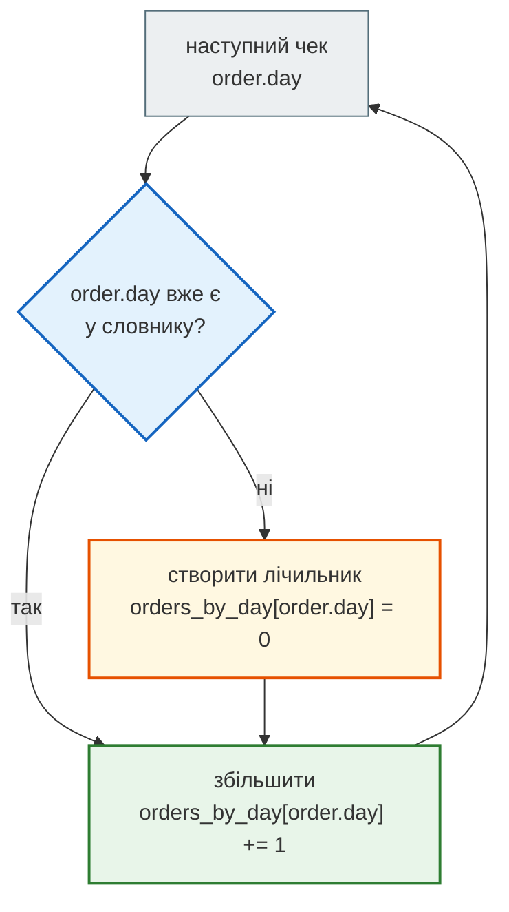
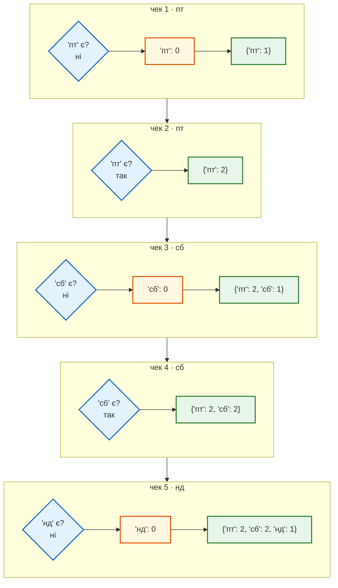
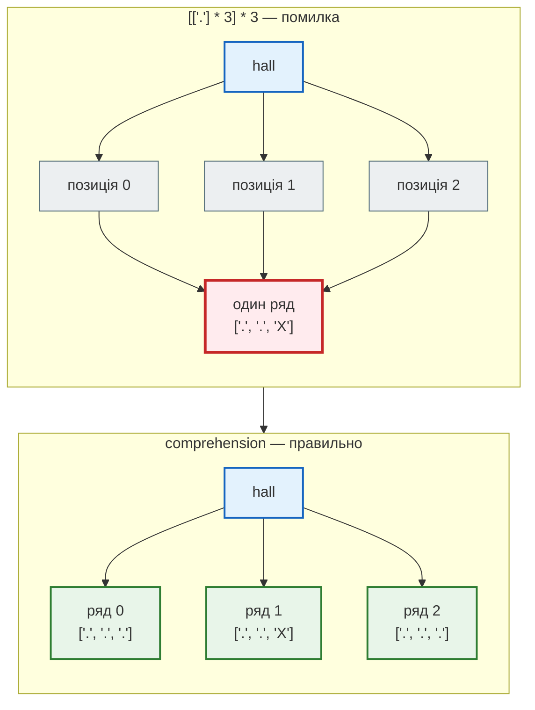

# Урок 6. Словники, for, comprehensions

В уроці 5 кафе навчилося зберігати чеки дня у списку. Але щоб відповісти на питання «який виторг у п'ятницю?», довелося б щоразу проходити весь список і рахувати вручну. А цикл `while` з індексом вимагав стежити за `i` і не забути `i += 1`.

У цьому уроці з'являються три інструменти, які роблять такі задачі коротшими й надійнішими:

- **цикл `for`** — проходить колекцію сам, без ручного індексу;
- **словник** (`dict`) — зберігає пари «ключ → значення», наприклад «день → виторг»;
- **comprehension** — компактний запис циклу, який будує новий список, множину чи словник.

**Що потрібно з попередніх уроків:** `if` і `while` (урок 4), списки, кортежі, множини і `NamedTuple Order` з чеками кафе (урок 5).

**Після уроку ти зможеш:**

- проходити списки, рядки й діапазони чисел циклом `for` і `range()`;
- створювати словник, читати значення за ключем без `KeyError`, додавати й змінювати пари;
- перебирати ключі, значення і пари словника та уникати пастки `for k, v in d`;
- рахувати, підсумовувати й групувати дані за ключем — три базові патерни аналітики;
- записувати простий цикл як list, set або dict comprehension і розуміти, коли цикл читабельніший.

**Задача розділу.** Аналітика кафе: виторг, кількість чеків і середній чек **для кожного дня**, найприбутковіший день, чеки за прийомом їжі. Повний звіт розберемо в розділі [«Практика»](#practice).

**Ноутбук заняття:** [`note_lesson_06_dicts_loops_comprehensions.ipynb`](https://github.com/NikoriakViktot/PY-Course-Victor-Nikoriak-22-09-2026/blob/main/module_1/lessons/lesson_06_dicts_loops_comprehensions/note_lesson_06_dicts_loops_comprehensions.ipynb) [](https://colab.research.google.com/github/NikoriakViktot/PY-Course-Victor-Nikoriak-22-09-2026/blob/main/module_1/lessons/lesson_06_dicts_loops_comprehensions/note_lesson_06_dicts_loops_comprehensions.ipynb)

## Пригадай

Дай відповідь подумки, нічого не запускаючи:

1. Чим `tuple` відрізняється від `list` за призначенням, а не за синтаксисом?
2. Що дасть `len({"пт", "сб", "пт"})`?
3. Після `a = [1]`, `b = a`, `b.append(2)` — що буде в `a`?

??? success "Відповіді"

    1. `list` — набір, що змінюється (позиції замовлення, чеки дня); `tuple` — фіксований запис, де кожна позиція має свій сенс (один закритий чек).
    2. `2`: множина зберігає `"пт"` лише один раз.
    3. `[1, 2]`: обидва імені вказують на один список. Ця ідея знову знадобиться в розділі про вкладені списки.

## Цикл for

### Той самий прохід, без індексу

В уроці 5 ми рахували кави в замовленні так:

```python
items = ["кава", "чай", "кава"]

coffee = 0
i = 0
while i < len(items):
    if items[i] == "кава":
        coffee += 1
    i += 1
```

Цикл `for` робить ту саму роботу, але індекс веде сам:

```python
items = ["кава", "чай", "кава"]

coffee = 0
for item in items:
    if item == "кава":
        coffee += 1

print("Кав у замовленні:", coffee)
```

```text
Кав у замовленні: 2
```

Запис `for item in items:` читається як «для кожного елемента `item` зі списку `items`». На кожному повторі Python бере наступний елемент і прив'язує до нього ім'я `item`. Коли елементи закінчуються, цикл завершується сам: немає умови, яку треба перевіряти, і немає лічильника, який можна забути збільшити.

| Повтор | `item` | `coffee` після повтору |
|---|---|---|
| 1 | `"кава"` | `1` |
| 2 | `"чай"` | `1` |
| 3 | `"кава"` | `2` |

`for` проходить будь-яку колекцію: список, кортеж, рядок (по символах), множину (у довільному порядку). Прохід списком чеків з уроку 5 стає коротшим:

```python
from typing import NamedTuple


class Order(NamedTuple):
    total_bill: float
    tip: float
    day: str
    time: str
    size: int


orders = [
    Order(540.0, 50.0, "пт", "вечеря", 2),
    Order(320.0, 30.0, "пт", "обід", 1),
    Order(980.0, 120.0, "сб", "вечеря", 4),
    Order(760.0, 70.0, "сб", "вечеря", 3),
    Order(450.0, 0.0, "нд", "обід", 5),
]

revenue = 0
for order in orders:
    revenue += order.total_bill

print("Виторг:", revenue)
```

```text
Виторг: 3050.0
```

`break` і `continue` працюють у `for` так само, як у `while`: `break` виходить з циклу, `continue` переходить до наступного елемента.

### range(): цикл по числах

Коли потрібні самі числа, наприклад номери столиків, використовують `range()`:

| Запис | Числа | Що означає |
|---|---|---|
| `range(5)` | 0, 1, 2, 3, 4 | від 0 до 5, не включаючи 5 |
| `range(1, 6)` | 1, 2, 3, 4, 5 | від 1 до 6, не включаючи 6 |
| `range(0, 10, 3)` | 0, 3, 6, 9 | крок 3 |
| `range(3, 0, -1)` | 3, 2, 1 | у зворотному порядку |

```python
for table in range(1, 4):
    print("Столик", table)
```

```text
Столик 1
Столик 2
Столик 3
```

Як і в зрізах, кінцеве число **не входить**. `range(len(items))` дає всі індекси списку, але якщо індекс не потрібен, пиши просто `for item in items`. Якщо потрібні і номер, і елемент, є `enumerate()`:

```python
for number, item in enumerate(["кава", "чай"], start=1):
    print(number, item)
```

```text
1 кава
2 чай
```

### Коли все ж while

`for` підходить, коли відомо, **що** перебирати: елементи колекції або числа з діапазону. `while` потрібен, коли кількість повторів заздалегідь невідома: «питати, доки користувач не введе `готово`» (урок 4) або «вгадувати, доки не вгадаєш число».

## Словник: ключ → значення

### Створення і читання

Список шукає елемент за **позицією** (`items[0]`). Словник шукає значення за **ключем**. Меню кафе:

```python
prices = {"кава": 55, "круасан": 70, "чай": 40}

print(prices["кава"])
print(len(prices))
```

```text
55
3
```

Словник записують у фігурних дужках: пари `ключ: значення` через кому. `prices["кава"]` читається як «ціна кави». `len()` повертає кількість пар.

Якщо ключа немає, програма зупиняється:

```python
prices["піца"]
```

```text
KeyError: 'піца'
```

Безпечний спосіб — `.get(ключ, запасне_значення)`. Якщо ключ є, повертається його значення, якщо ні — запасне (без нього — `None`):

```python
print(prices.get("кава", 0))
print(prices.get("піца", 0))
print(prices.get("піца"))
```

```text
55
0
None
```

`.get()` лише **читає**: після `prices.get("піца", 0)` у словнику так і не з'явилося ключа `"піца"`.

### Додавання, зміна, видалення

Запис `d[ключ] = значення` працює в обидва боки: якщо ключа немає — додає пару, якщо є — замінює значення.

```python
prices["какао"] = 60     # нового ключа не було — додали
prices["кава"] = 60      # ключ був — замінили значення
print(prices)

removed = prices.pop("какао")   # забрати значення й видалити пару
print(removed, prices)
```

```text
{'кава': 60, 'круасан': 70, 'чай': 40, 'какао': 60}
60 {'кава': 60, 'круасан': 70, 'чай': 40}
```

Словник пам'ятає порядок, у якому додавали ключі, тому друкує пари в цьому порядку.

### Правила для ключів

- **Ключі унікальні.** Якщо в записі той самий ключ трапляється двічі, лишається останнє значення: `{"a": 1, "a": 2}` дає `{'a': 2}`.
- **Регістр має значення.** `"Кава"` і `"кава"` — два різні ключі. Тому текст від користувача спершу очищають: `.strip().lower()`.
- **Ключ має бути незмінним:** рядок, число, кортеж. Список ключем бути не може: `{["a"]: 1}` дає `TypeError: unhashable type: 'list'` — те саме правило, що й для елементів множини. Кортеж можна: наприклад, місце в залі `(ряд, місце)` може бути ключем словника бронювань.
- **Значення можуть бути будь-якими**: числами, рядками, списками, іншими словниками.

### in перевіряє ключі

```python
print("чай" in prices)
print(40 in prices)
print(40 in prices.values())
```

```text
True
False
True
```

`in` для словника шукає лише серед **ключів**. `40` — значення (ціна чаю), тому `40 in prices` дає `False`. Щоб шукати серед значень, пиши `.values()`.

## Перебір словника

У словника три способи перебору, і вони дають різне:

```python
prices = {"кава": 55, "круасан": 70, "чай": 40}

for name in prices:
    print(name)

for price in prices.values():
    print(price)

for name, price in prices.items():
    print(name, "—", price, "грн")
```

```text
кава
круасан
чай
55
70
40
кава — 55 грн
круасан — 70 грн
чай — 40 грн
```

| Запис | Що дає на кожному повторі |
|---|---|
| `for key in d` | ключ |
| `for value in d.values()` | значення |
| `for key, value in d.items()` | кортеж `(ключ, значення)`, одразу розпакований у дві змінні |

### Передбач результат: пастка без .items()

```python
revenue_by_day = {"пт": 860.0, "сб": 1740.0, "нд": 450.0}

for day, revenue in revenue_by_day:
    print(day, revenue)
```

??? question "Що надрукує цей код?"

    Згадай, що дає `for ... in d` без `.items()`, а потім — що робить розпакування з рядком.

??? success "Відповідь і пояснення"

    ```text
    п т
    с б
    н д
    ```

    Без `.items()` цикл віддає лише **ключі** — рядки `"пт"`, `"сб"`, `"нд"`. Кожен ключ складається рівно з двох символів, тому Python розпаковує сам рядок: `day = "п"`, `revenue = "т"`. Помилки немає, але виторг загубився — і це найнебезпечніший варіант.

    Якби ключі мали іншу довжину, програма впала б: `for k, v in {"кава": 1}` дає `ValueError: too many values to unpack (expected 2)`. Правильно: `for day, revenue in revenue_by_day.items():`.

!!! warning "Не змінюй розмір словника під час перебору"
    Додавання чи видалення ключів усередині `for key in d:` зупиняє програму: `RuntimeError: dictionary changed size during iteration`. Змінювати значення наявних ключів можна.

## Три патерни: рахувати, підсумовувати, групувати

Майже вся аналітика даних будується з трьох прийомів. Усі вони проходять записи циклом і накопичують результат у словнику, де ключ — категорія (день, прийом їжі), а значення — те, що рахуємо.

### Підрахунок: скільки чеків у кожен день

```python
orders_by_day = {}

for order in orders:
    if order.day not in orders_by_day:
        orders_by_day[order.day] = 0
    orders_by_day[order.day] += 1

print(orders_by_day)
```

```text
{'пт': 2, 'сб': 2, 'нд': 1}
```

Перший раз, коли трапляється день, його ще немає в словнику, і ми створюємо лічильник з нулем. Далі лише збільшуємо. Без цієї перевірки рядок `orders_by_day[order.day] += 1` для нового дня впав би з `KeyError`: не можна додати 1 до значення, якого немає.



Схема показує, що перевірка потрібна лише для нового ключа: гілка «ні» створює лічильник, і далі обидві гілки сходяться в одне оновлення.

Як змінюється словник:

| Чек | `order.day` | `orders_by_day` після кроку |
|---|---|---|
| 1 | `"пт"` — новий ключ | `{'пт': 1}` |
| 2 | `"пт"` | `{'пт': 2}` |
| 3 | `"сб"` — новий ключ | `{'пт': 2, 'сб': 1}` |
| 4 | `"сб"` | `{'пт': 2, 'сб': 2}` |
| 5 | `"нд"` — новий ключ | `{'пт': 2, 'сб': 2, 'нд': 1}` |

Покроково — жовтим позначено створення нового ключа, зеленим — збільшення лічильника:



Ту саму логіку записують одним рядком через `.get()`: «візьми поточне значення або 0, додай 1, запиши назад».

```python
orders_by_day = {}
for order in orders:
    orders_by_day[order.day] = orders_by_day.get(order.day, 0) + 1
```

### Підсумовування: виторг за днями

Замість `+ 1` додаємо суму чека:

```python
revenue_by_day = {}
for order in orders:
    revenue_by_day[order.day] = revenue_by_day.get(order.day, 0) + order.total_bill

print(revenue_by_day)
```

```text
{'пт': 860.0, 'сб': 1740.0, 'нд': 450.0}
```

### Групування: чеки за прийомом їжі

Іноді потрібна не кількість і не сума, а **самі значення**, зібрані за ключем. Тоді значення словника — список:

```python
bills_by_time = {}
for order in orders:
    bills_by_time.setdefault(order.time, []).append(order.total_bill)

print(bills_by_time)
```

```text
{'вечеря': [540.0, 980.0, 760.0], 'обід': [320.0, 450.0]}
```

`d.setdefault(ключ, запасне)` робить дві речі: якщо ключа немає, **записує** `d[ключ] = запасне`; і в будь-якому разі **повертає** значення за ключем. Тут воно повертає список, а `.append()` додає до нього суму чека.

| | `d.get(k, x)` | `d.setdefault(k, x)` |
|---|---|---|
| Ключ є | повертає значення | повертає значення |
| Ключа немає | повертає `x`, словник не змінює | записує `d[k] = x` і повертає `x` |

!!! warning "Не присвоюй результат .append()"
    `d[k] = d.setdefault(k, []).append(v)` запише в словник `None`: `.append()` змінює список і повертає `None`. Правильно — просто `d.setdefault(k, []).append(v)`.

### Лідер: найприбутковіший день

Пройдемо пари `(день, виторг)` і запам'ятаємо найкращу:

```python
best_day = None
best_revenue = 0

for day, revenue in revenue_by_day.items():
    if best_day is None or revenue > best_revenue:
        best_day = day
        best_revenue = revenue

print("Найкращий день:", best_day, best_revenue)
```

```text
Найкращий день: сб 1740.0
```

`best_day is None` спрацьовує на першому повторі: першу пару беремо як стартового лідера. Далі лідер змінюється лише тоді, коли знайшовся більший виторг.

!!! note "max() для словника"
    `max(d)` порівнює **ключі**, а не значення. Для `{"кава": 30, "чай": 12, "какао": 7}` він поверне `'чай'` — останній за абеткою, хоча найбільше значення в кави. Найбільше значення дає `max(d.values())`, а ключ з найбільшим значенням — `max(d, key=d.get)`. Запис `key=d.get` передає в `max()` метод як значення; як це працює, розберемо в уроці 9.

??? note "Поглиблення: Counter і defaultdict"
    У модулі `collections` є готові інструменти для цих патернів:

    ```python
    from collections import Counter, defaultdict

    days = Counter(order.day for order in orders)   # Counter({'пт': 2, 'сб': 2, 'нд': 1})

    revenue = defaultdict(float)
    for order in orders:
        revenue[order.day] += order.total_bill       # відсутній ключ сам стає 0.0
    ```

    Спершу добре зрозумій ручні версії з `if` і `.get()`: готові інструменти лише ховають ту саму логіку.

## Comprehensions: цикл, що будує колекцію

### Список з циклу

Часто цикл потрібен лише для того, щоб зібрати новий список: взяти кожен елемент, змінити його і додати. Суми чеків з 10 % знижкою:

```python
discounted = []
for order in orders:
    discounted.append(order.total_bill * 0.9)

print(discounted)
```

```text
[486.0, 288.0, 882.0, 684.0, 405.0]
```

**List comprehension** записує те саме одним виразом:

```python
discounted = [order.total_bill * 0.9 for order in orders]
```

Читати його зручно з середини: «**для кожного** `order` **з** `orders` — **взяти** `order.total_bill * 0.9`». Квадратні дужки означають, що результат — новий список.

### Фільтр

Щоб узяти не всі елементи, в кінець додають `if`:

```python
big_bills = [order.total_bill for order in orders if order.total_bill > 500]
print(big_bills)
```

```text
[540.0, 980.0, 760.0]
```

Загальна форма:

```text
[ що_взяти   for елемент in колекція   if умова ]
```

**Передбач результат:**

```python
print([x ** 2 for x in range(1, 11) if x % 2 == 0])
```

??? success "Відповідь"

    ```text
    [4, 16, 36, 64, 100]
    ```

    `range(1, 11)` дає числа від 1 до 10, умова `x % 2 == 0` залишає парні (2, 4, 6, 8, 10), а `x ** 2` підносить кожне до квадрата.

### Множина і словник

Ті самі дужки, що й у літералах, визначають тип результату:

```python
days = {order.day for order in orders}
average = {day: revenue_by_day[day] / orders_by_day[day] for day in revenue_by_day}

print(len(days))
print(average)
```

```text
3
{'пт': 430.0, 'сб': 870.0, 'нд': 450.0}
```

- `{вираз for ...}` — **set comprehension**: дублікати днів відкидаються.
- `{ключ: значення for ...}` — **dict comprehension**: двокрапка відрізняє його від множини.

### Коли краще звичайний цикл

Comprehension будує **нову колекцію**. Якщо мета — виконати дію (надрукувати, змінити інший словник, відповісти користувачу), пиши звичайний `for`. Так само, якщо в одному виразі стає дві-три умови й вкладені цикли: кілька рядків із відступами прочитати легше, ніж один довгий рядок.

### Пастка: вкладені списки через множення

План залу кафе зберігають як список рядів, де кожен ряд — список місць: `"."` — вільне, `"X"` — заброньоване. Здається, що зал 3×3 можна створити множенням:

```python
hall = [["."] * 3] * 3
hall[1][2] = "X"
print(hall)
```

??? question "Скільки місць виявиться заброньовано?"

    Згадай урок 5: що буває, коли два імені посилаються на один список?

??? success "Відповідь і пояснення"

    ```text
    [['.', '.', 'X'], ['.', '.', 'X'], ['.', '.', 'X']]
    ```

    Три заброньовані місця, хоча бронювали одне. `* 3` не створює три нові ряди, а тричі кладе в зовнішній список посилання на **один і той самий** ряд. Зміна в ньому видна у всіх трьох позиціях.

    Comprehension створює новий ряд на кожному повторі:

    ```python
    hall = [["." for col in range(3)] for row in range(3)]
    hall[1][2] = "X"
    print(hall)   # [['.', '.', '.'], ['.', '.', 'X'], ['.', '.', '.']]
    ```



У першому випадку три позиції зовнішнього списку ведуть до одного ряду, у другому — кожна до свого.

## Практика { #practice }

### Розібраний приклад: звіт кафе за днями

Програма рахує для кожного дня кількість чеків, виторг і середній чек, знаходить найкращий день і групує суми чеків за прийомом їжі.

```python linenums="1" hl_lines="23 24 25 26 28 31"
from typing import NamedTuple


class Order(NamedTuple):
    total_bill: float
    tip: float
    day: str
    time: str
    size: int


orders = [
    Order(540.0, 50.0, "пт", "вечеря", 2),
    Order(320.0, 30.0, "пт", "обід", 1),
    Order(980.0, 120.0, "сб", "вечеря", 4),
    Order(760.0, 70.0, "сб", "вечеря", 3),
    Order(450.0, 0.0, "нд", "обід", 5),
]

orders_by_day = {}
revenue_by_day = {}
bills_by_time = {}
for order in orders:
    orders_by_day[order.day] = orders_by_day.get(order.day, 0) + 1
    revenue_by_day[order.day] = revenue_by_day.get(order.day, 0) + order.total_bill
    bills_by_time.setdefault(order.time, []).append(order.total_bill)

average_by_day = {day: revenue_by_day[day] / orders_by_day[day] for day in revenue_by_day}

best_day = None
for day, revenue in revenue_by_day.items():
    if best_day is None or revenue > revenue_by_day[best_day]:
        best_day = day

for day in revenue_by_day:
    print(day, "— чеків:", orders_by_day[day], "виторг:", revenue_by_day[day], "середній:", average_by_day[day])
print("Найкращий день:", best_day)
print("За прийомом їжі:", bills_by_time)
```

```text
пт — чеків: 2 виторг: 860.0 середній: 430.0
сб — чеків: 2 виторг: 1740.0 середній: 870.0
нд — чеків: 1 виторг: 450.0 середній: 450.0
Найкращий день: сб
За прийомом їжі: {'вечеря': [540.0, 980.0, 760.0], 'обід': [320.0, 450.0]}
```

Що відбувається в ключових рядках:

- **рядки 20–22** — три порожні словники, по одному на кожне питання;
- **рядок 23** — один прохід по чеках оновлює всі три словники одразу;
- **рядки 24–25** — підрахунок і підсумовування через `.get(…, 0)`;
- **рядок 26** — групування через `setdefault(…, []).append(…)`;
- **рядок 28** — dict comprehension ділить виторг на кількість чеків для кожного дня; ключі в обох словниках однакові, тому `KeyError` не буде;
- **рядки 30–33** — пошук лідера: тут поточний лідер зберігається як ключ, а його виторг читається зі словника;
- **рядок 35** — друк у порядку, в якому дні вперше трапилися в чеках.

### Зміни приклад: чайові за днями

Додай до програми словник, який для кожного дня зберігає **частку чайових від виторгу у відсотках**, округлену до одного знака після коми. Для чеків з прикладу:

```text
Чайові за днями: {'пт': 9.3, 'сб': 10.9, 'нд': 0.0}
```

Перевірка вручну: у п'ятницю чайові `50.0 + 30.0 = 80.0`, виторг `860.0`, `80.0 / 860.0 * 100` ≈ `9.30`.

**Критерії перевірки:**

- ключі — ті самі дні, в тому самому порядку, що й у `revenue_by_day`;
- день без чайових (`нд`) має `0.0`, а не зникає зі словника;
- чайові рахуються тим самим проходом, що й виторг, без другого циклу по `orders`.

??? tip "Підказка"
    Потрібен ще один накопичувальний словник у тому самому циклі. Частку зручно порахувати dict comprehension-ом після циклу, як `average_by_day`, з `round(…, 1)`.

### Спробуй самостійно: журнал оцінок

Інший контекст, ті самі патерни. Є записи оцінок, кожен — кортеж `(студент, предмет, оцінка)`:

```python
grades = [
    ("Олена", "математика", 10),
    ("Тарас", "математика", 7),
    ("Олена", "фізика", 12),
    ("Марта", "математика", 11),
    ("Тарас", "фізика", 9),
    ("Олена", "математика", 8),
]
```

Напиши програму, яка виводить:

```text
Кількість оцінок: {'Олена': 3, 'Тарас': 2, 'Марта': 1}
Середній бал: {'Олена': 10.0, 'Тарас': 8.0, 'Марта': 11.0}
Предмети: {'Олена': ['математика', 'фізика'], 'Тарас': ['математика', 'фізика'], 'Марта': ['математика']}
Найкращий середній бал: Марта
```

**Критерії перевірки:**

- кортежі розпаковуються прямо в заголовку циклу: `for student, subject, grade in grades:`;
- предмети кожного студента без повторів і відсортовані (у Олени два записи з математики, а в списку вона одна);
- середній бал рахується dict comprehension-ом із двох накопичувальних словників;
- якщо додати запис `("Марта", "фізика", 5)`, найкращою стане Олена.

??? tip "Підказка"
    Для предметів згрупуй їх у **множини** через `setdefault(student, set()).add(subject)`, а для виводу перетвори кожну на відсортований список comprehension-ом.

## Підсумок

| Що потрібно | Як записати |
|---|---|
| пройти колекцію | `for item in items:` |
| пройти числа | `for i in range(start, stop, step):` (stop не входить) |
| номер і елемент | `for n, item in enumerate(items, start=1):` |
| створити словник | `{"кава": 55}`, порожній — `{}` |
| прочитати без `KeyError` | `d.get(key, default)` |
| додати або змінити | `d[key] = value` |
| перевірити ключ / значення | `key in d`, `value in d.values()` |
| перебрати пари | `for key, value in d.items():` |
| підрахувати | `d[k] = d.get(k, 0) + 1` |
| підсумувати | `d[k] = d.get(k, 0) + amount` |
| згрупувати | `d.setdefault(k, []).append(item)` |
| новий список / множина / словник | `[… for …]`, `{… for …}`, `{k: v for …}` |
| таблиця без спільних рядків | `[["." for c in range(n)] for r in range(n)]` |

### Самоперевірка

1. Що станеться з `for k, v in {"a": 1}:`?
2. Як одним виразом отримати список квадратів **парних** чисел від 1 до 10?
3. Що робить `d.setdefault("x", []).append(5)`, якщо ключа `"x"` в `d` ще немає?
4. Чим `d.get("x", 0)` відрізняється від `d.setdefault("x", 0)`?
5. Чому `40 in {"чай": 40}` дає `False`?
6. Коли варто писати звичайний `for`, а не comprehension?

??? success "Відповіді"

    1. `ValueError: not enough values to unpack (expected 2, got 1)`: без `.items()` цикл віддає ключ `"a"`, а рядок з одного символу не розпакувати у дві змінні.
    2. `[x ** 2 for x in range(1, 11) if x % 2 == 0]`.
    3. Створює `d["x"] = []`, повертає цей список, і `.append(5)` додає до нього `5`. Після рядка `d == {"x": [5]}`.
    4. `.get()` лише читає і словник не змінює; `.setdefault()` записує `d["x"] = 0`, якщо ключа не було.
    5. `in` перевіряє ключі, а `40` — значення. Потрібно `40 in d.values()`.
    6. Коли потрібна дія, а не нова колекція (друк, зміна іншого об'єкта), або коли comprehension стає занадто довгим і вкладеним.

### Що далі

- Ноутбук заняття: [`note_lesson_06_dicts_loops_comprehensions.ipynb`](https://github.com/NikoriakViktot/PY-Course-Victor-Nikoriak-22-09-2026/blob/main/module_1/lessons/lesson_06_dicts_loops_comprehensions/note_lesson_06_dicts_loops_comprehensions.ipynb) [](https://colab.research.google.com/github/NikoriakViktot/PY-Course-Victor-Nikoriak-22-09-2026/blob/main/module_1/lessons/lesson_06_dicts_loops_comprehensions/note_lesson_06_dicts_loops_comprehensions.ipynb) — вправи й аналітика на реальному наборі з 244 чеків.
- Додатковий конспект: [`notes_loops_dicts_comprehensions.ipynb`](https://github.com/NikoriakViktot/PY-Course-Victor-Nikoriak-22-09-2026/blob/main/module_1/lessons/lesson_06_dicts_loops_comprehensions/notes_loops_dicts_comprehensions.ipynb) [](https://colab.research.google.com/github/NikoriakViktot/PY-Course-Victor-Nikoriak-22-09-2026/blob/main/module_1/lessons/lesson_06_dicts_loops_comprehensions/notes_loops_dicts_comprehensions.ipynb)
- Довідник: [Словники (dict)](../../reference/python_core/dicts.md).
- Наступний урок: [Урок 7. Функції](lesson_07.md). Звіт кафе вже працює, але це один довгий блок коду. Навчимося розкладати програму на функції з іменами.

## Документація

- Туторіал: [`for`](https://docs.python.org/3/tutorial/controlflow.html#for-statements), [`range()`](https://docs.python.org/3/tutorial/controlflow.html#the-range-function), [словники](https://docs.python.org/3/tutorial/datastructures.html#dictionaries), [прийоми перебору](https://docs.python.org/3/tutorial/datastructures.html#looping-techniques), [list comprehensions](https://docs.python.org/3/tutorial/datastructures.html#list-comprehensions), [вкладені comprehensions](https://docs.python.org/3/tutorial/datastructures.html#nested-list-comprehensions)
- Словник: [тип `dict`](https://docs.python.org/3/builtins/stdtypes.html#mapping-types-dict), [`dict.get()`](https://docs.python.org/3/builtins/stdtypes.html#dict.get), [`dict.setdefault()`](https://docs.python.org/3/builtins/stdtypes.html#dict.setdefault), [`dict.items()`](https://docs.python.org/3/builtins/stdtypes.html#dict.items)
- Функції: [`range`](https://docs.python.org/3/builtins/functions.html#func-range), [`enumerate()`](https://docs.python.org/3/builtins/functions.html#enumerate), [`max()`](https://docs.python.org/3/builtins/functions.html#max)
- Інструкції: [`for`](https://docs.python.org/3/reference/compound_stmts.html#the-for-statement)
- Модуль `collections`: [`Counter`](https://docs.python.org/3/library/collections.html#collections.Counter), [`defaultdict`](https://docs.python.org/3/library/collections.html#collections.defaultdict)
