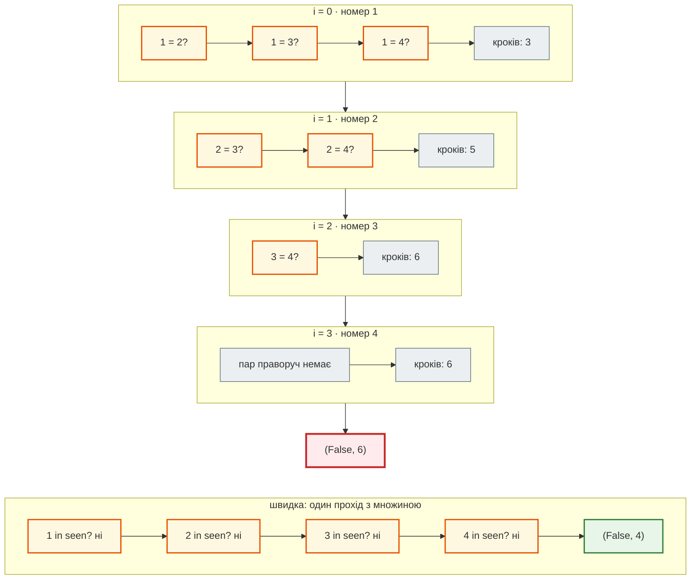
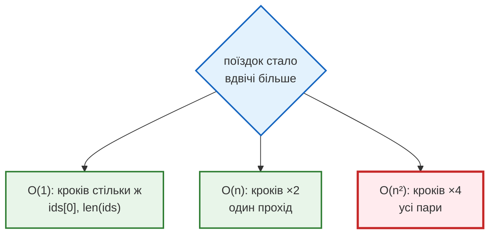
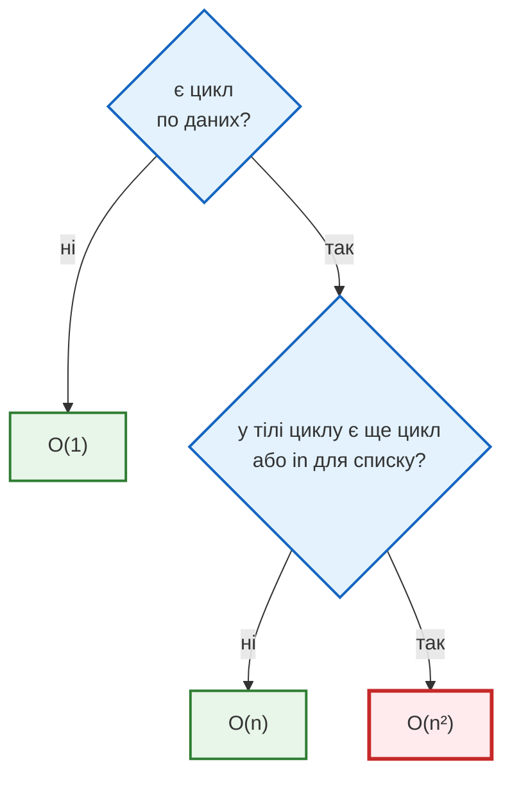

# Урок 8. П1. Big O + базові задачі

До цього уроку ми питали про програму одне: **чи правильно вона працює?** Тепер з'являється друге питання: **скільки роботи вона виконує і що буде, коли даних стане більше?**

Уяви диспетчерську службу таксі. Вона починала з тисячі поїздок на день, і будь-яка перевірка журналу займала мить. Місто росте: сто тисяч поїздок, мільйон. Одна й та сама перевірка, написана двома різними способами, в одному випадку триватиме частку секунди, а в іншому — кілька годин. Обидва способи при цьому дають **правильну** відповідь.

Мова, якою програмісти описують цю різницю, — **Big O** («О велике»).

**Що потрібно з попередніх уроків:** цикли `for` і вкладені цикли (уроки 4, 6), `list`, `set` і `dict` (уроки 5–6), функції з `return` (урок 7).

**Після уроку ти зможеш:**

- пояснити, чому ефективність рахують у кроках, а не в секундах;
- рахувати кроки простих функцій і перевіряти оцінку дослідом подвоєння;
- розрізняти `O(1)`, `O(n)` і `O(n²)` та впізнавати їх у коді;
- застосовувати три правила: найгірший випадок, без констант, лише найбільший доданок;
- знаходити прихований цикл `in` для списку і прибирати його через `set`;
- оцінювати складність власних розв'язків: FizzBuzz, паліндром, шифр Цезаря.

**Задача розділу.** Чотири задачі диспетчера таксі, для кожної — повільне і швидке рішення. Одну розберемо в тексті, решту дослідиш у лабораторії.

**Ноутбук заняття:** [`note_lesson_08_big_o.ipynb`](https://github.com/NikoriakViktot/PY-Course-Victor-Nikoriak-22-09-2026/blob/main/module_1/lessons/lesson_08_practicum_big_o/note_lesson_08_big_o.ipynb) [](https://colab.research.google.com/github/NikoriakViktot/PY-Course-Victor-Nikoriak-22-09-2026/blob/main/module_1/lessons/lesson_08_practicum_big_o/note_lesson_08_big_o.ipynb)

**Лабораторія:** [`lab_lesson_08_taxi_big_o.ipynb`](https://github.com/NikoriakViktot/PY-Course-Victor-Nikoriak-22-09-2026/blob/main/module_1/lessons/lesson_08_practicum_big_o/lab_lesson_08_taxi_big_o.ipynb) [](https://colab.research.google.com/github/NikoriakViktot/PY-Course-Victor-Nikoriak-22-09-2026/blob/main/module_1/lessons/lesson_08_practicum_big_o/lab_lesson_08_taxi_big_o.ipynb)

## Пригадай

Дай відповідь подумки, нічого не запускаючи:

1. Скільки разів виконається тіло циклу `for trip in trips:`, якщо в `trips` 500 поїздок?
2. Скільки разів виконається `print()` у цьому коді?

    ```python
    for a in range(3):
        for b in range(4):
            print(a, b)
    ```

3. Як Python перевіряє `"D-7" in drivers`, якщо `drivers` — список? А якщо множина?

??? success "Відповіді"

    1. 500 разів: по одному на кожну поїздку.
    2. 12 разів: для кожного з 3 значень `a` внутрішній цикл робить 4 повтори, `3 × 4 = 12`.
    3. Для списку — переглядає елементи по черзі, поки не знайде або не дійде до кінця. Для множини — одразу знаходить місце за хешем значення, не переглядаючи інших. Саме ця різниця стане головною в уроці.

## Два правильні рішення

Бухгалтерія помітила, що одна поїздка могла потрапити в журнал двічі. Потрібна функція: **чи є в списку номерів поїздок два однакові?**

Перший спосіб — порівняти кожну пару номерів:

```python
def has_duplicate_ids_slow(ids):
    for i in range(len(ids)):
        for j in range(i + 1, len(ids)):
            if ids[i] == ids[j]:
                return True
    return False
```

Другий — пройти список один раз і запам'ятовувати побачені номери в множині:

```python
def has_duplicate_ids_fast(ids):
    seen = set()
    for trip_id in ids:
        if trip_id in seen:
            return True
        seen.add(trip_id)
    return False


journal = [104, 311, 205, 311, 400]
print(has_duplicate_ids_slow(journal), has_duplicate_ids_fast(journal))
print(has_duplicate_ids_slow([1, 2, 3]), has_duplicate_ids_fast([1, 2, 3]))
```

```text
True True
False False
```

Обидві функції правильні: на будь-якому списку вони дають однакову відповідь. Яка з них «краща»? Щоб відповісти чесно, потрібна мірка.

## Чому не секунди

Здавалося б, найпростіше — заміряти час. Функція `time.perf_counter()` повертає поточний час у секундах з великою точністю; різниця двох таких значень — тривалість виконання.

```python
import time

ids = list(range(2000))
for attempt in range(3):
    start = time.perf_counter()
    has_duplicate_ids_slow(ids)
    print(f"{(time.perf_counter() - start) * 1000:.1f} мс")
```

Вивід щоразу трохи інший, наприклад:

```text
43.2 мс
44.9 мс
42.8 мс
```

Той самий код, ті самі дані — а мілісекунди різні. На іншому комп'ютері вони будуть зовсім інші. Секунди описують **залізо й момент запуску**, а не алгоритм.

Тому ефективність рахують у **кроках**: скільки базових дій — порівнянь, перевірок, записів — виконує алгоритм залежно від розміру даних. Розмір даних позначають буквою **n**: тут n — кількість поїздок у журналі.

## Рахуємо кроки

Додамо в обидві функції лічильник. Кожне порівняння двох номерів або кожна перевірка в множині — один крок. Функції повертають пару `(відповідь, кроки)`:

```python
def has_duplicate_ids_slow(ids):
    steps = 0
    for i in range(len(ids)):
        for j in range(i + 1, len(ids)):
            steps += 1
            if ids[i] == ids[j]:
                return True, steps
    return False, steps


def has_duplicate_ids_fast(ids):
    steps = 0
    seen = set()
    for trip_id in ids:
        steps += 1
        if trip_id in seen:
            return True, steps
        seen.add(trip_id)
    return False, steps


print(has_duplicate_ids_slow([1, 2, 3, 4]))
print(has_duplicate_ids_fast([1, 2, 3, 4]))
```

```text
(False, 6)
(False, 4)
```

Повільна функція порівняла всі пари з чотирьох номерів:

| `i` | з якими `j` порівнює | кроків |
|---|---|---|
| `0` | `1`, `2`, `3` | 3 |
| `1` | `2`, `3` | 2 |
| `2` | `3` | 1 |
| `3` | — | 0 |

Кожна пара — один крок. Покроково для `[1, 2, 3, 4]` (порівнюються номери на позиціях `i` і `j`):



У повільній функції кожен наступний номер порівнюється з усіма правішими — «трикутник» пар. У швидкій кожен номер перевіряється рівно один раз.

Разом `3 + 2 + 1 = 6`. Для n номерів це `(n − 1) + (n − 2) + … + 1 = n·(n − 1) / 2` порівнянь. Швидка функція робить рівно n кроків — по одному на номер.

### Дослід подвоєння

Тепер головне питання: що станеться, коли поїздок стане **вдвічі більше**?

??? question "Передбач: у скільки разів зросте кількість кроків кожної функції, якщо n подвоїти?"

    Подумай: скільки стане пар, якщо номерів удвічі більше? А скільки номерів переглядає швидка функція?

Перевіримо на журналах без повторів — так функціям доведеться переглянути все:

```python
for n in [1000, 2000, 4000]:
    ids = list(range(n))
    print(n, has_duplicate_ids_slow(ids)[1], has_duplicate_ids_fast(ids)[1])
```

```text
1000 499500 1000
2000 1999000 2000
4000 7998000 4000
```

Подвоїли n — кроків швидкої функції стало **вдвічі** більше, а повільної — **вчетверо**. Кроки не залежать від комп'ютера: у тебе вийдуть ті самі числа.



Цей прийом — **дослід подвоєння**: подвоюємо n і дивимось, у скільки разів зросла робота. Відношення ≈2 означає, що робота росте разом з n, ≈4 — що вона росте як n².

## Big O: порядок росту

**Big O** описує, як росте кількість кроків алгоритму, коли росте n. Не точне число кроків і не секунди, а **форму росту**. Запис `O(n²)` читається «О від ен квадрат» і означає: робота росте не швидше, ніж n².

| Клас | Назва | Приклад |
|---|---|---|
| `O(1)` | константний | `ids[0]`, `len(ids)`, `x in seen` для множини |
| `O(n)` | лінійний | один прохід циклом, `sum()`, `x in ids` для списку |
| `O(n²)` | квадратичний | цикл по тих самих даних усередині циклу |

Щоб відчути різницю, уяви книжкову полицю з n книг:

- **`O(1)`** — взяти першу книгу: один рух, скільки б книг не стояло;
- **`O(n)`** — переглянути кожну книгу, шукаючи потрібну: удвічі більше книг — удвічі довше;
- **`O(n²)`** — порівняти кожну книгу з кожною, шукаючи дві однакові: удвічі більше книг — учетверо довше.

Наскільки це різні світи, видно на числах:

| n | `O(n)` кроків | `O(n²)` кроків |
|---|---|---|
| 10 | 10 | 100 |
| 1 000 | 1 000 | 1 000 000 |
| 1 000 000 | 1 000 000 | 1 000 000 000 000 |

Мільйон кроків Python робить приблизно за десяту частку секунди. Трильйон — це вже дні. Для 10 поїздок різниці ніхто не помітить, для мільйона — вона вирішує, чи працює сервіс взагалі.

!!! note "Інші класи"
    Є й інші класи складності. `O(log n)` — коли на кожному кроці відкидається половина даних; це бінарний пошук у [Практикумі 2](lesson_11.md). `O(n log n)` — хороші алгоритми сортування, як у `sorted()`. `O(2ⁿ)` — перебір усіх можливих комбінацій, практичний лише для дуже малих n. У цьому уроці досить трьох: `O(1)`, `O(n)` і `O(n²)`.

## Три правила оцінки

### Найгірший випадок

Функція шукає поїздку за номером:

```python
def find_trip(ids, target):
    steps = 0
    for trip_id in ids:
        steps += 1
        if trip_id == target:
            return True, steps
    return False, steps


ids = list(range(1000))
print(find_trip(ids, 0))
print(find_trip(ids, 999))
print(find_trip(ids, 5000))
```

```text
(True, 1)
(True, 1000)
(False, 1000)
```

Пощастило — один крок. Не пощастило — усі 1000. Big O описує **найгірший випадок**: номер останній або його немає. Це гарантія «не повільніше, ніж», тому `find_trip` — `O(n)`.

Так само `has_duplicate_ids_slow` може знайти повтор уже в першій парі й зупинитися. Але журнал без повторів змусить її перевірити всі пари, тому вона `O(n²)`.

### Константи відкидаємо

Функція знаходить найдешевшу і найдорожчу поїздку двома окремими проходами:

```python
def fare_range(fares):
    cheapest = fares[0]
    for fare in fares:
        if fare < cheapest:
            cheapest = fare
    priciest = fares[0]
    for fare in fares:
        if fare > priciest:
            priciest = fare
    return cheapest, priciest


print(fare_range([180.0, 95.5, 420.0, 260.0]))
```

```text
(95.5, 420.0)
```

Два проходи — це `2n` кроків. Але при подвоєнні n робота зростає так само вдвічі, як і з одним проходом. Множник 2 не змінює **форми** росту, тому `O(2n)` записують як `O(n)`.

З тієї самої причини повільна перевірка дублікатів — `O(n²)`, хоча кроків `n·(n − 1) / 2`, тобто приблизно `n² / 2`. Множник `½` відкидаємо.

!!! warning "Вдвічі швидше — ще не інший клас"
    Почати внутрішній цикл з `i + 1` замість 0 — корисна оптимізація: кроків удвічі менше. Але при подвоєнні n їх однаково стає вчетверо більше. Щоб змінити клас, потрібна інша ідея, як множина в `has_duplicate_ids_fast`, а не менший множник.

### Лишаємо найбільший доданок

Уяви алгоритм, який робить `3n² + 100n + 500` кроків. Яка частина важить найбільше?

```python
for n in [10, 1000]:
    total = 3 * n ** 2 + 100 * n + 500
    share = 3 * n ** 2 / total * 100
    print(n, total, f"{share:.1f}%")
```

```text
10 1800 16.7%
1000 3100500 96.8%
```

Для малого n доданок `3n²` — лише шоста частина роботи. Для n = 1000 — майже вся. Чим більше n, тим сильніше найшвидший доданок «поглинає» решту. Тому лишають тільки його і без множника: `3n² + 100n + 500` — це `O(n²)`.

!!! note "Три правила разом"
    1. Оцінюємо **найгірший** випадок.
    2. **Множники** відкидаємо: `2n` → `O(n)`, `n² / 2` → `O(n²)`.
    3. З доданків лишаємо **найбільший**: `n² + n` → `O(n²)`.

## Як впізнати складність у коді

Не обов'язково рахувати кожен крок. Досить знайти в коді кілька шаблонів:

| Шаблон | Приклад | Складність |
|---|---|---|
| дія без циклу | `ids[0]`, `d[key]`, `len(ids)` | `O(1)` |
| один цикл по даних | `for trip in trips:` | `O(n)` |
| два цикли **один за одним** | `fare_range` вище | `O(n + n)` = `O(n)` |
| цикл **у циклі** по тих самих даних | `has_duplicate_ids_slow` | `O(n · n)` = `O(n²)` |
| `in` для списку | `x in ids` | `O(n)` |
| `in` для множини чи словника | `x in seen` | `O(1)` |

Цикли **один за одним** додаються, цикли **один в одному** — множаться.



### Прихований цикл: in для списку

Диспетчер хоче привітати водіїв, які працювали **і в понеділок, і у вівторок**:

```python
def common_drivers(monday, tuesday):
    result = []
    for driver in monday:
        if driver in tuesday:
            result.append(driver)
    return result


monday = ["D-1", "D-2", "D-3", "D-4"]
tuesday = ["D-3", "D-5", "D-1"]
print(common_drivers(monday, tuesday))
```

```text
['D-1', 'D-3']
```

??? question "Один цикл — отже, O(n)?"

    Подивись уважно на рядок `if driver in tuesday:`. Скільки роботи він робить, якщо `tuesday` — список з тисячі водіїв?

??? success "Відповідь"

    `in` для списку — це цикл, захований у два символи: Python переглядає `tuesday` від початку, поки не знайде водія. Для водія, якого у вівторок не було, — до кінця. Для n водіїв понеділка і m водіїв вівторка це до `n · m` кроків: `O(n·m)`, а коли списки однакової довжини — `O(n²)`.

Виправлення — перетворити вівторок на множину **один раз**, до циклу:

```python
def common_drivers_fast(monday, tuesday):
    tuesday_set = set(tuesday)
    result = []
    for driver in monday:
        if driver in tuesday_set:
            result.append(driver)
    return result


print(common_drivers_fast(monday, tuesday))
```

```text
['D-1', 'D-3']
```

Побудова множини — m кроків, далі кожна з n перевірок — один крок. Разом `n + m`: `O(n + m)`. Для двох змін по 10 000 водіїв це 20 000 кроків замість до 100 000 000.

!!! warning "Не створюй множину всередині циклу"
    `if driver in set(tuesday):` усередині `for` будує нову множину на **кожному** кроці — це знову `n · m`. Множину створюють один раз, до циклу.

## Що Big O не каже

**Big O не перевіряє правильність.** Функція з помилкою може бути `O(n)`, а правильна — `O(n²)`. Спершу програма має працювати правильно, потім її оцінюють.

**Big O не каже, скільки секунд.** Ця функція — `O(1)`: вона не залежить від кількості поїздок. Але кожен її виклик триває годину:

```python
import time


def first_trip_after_break(ids):
    time.sleep(3600)
    return ids[0]
```

Big O описує **ріст**: як зміниться робота, коли даних стане в тисячу разів більше.

**Швидкість має ціну.** Швидкі рішення цього уроку зберігають множину, яка займає пам'ять: до n елементів. Повільні обходяться без неї. Здебільшого пам'ять дешевша за очікування, але це свідомий обмін, а не безкоштовний виграш.

!!! note "Не оптимізуй передчасно"
    Спершу — правильний і зрозумілий код. Для списку з двадцяти елементів різниця між `O(n)` і `O(n²)` невидима. Але шаблони з цього уроку — цикл у циклі, `in` для списку в циклі — варто помічати одразу: саме вони перетворюються на години очікування, коли даних стає багато.

## Практика { #practice }

### Розібраний приклад: клієнти для розсилки

Відділ маркетингу хоче надіслати листи клієнтам таксі — кожному **один раз**, у порядку першої поїздки. У журналі клієнти повторюються.

```python linenums="1" hl_lines="6 19 22 32"
def unique_clients_slow(clients):
    steps = 0
    result = []
    for client in clients:
        found = False
        for known in result:
            steps += 1
            if known == client:
                found = True
                break
        if not found:
            result.append(client)
    return result, steps


def unique_clients_fast(clients):
    steps = 0
    result = []
    seen = set()
    for client in clients:
        steps += 1
        if client not in seen:
            seen.add(client)
            result.append(client)
    return result, steps


journal = ["Оля", "Іван", "Оля", "Марта", "Іван"]
print(unique_clients_slow(journal))
print(unique_clients_fast(journal))

for n in [1000, 2000, 4000]:
    clients = [f"C-{i}" for i in range(n)]
    print(n, unique_clients_slow(clients)[1], unique_clients_fast(clients)[1])
```

```text
(['Оля', 'Іван', 'Марта'], 6)
(['Оля', 'Іван', 'Марта'], 5)
1000 499500 1000
2000 1999000 2000
4000 7998000 4000
```

Що відбувається в ключових рядках:

- **рядки 5–10** — внутрішній цикл робить те саме, що `if client not in result:` для списку; лічильник показує роботу, яку `in` зазвичай ховає;
- **рядок 6** — `result` **росте**: що більше клієнтів уже знайдено, то довша кожна наступна перевірка. Коли всі клієнти різні, це `0 + 1 + … + (n − 1)` порівнянь — `O(n²)`, хоча видимий цикл лише один;
- **рядки 19 і 22** — ролі розділено: множина `seen` відповідає «чи був уже» за один крок, а список `result` лише зберігає порядок;
- **рядки 28–30** — на малому журналі різниця майже непомітна: 6 кроків проти 5, бо `result` встигає вирости лише до трьох клієнтів;
- **рядки 32–34** — дослід подвоєння на журналах, де всі клієнти різні (найгірший випадок): кроки повільного рішення ростуть ×4, швидкого — ×2.

!!! warning "А чому не `list(set(clients))`?"
    Це теж `O(n)`, але множина не зберігає порядок: клієнти в результаті можуть піти в будь-якому порядку. Коли порядок важливий — множина для перевірки плюс список для результату, як у `unique_clients_fast`.

### Визнач складність

Для кожного фрагмента визнач складність, де n — довжина `data`. Спершу відповідай сам, потім розгорни відповідь.

```python
def fragment_a(data):
    return data[len(data) // 2]


def fragment_b(data):
    total = 0
    for x in data:
        total += x
    for x in data:
        total -= x
    return total


def fragment_c(data):
    count = 0
    for x in data:
        for y in data:
            if x < y:
                count += 1
    return count


def fragment_d(data, blocked):
    return [x for x in data if x not in blocked]


def fragment_e(data):
    result = []
    for day in range(7):
        for x in data:
            result.append((day, x))
    return result
```

??? success "Відповіді"

    - **A** — `O(1)`: одне звернення за індексом, скільки б елементів не було.
    - **B** — `O(n)`: два цикли **один за одним**, `n + n = 2n`, множник відкидаємо.
    - **C** — `O(n²)`: цикл по `data` у циклі по `data`.
    - **D** — залежить від типу `blocked`. Якщо це список довжини m — `O(n·m)`: прихований цикл `not in`. Якщо множина — `O(n)`.
    - **E** — `O(n)`: зовнішній цикл завжди робить 7 повторів, незалежно від n. Це множник `7n`, який відкидаємо. Цикл у циклі дає `O(n²)`, лише коли **обидва** залежать від n.

### Лабораторія: таксі

У ноутбуці [`lab_lesson_08_taxi_big_o.ipynb`](https://github.com/NikoriakViktot/PY-Course-Victor-Nikoriak-22-09-2026/blob/main/module_1/lessons/lesson_08_practicum_big_o/lab_lesson_08_taxi_big_o.ipynb) [](https://colab.research.google.com/github/NikoriakViktot/PY-Course-Victor-Nikoriak-22-09-2026/blob/main/module_1/lessons/lesson_08_practicum_big_o/lab_lesson_08_taxi_big_o.ipynb) — чотири задачі диспетчера:

1. повторний номер поїздки;
2. водії двох змін;
3. клієнти для розсилки;
4. найшвидше повернення клієнта: найменша відстань між двома поїздками одного клієнта.

Для кожної спершу записуєш прогноз, потім дослід подвоєння на n = 500, 1000, 2000, 4000 показує таблицю кроків і графік. Наприкінці — оцінка часу для міста з мільйоном поїздок. Для показу на занятті той самий дослід є в інтерактивному застосунку [`taxi_lab`](https://github.com/NikoriakViktot/PY-Course-Victor-Nikoriak-22-09-2026/tree/main/module_1/lessons/lesson_08_practicum_big_o/taxi_lab) на Streamlit.

### Спробуй самостійно: три базові задачі

Розв'язки пиши в ноутбуці заняття. Для кожної задачі визнач складність свого розв'язку.

**1. FizzBuzz.** Функція `fizzbuzz(n)` повертає список рядків для чисел від 1 до n: `"FizzBuzz"` для кратних 15, `"Fizz"` для кратних 3, `"Buzz"` для кратних 5, інакше саме число рядком.

```text
fizzbuzz(5)  → ['1', '2', 'Fizz', '4', 'Buzz']
fizzbuzz(15)[-1] → 'FizzBuzz'
```

**2. Паліндром двома способами.** `is_palindrome_v1(text)` порівнює рядок з розвернутим `text[::-1]`. `is_palindrome_v2(text)` рухає два індекси з країв назустріч і зупиняється на першій розбіжності.

```text
"потоп" → True
"python" → False
"" → True
```

**3. Шифр Цезаря.** `caesar_encode(text, shift)` зсуває кожну малу латинську літеру на `shift` позицій по колу алфавіту; інші символи не змінює. `caesar_decode(text, shift)` повертає вихідний текст.

```text
caesar_encode("hello, world!", 3) → 'khoor, zruog!'
caesar_encode("xyz", 3) → 'abc'
```

**Критерії перевірки:**

- кожна функція повертає результат через `return`, а не друкує його;
- обидві версії паліндрома дають однакову відповідь для `"потоп"`, `"python"`, `""`, `"a"`, `"abba"`, `"abca"`;
- `caesar_decode(caesar_encode(text, k), k) == text` для будь-якого тексту;
- для кожної функції записано складність і коротке пояснення: скільки разів виконується цикл.

??? tip "Підказка щодо складності"
    У всіх трьох задачах — один прохід по n числах або символах. Для паліндрома подумай, чим відрізняються версії **на рядку, що не є паліндромом**: `text[::-1]` завжди будує весь розвернутий рядок, а два індекси можуть зупинитися на першому кроці. У найгіршому випадку обидві — `O(n)`.

## Підсумок

| Що потрібно | Як |
|---|---|
| оцінити ефективність | рахувати кроки залежно від n, а не секунди |
| перевірити оцінку | дослід подвоєння: ×2 → `O(n)`, ×4 → `O(n²)` |
| обрати випадок | найгірший: даних немає, елемент останній |
| спростити формулу | відкинути множники й менші доданки |
| цикли один за одним | складність додається |
| цикл у циклі | складність множиться |
| `in` для списку | `O(n)` — прихований цикл |
| `in` для `set` / `dict` | `O(1)` — множину будують один раз, до циклу |

### Самоперевірка

1. Два рішення завжди дають однакову відповідь. Чи означає це, що вони однаково ефективні?
2. Чому ефективність рахують у кроках, а не в секундах?
3. Кількість поїздок подвоїлась, а кроки зросли ×4. Який клас складності?
4. Внутрішній цикл почали з `i + 1` замість 0. Чи змінився клас складності?
5. Чому `if x in my_list:` усередині `for` — підозрілий рядок?
6. Функція має два цикли по `data` один за одним. Яка її складність?
7. Чим швидкі рішення цього уроку платять за швидкість?

??? success "Відповіді"

    1. Ні. Правильність і ефективність — різні питання. `has_duplicate_ids_slow` і `has_duplicate_ids_fast` завжди відповідають однаково, але перша — `O(n²)`, друга — `O(n)`.
    2. Секунди залежать від комп'ютера й від моменту запуску. Кроки — властивість алгоритму: однакові на будь-якій машині.
    3. `O(n²)`.
    4. Ні: кроків удвічі менше, але при подвоєнні n їх однаково стає вчетверо більше. Множник `½` у Big O відкидають.
    5. `in` для списку переглядає елементи по черзі — прихований цикл. Разом із зовнішнім `for` це `O(n·m)`. Рішення — множина, створена один раз до циклу.
    6. `O(n)`: `n + n = 2n`, множник відкидаємо.
    7. Пам'яттю: множина чи словник зберігає до n елементів.

### Що далі

- Ноутбук заняття: [`note_lesson_08_big_o.ipynb`](https://github.com/NikoriakViktot/PY-Course-Victor-Nikoriak-22-09-2026/blob/main/module_1/lessons/lesson_08_practicum_big_o/note_lesson_08_big_o.ipynb) [](https://colab.research.google.com/github/NikoriakViktot/PY-Course-Victor-Nikoriak-22-09-2026/blob/main/module_1/lessons/lesson_08_practicum_big_o/note_lesson_08_big_o.ipynb) — FizzBuzz, паліндром, шифр Цезаря з перевірками.
- Лабораторія: [`lab_lesson_08_taxi_big_o.ipynb`](https://github.com/NikoriakViktot/PY-Course-Victor-Nikoriak-22-09-2026/blob/main/module_1/lessons/lesson_08_practicum_big_o/lab_lesson_08_taxi_big_o.ipynb) [](https://colab.research.google.com/github/NikoriakViktot/PY-Course-Victor-Nikoriak-22-09-2026/blob/main/module_1/lessons/lesson_08_practicum_big_o/lab_lesson_08_taxi_big_o.ipynb) — чотири задачі диспетчера, дослід подвоєння, «місто росте».
- Довідник: [Python Helper Toolkit](../../reference/python_core/introspection_debug_tools.md) — вбудовані функції, якими зручно досліджувати код.
- Наступний урок: [Урок 9. Декоратори](lesson_09.md). Лінію «скільки роботи» продовжить [Практикум 2. Пошук](lesson_11.md): як використати властивості даних, наприклад відсортованість, щоб робити ще менше кроків.

## Документація і джерела

- Python: [складність операцій `list`, `set`, `dict`](https://wiki.python.org/moin/TimeComplexity), [множини в туторіалі](https://docs.python.org/3/tutorial/datastructures.html#sets), [тип `set`](https://docs.python.org/3/library/stdtypes.html#set-types-set-frozenset), [`time.perf_counter()`](https://docs.python.org/3/library/time.html#time.perf_counter)
- Для охочих — як цю тему пояснюють відомі курси:
    - MIT 6.0001, [лекція 10 «Understanding Program Efficiency»](https://ocw.mit.edu/courses/6-0001-introduction-to-computer-science-and-programming-in-python-fall-2016/resources/lecture-10-understanding-program-efficiency-part-1/): секундомір, підрахунок операцій і порядок росту;
    - Harvard CS50, [тиждень 3 «Algorithms»](https://cs50.harvard.edu/x/weeks/3/): лінійний і бінарний пошук, `O` та `Ω`;
    - Princeton, Sedgewick & Wayne, [«Algorithms», розділ 1.4](https://algs4.cs.princeton.edu/14analysis/): дослід подвоєння (doubling ratio).
