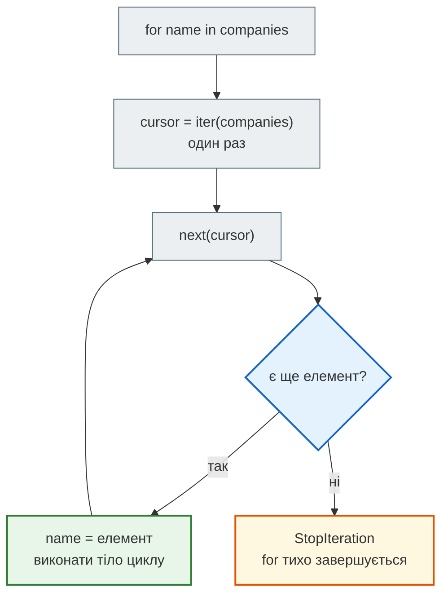
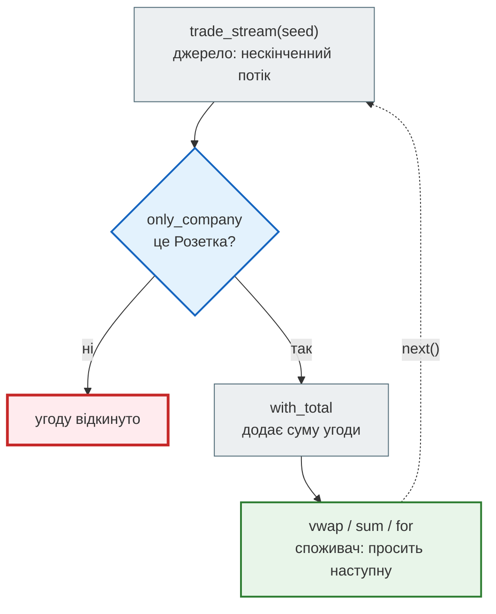

# Урок 10. Ітератори й генератори

Уяви брокерську компанію. Щодня біржа надсилає їй мільйони угод: хто купив акції «Розетки», за якою ціною, скільки штук. Колега пише звіт найпростішим способом:

```python
with open("transactions.ndjson") as file:
    trades = file.readlines()
```

Для тестового файлу все працює. Але справжній файл важить 5 ГБ, і о третій ночі сервер падає з `MemoryError`: `readlines()` намагається покласти в пам'ять **усі** рядки одразу. Помилка не в алгоритмі, а в способі мислення. Дані сприйняли як **склад**: спершу завезти все, потім обробляти. У цьому уроці ми навчимося бачити дані як **конвеєр**: брати по одній угоді, обробляти й відпускати.

(Читання файлів ми розберемо в уроці 14; тут файл — лише приклад проблеми.)

**Що потрібно з попередніх уроків:** цикл `for`, словники й comprehensions (урок 6), функції з `return` (урок 7), підрахунок роботи (урок 8), функції, що повертають функції (урок 9).

**Після уроку ти зможеш:**

- пояснити, що насправді робить `for`: `iter()`, `next()` і `StopIteration`;
- відрізняти ітерабельний об'єкт від ітератора і пам'ятати, що ітератор вичерпується;
- писати генераторні функції з `yield` і генераторні вирази `(… for …)`;
- описувати нескінченний потік даних через `while True` і брати з нього скільки треба через `islice`;
- будувати конвеєр з генераторів: джерело → фільтр → перетворення → підсумок;
- обирати між списком і генератором: пам'ять, кількість проходів, доступ за індексом.

**Задача розділу.** Потік біржових угод українських компаній: відфільтрувати угоди однієї компанії, порахувати суму кожної угоди й середньозважену ціну (VWAP), не зберігаючи потік у пам'яті. Повний звіт — у розділі [«Практика»](#practice).

**Ноутбук заняття:** [`lesson_10_transactions_streaming.ipynb`](https://github.com/NikoriakViktot/PY-Course-Victor-Nikoriak-22-09-2026/blob/main/module_1/lessons/lesson_10_iterators_generators/lesson_10_transactions_streaming.ipynb) [](https://colab.research.google.com/github/NikoriakViktot/PY-Course-Victor-Nikoriak-22-09-2026/blob/main/module_1/lessons/lesson_10_iterators_generators/lesson_10_transactions_streaming.ipynb)

## Пригадай

Дай відповідь подумки, нічого не запускаючи:

1. Що надрукує `print([n * n for n in range(4)])`?
2. Функція виконала `return`. Чи виконаються рядки під ним?
3. Декоратор з уроку 9 отримує функцію і повертає нову. Коли виконується код усередині `wrapper` — при `@` чи при виклику?

??? success "Відповіді"

    1. `[0, 1, 4, 9]` — comprehension одразу будує весь список.
    2. Ні: `return` завершує функцію, решта тіла не виконується.
    3. При виклику. `@` лише готує обгортку; її тіло працює, коли функцію викликають. Сьогодні побачимо функцію, тіло якої виконується **частинами**, між викликами.

## Що насправді робить for

Цикл `for` уміє проходити список, рядок, словник, `range`. Як він це робить, якщо в них зовсім різна будова? Він звертається до кожного з них однаково — через дві вбудовані функції:

- `iter(об'єкт)` — просить в об'єкта **ітератор**: «курсор», що пам'ятає, де ми зупинилися;
- `next(ітератор)` — просить у курсора наступний елемент.

```python
companies = ["Нафтогаз", "ПриватБанк", "Розетка"]
cursor = iter(companies)
print(next(cursor))
print(next(cursor))
print(next(cursor))
```

```text
Нафтогаз
ПриватБанк
Розетка
```

Елементи закінчилися. Ще один `next(cursor)` зупинить програму з помилкою `StopIteration` — сигналом «далі нічого немає». Цикл `for` робить те саме, що ми вручну, і сам перехоплює `StopIteration`, щоб тихо завершитися.

Ось `for` без `for`. Другий аргумент `next(…, None)` — значення, яке повернеться замість помилки, коли елементи скінчаться:

```python
cursor = iter(companies)
while True:
    name = next(cursor, None)
    if name is None:
        break
    print(name)
```

```text
Нафтогаз
ПриватБанк
Розетка
```



### Ітерабельне й ітератор

Список — **ітерабельний** об'єкт: з нього можна отримати ітератор, і щоразу новий. Тому список можна пройти скільки завгодно разів. А сам ітератор — одноразовий: він пам'ятає позицію і назад не повертається.

```python
cursor = iter(companies)
for name in cursor:
    print(name)
print(list(cursor))
```

```text
Нафтогаз
ПриватБанк
Розетка
[]
```

Перший `for` вичерпав курсор, тому `list(cursor)` отримує порожній список. Запам'ятай цю поведінку: за нею стоїть більшість пасток із генераторами.

| Об'єкт | Приклад | Скільки проходів |
|---|---|---|
| ітерабельний | `list`, `str`, `dict`, `range` | скільки завгодно |
| ітератор | `iter(список)`, генератор, файл | один |

!!! note "Власні ітератори-класи"
    Щоб зробити власний ітерабельний об'єкт, пишуть клас з методами `__iter__` і `__next__`. Класи ми почнемо в уроці 19, а ітератори-класи докладно — в уроці 24. У ноутбуці заняття є приклад такого класу `TransactionIterator` — подивися, але не вивчай напам'ять. Генератори нижче дають той самий результат набагато простіше.

## yield: функція на паузі

Звичайна функція з `return` віддає результат один раз і завершується. Функція з `yield` — **генераторна функція** — віддає значення і **ставиться на паузу**. Уся її пам'ять (локальні змінні, місце в коді) зберігається до наступного `next()`.

```python
def ticker():
    print("старт")
    yield "Нафтогаз"
    print("продовжуємо")
    yield "Розетка"
    print("кінець")


feed = ticker()
print(type(feed).__name__)
```

```text
generator
```

??? question "Що надрукують ці рядки?"

    ```python
    print(next(feed))
    print(next(feed))
    print(next(feed, "потік вичерпано"))
    ```

    Зверни увагу: виклик `ticker()` вище ще не надрукував «старт».

??? success "Відповідь і пояснення"

    ```text
    старт
    Нафтогаз
    продовжуємо
    Розетка
    кінець
    потік вичерпано
    ```

    | Виклик | Що виконується | Що повертає |
    |---|---|---|
    | `ticker()` | нічого, лише створюється генератор | об'єкт-генератор |
    | перший `next` | від початку до першого `yield` | `"Нафтогаз"` |
    | другий `next` | від паузи до другого `yield` | `"Розетка"` |
    | третій `next` | від паузи до кінця тіла | `StopIteration` → значення за замовчуванням |

    Покроково: генератор щоразу зупиняється на `yield` і продовжує з того самого місця:

    ```mermaid
    flowchart TD
        classDef step     fill:#eceff1,stroke:#546e7a,stroke-width:1px;
        classDef decision fill:#e3f2fd,stroke:#1565c0,stroke-width:2px;
        classDef success  fill:#e8f5e9,stroke:#2e7d32,stroke-width:2px;
        classDef error    fill:#ffebee,stroke:#c62828,stroke-width:3px;
        classDef warning  fill:#fff8e1,stroke:#e65100,stroke-width:2px;

        G["feed = ticker()<br>тіло ще не виконувалось"]
        subgraph N1["next №1"]
            direction LR
            P1["print('старт')"] --> Y1["yield 'Нафтогаз'<br>пауза"]
        end
        subgraph N2["next №2"]
            direction LR
            P2["print('продовжуємо')"] --> Y2["yield 'Розетка'<br>пауза"]
        end
        subgraph N3["next №3"]
            direction LR
            P3["print('кінець')"] --> Y3["кінець тіла<br>StopIteration"]
        end
        G --> N1 --> N2 --> N3

        class G step
        class P1,P2,P3 step
        class Y1,Y2 warning
        class Y3 error
    ```

Генератор — це ітератор: його можна передати в `for`, `list()`, `sum()`, і він так само одноразовий.

## Нескінченний потік угод

Генератор не зберігає значення, він **обчислює** наступне, коли його просять. Тому він може описувати нескінченний потік — наприклад, угоди на біржі. Цикл `while True` тут безпечний: функція стає на паузу на кожному `yield`.

```python
import random
from itertools import islice

COMPANIES = {"Нафтогаз": 145.0, "ПриватБанк": 89.0, "Розетка": 234.0}


def trade_stream(seed):
    rng = random.Random(seed)
    prices = dict(COMPANIES)
    trade_id = 1
    while True:
        company = rng.choice(list(prices))
        prices[company] = round(prices[company] * (1 + rng.gauss(0, 0.01)), 2)
        yield {
            "id": trade_id,
            "company": company,
            "price": prices[company],
            "volume": rng.randint(1, 100) * 100,
        }
        trade_id += 1


for trade in islice(trade_stream(seed=7), 5):
    print(trade["id"], trade["company"], trade["price"], trade["volume"])
```

```text
1 ПриватБанк 89.84 700
2 Нафтогаз 144.53 6900
3 Нафтогаз 144.2 6500
4 Нафтогаз 144.57 500
5 Нафтогаз 144.07 1200
```

- `random.Random(seed)` — окремий генератор випадкових чисел. Той самий `seed` дає ті самі угоди, тож у тебе вийде той самий вивід.
- `islice(потік, 5)` з модуля `itertools` бере з потоку перші 5 елементів і зупиняється. Це як зріз `[:5]`, але для ітераторів.

!!! warning "Нескінченний потік не можна перетворити на список"
    `list(trade_stream(7))` ніколи не завершиться: `list()` просить елементи, поки вони не скінчаться, а цей потік не скінчиться ніколи. Програма зависне, займаючи дедалі більше пам'яті. З нескінченного потоку беруть частину — через `islice` або цикл з `break`.

## Скільки пам'яті

Список зберігає всі елементи одразу. Генератор — лише свій стан: де зупинився і значення локальних змінних.

```python
import sys

million_list = [n for n in range(1_000_000)]
million_gen = (n for n in range(1_000_000))
print(sys.getsizeof(million_list), sys.getsizeof(million_gen))
```

Точні числа залежать від версії Python, але порядок такий: близько **8 мільйонів байт** для списку (і це без самих чисел, лише «полиці» для них) і близько **200 байт** для генератора. На десяти мільйонах список виросте вдесятеро, генератор — ні.

Запис `(n for n in range(…))` — **генераторний вираз**. Він пишеться як list comprehension з уроку 6, але в круглих дужках, і не будує список, а повертає генератор. Коли потрібен лише підсумок, список взагалі не потрібен:

```python
total_volume = sum(trade["volume"] for trade in islice(trade_stream(seed=7), 1000))
print(total_volume)
```

```text
4872300
```

Тисяча угод пройшла через `sum()` по одній, і жодного разу всі разом не лежали в пам'яті. Коли генераторний вираз — єдиний аргумент функції, другі дужки можна не писати.

| | Список `[…]` | Генератор `(…)` |
|---|---|---|
| коли обчислюються елементи | одразу всі | по одному, на запит |
| пам'ять | росте з кількістю елементів | стала, мала |
| проходів | скільки завгодно | один |
| `len()`, індекс `[i]` | є | немає |

## Конвеєр з генераторів

Генератор може отримувати на вхід інший генератор. Так з маленьких кроків складається **конвеєр**: кожен крок бере угоди з попереднього по одній, робить свою справу і передає далі. Щоб побачити, як угоди проходять конвеєр, кроки друкують, що роблять:

```python
def only_company(stream, company):
    for trade in stream:
        if trade["company"] == company:
            print("  фільтр пропустив угоду", trade["id"])
            yield trade


def with_total(stream):
    for trade in stream:
        enriched = dict(trade)
        enriched["total"] = round(trade["price"] * trade["volume"], 2)
        print("  додано суму до угоди", trade["id"])
        yield enriched


pipeline = with_total(only_company(trade_stream(seed=7), "Розетка"))
print("конвеєр зібрано")
for trade in islice(pipeline, 2):
    print("отримано угоду", trade["id"], "на суму", trade["total"])
```

??? question "У якому порядку з'являться рядки?"

    Подумай: коли фільтр почне працювати — при збиранні конвеєра чи при першому запиті угоди? І чи дочекається `with_total`, поки фільтр пропустить усі угоди «Розетки»?

??? success "Відповідь і пояснення"

    ```text
    конвеєр зібрано
      фільтр пропустив угоду 6
      додано суму до угоди 6
    отримано угоду 6 на суму 1288980.0
      фільтр пропустив угоду 8
      додано суму до угоди 8
    отримано угоду 8 на суму 1889649.0
    ```

    Рядок `pipeline = …` лише з'єднав генератори — жодна угода ще не оброблена. Коли `for` просить першу угоду, запит іде ланцюжком назад до джерела. Фільтр мовчки відкидає угоди 1–5 (це не «Розетка»), угода 6 проходить усі кроки, і лише потім конвеєр береться за наступну. Конвеєр обробляє **по одній угоді за раз**, тож у пам'яті ніколи немає більше однієї угоди на кожному кроці.



| Крок | Роль | Приклад |
|---|---|---|
| джерело | створює елементи | `trade_stream`, файл, `range` |
| фільтр | пропускає частину | `only_company` |
| перетворення | змінює кожен елемент | `with_total` |
| споживач | просить елементи і збирає підсумок | `for`, `sum`, `list`, `vwap` |

Останній крок — **споживач**, без нього конвеєр не зрушить. Наприклад, середньозважена ціна (VWAP, volume-weighted average price) — середня ціна, де кожна угода важить стільки, скільки в ній акцій:

```python
def vwap(stream):
    money = 0
    shares = 0
    for trade in stream:
        money += trade["price"] * trade["volume"]
        shares += trade["volume"]
    return round(money / shares, 2)


def quiet_only(stream, company):
    for trade in stream:
        if trade["company"] == company:
            yield trade


rozetka = quiet_only(islice(trade_stream(seed=7), 1000), "Розетка")
print(vwap(rozetka))
```

```text
230.22
```

`vwap` — звичайна функція з `return`: вона споживає потік і повертає одне число, як reducer з уроку 7. `islice` стоїть **до** фільтра, тому обробляються перші 1000 угод потоку, з яких приблизно третина — «Розетки».

## Пастки генераторів

**Генератор одноразовий.** Другий прохід нічого не дасть:

```python
prices = (trade["price"] for trade in islice(trade_stream(seed=7), 3))
print(max(prices))
print(list(prices))
```

```text
144.53
[]
```

`max()` уже вичерпав генератор. Якщо дані потрібні кілька разів — або створи генератор заново, або **один раз** перетвори на список і працюй зі списком.

**У генератора немає довжини й індексів.** Він не знає, скільки елементів буде, і не зберігає попередніх:

```python
feed = trade_stream(seed=7)
print(len(feed))
```

```text
TypeError: object of type 'generator' has no len()
```

```python
print(feed[0])
```

```text
TypeError: 'generator' object is not subscriptable
```

!!! note "Коли потрібен список"
    Генератор — не заміна списку, а інструмент для потоку. Список потрібен, коли дані треба пройти кілька разів, відсортувати, звертатися за індексом або знати їхню кількість наперед. Типовий підхід: конвеєр з генераторів відфільтровує й перетворює великий потік, а в список потрапляє лише **невеликий результат**.

## Корисні інструменти

`yield from` віддає по черзі всі елементи іншого ітерабельного об'єкта — зручно, коли генератор складається з кількох джерел:

```python
def morning_session():
    yield from ["Нафтогаз", "Розетка"]
    yield from ("Київстар",)


print(list(morning_session()))
```

```text
['Нафтогаз', 'Розетка', 'Київстар']
```

Модуль `itertools` зі стандартної бібліотеки має готові «цеглинки» для ітераторів:

```python
from itertools import chain, count

print(list(islice(count(100), 3)))
print(list(chain(["Нафтогаз"], ("Розетка", "Київстар"))))
```

```text
[100, 101, 102]
['Нафтогаз', 'Розетка', 'Київстар']
```

- `count(start)` — нескінченний лічильник, як `range` без кінця;
- `chain(a, b, …)` — один потік з кількох, без склеювання в новий список;
- `islice(потік, n)` — перші n елементів будь-якого ітератора.

## Практика { #practice }

### Розібраний приклад: звіт по компаніях з потоку

Програма проходить 3000 угод потоку **один раз** і для кожної компанії рахує кількість угод, обсяг акцій і VWAP.

```python linenums="1" hl_lines="8 9 10 11 12 13 17"
from collections import defaultdict


def company_report(stream):
    trades = defaultdict(int)
    shares = defaultdict(int)
    money = defaultdict(float)
    for trade in stream:
        company = trade["company"]
        trades[company] += 1
        shares[company] += trade["volume"]
        money[company] += trade["price"] * trade["volume"]
    return trades, shares, money


trades, shares, money = company_report(islice(trade_stream(seed=7), 3000))
for company in COMPANIES:
    print(company, trades[company], shares[company], round(money[company] / shares[company], 2))
```

```text
Нафтогаз 1004 4886500 162.55
ПриватБанк 1010 5027600 75.2
Розетка 986 5036300 233.43
```

Що відбувається в ключових рядках:

- **рядок 8** — один прохід по потоку: кожна угода обробляється і відразу забувається;
- **рядки 9–12** — три накопичувальні словники з уроку 6, `defaultdict(int)` створює нуль для нового ключа сам;
- **рядок 13** — функція повертає три невеликі словники, а не список угод: у пам'яті лишається по три числа на компанію;
- **рядок 17** — друк у порядку компаній зі словника `COMPANIES`, а VWAP — гроші поділені на акції.

Той самий код працюватиме і для 3 000, і для 3 000 000 угод — пам'ять не зростає. Зміниться лише час.

### Зміни приклад: конвеєр логів

Сервер біржі пише журнал. Треба вибрати лише помилки й прибрати з них позначку рівня:

```python
def get_logs():
    yield "INFO: Server started"
    yield "ERROR: Disk full"
    yield "WARNING: High latency"
    yield "ERROR: DB timeout"
```

Напиши два генератори: `filter_errors(stream)` пропускає рядки, що містять `"ERROR"`, а `extract_message(stream)` віддає текст після `": "`. Конвеєр `extract_message(filter_errors(get_logs()))` у циклі має надрукувати:

```text
Disk full
DB timeout
```

**Критерії перевірки:**

- обидві функції — генератори з `yield`, без проміжних списків;
- `extract_message` повертає рядок без змін, якщо в ньому немає `": "`;
- `list(extract_message(filter_errors(get_logs())))` дає `['Disk full', 'DB timeout']`.

??? tip "Підказка"
    `line.split(": ", maxsplit=1)` розділяє рядок лише за першим `": "` і повертає список з однієї або двох частин.

### Спробуй самостійно: дані з датчика

Інший контекст, та сама ідея. Датчик температури надсилає «брудний» потік: частина значень загублена (`None`), а частина надходить у градусах Фаренгейта (усе, що більше за 50):

```python
raw = [None, 98.6, 37.0, None, 101.3, 36.6, 212.0, None, 40.1]
```

Побудуй конвеєр з трьох генераторів:

1. `clean_nulls(stream)` — відкидає `None`;
2. `to_celsius(stream)` — значення більше за 50 переводить за формулою `(f - 32) * 5 / 9` і округлює до одного знака, решту лишає без змін;
3. `batch(stream, size)` — збирає значення в пакети по `size` штук для запису в базу; останній неповний пакет теж віддає.

Для `list(batch(to_celsius(clean_nulls(raw)), 3))` очікуваний результат:

```text
[[37.0, 37.0, 38.5], [36.6, 100.0, 40.1]]
```

**Критерії перевірки:**

- кожна функція — генератор, що приймає потік і віддає потік;
- конвеєр працює з будь-яким ітерабельним джерелом: списком, `iter(raw)` чи іншим генератором;
- для `batch(stream, 4)` пакети — `[37.0, 37.0, 38.5, 36.6]` і `[100.0, 40.1]`;
- порожній вхід дає порожній результат, а не пакет `[]`.

## Підсумок

| Що потрібно | Як |
|---|---|
| отримати ітератор | `cursor = iter(список)` |
| наступний елемент | `next(cursor)`, без помилки в кінці — `next(cursor, None)` |
| генераторна функція | `yield` замість `return`; виклик повертає генератор |
| генераторний вираз | `(вираз for x in потік if умова)` |
| нескінченний потік | `while True:` + `yield` |
| перші n елементів | `itertools.islice(потік, n)` |
| віддати елементи іншого джерела | `yield from джерело` |
| кілька потоків в один | `itertools.chain(a, b)` |
| конвеєр | `крок3(крок2(крок1(джерело)))` |
| кілька проходів | один раз `list(генератор)` — і далі працювати зі списком |

### Самоперевірка

1. Що робить `for` з об'єктом, перш ніж узяти перший елемент?
2. Чому після `for x in cursor:` вираз `list(cursor)` дає `[]`?
3. Виклик генераторної функції нічого не надрукував, хоча перший рядок її тіла — `print`. Чому?
4. Чим `[x for x in data]` відрізняється від `(x for x in data)`?
5. Чому `list(trade_stream(7))` зависне?
6. Конвеєр `with_total(only_company(trade_stream(7), "Розетка"))` створено. Скільки угод уже оброблено?
7. Коли генератор гірший за список?

??? success "Відповіді"

    1. Викликає `iter()` і отримує ітератор, а потім бере елементи через `next()`, поки не прийде `StopIteration`.
    2. Ітератор одноразовий: `for` дійшов до кінця, і курсор більше не має елементів.
    3. Виклик лише створює об'єкт-генератор. Тіло почне виконуватися з першим `next()`.
    4. Перше одразу будує список з усіма елементами. Друге повертає генератор, який обчислює елементи по одному, на запит, і займає сталу пам'ять.
    5. Потік нескінченний: `list()` чекає на кінець, якого немає.
    6. Жодної. Угоди почнуть проходити конвеєр, коли споживач попросить першу.
    7. Коли дані треба пройти кілька разів, відсортувати, знати їхню кількість або звертатися за індексом.

### Що далі

- Ноутбук заняття: [`lesson_10_transactions_streaming.ipynb`](https://github.com/NikoriakViktot/PY-Course-Victor-Nikoriak-22-09-2026/blob/main/module_1/lessons/lesson_10_iterators_generators/lesson_10_transactions_streaming.ipynb) [](https://colab.research.google.com/github/NikoriakViktot/PY-Course-Victor-Nikoriak-22-09-2026/blob/main/module_1/lessons/lesson_10_iterators_generators/lesson_10_transactions_streaming.ipynb) — клас-ітератор і генератор угод, запис і потокове читання NDJSON / CSV, конвеєр з VWAP по всіх компаніях.
- Додаткова практика: [`note_lesson_10_iterators_generators.ipynb`](https://github.com/NikoriakViktot/PY-Course-Victor-Nikoriak-22-09-2026/blob/main/module_1/lessons/lesson_10_iterators_generators/note_lesson_10_iterators_generators.ipynb) [](https://colab.research.google.com/github/NikoriakViktot/PY-Course-Victor-Nikoriak-22-09-2026/blob/main/module_1/lessons/lesson_10_iterators_generators/note_lesson_10_iterators_generators.ipynb) — конвеєр з генераторів на 500 000 замовлень ресторану з виміром пам'яті.
- Живий потік: Dash-застосунок [`transactions_dash`](https://github.com/NikoriakViktot/PY-Course-Victor-Nikoriak-22-09-2026/tree/main/module_1/lessons/lesson_10_iterators_generators/transactions_dash) — нескінченний генератор угод на графіках у реальному часі. Запускається на своєму комп'ютері: `pip install dash plotly`, потім `python app.py`.
- Наступне заняття: [Практикум 2. Пошук](lesson_11.md). Дані, які вже лежать у пам'яті, можна обробляти розумніше, ніж перебором.

## Документація і джерела

- Туторіал: [ітератори](https://docs.python.org/3/tutorial/classes.html#iterators), [генератори](https://docs.python.org/3/tutorial/classes.html#generators), [генераторні вирази](https://docs.python.org/3/tutorial/classes.html#generator-expressions)
- Глосарій: [iterable](https://docs.python.org/3/glossary.html#term-iterable), [iterator](https://docs.python.org/3/glossary.html#term-iterator), [generator](https://docs.python.org/3/glossary.html#term-generator), [generator expression](https://docs.python.org/3/glossary.html#term-generator-expression)
- Функції: [`iter()`](https://docs.python.org/3/library/functions.html#iter), [`next()`](https://docs.python.org/3/library/functions.html#next); модуль [`itertools`](https://docs.python.org/3/library/itertools.html): [`islice`](https://docs.python.org/3/library/itertools.html#itertools.islice), [`chain`](https://docs.python.org/3/library/itertools.html#itertools.chain), [`count`](https://docs.python.org/3/library/itertools.html#itertools.count)
- Довідник мови: [вираз `yield`](https://docs.python.org/3/reference/expressions.html#yield-expressions); [PEP 255 — прості генератори](https://peps.python.org/pep-0255/), [PEP 289 — генераторні вирази](https://peps.python.org/pep-0289/)
- Для охочих:
    - Dave Beazley, [«Generator Tricks for Systems Programmers»](https://www.dabeaz.com/generators/) — класичний туторіал про конвеєри з генераторів для логів і файлів ([код і слайди на GitHub](https://github.com/dabeaz/generators));
    - Dave Beazley, [Practical Python, розділ 6 «Generators»](https://dabeaz-course.github.io/practical-python/Notes/06_Generators/00_Overview.html) — вправи з потоковою обробкою біржових даних.
