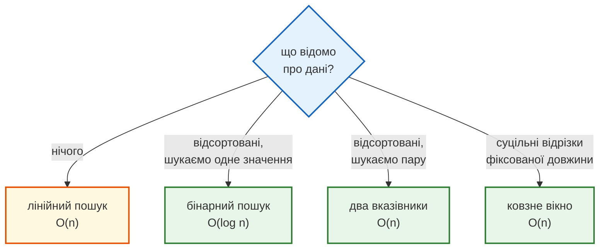
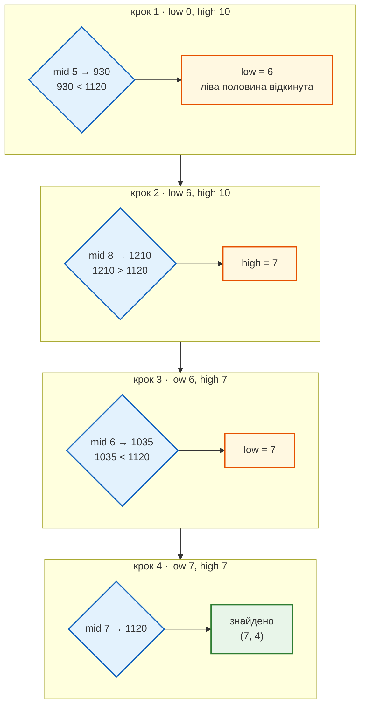
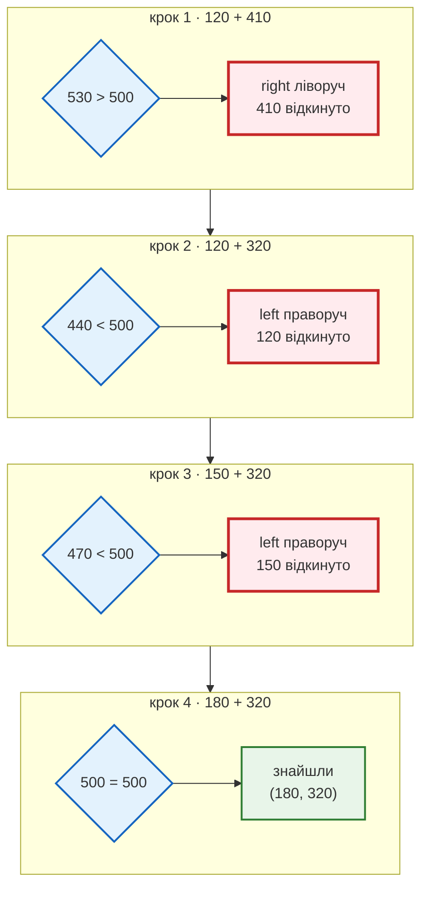
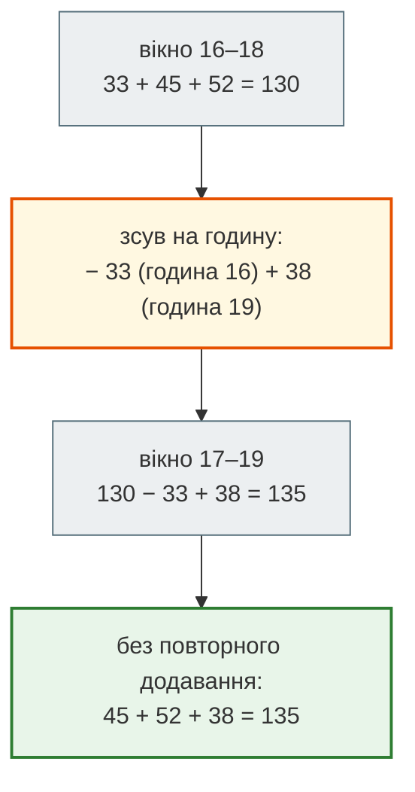

# Урок 11. Практикум П2. Пошук

У практикумі П1 диспетчерська таксі навчилася **рахувати ціну** рішення: `O(n)` чи `O(n²)`. Тепер у неї нове питання — не «скільки коштує перебрати все», а **«чи треба перебирати все?»**

Щодня диспетчеру ставлять питання: чи була поїздка о 18:40? Які дві поїздки разом дають рівно суму ваучера? Коли три найзавантаженіші години поспіль? Кожне з них можна розв'язати перебором. Але якщо про дані щось відомо — вони **відсортовані** або нас цікавить **суцільний відрізок** — роботи стає в рази менше.

**Що потрібно з попередніх уроків:** списки й індекси (урок 5), цикли `for` і `while` (уроки 4, 6), функції (урок 7), підрахунок кроків і Big O (урок 8).

**Після уроку ти зможеш:**

- обирати стратегію пошуку за властивістю даних, а не за звичкою;
- писати бінарний пошук і пояснювати, чому подвоєння даних додає лише один крок — `O(log n)`;
- користуватися модулем `bisect` для відсортованих списків;
- розв'язувати задачі на пари у відсортованому списку двома вказівниками за `O(n)`;
- рахувати суми суцільних відрізків ковзним вікном, не перераховуючи їх заново.

**Задача розділу.** Чотири питання диспетчера таксі — чотири властивості даних — чотири стратегії. Практика — автодоповнення адреси в застосунку таксі.

**Ноутбук заняття:** [`note_lesson_11_search.ipynb`](https://github.com/NikoriakViktot/PY-Course-Victor-Nikoriak-22-09-2026/blob/main/module_1/lessons/lesson_11_practicum_search/note_lesson_11_search.ipynb) [](https://colab.research.google.com/github/NikoriakViktot/PY-Course-Victor-Nikoriak-22-09-2026/blob/main/module_1/lessons/lesson_11_practicum_search/note_lesson_11_search.ipynb)

## Пригадай

Дай відповідь подумки, нічого не запускаючи:

1. Скільки кроків робить функція, що перевіряє кожен елемент списку з n елементів, у найгіршому випадку?
2. Дослід подвоєння дав відношення ×2. Який це клас складності?
3. Що дасть `[10, 20, 30, 40][-1]` і `[10, 20, 30, 40][1:3]`?

??? success "Відповіді"

    1. n кроків: елемент останній або його немає. Це `O(n)`.
    2. `O(n)`: подвоїли дані — подвоїлась робота. Сьогодні побачимо клас, де подвоєння додає лише **один** крок.
    3. `40` (останній елемент) і `[20, 30]` (індекси 1 і 2).

## Чотири питання — чотири властивості даних



| Питання диспетчера | Властивість даних | Стратегія |
|---|---|---|
| чи їздив клієнт сьогодні? | немає порядку | лінійний пошук |
| чи була поїздка о 18:40? | час відсортований | бінарний пошук |
| які дві поїздки дають рівно суму ваучера? | суми відсортовані | два вказівники |
| коли три найзавантаженіші години поспіль? | години йдуть підряд | ковзне вікно |

## Лінійний пошук: коли нічого не відомо

Журнал поїздок за день записаний у порядку дзвінків, імена клієнтів ідуть як завгодно. Щоб дізнатися, чи їздив клієнт, лишається перевірити кожен запис:

```python
def linear_search(items, target):
    steps = 0
    for i in range(len(items)):
        steps += 1
        if items[i] == target:
            return i, steps
    return -1, steps


clients = ["Марта", "Олег", "Ірина", "Тарас", "Олена", "Богдан"]
print(linear_search(clients, "Тарас"))
print(linear_search(clients, "Софія"))
```

```text
(3, 4)
(-1, 6)
```

Функція повертає пару: індекс знайденого (або `-1`) і кількість перевірок. Софії в журналі немає, тому довелося переглянути всі 6 записів. Це `O(n)` — базовий рівень, з яким порівнюємо все далі. Оператор `in` для списку робить те саме, лише без лічильника.

## Бінарний пошук: відсортовані дані

### Ідея: відкинути половину

Система записує час початку кожної поїздки у хвилинах від опівночі: 18:40 — це `18 * 60 + 40 = 1120`. Записи додаються по порядку, тому список **відсортований**. Це змінює все.

Подивимося на середній запис. Якщо там 17:15, а шукаємо 18:40 — уся ліва половина списку ще раніша, і шукати там немає сенсу. Одне порівняння відкидає **половину** даних. Далі — середина правої половини, і так поки не знайдемо або поки не залишиться нічого.

Так ми шукаємо слово в паперовому словнику: відкриваємо посередині й одразу знаємо, в якій половині продовжувати.

```python
def binary_search(items, target):
    low, high = 0, len(items) - 1
    steps = 0
    while low <= high:
        mid = (low + high) // 2
        steps += 1
        if items[mid] == target:
            return mid, steps
        if items[mid] < target:
            low = mid + 1
        else:
            high = mid - 1
    return -1, steps


starts = [425, 510, 612, 700, 845, 930, 1035, 1120, 1210, 1290, 1375]
print(binary_search(starts, 1120))
print(binary_search(starts, 1000))
```

```text
(7, 4)
(-1, 3)
```

Як шукалося 1120:

| Крок | `low` … `high` | `mid` → значення | Рішення |
|---|---|---|---|
| 1 | 0 … 10 | 5 → 930 | 930 < 1120 → `low = 6` |
| 2 | 6 … 10 | 8 → 1210 | 1210 > 1120 → `high = 7` |
| 3 | 6 … 7 | 6 → 1035 | 1035 < 1120 → `low = 7` |
| 4 | 7 … 7 | 7 → 1120 | знайдено |

Покроково — межі звужуються, доки `mid` не влучить:



Після кроку 1 лишилося 5 записів з 11, після кроку 2 — 2, після кроку 3 — 1.

Чотири кроки на 11 записах. Для 1000 (це 16:40) пошук за три кроки звузив межі до порожнього проміжку: `low` став більшим за `high` — отже, такої поїздки немає.

### Дослід подвоєння: +1 крок

Скільки кроків знадобиться на списку з тисячі, двох тисяч, мільйона записів? Візьмемо найгірший випадок — шуканого значення немає:

```python
for n in [1000, 2000, 4000, 1_000_000]:
    times = list(range(0, 2 * n, 2))
    _, steps = binary_search(times, -1)
    print(n, steps)
```

```text
1000 9
2000 10
4000 11
1000000 19
```

Подвоїли дані — додався **один** крок. Мільйон записів — 19 кроків. Лінійному пошуку для мільйона потрібен мільйон перевірок.

Кожен крок ділить залишок навпіл, тому кроків приблизно стільки, скільки разів n можна поділити на 2 до одиниці. Це **логарифм за основою 2**: `log₂ 1 000 000 ≈ 20`. Звідси назва класу — `O(log n)`.

| n | лінійний пошук | бінарний пошук |
|---|---|---|
| 1 000 | до 1 000 | до 10 |
| 1 000 000 | до 1 000 000 | до 20 |
| 1 000 000 000 | до 1 000 000 000 | до 30 |

!!! warning "Лише для відсортованих даних"
    На невідсортованому списку бінарний пошук не падає з помилкою — він **мовчки бреше**:

    ```python
    print(binary_search([1120, 425, 930, 612], 1120))
    ```

    ```text
    (-1, 3)
    ```

    1120 у списку є, але пошук відкинув не ту половину. Якщо даних не впорядковано, спершу відсортуй їх (`sorted()`, урок 5) або користуйся лінійним пошуком.

### Готовий бінарний пошук: bisect

У стандартній бібліотеці є модуль `bisect` з бінарним пошуком. Функція `bisect_left(список, x)` повертає позицію, **куди можна вставити** `x`, щоб порядок не зламався. Це дає більше, ніж «є чи немає»: наприклад, скільки поїздок почалося **до** певного часу.

```python
from bisect import bisect_left

evening = 18 * 60
index = bisect_left(starts, evening)
print(index, starts[index])
print("поїздок до 18:00:", index)
print("поїздок з 18:00:", len(starts) - index)
```

```text
7 1120
поїздок до 18:00: 7
поїздок з 18:00: 4
```

Перша поїздка після 18:00 — з індексом 7, о 18:40. Щоб перевірити, чи значення є в списку, дивимося, що лежить на знайденій позиції:

```python
def contains(items, target):
    i = bisect_left(items, target)
    return i < len(items) and items[i] == target


print(contains(starts, 1120), contains(starts, 1000))
```

```text
True False
```

Перевірка `i < len(items)` потрібна, бо для значення, більшого за всі елементи, `bisect_left` повертає `len(items)` — позицію **після** останнього.

## Два вказівники: пара у відсортованому списку

Компанія видала пасажиру ваучер на **рівно 500 грн** і дозволяє покрити ним дві поїздки. Суми поїздок за тиждень відсортовані:

```python
fares = [120, 150, 180, 230, 270, 320, 410]
```

Які дві поїздки разом дають 500? Перебір усіх пар — цикл у циклі, `O(n²)`. Але список відсортований, і цим можна скористатися.

Поставимо один вказівник на початок (найдешевша поїздка), другий — на кінець (найдорожча):

- сума **замала** → потрібно більше: зсуваємо лівий вказівник праворуч, до дорожчої поїздки;
- сума **завелика** → зсуваємо правий вказівник ліворуч, до дешевшої;
- сума **рівно** 500 → знайшли.

```python
def pair_with_sum(items, target):
    left, right = 0, len(items) - 1
    steps = 0
    while left < right:
        steps += 1
        total = items[left] + items[right]
        if total == target:
            return (items[left], items[right]), steps
        if total < target:
            left += 1
        else:
            right -= 1
    return None, steps


print(pair_with_sum(fares, 500))
```

```text
((180, 320), 4)
```

| Крок | `left` → сума | `right` → сума | Разом | Що робимо |
|---|---|---|---|---|
| 1 | 120 | 410 | 530 | завелика → `right` ліворуч |
| 2 | 120 | 320 | 440 | замала → `left` праворуч |
| 3 | 150 | 320 | 470 | замала → `left` праворуч |
| 4 | 180 | 320 | 500 | знайшли |

Покроково — кожен крок назавжди відкидає одну поїздку:



Чому можна безпечно відкинути 410 на першому кроці? Бо навіть із **найдешевшою** поїздкою 120 вона дає забагато, а з дорожчими буде ще більше. Кожен крок відкидає одну поїздку назавжди, тому кроків щонайбільше n − 1 — це `O(n)`.

```python
def pair_with_sum_brute(items, target):
    steps = 0
    for i in range(len(items)):
        for j in range(i + 1, len(items)):
            steps += 1
            if items[i] + items[j] == target:
                return (items[i], items[j]), steps
    return None, steps


print(pair_with_sum_brute(fares, 500))
print(pair_with_sum(fares, 10_000))
print(pair_with_sum_brute(fares, 10_000))
```

```text
((180, 320), 14)
(None, 6)
(None, 21)
```

Коли пари немає, перебір перевіряє всі 21 пару з 7 поїздок, а два вказівники — 6 кроків. Для тисячі поїздок це близько 500 000 проти 999.

!!! note "А якщо суми не відсортовані?"
    Два вказівники спираються на порядок: «зсунь лівий — сума зросте». Без сортування ця логіка не працює. Можна спершу відсортувати (`sorted()` — це `O(n log n)`), а можна скористатися множиною — це тема [Практикуму 3](lesson_16.md), де ця сама задача повернеться з невідсортованими даними.

## Ковзне вікно: суцільні відрізки

Кількість поїздок по годинах доби зберігається списком з 24 чисел (індекс — година):

```python
per_hour = [3, 1, 0, 0, 1, 4, 12, 30, 41, 25, 18, 20,
            22, 19, 17, 21, 33, 45, 52, 38, 24, 15, 9, 6]
```

Диспетчер хоче знати, коли почати пікову зміну водіїв: які **три години поспіль** найзавантаженіші?

Прямий спосіб — для кожної початкової години порахувати суму трьох годин заново:

```python
def busiest_window_naive(counts, k):
    best_start, best_sum = 0, sum(counts[0:k])
    for start in range(1, len(counts) - k + 1):
        window_sum = sum(counts[start:start + k])
        if window_sum > best_sum:
            best_start, best_sum = start, window_sum
    return best_start, best_sum


print(busiest_window_naive(per_hour, 3))
```

```text
(17, 135)
```

Пік — години 17, 18 і 19, тобто з 17:00 до 20:00: 135 поїздок. Але кожне вікно перераховується з нуля: k додавань на кожен з n кроків, `O(n·k)`.

Подивися на сусідні вікна: 16–18 і 17–19. У них спільні години 17 і 18. Коли вікно зсувається на годину, **одна година випадає зліва, одна додається справа**. Отже, нову суму можна отримати зі старої двома діями:

```python
def busiest_window(counts, k):
    window_sum = sum(counts[0:k])
    best_start, best_sum = 0, window_sum
    for end in range(k, len(counts)):
        window_sum += counts[end] - counts[end - k]
        if window_sum > best_sum:
            best_start, best_sum = end - k + 1, window_sum
    return best_start, best_sum


print(busiest_window(per_hour, 3))
print(busiest_window(per_hour, 5))
```

```text
(17, 135)
(16, 192)
```



Результат той самий, що в наївної версії, але кожне вікно тепер отримується з попереднього.

Кожне вікно тепер коштує дві дії, незалежно від k: `O(n)`. Для k = 3 різниця невелика, а для «найзавантаженішого тижня з року» (k = 7 із 365 днів) чи «найкращих 60 хвилин доби» (k = 60 з 1440 хвилин) — суттєва.

## Як обрати стратегію

| Що відомо про дані | Стратегія | Складність |
|---|---|---|
| нічого | лінійний пошук, `in` | `O(n)` |
| відсортовані, шукаємо значення чи позицію | бінарний пошук, `bisect` | `O(log n)` |
| відсортовані, шукаємо пару | два вказівники | `O(n)` |
| суцільні відрізки однакової довжини | ковзне вікно | `O(n)` |

Головне питання практикуму: **що я знаю про ці дані такого, що дозволяє не перевіряти все?**

## Практика { #practice }

### Розібраний приклад: автодоповнення адреси

Пасажир починає вводити вулицю в застосунку таксі, і після кожної літери з'являються підказки. Вулиць у місті тисячі, а підказки мають з'являтися миттєво. Список вулиць відсортований за абеткою.

```python linenums="1" hl_lines="7 8 9 10"
from bisect import bisect_left

streets = sorted(["Богдана Хмельницького", "Велика Васильківська", "Верхній Вал",
                  "Володимирська", "Хрещатик", "Хорива", "Шота Руставелі"])


def suggest(streets, prefix, limit=3):
    start = bisect_left(streets, prefix)
    result = []
    i = start
    while i < len(streets) and streets[i].startswith(prefix) and len(result) < limit:
        result.append(streets[i])
        i += 1
    return result


print(suggest(streets, "В"))
print(suggest(streets, "Ве"))
print(suggest(streets, "Х"))
print(suggest(streets, "Я"))
```

```text
['Велика Васильківська', 'Верхній Вал', 'Володимирська']
['Велика Васильківська', 'Верхній Вал']
['Хорива', 'Хрещатик']
[]
```

Що відбувається в ключових рядках:

- **рядок 8** — `bisect_left` знаходить першу позицію, куди «вписався б» префікс. Усі вулиці, що з нього починаються, стоять підряд саме звідти — бо список відсортований за абеткою;
- **рядки 9–13** — від цієї позиції йдемо праворуч, поки вулиця починається з префікса й підказок ще менше за `limit`;
- **рядок 11** — перевірка `i < len(streets)` стоїть першою: коли префікс «більший» за всі вулиці, `bisect_left` повертає позицію після кінця списку.

На 10 000 вулиць пошук позиції займе ~14 кроків замість 10 000, а далі — лише стільки кроків, скільки підказок показуємо.

### Зміни приклад: тихі години для техобслуговування

Сервер диспетчерської треба оновити, і на це потрібно **дві години поспіль** з найменшою кількістю поїздок. Напиши `quietest_window(counts, k)` — ковзне вікно, що шукає мінімум, і повертає пару `(початкова година, сума)`.

Для `per_hour` з розділу вище:

```text
quietest_window(per_hour, 2) → (2, 0)
quietest_window(per_hour, 4) → (1, 2)
```

**Критерії перевірки:**

- функція проходить список один раз, без `sum()` усередині циклу;
- результат збігається з наївною версією для k від 1 до 24;
- при однакових сумах повертається найраніше вікно.

??? tip "Підказка"
    Скопіюй `busiest_window` і зміни одне порівняння. Подумай, яке саме, щоб при рівних сумах лишалося найраніше вікно.

### Спробуй самостійно: перша поїздка після часу

Напиши **власний** бінарний пошук `first_at_or_after(items, target)` без модуля `bisect`: він повертає індекс першого елемента, не меншого за `target`, або `len(items)`, якщо таких немає. Це і є те, що робить `bisect_left`.

```text
first_at_or_after(starts, 1080) → 7
first_at_or_after(starts, 1120) → 7
first_at_or_after(starts, 400)  → 0
first_at_or_after(starts, 1400) → 11
first_at_or_after([], 5)        → 0
```

**Критерії перевірки:**

- результат збігається з `bisect_left(items, target)` для всіх значень `target` від 400 до 1400;
- функція робить не більше `len(items).bit_length() + 1` порівнянь (додай лічильник);
- цикл `while` з двома межами, без перебору всіх елементів.

## Підсумок

| Що потрібно | Як |
|---|---|
| знайти в невідсортованому | лінійний пошук або `x in items` — `O(n)` |
| знайти у відсортованому | бінарний пошук: середина, відкинути половину — `O(log n)` |
| позиція для вставки, «скільки до x» | `bisect_left(items, x)` |
| чи є x у відсортованому | `i = bisect_left(items, x)`, потім `i < len(items) and items[i] == x` |
| пара з заданою сумою у відсортованому | два вказівники з кінців назустріч — `O(n)` |
| найкращий відрізок довжини k | ковзне вікно: `+ новий − той, що випав` — `O(n)` |

### Самоперевірка

1. Чому бінарний пошук не можна застосувати до невідсортованого списку?
2. Скільки кроків приблизно зробить бінарний пошук на 1 000 000 записів? А на 2 000 000?
3. Що поверне `bisect_left([10, 20, 30], 25)` і що це означає?
4. У двох вказівниках сума замала. Чому зсуваємо саме лівий вказівник?
5. Чим ковзне вікно краще за перерахунок суми кожного відрізка?
6. Диспетчеру треба знайти поїздку за номером у журналі, де номери йдуть як завгодно. Яку стратегію обрати?

??? success "Відповіді"

    1. Бінарний пошук відкидає половину, спираючись на порядок: «середній менший — отже вся ліва половина менша». Без порядку цей висновок хибний, і пошук мовчки дасть неправильну відповідь.
    2. Близько 20. На 2 000 000 — близько 21: подвоєння додає один крок.
    3. `2` — позицію, куди вставити 25, щоб порядок не зламався: після 10 і 20, перед 30. Також це кількість елементів, менших за 25.
    4. Правий вказівник уже на найбільшому з можливих. Щоб сума зросла, лишається збільшити менше число — зсунути лівий праворуч.
    5. Сусідні вікна відрізняються двома елементами, тож нову суму отримуємо зі старої за дві дії, а не за k. Разом `O(n)` замість `O(n·k)`.
    6. Лінійний пошук: порядку немає, скористатися нічим. Якщо таких пошуків буде багато, варто один раз відсортувати або (у Практикумі 3) побудувати словник.

### Що далі

- Ноутбук заняття: [`note_lesson_11_search.ipynb`](https://github.com/NikoriakViktot/PY-Course-Victor-Nikoriak-22-09-2026/blob/main/module_1/lessons/lesson_11_practicum_search/note_lesson_11_search.ipynb) [](https://colab.research.google.com/github/NikoriakViktot/PY-Course-Victor-Nikoriak-22-09-2026/blob/main/module_1/lessons/lesson_11_practicum_search/note_lesson_11_search.ipynb) — зміна диспетчера таксі: чотири задачі, чотири стратегії, лічильники кроків і перевірки.
- Наступне заняття: [Урок 12. Модулі та стандартна бібліотека](lesson_12.md). Модуль `bisect` — лише один з багатьох готових інструментів.
- Лінію «алгоритм залежить від представлення даних» продовжить [Практикум 3. Хеш-структури](lesson_16.md): пошук за `O(1)` через `dict` і `set`.

## Документація і джерела

- Модуль [`bisect`](https://docs.python.org/3/library/bisect.html): [`bisect_left`](https://docs.python.org/3/library/bisect.html#bisect.bisect_left), [пошук у відсортованих списках](https://docs.python.org/3/library/bisect.html#searching-sorted-lists)
- Методи рядків: [`str.startswith`](https://docs.python.org/3/library/stdtypes.html#str.startswith); сортування: [Sorting Techniques](https://docs.python.org/3/howto/sorting.html)
- [Складність операцій `list`, `dict`, `set`](https://wiki.python.org/moin/TimeComplexity)
- Для охочих:
    - Harvard CS50, [тиждень 3 «Algorithms»](https://cs50.harvard.edu/x/weeks/3/) — лінійний і бінарний пошук на прикладі телефонної книги;
    - MIT 6.0001, [лекція 12 «Searching and Sorting»](https://ocw.mit.edu/courses/6-0001-introduction-to-computer-science-and-programming-in-python-fall-2016/resources/lecture-12-searching-and-sorting/).
