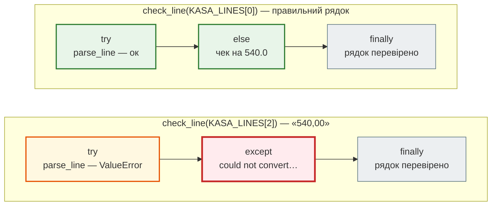
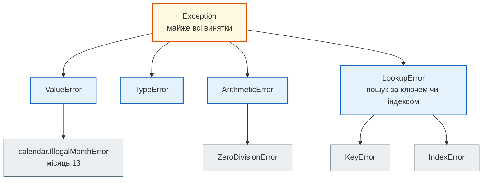
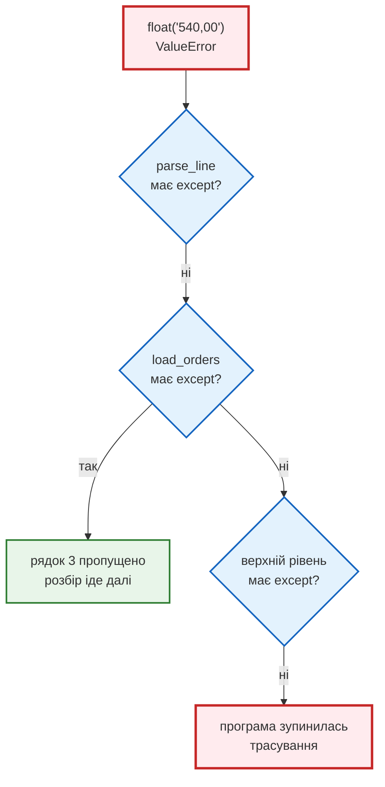

# Урок 13. Винятки

В уроці 12 звіт кафе переїхав у модулі, і адміністратор запускає його сам: `python main.py 2024 7`. Першого ж дня він надрукував місяць словом, `python main.py 2024 липень`, і замість звіту побачив кілька рядків англійською з `Traceback` і `ValueError`. Що з цим робити, він не зрозумів.

А тут ще каса. Чеки тепер приходять з неї **рядками тексту**, `"2024-07-19 18:30;540.00;50;2"`, і не всі рядки цілі: десь кома замість крапки, десь рядок обрізаний, десь 30 лютого. Програма падає на першому ж зіпсованому рядку, і звіт не отримує ніхто, навіть за правильні чеки.

**Виняток** (exception) — це спосіб, яким Python повідомляє: «цю дію виконати не можу». У цьому уроці навчимося читати ці повідомлення, перехоплювати винятки там, де знаємо, що відповісти людині, і піднімати власні, коли дані порушують правила кафе. Мета — програма, яка не падає від чужої помилки, але й **не мовчить** про неї.

**Що потрібно з попередніх уроків:** рядки й `split` (урок 3), `if` і `while` (урок 4), словники (урок 6), функції й `return` (урок 7), модулі, `datetime` і `sys.argv` (урок 12).

**Після уроку ти зможеш:**

- читати трасування (traceback) знизу вгору і знаходити рядок, де сталася помилка;
- розрізняти `SyntaxError` і винятки під час виконання, впізнавати `ValueError`, `TypeError`, `KeyError`, `IndexError`, `ZeroDivisionError`;
- перехоплювати винятки через `try` / `except` / `else` / `finally` і обирати, де саме їх ловити;
- піднімати власні винятки через `raise`, коли дані порушують правила програми;
- пояснювати, чому голий `except:` небезпечний і чим EAFP відрізняється від LBYL.

**Задача розділу.** Каса віддає дев'ять рядків, п'ять із них зіпсовані. Програма має прийняти чотири правильні чеки й для кожного пропущеного рядка пояснити, що з ним не так. Повний код — у розділі [«Практика»](#practice).

**Ноутбук заняття:** [`note_lesson_13_exceptions.ipynb`](https://github.com/NikoriakViktot/PY-Course-Victor-Nikoriak-22-09-2026/blob/main/module_1/lessons/lesson_13_exceptions/note_lesson_13_exceptions.ipynb) [](https://colab.research.google.com/github/NikoriakViktot/PY-Course-Victor-Nikoriak-22-09-2026/blob/main/module_1/lessons/lesson_13_exceptions/note_lesson_13_exceptions.ipynb)

## Пригадай

Дай відповідь подумки, нічого не запускаючи:

1. Що станеться при `menu["піца"]`, якщо такого ключа в словнику немає? А при `menu.get("піца")`?
2. Що поверне `"2024-07-19 18:30;540.00;50;2".split(";")`?
3. `sys.argv` для `python main.py 2024 липень` — який тип у `sys.argv[2]`?

??? success "Відповіді"

    1. `menu["піца"]` зупинить програму з `KeyError`. `menu.get("піца")` поверне `None`.
    2. Список з чотирьох рядків: `['2024-07-19 18:30', '540.00', '50', '2']`.
    3. `str`: усі аргументи командного рядка — рядки. Тому `main.py` викликає `int(args[2])`, і саме тут `"липень"` зламав програму.

## Звіт упав: читаємо трасування

Ось що побачив адміністратор (шляхи до файлів скорочено):

```bash
python main.py 2024 липень
```

```text
Traceback (most recent call last):
  File "main.py", line 23, in <module>
    main(sys.argv)
  File "main.py", line 14, in main
    year, month = int(args[1]), int(args[2])
                                ^^^^^^^^^^^^
ValueError: invalid literal for int() with base 10: 'липень'
```

**Трасування** (traceback) — це шлях, яким програма дійшла до помилки. Читати його треба **знизу вгору**:

1. **Останній рядок** — тип винятку і повідомлення: `ValueError` — «неприпустиме значення», `int()` не може перетворити `'липень'` на число.
2. **Над ним** — рядок коду, що впав, і файл з номером рядка: `main.py`, рядок 14, функція `main`. Стрілки `^^^^` показують, яка саме частина рядка.
3. **Ще вище** — хто викликав цю функцію: рядок 23, `main(sys.argv)` на верхньому рівні файлу (`<module>`).

Найчастіше відповідь — в останніх двох рядках. Решта показує, як програма туди потрапила.

### Два види помилок

**`SyntaxError`** — Python не може навіть прочитати код. Програма не запускається зовсім, і не виконується жоден рядок, навіть той, що стоїть вище помилки:

```python
print("Звіт кафе")
print("Середній чек:", 860.0 / 2
```

```text
SyntaxError: '(' was never closed
```

Перший `print` правильний, але нічого не надрукувалося: Python спершу читає весь файл і лише потім виконує.

**Виняток під час виконання** — код написаний правильно, програма стартує, і рядки виконуються, доки один з них не натрапить на неможливу дію:

```python
print("Звіт кафе")
print("Середній чек:", 860.0 / 0)
print("Кінець звіту")
```

```text
Звіт кафе
ZeroDivisionError: float division by zero
```

Перший рядок виконався, другий зупинив програму, до третього черга не дійшла. Далі йдеться саме про такі помилки: їх можна передбачити й обробити.

!!! note "Вивід на цій сторінці"
    Коли код падає, у блоці виводу показано лише останній рядок трасування — тип винятку і повідомлення.

## Каса віддає рядки

Чек з каси — це рядок з чотирма полями через `;`: час, сума, чайові, кількість гостей. Сьогодні каса віддала дев'ять рядків:

```python
from datetime import datetime
from typing import NamedTuple


class RawOrder(NamedTuple):
    total_bill: float
    tip: float
    size: int
    timestamp: datetime


KASA_LINES = [
    "2024-07-19 18:30;540.00;50;2",
    "2024-07-19 12:10;320.00;30;1",
    "2024-07-19 19:05;540,00;40;3",
    "2024-07-20 20:15;980.00;120;4",
    "2024-07-20 13:40;760.00",
    "2024-02-30 19:00;450.00;0;5",
    "2024-07-21 18:00;-120.00;0;2",
    "2024-07-21 14:20;610.00;60;0",
    "2024-07-21 21:30;1200.00;150;6",
]
```

`RawOrder` — той самий чек, що в уроці 12. Перша версія розбору — «все буде добре»:

```python
def parse_line(line):
    """Рядок каси -> RawOrder."""
    time_text, bill_text, tip_text, size_text = line.split(";")
    timestamp = datetime.strptime(time_text, "%Y-%m-%d %H:%M")
    return RawOrder(float(bill_text), float(tip_text), int(size_text), timestamp)


def load_orders(lines):
    orders = []
    for line in lines:
        orders.append(parse_line(line))
    return orders


print(parse_line(KASA_LINES[0]))
```

```text
RawOrder(total_bill=540.0, tip=50.0, size=2, timestamp=datetime.datetime(2024, 7, 19, 18, 30))
```

Перший рядок розібрано. **Прогноз:** що буде з усіма дев'ятьма?

```python
orders = load_orders(KASA_LINES)
```

```text
ValueError: could not convert string to float: '540,00'
```

Третій рядок — `540,00` з комою — зупинив усю програму. Два правильні чеки перед ним і чотири після нього втрачені разом з ним.

## Часті винятки

Кожен зіпсований рядок каси ламає програму по-своєму. Ось винятки, які трапляються найчастіше:

| Виняток | Приклад з кафе | Що каже Python |
|---|---|---|
| `ValueError` | `float("540,00")` | could not convert string to float: '540,00' |
| `ValueError` | `datetime.strptime("2024-02-30 19:00", ...)` | day is out of range for month |
| `ValueError` | `a, b, c, d = "2024-07-20 13:40;760.00".split(";")` | not enough values to unpack (expected 4, got 2) |
| `TypeError` | `"Чек: " + 540.0` | can only concatenate str (not "float") to str |
| `ZeroDivisionError` | `610.0 / 0` — середній чек на 0 гостей | float division by zero |
| `IndexError` | `sys.argv[2]`, коли аргумент один | list index out of range |
| `KeyError` | `menu["піца"]` | 'піца' |

`ValueError` — «тип правильний, значення ні»: `float` приймає рядок, але не такий. `TypeError` — «тип не той»: рядок з числом не складаються. Ще один виняток, `FileNotFoundError`, з'явиться в [уроці 14](lesson_14.md), коли каса віддаватиме чеки файлом.

## try / except: перехопити виняток

Заборонити касі помилятися ми не можемо. Але можемо сказати програмі: «спробуй; якщо вийде `ValueError` — зроби інше».

```python
def parse_bill(text):
    try:
        return float(text)
    except ValueError:
        print("Не число:", text)
        return None


print(parse_bill("540.00"))
print(parse_bill("540,00"))
```

```text
540.0
Не число: 540,00
None
```

- **`try`** — код, який може впасти;
- **`except ValueError`** — що робити, якщо в `try` виник саме `ValueError`. Виконання переходить сюди **одразу**, решта `try` пропускається;
- якщо винятку не було, `except` не виконується зовсім.

Повідомлення Python часто корисне. Щоб його отримати, додай `as` та ім'я змінної:

```python
try:
    float("540,00")
except ValueError as error:
    print("Каса надіслала не число:", error)
```

```text
Каса надіслала не число: could not convert string to float: '540,00'
```

### else і finally

Повна форма має ще дві гілки:

- **`else`** — виконується, лише якщо в `try` **не** було винятку: «чек прийнято»;
- **`finally`** — виконується **завжди**, був виняток чи ні.

**Прогноз:** що надрукує функція для правильного рядка і для рядка з комою?

```python
def check_line(line):
    print("try: розбираю", line[:16])
    try:
        order = parse_line(line)
        print("try: розібрано")
    except ValueError as error:
        print("except:", error)
    else:
        print("else: чек на", order.total_bill)
    finally:
        print("finally: рядок перевірено")


check_line(KASA_LINES[0])
print("---")
check_line(KASA_LINES[2])
```

```text
try: розбираю 2024-07-19 18:30
try: розібрано
else: чек на 540.0
finally: рядок перевірено
---
try: розбираю 2024-07-19 19:05
except: could not convert string to float: '540,00'
finally: рядок перевірено
```

У другому виклику `print("try: розібрано")` не виконався: виняток перервав `try` на рядку `parse_line(line)`. `else` пропущено, бо виняток був. `finally` спрацював обидва рази.

Обидва виклики поруч:



`try` і `finally` є в обох шляхах; між ними — або `else`, або `except`, але ніколи обидва разом.

Навіщо `else`, якщо той самий код можна дописати в кінець `try`? Щоб у `try` лишався лише рядок, який ми **очікуємо** побачити впалим. Помилка в коді з `else` не буде випадково перехоплена чужим `except`. `finally` зазвичай закриває те, що відкрили: файл, з'єднання, зміну каси. У [уроці 14](lesson_14.md) цю роботу візьме на себе `with`.

## Кілька except і ієрархія винятків

Винятки утворюють **дерево**: загальні типи вгорі, конкретні внизу. `except` ловить свій тип **і всіх його нащадків**:



Тому `except ValueError` ловить і помилку з уроку 12, `python main.py 2024 13`: `IllegalMonthError` — різновид `ValueError`.

```python
import calendar

try:
    calendar.monthrange(2024, 13)
except ValueError as error:
    print("Не той місяць:", error)
```

```text
Не той місяць: bad month number 13; must be 1-12
```

Якщо різні винятки треба обробити по-різному, пишуть кілька `except`. Python перевіряє їх **згори вниз** і виконує **перший**, що підійшов:

```python
menu = {"борщ": 95, "вареники": 80, "вода": 0}


def price_per_guest(dish, guests):
    try:
        return menu[dish] / guests
    except KeyError:
        return f"страви {dish} немає в меню"
    except ZeroDivisionError:
        return "гостей має бути хоча б один"


print(price_per_guest("борщ", 2))
print(price_per_guest("піца", 2))
print(price_per_guest("борщ", 0))
```

```text
47.5
страви піца немає в меню
гостей має бути хоча б один
```

Якщо обробка однакова, типи записують кортежем: `except (KeyError, ZeroDivisionError):`.

!!! warning "Від вузького до широкого"
    `except Exception:`, поставлений першим, забере **всі** винятки, і гілки під ним не виконаються ніколи. Конкретні типи пишуть вище, загальні — нижче або не пишуть зовсім.

## raise: правила кафе

Шостий рядок каси, `-120.00`, Python розбере без жодної помилки: це цілком нормальне число. Сьомий, `0` гостей, — теж. Але для кафе це неможливі чеки. Python про правила кафе нічого не знає, тож перевіряти їх мусимо ми, і повідомляти так само, як Python: **винятком**.

`raise` піднімає виняток власноруч:

```python
def parse_line(line):
    """Рядок каси -> RawOrder. Зіпсований рядок -> ValueError з поясненням."""
    fields = line.split(";")
    if len(fields) != 4:
        raise ValueError(f"очікували 4 поля, а маємо {len(fields)}")
    time_text, bill_text, tip_text, size_text = fields
    timestamp = datetime.strptime(time_text, "%Y-%m-%d %H:%M")
    bill, tip, size = float(bill_text), float(tip_text), int(size_text)
    if bill <= 0:
        raise ValueError(f"сума чека має бути більшою за 0, а маємо {bill}")
    if tip < 0:
        raise ValueError(f"чайові не можуть бути від'ємними: {tip}")
    if size < 1:
        raise ValueError(f"гостей має бути хоча б один, а маємо {size}")
    return RawOrder(bill, tip, size, timestamp)


print(parse_line("2024-07-21 21:30;1200.00;150;6").size)
parse_line("2024-07-21 18:00;-120.00;0;2")
```

```text
6
ValueError: сума чека має бути більшою за 0, а маємо -120.0
```

`raise` працює як `return`, тільки для поганого випадку: функція одразу завершується, а виняток летить до того, хто її викликав. Чому `ValueError`, а не `print` і `return None`?

- `None` легко не помітити: він потрапить у список чеків і зламає звіт десь пізніше, далеко від справжньої причини;
- виняток неможливо не помітити: або його обробить той, хто знає, що робити, або програма зупиниться з точним повідомленням;
- для того, хто викликає `parse_line`, усі проблеми рядка — і кома, і 30 лютого, і наші правила — тепер однакові: `ValueError`.

## Виняток спливає по стеку

Функція `parse_line` не ловить винятки сама. Куди вони дінуться? Згадай трасування наївної версії (скорочено):

```text
Traceback (most recent call last):
  File "kasa.py", ..., in <module>
    orders = load_orders(KASA_LINES)
  File "kasa.py", ..., in load_orders
    orders.append(parse_line(line))
  File "kasa.py", ..., in parse_line
    return RawOrder(float(bill_text), float(tip_text), int(size_text), timestamp)
ValueError: could not convert string to float: '540,00'
```

Виняток народився у `float()` всередині `parse_line`. Там його ніхто не ловив, і він **спливає** до того, хто викликав: у `load_orders`. Там теж не ловили — далі на верхній рівень програми. Не зловив ніхто — програма зупинилася і надрукувала весь шлях.



**Де ловити?** Там, де знаєш, **що відповісти**. `parse_line` бачить лише один рядок і не знає, пропустити його чи зупинити все. `load_orders` знає номер рядка і що робити: пропустити й записати причину. Отже, `try` — у `load_orders`:

```python
def load_orders(lines):
    """Правильні чеки і список пояснень до пропущених рядків."""
    orders = []
    errors = []
    for number, line in enumerate(lines, start=1):
        try:
            orders.append(parse_line(line))
        except ValueError as error:
            errors.append(f"рядок {number}: {error}")
    return orders, errors


orders, errors = load_orders(KASA_LINES)
print("Прийнято чеків:", len(orders))
for message in errors:
    print(message)
```

```text
Прийнято чеків: 4
рядок 3: could not convert string to float: '540,00'
рядок 5: очікували 4 поля, а маємо 2
рядок 6: day is out of range for month
рядок 7: сума чека має бути більшою за 0, а маємо -120.0
рядок 8: гостей має бути хоча б один, а маємо 0
```

Чотири правильні чеки прийнято, п'ять рядків пропущено, і про кожен сказано, що з ним не так. Жоден `try` не знадобився ні в `parse_line`, ні в `float`, ні в `strptime`: одного обробника в правильному місці досить.

!!! tip "Errors should never pass silently"
    «Помилки ніколи не мають минати тихо» — рядок з [Дзену Python](https://peps.python.org/pep-0020/). `load_orders` не ховає зіпсовані рядки, а повертає їх разом з поясненнями. Власниця кафе може віддати список касирові й виправити дані.

## Антипатерн «підгузок»

Найпростіший спосіб «прибрати» помилки — `except` без типу. Він ловить **усе**. Тому його й називають «підгузком»:

```python
accepted = []
try:
    order = parse_line(KASA_LINES[0])
    accepted.apend(order)
except:
    print("Зіпсований рядок каси")
```

```text
Зіпсований рядок каси
```

Рядок каси правильний. Впав `accepted.apend` — друкарська помилка в імені методу (`AttributeError`). Але повідомлення звинувачує касу, і програміст годину шукатиме проблему не там. Голий `except:` ховає **твої власні** помилки так само старанно, як і чужі.

З конкретним типом друкарська помилка одразу себе показує:

```python
try:
    order = parse_line(KASA_LINES[0])
    accepted.apend(order)
except ValueError:
    print("Зіпсований рядок каси")
```

```text
AttributeError: 'list' object has no attribute 'apend'
```

!!! warning "Лови лише те, що вмієш обробити"
    Пиши `except` з конкретним типом і лише навколо рядків, які справді можуть так впасти. `except Exception:` трохи кращий за голий `except:`, але ховає ті самі друкарські помилки.

## EAFP чи LBYL

Є два підходи до ризикованих дій:

- **LBYL** (Look Before You Leap, «подивись, перш ніж стрибати») — спершу перевірити умову через `if`, потім діяти;
- **EAFP** (Easier to Ask Forgiveness than Permission, «легше попросити вибачення, ніж дозволу») — діяти одразу, а на помилку відповісти в `except`.

Здається, перевірити аргумент можна й через `if text.isdigit():`. Але перевірка і сама дія розуміють «число» по-різному:

```python
for text in ["7", " 7", "-5", "07"]:
    print(repr(text), text.isdigit(), end=" ")
    try:
        print(int(text))
    except ValueError:
        print("ValueError")
```

```text
'7' True 7
' 7' False 7
'-5' False -5
'07' True 7
```

`isdigit()` відкидає `" 7"` і `"-5"`, які `int()` чудово перетворює. Тобто перевірка каже одне, а дія робить інше. `try: int(text)` питає саму операцію: вийде чи ні. Тому в Python для перетворень і розбору зазвичай обирають **EAFP**.

LBYL доречний, коли перевірка проста і відсутність — нормальна ситуація, а не помилка:

```python
print(menu.get("піца", "немає в меню"))
print("піца" in menu)
```

```text
немає в меню
False
```

Обидва підходи описано в [глосарії Python](https://docs.python.org/3/glossary.html#term-EAFP).

## Практика { #practice }

### Розібраний приклад: зрозумілі помилки для адміністратора

Повернемося до `main.py` з уроку 12. Адміністратор має бачити не трасування, а пояснення і підказку. Розділимо роботу так само, як з касою:

- `parse_period(args)` перевіряє аргументи й піднімає `ValueError` з поясненням людською мовою;
- `main(args)` ловить `ValueError` і друкує пояснення та підказку.

```python linenums="1" hl_lines="3 4 6 7 8 9 10 11 16 17 18 19 20"
def parse_period(args):
    """['main.py', '2024', '7'] -> (2024, 7). Некоректні аргументи -> ValueError."""
    if len(args) != 3:
        raise ValueError("потрібно два аргументи: рік і місяць")
    try:
        year, month = int(args[1]), int(args[2])
    except ValueError:
        raise ValueError(f"рік і місяць мають бути числами, а маємо {args[1]} і {args[2]}")
    if not 1 <= month <= 12:
        raise ValueError(f"місяць має бути від 1 до 12, а маємо {month}")
    return year, month


def main(args):
    try:
        year, month = parse_period(args)
    except ValueError as error:
        print("Помилка:", error)
        print("Використання: python main.py РІК МІСЯЦЬ, наприклад: python main.py 2024 7")
        return 1
    print(f"Звіт кафе за {month:02d}.{year}")
    return 0


main(["main.py", "2024", "липень"])
main(["main.py", "2024", "13"])
main(["main.py", "2024"])
main(["main.py", "2024", "7"])
```

```text
Помилка: рік і місяць мають бути числами, а маємо 2024 і липень
Використання: python main.py РІК МІСЯЦЬ, наприклад: python main.py 2024 7
Помилка: місяць має бути від 1 до 12, а маємо 13
Використання: python main.py РІК МІСЯЦЬ, наприклад: python main.py 2024 7
Помилка: потрібно два аргументи: рік і місяць
Використання: python main.py РІК МІСЯЦЬ, наприклад: python main.py 2024 7
Звіт кафе за 07.2024
```

Що відбувається в ключових рядках:

- **рядки 3–4** — перевірка кількості аргументів **до** звернення до `args[2]`. Без неї `python main.py 2024` впав би з `IndexError`;
- **рядки 6–8** — `raise` всередині `except`: технічне повідомлення `int()` замінюємо зрозумілим. `ValueError` з `int()` для адміністратора нічого не означає, а «рік і місяць мають бути числами» — означає;
- **рядки 9–10** — правило, якого Python не знає: місяць від 1 до 12. Тепер місяць 13 не доходить до `calendar`, і помилка звучить однаково з іншими;
- **рядки 16–20** — `main` єдина, хто розмовляє з людиною: друкує пояснення і повертає `1`. Код повернення `0` означає «успіх», інше число — «помилка». Так програми в терміналі повідомляють про результат одна одній;
- **`parse_period`** нічого не друкує: вона лише повертає результат або піднімає виняток. Тому її легко перевірити окремо.

У справжньому `main.py` останній рядок буде `sys.exit(main(sys.argv))`: [`sys.exit`](https://docs.python.org/3/library/sys.html#sys.exit) передає код повернення терміналу.

### Зміни приклад: питати, доки не введуть правильно

У ноутбуці немає командного рядка, тож місяць краще **спитати**. Напиши `ask_month(ask)`, яка:

- викликає `ask("Місяць (1–12): ")` і перетворює відповідь на ціле число;
- якщо відповідь не число або не від 1 до 12 — друкує `Помилка: …` і питає знову;
- повертає перший правильний місяць.

`ask` — функція, яка отримує підказку і повертає рядок. У справжній програмі це `input`, а для перевірки — підробка з готовими відповідями:

```python
def fake_input(answers):
    """Функція, що замість клавіатури повертає відповіді зі списку по черзі."""
    it = iter(answers)

    def ask(prompt):
        answer = next(it)
        print(prompt + answer)
        return answer

    return ask
```

Очікуваний вивід для `ask_month(fake_input(["липень", "13", " 7 "]))`:

```text
Місяць (1–12): липень
Помилка: потрібне число, а маємо липень
Місяць (1–12): 13
Помилка: місяць має бути від 1 до 12
Місяць (1–12):  7 
7
```

**Критерії перевірки:**

- цикл — `while True`, вихід — `return` правильного місяця;
- `try` охоплює лише `int(...)`, а перевірка 1–12 — звичайний `if` після нього;
- `ask_month(fake_input(["12"]))` повертає `12` з першої спроби;
- `ask_month(input)` працює з клавіатурою без змін у коді.

??? tip "Підказка"
    Всередині `while True`: `text = ask(...)`, потім `try: month = int(text)` / `except ValueError: print(...)` і `continue`. Далі `if 1 <= month <= 12: return month`, інакше — друк помилки, і цикл піде на нове коло.

### Спробуй самостійно: меню і бюджет

Гість питає: «Скільки порцій борщу я можу взяти на 300 грн?» Напиши `portions_for_budget(dish, budget, menu)`:

```python
menu = {"борщ": 95, "вареники": 80, "узвар": 35, "вода": 0}
```

| Виклик | Результат |
|---|---|
| `portions_for_budget("борщ", 300, menu)` | `3` |
| `portions_for_budget("узвар", 100, menu)` | `2` |
| `portions_for_budget("вода", 100, menu)` | `None` — безкоштовно, порцій скільки завгодно |
| `portions_for_budget("піца", 300, menu)` | `ValueError: страви піца немає в меню` |
| `portions_for_budget("борщ", -50, menu)` | `ValueError: бюджет не може бути від'ємним` |

**Правила:**

- кількість порцій — `budget // menu[dish]`;
- відсутню страву не перевіряй через `in`: зловити `KeyError` і підняти замість нього `ValueError` з поясненням;
- безкоштовну страву теж не перевіряй через `if`: зловити `ZeroDivisionError`;
- від'ємний бюджет — власний `raise`, **до** будь-яких обчислень;
- жодного голого `except:`.

### Знайди помилку

Три фрагменти з кафе, у кожному обробка винятків зроблена неправильно. Що піде не так і як виправити?

```python
# 1
try:
    orders.apend(parse_line(line))
except:
    print("Зіпсований рядок")

# 2
try:
    price = menu[dish]
except IndexError:
    price = None

# 3
try:
    year = int(text)
except Exception:
    print("Щось пішло не так")
except ValueError:
    print("Рік має бути числом")
```

??? success "Відповіді"

    1. Голий `except:` ховає друкарську помилку `apend` (`AttributeError`): кожен рядок, навіть правильний, буде «зіпсованим». Треба `except ValueError:` і `append`.
    2. Словник піднімає `KeyError`, а не `IndexError`, тож `except` не спрацює і програма впаде. Треба `except KeyError:`, а ще простіше — `price = menu.get(dish)`.
    3. `Exception` стоїть першим і забирає і `ValueError`: друге повідомлення не з'явиться ніколи. Поміняти місця або прибрати `except Exception`.

## Підсумок

| Поняття | Що запам'ятати |
|---|---|
| Трасування | читати знизу вгору: тип і повідомлення → рядок → хто викликав |
| `try` / `except` | лови конкретний тип і лише навколо рядків, що можуть так впасти |
| `else` / `finally` | `else` — лише якщо винятку не було, `finally` — завжди |
| Ієрархія | `except ValueError` ловить і нащадків; вузькі типи вище за широкі |
| `raise` | правило програми порушено → виняток з поясненням, а не `print` і `None` |
| Де ловити | там, де знаєш, що відповісти людині |
| EAFP | для перетворень — `try: int(text)`, а не `isdigit()` |

### Самоперевірка

1. Що виконається з програми, у третьому рядку якої `SyntaxError`? А якщо там `ZeroDivisionError`?
2. Трасування має п'ять рядків `File ...`. У якому з них шукати рядок, що впав?
3. У `try` три рядки, виняток виник у першому. Чи виконаються другий і третій?
4. Чим відрізняються `else` і `finally`?
5. `except ValueError:` стоїть навколо `calendar.monthrange(2024, 13)`. Чи спрацює він? Чому?
6. Чому `parse_line` піднімає `ValueError`, а не друкує повідомлення і повертає `None`?
7. Чому `try` стоїть у `load_orders`, а не в `parse_line`?
8. `if text.isdigit(): month = int(text)`. Які правильні відповіді користувача цей код відкине?

??? success "Відповіді"

    1. Із `SyntaxError` — нічого: Python не запустить програму, яку не може прочитати. Із `ZeroDivisionError` — перші два рядки виконаються, третій зупинить програму.
    2. В останньому, найближчому до повідомлення про виняток. Рядки вище показують, хто викликав цю функцію.
    3. Ні: виконання одразу переходить до відповідного `except`.
    4. `else` виконується, лише якщо в `try` не було винятку. `finally` виконується завжди.
    5. Так: `IllegalMonthError` — нащадок `ValueError`, а `except` ловить свій тип і всіх нащадків.
    6. `None` легко не помітити, і він зламає програму пізніше, далеко від причини. Виняток або обробить той, хто знає, що робити, або програма зупиниться з точним повідомленням.
    7. `load_orders` знає номер рядка і що робити зі зіпсованим рядком: пропустити й записати причину. `parse_line` бачить лише один рядок.
    8. `" 7"` з пробілом і від'ємні числа: `isdigit()` поверне `False`, хоча `int()` їх перетворює. `try: int(text)` питає саму операцію.

### Що далі

- Ноутбук заняття: [`note_lesson_13_exceptions.ipynb`](https://github.com/NikoriakViktot/PY-Course-Victor-Nikoriak-22-09-2026/blob/main/module_1/lessons/lesson_13_exceptions/note_lesson_13_exceptions.ipynb) [](https://colab.research.google.com/github/NikoriakViktot/PY-Course-Victor-Nikoriak-22-09-2026/blob/main/module_1/lessons/lesson_13_exceptions/note_lesson_13_exceptions.ipynb) — той самий день каси: прогнози, `parse_line` і `load_orders`, вправи з перевірками.
- Довідник: [`notes_exceptions.ipynb`](https://github.com/NikoriakViktot/PY-Course-Victor-Nikoriak-22-09-2026/blob/main/module_1/lessons/lesson_13_exceptions/notes_exceptions.ipynb) [](https://colab.research.google.com/github/NikoriakViktot/PY-Course-Victor-Nikoriak-22-09-2026/blob/main/module_1/lessons/lesson_13_exceptions/notes_exceptions.ipynb) і сторінка [Exceptions & Error Handling](../../reference/python_core/exceptions.md) — стислий повтор усієї теми.
- Наступне заняття: [Урок 14. Файли, менеджери контексту та JSON](lesson_14.md). Рядки каси прийдуть з файлу: з'являться `FileNotFoundError` і `with`, який закриває файл навіть тоді, коли всередині стався виняток.

## Документація і джерела

- Туторіал Python: [Errors and Exceptions](https://docs.python.org/3/tutorial/errors.html) — `try`, `except`, `else`, `finally`, `raise`
- [Built-in Exceptions](https://docs.python.org/3/library/exceptions.html) — усі вбудовані винятки і [їхня ієрархія](https://docs.python.org/3/library/exceptions.html#exception-hierarchy)
- Глосарій: [EAFP](https://docs.python.org/3/glossary.html#term-EAFP), [LBYL](https://docs.python.org/3/glossary.html#term-LBYL)
- [PEP 20 — The Zen of Python](https://peps.python.org/pep-0020/): «Errors should never pass silently»
- Для охочих:
    - Harvard CS50P, [лекція 3 «Exceptions»](https://cs50.harvard.edu/python/weeks/3/) — `ValueError`, `try`/`except`/`else`, цикл вводу до правильної відповіді;
    - MIT 6.0001, [лекція 7 «Testing, Debugging, Exceptions, and Assertions»](https://ocw.mit.edu/courses/6-0001-introduction-to-computer-science-and-programming-in-python-fall-2016/resources/lecture-7-testing-debugging-exceptions-and-assertions/).
