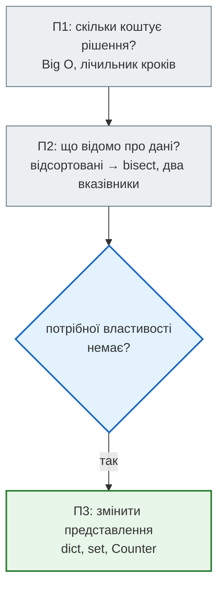
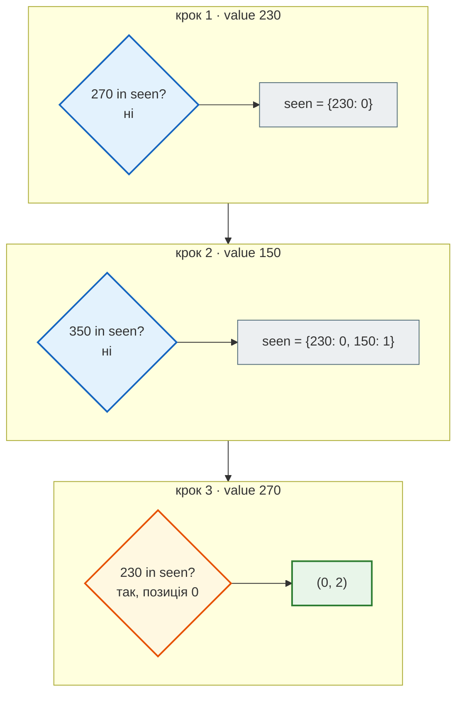
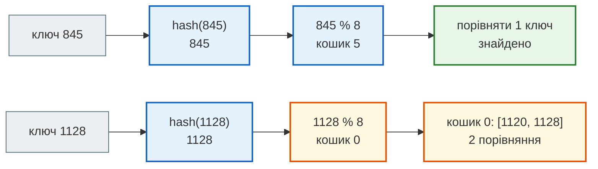

# Урок 16. Практикум П3. Хеш-структури

У практикумі П1 диспетчерська таксі навчилася **рахувати ціну** рішення, у П2 — **обирати стратегію** за властивостями даних: відсортовані дані дають бінарний пошук і два вказівники. Але сьогоднішня зміна почалася з поганої новини: журнал поїздок приходить **у порядку дзвінків**. Нічого не відсортовано, і сортувати на кожне питання — дорого.

Питання ті самі: які дві поїздки покриває ваучер? Де поїздка №845? Який маршрут найпопулярніший? Хто їздить постійно? Чекати, поки дані стануть зручними, не будемо. Змінимо **представлення**: один раз перекладемо дані у словник чи множину, і далі кожна відповідь займатиме один крок.

**Що потрібно з попередніх уроків:** словники, `dict.get` і підрахунок частот (урок 6), `NamedTuple` (урок 5), кортежі (урок 5), Big O і лічильники кроків (урок 8), два вказівники й бінарний пошук (урок 11), `Counter` (урок 12).

**Після уроку ти зможеш:**

- розв'язувати задачу про пару з потрібною сумою на невідсортованих даних за один прохід (Two Sum);
- будувати словник-індекс і пояснювати, коли він окупається;
- пояснювати на спрощеній моделі, чому пошук у `dict` і `set` займає в середньому один крок;
- розрізняти hashable і unhashable значення, використовувати кортежі як ключі;
- рахувати частоти й групувати дані за канонічним ключем.

**Задача розділу.** Звіт диспетчера за зміну: пара поїздок для ваучера, найпопулярніший маршрут, постійні клієнти — кожне за один прохід по журналу. Повний код — у розділі [«Практика»](#practice).

**Ноутбук заняття:** [`note_lesson_16_hashing.ipynb`](https://github.com/NikoriakViktot/PY-Course-Victor-Nikoriak-22-09-2026/blob/main/module_1/lessons/lesson_16_practicum_hashing/note_lesson_16_hashing.ipynb) [](https://colab.research.google.com/github/NikoriakViktot/PY-Course-Victor-Nikoriak-22-09-2026/blob/main/module_1/lessons/lesson_16_practicum_hashing/note_lesson_16_hashing.ipynb)

## Пригадай

Дай відповідь подумки, нічого не запускаючи:

1. У практикумі П2 два вказівники знайшли пару для ваучера на 500 грн у `[120, 150, 180, 230, 270, 320, 410]`. На яку властивість списку вони спиралися?
2. В уроці 8 `if driver in tuesday:` для списку повільне, а для `set(tuesday)` — швидке. Яка складність кожного варіанта?
3. Що робить рядок `counts[name] = counts.get(name, 0) + 1`?

??? success "Відповіді"

    1. На відсортованість: «сума замала → зсуваємо лівий, і вона зросте». Без порядку цей висновок хибний.
    2. `in` для списку — `O(n)`: переглядає елементи по черзі. Для множини — `O(1)` в середньому.
    3. Збільшує лічильник для `name` на одиницю. Якщо ключа ще немає, `get` поверне `0`, тож перша зустріч дасть `1`.

## Три практикуми — три питання



П3 відповідає на питання, яке П2 лишило відкритим: що робити, коли дані **не** мають зручної властивості.

## Журнал зміни

Кожна поїздка — `NamedTuple`: номер, клієнт, звідки, куди, вартість. Записи йдуть у порядку дзвінків:

```python
from typing import NamedTuple


class Trip(NamedTuple):
    id: int
    client: str
    start: str
    end: str
    fare: int


trips = [
    Trip(1120, "Марта", "Поділ", "Оболонь", 230),
    Trip(425, "Олег", "Вокзал", "Поділ", 150),
    Trip(930, "Марта", "Оболонь", "Поділ", 270),
    Trip(612, "Ірина", "Печерськ", "Вокзал", 180),
    Trip(845, "Тарас", "Поділ", "Оболонь", 320),
    Trip(1035, "Олег", "Поділ", "Вокзал", 120),
    Trip(700, "Олена", "Оболонь", "Поділ", 410),
    Trip(510, "Богдан", "Вокзал", "Печерськ", 150),
]

fares = [trip.fare for trip in trips]
print(fares)
```

```text
[230, 150, 270, 180, 320, 120, 410, 150]
```

## Ваучер: пара з потрібною сумою

Пасажирові видали ваучер на **рівно 500 грн** на дві поїздки цієї зміни. Які дві поїздки він покриває?

### Два вказівники більше не працюють

**Прогноз:** що поверне `pair_with_sum` з практикуму П2, якщо дати їй невідсортований список?

```python
def pair_with_sum(items, target):
    left, right = 0, len(items) - 1
    steps = 0
    while left < right:
        steps += 1
        total = items[left] + items[right]
        if total == target:
            return (items[left], items[right]), steps
        if total < target:
            left += 1
        else:
            right -= 1
    return None, steps


print(pair_with_sum(fares, 500))
```

```text
(None, 7)
```

«Пари немає», хоча `230 + 270 = 500`. Функція не впала і не попередила — просто мовчки дала неправильну відповідь. Два вказівники зсували лівий, бо «сума замала — праворуч більші числа». Але праворуч стоять і менші: порядку немає.

Можна відсортувати (`O(n log n)`), але тоді загубляться позиції поїздок у журналі. Можна перебрати всі пари:

```python
def pair_with_sum_brute(items, target):
    steps = 0
    for i in range(len(items)):
        for j in range(i + 1, len(items)):
            steps += 1
            if items[i] + items[j] == target:
                return (i, j), steps
    return None, steps


print(pair_with_sum_brute(fares, 500))
```

```text
((0, 2), 2)
```

Тут пощастило: пара знайшлася вже на другому кроці. Але коли пари немає, перебір перевіряє всі `n · (n − 1) / 2` пар, це `O(n²)`.

### Пам'ятати побачене

Ідея: проходимо журнал **один раз** і для кожної суми питаємо: «чи бачили ми вже **доповнення** до 500?» Для 230 доповнення — 270. Щоб відповідь на «чи бачили» займала один крок, побачені суми зберігаємо у **словнику** «сума → позиція в журналі»:

```python
def pair_with_sum_hash(items, target):
    seen = {}
    steps = 0
    for i, value in enumerate(items):
        steps += 1
        need = target - value
        if need in seen:
            return (seen[need], i), steps
        seen[value] = i
    return None, steps


print(pair_with_sum_hash(fares, 500))
```

```text
((0, 2), 3)
```

| Крок | `i` | `value` | `need` | `need in seen`? | `seen` після кроку |
|---|---|---|---|---|---|
| 1 | 0 | 230 | 270 | ні | `{230: 0}` |
| 2 | 1 | 150 | 350 | ні | `{230: 0, 150: 1}` |
| 3 | 2 | 270 | 230 | **так**, позиція 0 | — |

Покроково — словник `seen` росте, доки доповнення не знайдеться:



Відповідь — позиції `(0, 2)`: поїздки №1120 і №930 Марти. Один прохід, `O(n)`, а позиції в журналі збереглися.

!!! note "Two Sum"
    Це відома задача з співбесід — **Two Sum**: знайти два елементи з заданою сумою. Рішення зі словником — класичне: `O(n)` часу за рахунок `O(n)` додаткової пам'яті.

### Дослід подвоєння

Порівняємо кроки, коли пари немає (найгірший випадок):

```python
for n in [1000, 2000, 4000]:
    values = list(range(1, n + 1))
    _, brute = pair_with_sum_brute(values, 10**9)
    _, fast = pair_with_sum_hash(values, 10**9)
    print(n, brute, fast)
```

```text
1000 499500 1000
2000 1999000 2000
4000 7998000 4000
```

Подвоїли журнал — перебір виконує **вчетверо** більше кроків (`O(n²)`), словник — удвічі (`O(n)`). На 4000 поїздок це 8 мільйонів проти 4 тисяч.

## Поїздка за номером: словник-індекс

Пасажир дзвонить: «Я забув сумку в поїздці №845». Номери в журналі йдуть як завгодно, тож лишається лінійний пошук, як у П2:

```python
def find_trip(trips, trip_id):
    steps = 0
    for trip in trips:
        steps += 1
        if trip.id == trip_id:
            return trip, steps
    return None, steps


print(find_trip(trips, 845))
```

```text
(Trip(id=845, client='Тарас', start='Поділ', end='Оболонь', fare=320), 5)
```

Для одного дзвінка — нормально. Але за зміну таких дзвінків сотні, і кожен знову переглядає журнал. Краще **один раз** побудувати словник «номер → поїздка»:

```python
by_id = {trip.id: trip for trip in trips}

print(by_id[845].client)
print(by_id.get(999))
```

```text
Тарас
None
```

Побудова — один прохід, `O(n)`. Далі кожен запит `by_id[845]` — один крок. Перевіримо на великому журналі: 1000 поїздок у випадковому порядку, 100 дзвінків.

```python
import random

ids = list(range(1000))
random.Random(7).shuffle(ids)
big_journal = [Trip(i, "клієнт", "А", "Б", 100) for i in ids]
calls = list(range(0, 1000, 10))

linear_steps = sum(find_trip(big_journal, trip_id)[1] for trip_id in calls)
index = {trip.id: trip for trip in big_journal}
index_steps = len(big_journal) + len(calls)

print(linear_steps, index_steps)
```

```text
53493 1100
```

100 лінійних пошуків — понад 53 000 кроків, у середньому пів журналу на дзвінок. Індекс — 1000 кроків на побудову і по одному на кожен дзвінок.

!!! warning "Індекс окупається не завжди"
    Для **одного** запиту побудова словника (n кроків) дорожча за один лінійний пошук (у середньому n / 2). Індекс виграє, коли запитів багато. Та сама логіка, що в уроці 11: відсортувати один раз, щоб потім багато разів шукати бінарно.

## Як словник знаходить ключ за один крок

Спрощена модель — без подробиць CPython, але з головною ідеєю. Словник тримає масив **кошиків** (buckets). Для ключа Python обчислює число — **хеш** — і за ним одразу визначає номер кошика. Для малих цілих чисел хеш дорівнює самому числу:

```python
print(hash(845), hash(1120))
```

```text
845 1120
```

Візьмемо таблицю з 8 кошиків і розкладемо номери поїздок: кошик = `hash(номер) % 8`.

```python
buckets = [[] for _ in range(8)]
for trip_id in [1120, 425, 930, 612, 845]:
    buckets[hash(trip_id) % 8].append(trip_id)

for number, bucket in enumerate(buckets):
    print(number, bucket)
```

```text
0 [1120]
1 [425]
2 [930]
3 []
4 [612]
5 [845]
6 []
7 []
```

Щоб знайти 845, не треба переглядати таблицю: `845 % 8 = 5` — одразу в кошик 5 і порівняти один ключ. Кількість поїздок у таблиці на це не впливає.

Шлях ключа до кошика, включно з колізією, яку розберемо далі:



А якщо два ключі потрапили в один кошик? Це **колізія**:

```python
def find_in_table(buckets, key):
    bucket = buckets[hash(key) % len(buckets)]
    comparisons = 0
    for item in bucket:
        comparisons += 1
        if item == key:
            return True, comparisons
    return False, comparisons


buckets[hash(1128) % 8].append(1128)
print(buckets[0])
print(find_in_table(buckets, 1128))
print(find_in_table(buckets, 845))
```

```text
[1120, 1128]
(True, 2)
(True, 1)
```

`1128 % 8 = 0` — той самий кошик, що в 1120. Шукаючи 1128, порівнюємо двічі. Справжній `dict` тримає кошиків більше, ніж ключів, і збільшує таблицю, коли вона заповнюється. Тому колізій мало, і пошук **в середньому** займає сталу кількість кроків: `O(1)`. У найгіршому випадку, коли все потрапило в один кошик, — `O(n)`, але на практиці це майже не трапляється.

!!! note "Хеш рядка змінюється між запусками"
    `hash("Поділ")` щоразу, коли запускаєш Python, дає **інше** число: так Python захищається від спеціально підібраних колізій ([PYTHONHASHSEED](https://docs.python.org/3/using/cmdline.html#envvar-PYTHONHASHSEED)). У межах одного запуску хеш сталий, і словник працює правильно. Тому в прикладах вище — лише цілі числа.

## Що може бути ключем

Хеш ключа має бути сталим, доки ключ лежить у словнику. Інакше словник шукатиме його не в тому кошику. Тому ключами можуть бути лише **hashable** значення — ті, що не змінюються: `int`, `float`, `str`, `tuple` з незмінних елементів.

Маршрут — пара «звідки, куди» — зручно зберігати кортежем:

```python
route_counts = {("Поділ", "Оболонь"): 2}
print(route_counts[("Поділ", "Оболонь")])
```

```text
2
```

Список ключем бути не може — його можна змінити після того, як поклали у словник:

```python
route_counts[["Поділ", "Оболонь"]] = 2
```

```text
TypeError: unhashable type: 'list'
```

Кортеж, у якому є список, — теж:

```python
hash(("Поділ", ["Оболонь", "Поділ"]))
```

```text
TypeError: unhashable type: 'list'
```

Ті самі правила діють для елементів `set`: множина — це словник без значень.

## Частоти: найпопулярніший маршрут

Рахуємо, скільки разів трапляється кожен маршрут. Той самий прийом, що в уроці 6, тільки ключ — кортеж:

```python
def route_counts_naive(trips):
    counts = {}
    for trip in trips:
        route = (trip.start, trip.end)
        counts[route] = counts.get(route, 0) + 1
    return counts


print(route_counts_naive(trips))
```

```text
{('Поділ', 'Оболонь'): 2, ('Вокзал', 'Поділ'): 1, ('Оболонь', 'Поділ'): 2, ('Печерськ', 'Вокзал'): 1, ('Поділ', 'Вокзал'): 1, ('Вокзал', 'Печерськ'): 1}
```

Але «Поділ → Оболонь» і «Оболонь → Поділ» — для диспетчера один і той самий маршрут, і його треба рахувати разом. Потрібен **канонічний ключ**: одне представлення для всіх варіантів, які ми вважаємо однаковими. Для пари міст — відсортований кортеж:

```python
def route_key(trip):
    return tuple(sorted((trip.start, trip.end)))


print(route_key(trips[0]), route_key(trips[2]))
```

```text
('Оболонь', 'Поділ') ('Оболонь', 'Поділ')
```

Тепер рахуємо через `Counter` з уроку 12:

```python
from collections import Counter

routes = Counter(route_key(trip) for trip in trips)
print(routes.most_common(2))
```

```text
[(('Оболонь', 'Поділ'), 4), (('Вокзал', 'Поділ'), 2)]
```

«Оболонь — Поділ» — 4 поїздки з восьми. Один прохід журналом, `O(n)`.

!!! tip "Канонічний ключ"
    Коли різні записи мають вважатися однаковими, зведи кожен до одного вигляду і використай його як ключ словника: відсортований кортеж для маршруту, `name.lower()` для імен без урахування регістру, відсортовані літери для анаграм. Прийом повернеться в самостійній задачі.

## Пастка: словник змінюється під час обходу

Диспетчер хоче прибрати з лічильника клієнтів з однією поїздкою:

```python
clients = Counter(trip.client for trip in trips)

for name in clients:
    if clients[name] < 2:
        del clients[name]
```

```text
RuntimeError: dictionary changed size during iteration
```

Видаляти ключі зі словника, по якому зараз іде цикл, не можна. Два правильні способи: обходити **копію** ключів — `for name in list(clients):` — або будувати **новий** словник:

```python
clients = Counter(trip.client for trip in trips)
regular = {name: count for name, count in clients.items() if count >= 2}
print(regular)
```

```text
{'Марта': 2, 'Олег': 2}
```

## Як обрати структуру

| Питання до даних | Представлення | Складність запиту |
|---|---|---|
| «чи є такий?», дані без порядку, запит один | список, `in` | `O(n)` |
| «чи є такий?», запитів багато | `set` | `O(1)` в середньому |
| «знайти запис за ключем» | `dict` ключ → запис | `O(1)` в середньому |
| «скільки разів?» | `Counter` / `dict` ключ → лічильник | `O(1)` на оновлення |
| «найближчий більший», діапазони, префікси | відсортований список + `bisect` | `O(log n)` |

Хеш-структури не дають порядку «від меншого до більшого» — для діапазонів і префіксів (автодоповнення з П2) лишається відсортований список. Пам'ять теж не безкоштовна: словник на n записів займає більше місця, ніж список з тих самих записів.

## Практика { #practice }

### Розібраний приклад: звіт диспетчера за зміну

Три відповіді — кожна за один прохід журналом:

```python linenums="1" hl_lines="2 4 5 6 11 15"
def shift_report(trips, voucher):
    pair, _ = pair_with_sum_hash([trip.fare for trip in trips], voucher)
    voucher_trips = [trips[i].id for i in pair] if pair else None
    routes = Counter(route_key(trip) for trip in trips)
    top_route, top_count = routes.most_common(1)[0]
    clients = Counter(trip.client for trip in trips)
    return {
        "voucher_trips": voucher_trips,
        "top_route": " — ".join(top_route),
        "top_route_trips": top_count,
        "regular_clients": [name for name, count in clients.items() if count >= 2],
    }


report = shift_report(trips, 500)
for key, value in report.items():
    print(key, value)
```

```text
voucher_trips [1120, 930]
top_route Оболонь — Поділ
top_route_trips 4
regular_clients ['Марта', 'Олег']
```

Що відбувається в ключових рядках:

- **рядок 2** — Two Sum на словнику: пара позицій у журналі, а не значень, тож у рядку 3 одразу маємо номери поїздок;
- **рядки 4–5** — канонічний ключ маршруту і `Counter`: напрямок не важливий;
- **рядок 6** — ще один `Counter`, тепер за клієнтами;
- **рядок 11** — новий список з потрібних клієнтів, без змін словника під час обходу;
- **рядок 15** — увесь звіт — три проходи журналом, `O(n)`. Перебір пар для ваучера сам по собі дав би `O(n²)`.

### Зміни приклад: перший разовий клієнт

Відділ маркетингу хоче подзвонити **першому** за журналом клієнтові, який цієї зміни їздив рівно один раз. Напиши `first_unique(names)`, яка повертає таке ім'я або `None`.

```text
first_unique([trip.client for trip in trips])  →  'Ірина'
first_unique(["Марта", "Марта"])               →  None
first_unique([])                               →  None
```

**Критерії перевірки:**

- два проходи: спершу `Counter` по всіх іменах, потім пошук першого з лічильником 1;
- жодного `names.count(name)` у циклі — це приховане `O(n²)`, як `in` для списку в уроці 8;
- Марта й Олег — не разові: вони трапляються двічі, хоч і не поспіль.

??? tip "Підказка"
    Порядок дає другий прохід по **списку** `names`, а не по словнику: ідемо по іменах у порядку журналу і повертаємо перше, для якого `counts[name] == 1`.

### Спробуй самостійно: анаграми

Класична задача з співбесід на той самий прийом — канонічний ключ. **Анаграми** — слова з тих самих літер у різному порядку: «літо» і «тіло», «клоун» і «уклон». Промокоди таксі генеруються випадково, і служба підтримки просить знайти ті, що є анаграмами один одного: їх легко сплутати.

Напиши дві функції:

- `is_anagram(a, b)` — чи є два слова анаграмами. Порівнюй `Counter(a) == Counter(b)`, без урахування регістру;
- `group_anagrams(words)` — групи анаграм у порядку першої появи. Ключ групи — відсортовані літери слова: `"".join(sorted(word.lower()))`.

```text
is_anagram("Літо", "тіло")    →  True
is_anagram("літо", "літа")    →  False
group_anagrams(["літо", "клоун", "тіло", "таксі", "уклон", "кит"])
    →  [['літо', 'тіло'], ['клоун', 'уклон'], ['таксі'], ['кит']]
```

**Правила:**

- `group_anagrams` проходить список **один раз**: словник «ключ → список слів»;
- порівнювати кожне слово з кожним не можна — це `O(n²)`;
- слова зберігаються в групі у тому вигляді, в якому прийшли (без `lower()`).

## Підсумок

| Поняття | Що запам'ятати |
|---|---|
| Змінити представлення | немає зручної властивості даних — переклади їх у `dict` / `set` один раз |
| Two Sum | словник «значення → позиція», питаємо про доповнення: `O(n)` |
| Словник-індекс | побудова `O(n)`, далі кожен запит `O(1)`; окупається, коли запитів багато |
| Хеш | число з ключа → номер кошика; в середньому `O(1)`, колізії рідкісні |
| Hashable | ключі й елементи `set` — лише незмінні: `str`, `int`, `tuple` |
| Канонічний ключ | одне представлення для «однакових» записів: відсортований кортеж, відсортовані літери |
| Пастка | не змінювати `dict` під час обходу — обходь копію або будуй новий |

### Самоперевірка

1. Чому `pair_with_sum` з П2 мовчки дає неправильну відповідь на невідсортованих даних, а не падає?
2. Що зберігає `seen` у `pair_with_sum_hash` і чому саме словник, а не список?
3. Коли словник-індекс `{id: trip}` не окупається?
4. Поясни на моделі з кошиками, чому пошук у `dict` не залежить від кількості ключів.
5. Чому список не може бути ключем словника, а кортеж — може?
6. Навіщо канонічний ключ у підрахунку маршрутів? Що вийде без нього?
7. `names.count(name)` усередині циклу по `names` — яка складність і чому?

??? success "Відповіді"

    1. Алгоритм не перевіряє, чи список відсортований, — він покладається на це. На невідсортованих даних кожен крок робить хибний висновок «праворуч більші», і пошук закінчується, не розглянувши потрібну пару.
    2. Побачені суми та їхні позиції в журналі. Питання «чи бачили доповнення?» у словнику — один крок, у списку — прохід по ньому, тобто разом `O(n²)`.
    3. Коли запит один або їх мало: побудова коштує n кроків, а один лінійний пошук — у середньому n / 2.
    4. За хешем ключа одразу обчислюється номер кошика, а в кошику — один чи кілька ключів. Скільки ключів у всій таблиці, на це не впливає.
    5. Список можна змінити, і тоді його хеш став би іншим, а словник шукав би ключ не в тому кошику. Кортеж з незмінних елементів змінити не можна.
    6. Щоб «Поділ → Оболонь» і «Оболонь → Поділ» рахувались як один маршрут. Без нього лічильник розіб'ється на два ключі по 2, і лідера не буде видно.
    7. `O(n²)`: `count` сам проходить весь список, і так для кожного імені. `Counter` рахує все за один прохід.

### Що далі

- Ноутбук заняття: [`note_lesson_16_hashing.ipynb`](https://github.com/NikoriakViktot/PY-Course-Victor-Nikoriak-22-09-2026/blob/main/module_1/lessons/lesson_16_practicum_hashing/note_lesson_16_hashing.ipynb) [](https://colab.research.google.com/github/NikoriakViktot/PY-Course-Victor-Nikoriak-22-09-2026/blob/main/module_1/lessons/lesson_16_practicum_hashing/note_lesson_16_hashing.ipynb) — та сама зміна диспетчера: прогнози, лічильники кроків, вправи з перевірками.
- Наступне заняття: [Урок 17. Огляд модуля 1](lesson_17.md) — усе разом: типи, колекції, функції, винятки, файли, Git і три практикуми.
- У модулі 2 повернемося до hashable з іншого боку: як зробити ключем словника **власний** клас (`__hash__` і `__eq__`).

## Документація і джерела

- Типи [`dict`](https://docs.python.org/3/library/stdtypes.html#mapping-types-dict) і [`set`](https://docs.python.org/3/library/stdtypes.html#set-types-set-frozenset); вбудована функція [`hash()`](https://docs.python.org/3/library/functions.html#hash)
- Глосарій: [hashable](https://docs.python.org/3/glossary.html#term-hashable); [`collections.Counter`](https://docs.python.org/3/library/collections.html#collections.Counter)
- [Складність операцій `list`, `dict`, `set`](https://wiki.python.org/moin/TimeComplexity)
- Для охочих:
    - Harvard CS50x, [тиждень 5 «Data Structures»](https://cs50.harvard.edu/x/weeks/5/) — хеш-таблиці, хеш-функції й колізії;
    - MIT 6.006, [лекція 4 «Hashing»](https://ocw.mit.edu/courses/6-006-introduction-to-algorithms-spring-2020/resources/lecture-4-hashing/) — для тих, хто хоче глибше.
