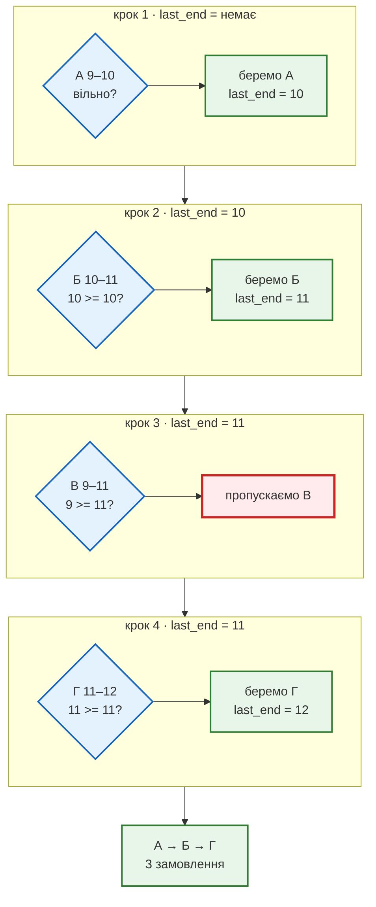
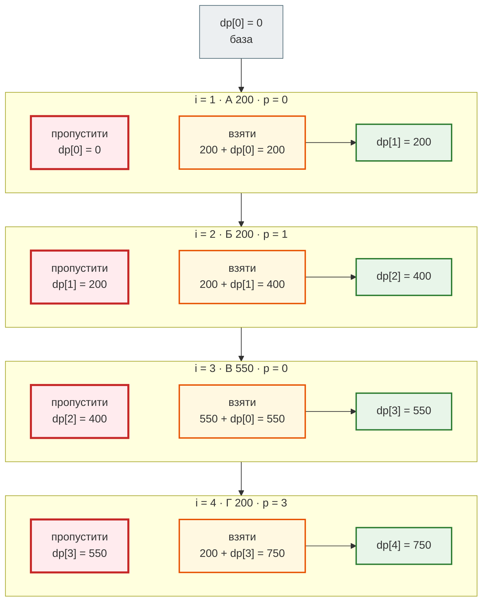
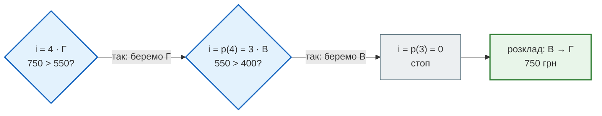
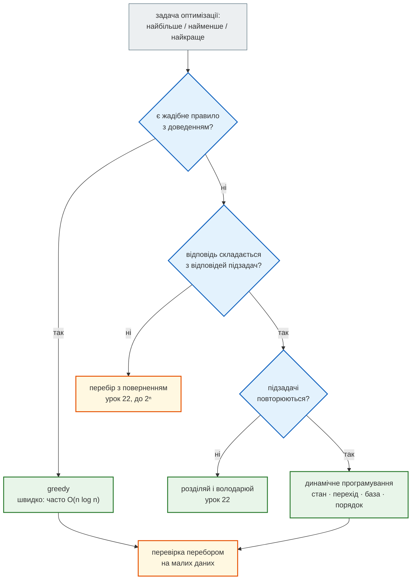

# Урок 26. Практикум П5. Динамічне програмування + greedy (вступ)

Чотири практикуми навчили диспетчерську **оцінювати** рішення (П1), **обирати** стратегію за властивостями даних (П2), **змінювати представлення** даних (П3) і **розбивати** задачу на менші копії себе (П4). Сьогодні — п'яте вміння: будувати найкраще рішення з **найкращих рішень менших задач**, не перераховуючи їх знову.

Водій «Смачно + Таксі» відкриває зміну й бачить у застосунку чотири замовлення. Усі мають фіксований час і відому винагороду. Узяти всі не вийде: деякі перетинаються. Диспетчерська ставить два питання:

1. Як виконати **найбільше замовлень**? (Рейтинг водія залежить від кількості.)
2. Як **заробити найбільше**?

Дані ті самі, а відповіді — різні. На першому питанні ми побачимо **жадібний алгоритм** (greedy), який робить найкращий крок зараз і ніколи не передумує. На другому він програє, і з'явиться **динамічне програмування** (ДП).

**Що потрібно з попередніх уроків:** `NamedTuple` і `sorted(key=...)` (уроки 5–7), Big O і лічильник кроків (урок 8), `bisect` (урок 11), рекурсія й `lru_cache` (урок 22), перевірки через `assert` (урок 25).

**Після уроку ти зможеш:**

- пояснити, що таке жадібний алгоритм і чому його правильність треба доводити або перевіряти;
- розв'язати задачу вибору максимальної кількості інтервалів жадібно за `O(n log n)`;
- побудувати ДП-розв'язок через вибір «взяти або пропустити»: стан, перехід, база, порядок;
- заповнити таблицю ДП вручну, записати її в коді й відновити саму відповідь, а не лише число;
- перевірити швидкий алгоритм повільним перебором на малих даних.

**Задача розділу.** Розклад водія на зміну: спершу найбільше замовлень, потім найбільший заробіток. Повний код — у розділі [«Практика»](#practice).

**Ноутбук заняття:** [`note_lesson_26_scheduling.ipynb`](https://github.com/NikoriakViktot/PY-Course-Victor-Nikoriak-22-09-2026/blob/main/module_2/lessons/lesson_26_practicum_dp_greedy/note_lesson_26_scheduling.ipynb) [](https://colab.research.google.com/github/NikoriakViktot/PY-Course-Victor-Nikoriak-22-09-2026/blob/main/module_2/lessons/lesson_26_practicum_dp_greedy/note_lesson_26_scheduling.ipynb)

## Пригадай

1. Чому `fib(20)` без кешу робить 21 891 виклик, а з `lru_cache` — 21 обчислення?
2. Що повертає `bisect.bisect_right([10, 11, 11, 12], 11)`?
3. Скільки підмножин має набір з `n` замовлень?

??? success "Відповіді"

    1. Ті самі `fib(k)` обчислюються знову й знову. Кеш рахує кожне `k` один раз (урок 22).
    2. `3`: позицію **після** останнього елемента, що дорівнює `11`, тобто кількість елементів `<= 11`.
    3. `2ⁿ`: кожне замовлення або беремо, або ні. Для 4 замовлень — 16, для 40 — понад трильйон.

## Задача: зміна водія

| Замовлення | Час | Заробіток |
|---|---|---:|
| А | 09:00–10:00 | 200 грн |
| Б | 10:00–11:00 | 200 грн |
| В | 09:00–11:00 | 550 грн |
| Г | 11:00–12:00 | 200 грн |

!!! note "Модель спрощена — і це свідомо"
    - кожне замовлення має фіксований інтервал і відому винагороду;
    - водій виконує лише одне замовлення одночасно;
    - замовлення, що закінчується о 10:00, дозволяє почати наступне о 10:00;
    - переїзди між замовленнями й витрати на пальне поки не враховуємо;
    - максимізуємо **винагороду**, а не чистий прибуток.

    Реальний сервіс додасть і час на дорогу, і витрати, але алгоритм від цього не зміниться: зміниться лише правило «чи сумісні два замовлення».

Щоб не плутатися в хвилинах, запишемо час цілими годинами:

```python
from typing import NamedTuple


class Order(NamedTuple):
    name: str
    start: int   # година початку
    end: int     # година завершення
    reward: int  # грн


orders = [
    Order("А", 9, 10, 200),
    Order("Б", 10, 11, 200),
    Order("В", 9, 11, 550),
    Order("Г", 11, 12, 200),
]


def compatible(a, b):
    """Два замовлення не перетинаються: одне закінчується до початку іншого."""
    return a.end <= b.start or b.end <= a.start


print(compatible(orders[0], orders[1]), compatible(orders[0], orders[2]))
```

```text
True False
```

А (9–10) і Б (10–11) сумісні: А закінчується саме тоді, коли починається Б. А і В перетинаються: обидва тривають о 9-й.

Часова схема показує, що з чим перетинається:

```mermaid
gantt
    dateFormat HH:mm
    axisFormat %H:%M
    section А · 200 грн
    А : a, 09:00, 10:00
    section Б · 200 грн
    Б : b, 10:00, 11:00
    section В · 550 грн
    В : c, 09:00, 11:00
    section Г · 200 грн
    Г : d, 11:00, 12:00
```



??? question "Спробуй сам, перш ніж читати далі"

    1. Яку найбільшу кількість замовлень може виконати водій?
    2. Скільки найбільше він може заробити?

    Запиши відповіді й розклади, які їх дають. Ми повернемося до них двічі.

## Мета 1: найбільше замовлень

### Ідея: звільнитися якнайраніше

Кожне замовлення «коштує» однаково: +1 до рахунку. Тоді вигідно брати те, яке **звільняє водія найраніше**: після нього залишається найбільше часу для решти.

Жадібне правило:

1. відсортувати замовлення за часом завершення;
2. йти по черзі й брати замовлення, якщо воно починається не раніше, ніж закінчилось останнє взяте;
3. ніколи не повертатися до вже прийнятих рішень.

Покроково на наших даних. Після сортування за `end`: А (10), Б (11), В (11), Г (12). `sorted` стабільний, тому Б і В з однаковим `end = 11` залишаються в початковому порядку.



```python
def max_orders(orders):
    chosen = []
    last_end = None
    for order in sorted(orders, key=lambda o: o.end):
        if last_end is None or order.start >= last_end:
            chosen.append(order)
            last_end = order.end
    return chosen


chosen = max_orders(orders)
print([o.name for o in chosen], len(chosen))
```

```text
['А', 'Б', 'Г'] 3
```

Три замовлення — більше не вийде: А, Б і Г разом займають 9:00–12:00 без пауз, а В перетинається і з А, і з Б. Сортування коштує `O(n log n)`, прохід — `O(n)`, отже весь алгоритм — `O(n log n)`.

### Чому це правило правильне

Жадібний алгоритм не перебирає варіанти, тому його правильність не очевидна — її треба **довести**. Класичний спосіб — **аргумент обміну** (exchange argument):

1. Візьмемо будь-який найкращий розклад і подивимось на його **перше** замовлення.
2. Жадібне перше замовлення закінчується **не пізніше** (воно найраніше серед усіх).
3. Замінимо перше замовлення найкращого розкладу на жадібне. Решта замовлень починалась після кінця старого першого, тож і після кінця нового — розклад лишився сумісним, а кількість не змінилась.
4. Тепер найкращий розклад починається так само, як жадібний. Повторимо міркування для решти часу — і дійдемо до жадібного розкладу, нічого не втративши.

Отже, жадібний розклад має стільки ж замовлень, скільки найкращий.

### Інші «очевидні» правила ламаються

Правило «найраніший кінець» — не єдине, що спадає на думку. Перевіримо ще два на маленьких наборах:

```python
def greedy_by(orders, key):
    """Жадібно: переглядаємо за key і беремо все, що сумісне з уже взятим."""
    chosen = []
    for order in sorted(orders, key=key):
        if all(compatible(order, c) for c in chosen):
            chosen.append(order)
    return [o.name for o in chosen]


early = [Order("Л", 8, 12, 0), Order("М", 9, 10, 0), Order("Н", 10, 11, 0)]
print("найраніший початок:", greedy_by(early, key=lambda o: o.start))
print("найраніший кінець: ", [o.name for o in max_orders(early)])

short = [Order("П", 8, 11, 0), Order("Р", 10, 12, 0), Order("С", 11, 14, 0)]
print("найкоротше:        ", greedy_by(short, key=lambda o: o.end - o.start))
print("найраніший кінець: ", [o.name for o in max_orders(short)])
```

```text
найраніший початок: ['Л']
найраніший кінець:  ['М', 'Н']
найкоротше:         ['Р']
найраніший кінець:  ['П', 'С']
```

- «Найраніший початок» бере Л (8–12), і воно блокує обидва короткі замовлення.
- «Найкоротше» бере Р (10–12, 2 години), яке перетинається з обома іншими.

Жадібні правила легко вигадати і так само легко помилитися. Тому правило або доводять, або хоча б перевіряють перебором (розділ [«Перевірка»](#brute-force)).

## Мета 2: найбільший заробіток

Диспетчерська змінює мету: тепер важливі гроші. Скільки дає розклад, який ми щойно знайшли?

```python
print("жадібний за кількістю:", sum(o.reward for o in chosen), "грн")
print("В + Г:                ", orders[2].reward + orders[3].reward, "грн")
```

```text
жадібний за кількістю: 600 грн
В + Г:                 750 грн
```

Три замовлення дають 600 грн, а **два** — 750. Жадібний алгоритм не помилився: він розв'язував **іншу** задачу. Правило «найраніший кінець» оптимальне, лише коли всі замовлення важать однаково.

### «Просто бери найдорожче»?

Нове жадібне правило: переглядати замовлення від найдорожчого й брати все, що сумісне:

```python
def most_expensive_first(orders):
    return greedy_by(orders, key=lambda o: -o.reward)


print(most_expensive_first(orders))
```

```text
['В', 'Г']
```

На наших даних вийшло 750 грн — правильно. Але це збіг. Інша зміна:

```python
evening = [Order("Д", 9, 13, 500), Order("Е", 9, 11, 300), Order("Ж", 11, 13, 300)]
print(most_expensive_first(evening))
```

```text
['Д']
```

Д дає 500 грн, а Е + Ж — 600. Найдорожче замовлення забирає час у двох дешевших, які разом вигідніші.

Жадібний алгоритм робить найкращий крок **зараз** і не бачить його наслідків. Для заробітку потрібно порівнювати **цілі варіанти**: що буде, якщо взяти замовлення, і що — якщо пропустити.

## Динамічне програмування: взяти або пропустити

### Словами

Відсортуємо замовлення за часом завершення й розглядатимемо їх по одному. Для **кожного** замовлення є лише два варіанти:

- **пропустити** — тоді найкращий заробіток такий самий, як без нього;
- **взяти** — тоді отримуємо його винагороду **плюс** найкращий заробіток серед замовлень, які закінчились до його початку.

Обираємо більше. Головне: «найкращий заробіток без нього» і «найкращий серед попередніх сумісних» — це відповіді на **ту саму задачу для меншого набору**. Якщо записувати їх у таблицю, кожну рахуємо один раз.

### Позначення

Після сортування за `end` нумеруємо замовлення з **одиниці**:

| `i` | 1 | 2 | 3 | 4 |
|---|---|---|---|---|
| замовлення | А 9–10 | Б 10–11 | В 9–11 | Г 11–12 |
| у Python | `orders[0]` | `orders[1]` | `orders[2]` | `orders[3]` |

- `dp[i]` — найбільший заробіток, якщо дозволено брати лише **перші `i`** замовлень;
- `dp[0] = 0` — без замовлень заробіток нульовий (**базовий випадок**);
- `p(i)` — скільки перших замовлень закінчуються не пізніше, ніж **починається** замовлення `i`. Усі вони сумісні з ним, бо список відсортований за `end`.

Тоді для кожного `i`:

- пропустити: `dp[i - 1]`;
- взяти: `reward(i) + dp[p(i)]`;
- `dp[i] = max(пропустити, взяти)`.

Нумерація з одиниці потрібна, щоб `dp[0]` означав «жодного замовлення». Звідси зсув: замовлення `i` у Python — `orders[i - 1]`.

### Заповнюємо таблицю вручну

Спершу `p(i)`:

- А починається о 9; до 9 не закінчилось нічого → `p(1) = 0`;
- Б починається о 10; до 10 закінчилось лише А → `p(2) = 1`;
- В починається о 9 → `p(3) = 0`;
- Г починається об 11; до 11 закінчились А, Б, В → `p(4) = 3`.

Тепер рядок за рядком, **зверху вниз**: кожен рядок використовує лише вже заповнені.

| `i` | замовлення | `p(i)` | пропустити `dp[i-1]` | взяти `reward + dp[p(i)]` | `dp[i]` |
|---|---|---|---|---|---|
| 0 | — | — | — | — | **0** |
| 1 | А 200 | 0 | 0 | 200 + 0 = 200 | **200** |
| 2 | Б 200 | 1 | 200 | 200 + 200 = 400 | **400** |
| 3 | В 550 | 0 | 400 | 550 + 0 = 550 | **550** |
| 4 | Г 200 | 3 | 550 | 200 + 550 = 750 | **750** |

Відповідь — `dp[4] = 750`. Та сама таблиця як покрокова схема:



На цих даних у кожному рядку перемагає «взяти», але `dp[i]` зростає нерівно: у рядку 3 взяти В вигідніше, ніж зберегти А + Б (550 проти 400). Саме тут ДП «передумує» щодо рішень greedy — не змінюючи попередніх рядків, а порівнюючи варіанти.

### Формула і код

Спершу `p(i)` — найпростішим способом: для кожного замовлення йти назад, доки не знайдемо перше, що закінчилось до його початку.

```python
def prev_compatible(orders):
    """p[i] для замовлень, уже відсортованих за end. p[0] не використовується."""
    p = [0] * (len(orders) + 1)
    for i in range(1, len(orders) + 1):
        start = orders[i - 1].start
        for j in range(i - 1, 0, -1):
            if orders[j - 1].end <= start:
                p[i] = j
                break
    return p


by_end = sorted(orders, key=lambda o: o.end)
print([o.name for o in by_end], prev_compatible(by_end)[1:])
```

```text
['А', 'Б', 'В', 'Г'] [0, 1, 0, 3]
```

Той самий рядок `p(i)`, що й у таблиці. Тепер сама таблиця:

```python
def max_earnings(orders):
    orders = sorted(orders, key=lambda o: o.end)
    p = prev_compatible(orders)
    dp = [0] * (len(orders) + 1)           # dp[0] = 0 — база
    for i in range(1, len(orders) + 1):    # порядок: від менших наборів до більших
        skip = dp[i - 1]
        take = orders[i - 1].reward + dp[p[i]]
        dp[i] = max(skip, take)
    return dp[-1]


print(max_earnings(orders), max_earnings(evening))
```

```text
750 600
```

750 для нашої зміни і 600 для вечірньої — там, де «бери найдорожче» дало 500.

Складність: пошук `p(i)` у гіршому разі проходить усі попередні замовлення — `O(n²)`, заповнення таблиці — `O(n)`. Прискорення до `O(n log n)` — у розділі [«Архітектура»](#architecture).

### Який розклад дав 750

Число — ще не відповідь водієві: потрібен сам розклад. Його відновлюють **з кінця таблиці**: якщо в рядку `i` перемогло «взяти», замовлення `i` в розкладі, і стрибаємо в `p(i)`; інакше — переходимо до `i - 1`.

```python
def best_schedule(orders):
    orders = sorted(orders, key=lambda o: o.end)
    p = prev_compatible(orders)
    dp = [0] * (len(orders) + 1)
    for i in range(1, len(orders) + 1):
        dp[i] = max(dp[i - 1], orders[i - 1].reward + dp[p[i]])

    chosen = []
    i = len(orders)
    while i > 0:
        if orders[i - 1].reward + dp[p[i]] > dp[i - 1]:   # «взяти» перемогло
            chosen.append(orders[i - 1])
            i = p[i]
        else:                                             # «пропустити»
            i -= 1
    return list(reversed(chosen))


print([o.name for o in best_schedule(orders)])
print([o.name for o in best_schedule(evening)])
```

```text
['В', 'Г']
['Е', 'Ж']
```



Замовлення Б і А не знадобились: з рядка 3 ми стрибнули одразу в `p(3) = 0`.

### Те саме зверху вниз: рекурсія з пам'яттю

Формулу можна записати рекурсією — майже дослівно:

```python
calls = 0


def best_plain(i, orders, p):
    global calls
    calls += 1
    if i == 0:
        return 0
    return max(best_plain(i - 1, orders, p),
               orders[i - 1].reward + best_plain(p[i], orders, p))


chain = [Order(f"#{k}", k, k + 2, 100) for k in range(1, 21)]
chain_p = prev_compatible(sorted(chain, key=lambda o: o.end))
print(best_plain(len(chain), chain, chain_p), calls)
```

```text
1000 35421
```

20 замовлень «ланцюжком»: кожне перетинається з сусідами, тож `p(i) = i - 2`. Рекурсія рахує `best(i - 1)` і `best(i - 2)` — точнісінько як `fib` з уроку 22, і кількість викликів росте так само експоненційно. `lru_cache` запам'ятовує вже пораховані `best(i)`:

```python
from functools import lru_cache


def max_earnings_memo(orders):
    orders = sorted(orders, key=lambda o: o.end)
    p = prev_compatible(orders)

    @lru_cache(maxsize=None)
    def best(i):
        if i == 0:
            return 0
        return max(best(i - 1), orders[i - 1].reward + best(p[i]))

    result = best(len(orders))
    print(best.cache_info())
    return result


print(max_earnings_memo(chain))
```

```text
CacheInfo(hits=20, misses=21, maxsize=None, currsize=21)
1000
```

21 справжнє обчислення (`best(0)` … `best(20)`) замість 35 421. Це й є динамічне програмування: **та сама формула**, але кожна підзадача рахується один раз.

| | Мемоізація (зверху вниз) | Табуляція (знизу вгору) |
|---|---|---|
| Напрямок | від `best(n)` до бази | від `dp[0]` до `dp[n]` |
| Код | рекурсія + кеш (`lru_cache`, словник) | цикл, що заповнює список |
| Що рахує | лише потрібні підзадачі | усі підзадачі по черзі |
| Ризик | глибина рекурсії (~1000, урок 22) | треба самому задати порядок |

### Чотири питання ДП

Будь-який ДП-розв'язок відповідає на чотири питання. Для нашої задачі:

| Питання | Відповідь |
|---|---|
| **Стан** — що описує підзадачу? | `i`: дозволено брати лише перші `i` замовлень |
| **Перехід** — як відповідь складається з менших? | `dp[i] = max(dp[i-1], reward(i) + dp[p(i)])` |
| **База** — що відомо без обчислень? | `dp[0] = 0` |
| **Порядок** — у якій послідовності рахувати? | `i` від 1 до `n`: `p(i) < i`, тож усе потрібне вже пораховано |

ДП працює, коли в задачі є дві властивості:

- **оптимальна підструктура** — найкраща відповідь складається з найкращих відповідей підзадач (найкращий розклад до замовлення `i` містить найкращий розклад до `p(i)`);
- **перекриття підзадач** — ті самі підзадачі потрібні багато разів (як `best(18)` у ланцюжку).

!!! warning "Три міфи про ДП"
    - **«ДП — це просто кеш для будь-якої рекурсії».** Кеш допомагає, лише коли підзадачі **повторюються**. У сортуванні злиттям (урок 22) кожна половина унікальна — кешу нічого запам'ятовувати.
    - **«ДП завжди рекурсивне».** `max_earnings` — звичайний цикл без жодного рекурсивного виклику.
    - **«Таблиця ДП завжди одновимірна».** У нас стан — одне число `i`. Якщо стан описують два параметри (наприклад, замовлення й залишок пального), таблиця стає двовимірною.

## Перевірка повільним перебором { #brute-force }

ДП і жадібний алгоритм — хитрі. Повний перебір — тупий, але очевидно правильний: перевірити **усі** `2ⁿ` підмножини. На великих даних він безнадійно повільний, зате на малих — ідеальний суддя (урок 25: швидке рішення порівнюють з повільним).

```python
from itertools import combinations


def brute_force(orders):
    """Найбільший заробіток серед усіх сумісних підмножин. O(2ⁿ · n²)."""
    best = 0
    for size in range(len(orders) + 1):
        for combo in combinations(orders, size):
            if all(compatible(a, b) for a, b in combinations(combo, 2)):
                best = max(best, sum(o.reward for o in combo))
    return best


cases = {
    "порожній список": [],
    "усі сумісні": [Order("x", 9, 10, 100), Order("y", 10, 11, 150), Order("z", 11, 12, 50)],
    "усі перетинаються": [Order("x", 9, 12, 100), Order("y", 10, 13, 150), Order("z", 11, 14, 50)],
    "дотичні межі": orders,
    "однаковий кінець": [Order("x", 9, 11, 100), Order("y", 10, 11, 150)],
}
for name, data in cases.items():
    print(f"{name:18} ДП = {max_earnings(data):4}  перебір = {brute_force(data):4}")
```

```text
порожній список    ДП =    0  перебір =    0
усі сумісні        ДП =  300  перебір =  300
усі перетинаються  ДП =  150  перебір =  150
дотичні межі       ДП =  750  перебір =  750
однаковий кінець   ДП =  150  перебір =  150
```

І кілька сотень випадкових змін:

```python
import random

random.seed(26)
mismatches = 0
for trial in range(500):
    data = []
    for k in range(random.randint(0, 8)):
        start = random.randint(8, 20)
        data.append(Order(str(k), start, start + random.randint(1, 4), random.randint(1, 10) * 50))
    if max_earnings(data) != brute_force(data):
        mismatches += 1
print("перевірено 500 змін, розбіжностей:", mismatches)
```

```text
перевірено 500 змін, розбіжностей: 0
```

Якщо ДП має помилку (наприклад, у `p(i)`), такий тест майже напевно знайде зміну, де відповіді розходяться. У файлі з тестами це стане `@pytest.mark.parametrize` по наборах з уроку 25.

## Архітектура: greedy, перебір чи ДП { #architecture }

Сьогодні ми бачили три способи розв'язати одну задачу. Як обрати для нової?



Сумісність замовлень — окрема функція `compatible` (і `p(i)`). Коли модель ускладниться (час на дорогу, перерва водія), зміниться лише вона, а решта алгоритму — ні. Перерву між замовленнями додаси сам у «Зміни приклад».

### Складність

| Алгоритм | Час | Пам'ять | Що дає |
|---|---|---|---|
| `max_orders` (greedy) | `O(n log n)` — сортування | `O(n)` | найбільша **кількість** |
| `brute_force` | `O(2ⁿ · n²)` | `O(n)` | будь-яку мету, але лише для малих `n` |
| `max_earnings` з простим `p(i)` | `O(n²)` у гіршому разі | `O(n)` | найбільший **заробіток** |
| те саме з `bisect` для `p(i)` | `O(n log n)` | `O(n)` | те саме, швидше |

Звідки `O(n²)`? Порахуймо кроки внутрішнього циклу `prev_compatible` на найгіршому наборі — усі замовлення починаються одночасно й перетинаються:

```python
def p_steps(orders):
    steps = 0
    for i in range(1, len(orders) + 1):
        for j in range(i - 1, 0, -1):
            steps += 1
            if orders[j - 1].end <= orders[i - 1].start:
                break
    return steps


for n in (1000, 2000):
    worst = [Order(str(k), 0, k + 1, 1) for k in range(n)]
    print(n, p_steps(worst))
```

```text
1000 499500
2000 1999000
```

Удвічі більше замовлень — учетверо більше кроків (дослід подвоєння з уроку 8). Але `ends` відсортовані, тому `p(i)` — це кількість кінців `<= start`, тобто `bisect_right` з уроку 11: `O(log n)` на замовлення. Реалізуєш сам у «Спробуй самостійно».

??? note "Для допитливих: псевдополіноміальний час"
    У багатьох ДП-задачах таблицю будують не по об'єктах, а **по числу**: по сумі грошей (скільки монет потрібно, щоб видати `A` копійок) або по місткості рюкзака `W`. Тоді час — `O(n · A)` чи `O(n · W)`. Це схоже на поліном, але `A` може бути величезним числом, записаним лише кількома цифрами: таблиця на `10¹⁸` комірок не поміститься в жодну пам'ять. Такий час називають **псевдополіноміальним**. У нашій задачі таблиця має `n + 1` комірку — по одній на замовлення, — тож цієї пастки немає.

## Додатково: «жадібність» у регулярних виразах

Слово «жадібний» трапиться тобі ще в одному місці — у модулі `re` (урок 12). Квантифікатори `*` і `+` **жадібні**: захоплюють якомога довший шматок тексту.

```python
import re

html = "<b>Python</b><i>курс</i>"
print(re.findall(r"<.*>", html))
print(re.findall(r"<.*?>", html))
```

```text
['<b>Python</b><i>курс</i>']
['<b>', '</b>', '<i>', '</i>']
```

`.*` спершу з'їдає рядок до кінця, а потім **відступає** символ за символом (backtracking), доки не знайде `>` — останню дужку рядка. `.*?` — нежадібний: бере якомога менше.

Зверни увагу на різницю: жадібний **квантифікатор** відступає і переглядає своє рішення, а жадібний **алгоритм** — ніколи. Спільна лише назва: «брати якомога більше одразу».

Модуль `re` від простого до складного — в окремому ноутбуці [`re_lesson_26_greedy_regex.ipynb`](https://github.com/NikoriakViktot/PY-Course-Victor-Nikoriak-22-09-2026/blob/main/module_2/lessons/lesson_26_practicum_dp_greedy/re_lesson_26_greedy_regex.ipynb) [](https://colab.research.google.com/github/NikoriakViktot/PY-Course-Victor-Nikoriak-22-09-2026/blob/main/module_2/lessons/lesson_26_practicum_dp_greedy/re_lesson_26_greedy_regex.ipynb): методи рядків проти regex, `search` / `fullmatch` / `findall` / `sub`, групи, квантифікатори, номери замовлень і дати в журналі водіїв.

## Практика { #practice }

### Розібраний приклад: уся зміна

До обіду додалися пообідні замовлення — десять на всю зміну:

```python
shift = [
    Order("А", 9, 10, 200), Order("Б", 10, 11, 200), Order("В", 9, 11, 550),
    Order("Г", 11, 12, 200), Order("Ґ", 12, 14, 380), Order("Д", 11, 13, 300),
    Order("Е", 13, 15, 250), Order("Є", 14, 16, 420), Order("Ж", 15, 17, 260),
    Order("З", 16, 18, 330),
]

most = max_orders(shift)
print("найбільше замовлень:", [o.name for o in most], len(most), "шт.,",
      sum(o.reward for o in most), "грн")

best = best_schedule(shift)
print("найбільший заробіток:", [o.name for o in best], len(best), "шт.,",
      sum(o.reward for o in best), "грн")
print("ДП:", max_earnings(shift), " перебір:", brute_force(shift))
```

```text
найбільше замовлень: ['А', 'Б', 'Г', 'Ґ', 'Є', 'З'] 6 шт., 1730 грн
найбільший заробіток: ['В', 'Г', 'Ґ', 'Є', 'З'] 5 шт., 1880 грн
ДП: 1880  перебір: 1880
```

Що тут відбувається:

- **greedy** дає 6 замовлень — більше не можна, але грошей 1730;
- **ДП** жертвує одним замовленням (А + Б → В) і заробляє на 150 грн більше;
- **перебір** (`2¹⁰ = 1024` підмножини) підтверджує 1880.

Вибір між розкладами — бізнес-рішення: рейтинг чи гроші. Алгоритм лише чесно відповідає на поставлене питання.

### Зміни приклад: перерва між замовленнями

Водієві потрібна **година перерви** між замовленнями: після замовлення, що закінчилось о 10:00, наступне можна почати не раніше 11:00.

1. Зміни лише умову в `prev_compatible` (додай параметр `rest`, за замовчуванням 0).
2. Переконайся, що при `rest=0` усе працює як раніше, а для ранкової зміни `orders` при `rest=1` найкращий заробіток — **550 грн**.

**Критерії перевірки:**

- `max_earnings(orders, rest=0) == 750`, `max_earnings(orders, rest=1) == 550`;
- `max_earnings(shift, rest=0) == 1880`;
- `max_earnings` і `best_schedule` приймають `rest` і передають його в `prev_compatible`.

??? tip "Підказка"
    Замовлення `j` сумісне з `i`, якщо `orders[j - 1].end + rest <= start`. Чому 550? Після А (кінець о 10) можна взяти лише Г (об 11 — рівно година), 200 + 200 = 400. Б після А не можна, В + Г теж (В закінчується об 11, Г починається об 11). Лишається В саме — 550.

### Спробуй самостійно: `p(i)` через `bisect`

Напиши `max_earnings_fast(orders)`: те саме ДП, але `p(i)` знаходь через `bisect.bisect_right` по списку кінців.

**Критерії перевірки:**

- `max_earnings_fast(orders) == 750`, `max_earnings_fast(shift) == 1880`, `max_earnings_fast([]) == 0`;
- на 500 випадкових змінах результат збігається з `max_earnings` (скопіюй цикл з розділу [«Перевірка»](#brute-force));
- жодних вкладених циклів.

??? tip "Підказка"
    `ends = [o.end for o in orders]` після сортування. Кількість замовлень серед перших `i - 1`, що закінчились до `start`: `bisect.bisect_right(ends, start, 0, i - 1)`. Межа `i - 1` не дає зарахувати саме замовлення `i` чи пізніші з таким самим кінцем.

### Знайди помилку

Колега переписав сумісність «строго»:

```python
def prev_compatible_bug(orders):
    p = [0] * (len(orders) + 1)
    for i in range(1, len(orders) + 1):
        for j in range(i - 1, 0, -1):
            if orders[j - 1].end < orders[i - 1].start:
                p[i] = j
                break
    return p


by_end = sorted(orders, key=lambda o: o.end)
p_bug = prev_compatible_bug(by_end)
dp = [0] * 5
for i in range(1, 5):
    dp[i] = max(dp[i - 1], by_end[i - 1].reward + dp[p_bug[i]])
print(p_bug[1:], dp[4])
```

```text
[0, 0, 0, 1] 550
```

??? question "Що не так і чому саме 550?"
    Порівняй `p` з таблицею й перевір, які замовлення тепер вважаються несумісними.

??? success "Відповідь"
    `<` замість `<=` порушує правило моделі «закінчилось о 10:00 — можна почати о 10:00». Тепер Г (початок 11) не можна поставити після Б чи В (кінець 11): `p(4) = 1` замість 3. Найкращим стає В саме — 550. Помилка на межі: такі ловлять тести з дотичними інтервалами (набір «дотичні межі» в розділі «Перевірка»).

## Підсумок

| Поняття | Що запам'ятати |
|---|---|
| Жадібний алгоритм | найкращий крок зараз, без повернень; швидкий, але правильний лише з доведенням |
| Найраніший кінець | оптимальний для найбільшої **кількості** інтервалів; `O(n log n)` |
| Аргумент обміну | заміна першого кроку оптимального розв'язку на жадібний нічого не погіршує |
| Зміна мети | правило для кількості не працює для заробітку; «найдорожче» — теж |
| ДП | стан · перехід · база · порядок; кожна підзадача рахується один раз |
| Взяти або пропустити | `dp[i] = max(dp[i-1], reward(i) + dp[p(i)])` |
| Відновлення відповіді | іти по таблиці з кінця: «взяти» → `p(i)`, «пропустити» → `i - 1` |
| Мемоізація й табуляція | та сама формула: рекурсія з `lru_cache` або цикл по таблиці |
| Перевірка | швидке рішення порівнюють з перебором на малих і граничних даних |

### Самоперевірка

1. Чому жадібний алгоритм не «передумує», і чим це небезпечно?
2. Чому правило «найраніший кінець» дає найбільшу кількість замовлень? Поясни аргументом обміну.
3. Чому те саме правило не дає найбільшого заробітку? Наведи приклад.
4. Що означає `dp[i]`? Чому `dp[0] = 0`?
5. Навіщо сортувати замовлення за `end` перед ДП?
6. Чим мемоізація відрізняється від табуляції?
7. Як перевірити, що швидкий алгоритм правильний, якщо доведення немає?

??? success "Відповіді"

    1. Він приймає рішення за локальною вигодою і не порівнює цілі варіанти. Крок, вигідний зараз, може забрати можливості в майбутньому (замовлення Д забрало час у Е й Ж).
    2. Перше замовлення будь-якого найкращого розкладу можна замінити жадібним: воно закінчується не пізніше, тож решта розкладу лишається сумісною, а кількість та сама. Повторюємо для решти часу.
    3. Воно не дивиться на винагороду. На ранковій зміні дає А → Б → Г = 600 грн, а В → Г = 750.
    4. Найбільший заробіток, коли дозволено брати лише перші `i` замовлень. Без замовлень заробити нічого не можна — це база, від якої рахуються всі інші рядки.
    5. Щоб «сумісні з замовленням `i`» були **префіксом** списку — першими `p(i)` замовленнями. Тоді найкращий заробіток серед них — уже порахований `dp[p(i)]`.
    6. Мемоізація — рекурсія зверху вниз з кешем, рахує лише потрібне. Табуляція — цикл знизу вгору, рахує все по порядку й не має обмеження глибини рекурсії.
    7. Порівняти з повним перебором на малих наборах: граничних (порожній, дотичні межі, однаковий кінець) і випадкових.

### Що далі

- Ноутбук заняття: [`note_lesson_26_scheduling.ipynb`](https://github.com/NikoriakViktot/PY-Course-Victor-Nikoriak-22-09-2026/blob/main/module_2/lessons/lesson_26_practicum_dp_greedy/note_lesson_26_scheduling.ipynb) [](https://colab.research.google.com/github/NikoriakViktot/PY-Course-Victor-Nikoriak-22-09-2026/blob/main/module_2/lessons/lesson_26_practicum_dp_greedy/note_lesson_26_scheduling.ipynb) — сумісність, greedy, контрприклад, `p(i)`, таблиця ДП, відновлення розкладу, перевірка перебором, `bisect`.
- Додатково: [`re_lesson_26_greedy_regex.ipynb`](https://github.com/NikoriakViktot/PY-Course-Victor-Nikoriak-22-09-2026/blob/main/module_2/lessons/lesson_26_practicum_dp_greedy/re_lesson_26_greedy_regex.ipynb) [](https://colab.research.google.com/github/NikoriakViktot/PY-Course-Victor-Nikoriak-22-09-2026/blob/main/module_2/lessons/lesson_26_practicum_dp_greedy/re_lesson_26_greedy_regex.ipynb) — модуль `re` і жадібні квантифікатори.
- Наступне заняття — урок 27 «Потоки, multiprocessing, asyncio: вступ».

## Документація і джерела

- Python: [`bisect`](https://docs.python.org/3/library/bisect.html), [`functools.lru_cache`](https://docs.python.org/3/library/functools.html#functools.lru_cache), [`itertools.combinations`](https://docs.python.org/3/library/itertools.html#itertools.combinations), [`typing.NamedTuple`](https://docs.python.org/3/library/typing.html#typing.NamedTuple), [Sorting Techniques](https://docs.python.org/3/howto/sorting.html) (стабільність сортування)
- Регулярні вирази: [`re`](https://docs.python.org/3/library/re.html), [Regular Expression HOWTO](https://docs.python.org/3/howto/regex.html) — розділ «Greedy versus Non-Greedy»
- Для охочих:
    - J. Kleinberg, É. Tardos. *Algorithm Design* — розділ 4.1 «Interval Scheduling» (жадібний алгоритм за найранішим кінцем), 4.2 (аргумент обміну) і 6.1 «Weighted Interval Scheduling» — саме наша задача через ДП з тим самим `p(j)`;
    - MIT 6.0002, [лекція 1 «Introduction and Optimization Problems»](https://ocw.mit.edu/courses/6-0002-introduction-to-computational-thinking-and-data-science-fall-2016/resources/lecture-1-introduction-and-optimization-problems/) (жадібні алгоритми) і [лекція 2 «Optimization Problems»](https://ocw.mit.edu/courses/6-0002-introduction-to-computational-thinking-and-data-science-fall-2016/resources/lecture-2-optimization-problems/) (динамічне програмування, мемоізація).
