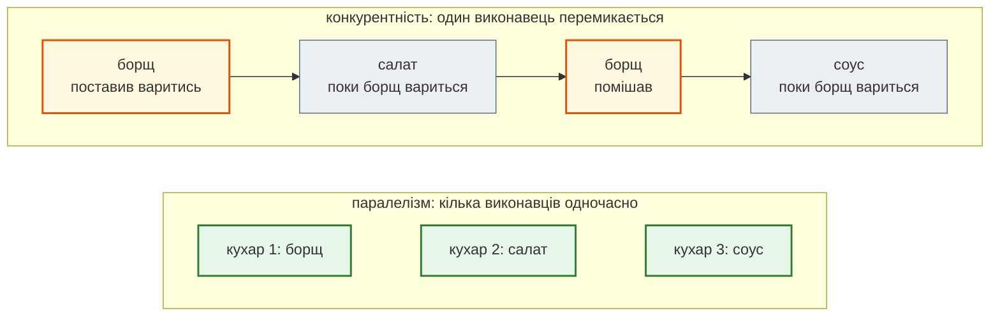
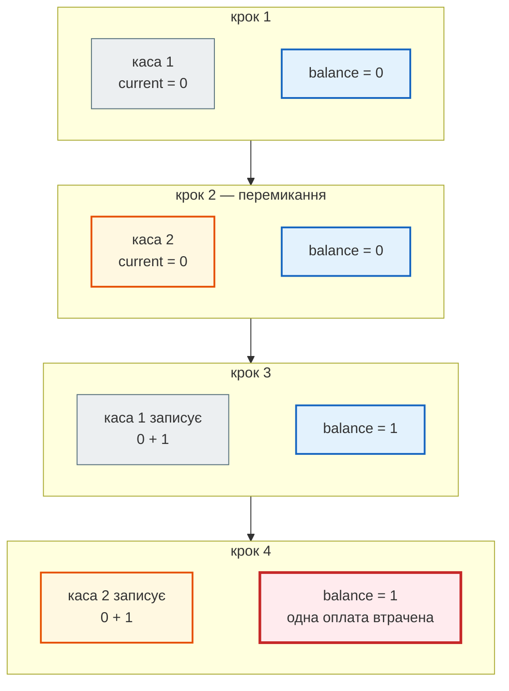
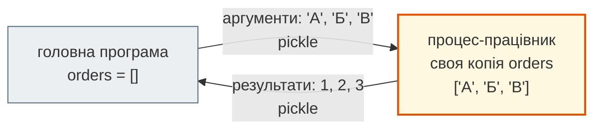
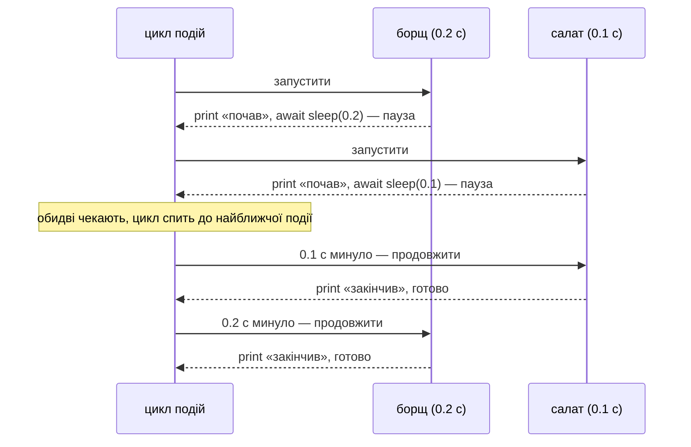
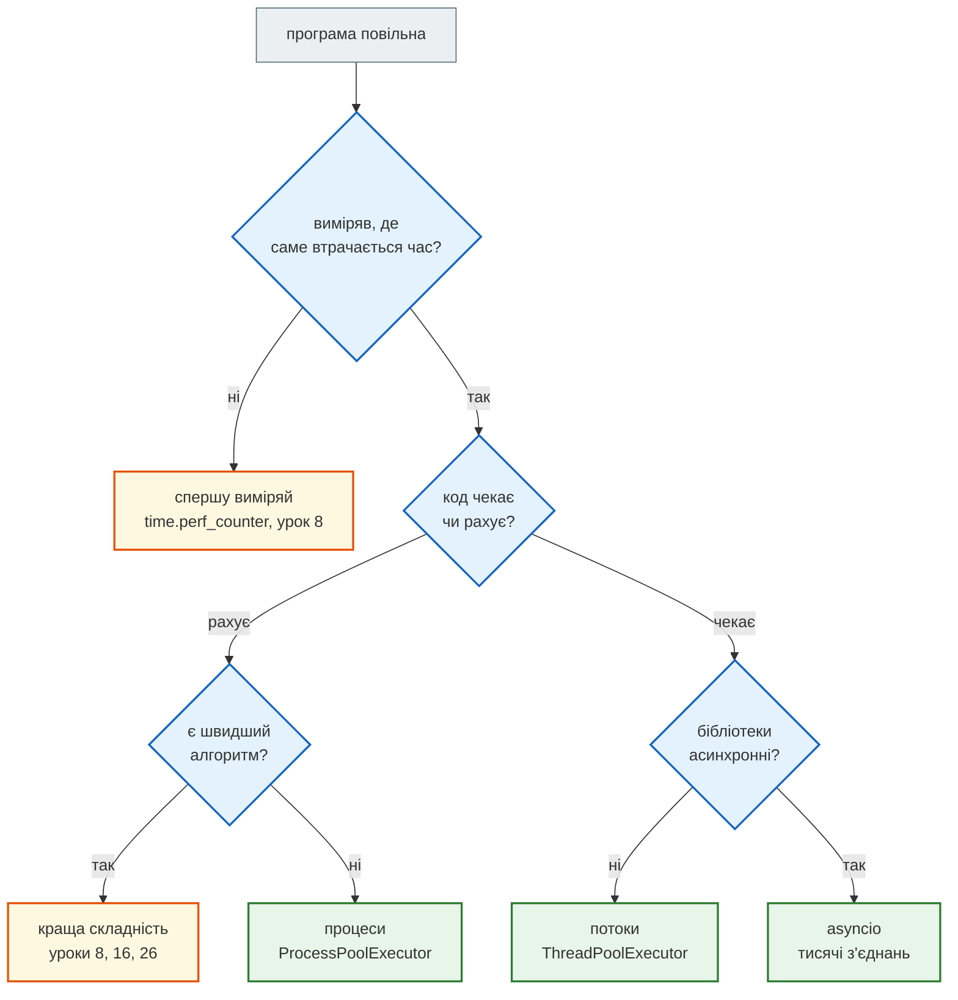

# Урок 27. Потоки, multiprocessing, asyncio: вступ

Щоранку о 9:00 диспетчерська «Смачно + Таксі» робить дві речі:

1. **Опитує п'ять ресторанів-партнерів**, чи вони відкриті. Кожна відповідь іде мережею близько пів секунди. Програма опитує їх по черзі й чекає 2,5 секунди, хоча **весь цей час нічого не робить**: лише чекає.
2. **Рахує важку статистику по чотирьох районах міста.** Тут, навпаки, процесор зайнятий на 100 %, а решта ядер ноутбука простоює.

Досі всі наші програми виконували одну справу за раз. Сьогодні — три способи робити кілька справ одночасно: **потоки** (`threading`), **процеси** (`multiprocessing`) і **асинхронність** (`asyncio`). Головне вміння уроку — не синтаксис, а **вибір**: який інструмент допоможе саме цій задачі, а який лише ускладнить код.

**Що потрібно з попередніх уроків:** функції як об'єкти й `map` (уроки 7, 18), `with` (урок 14), `if __name__ == "__main__":` (уроки 4, 12), Big O і вимірювання (урок 8), генератори на паузі й `.send()` (уроки 10, 24).

**Після уроку ти зможеш:**

- відрізнити задачу, що **чекає** (IO-bound), від задачі, що **рахує** (CPU-bound);
- пояснити різницю між конкурентністю й паралелізмом;
- запускати функції в потоках через `ThreadPoolExecutor` і розпізнавати стан гонитви (race condition), виправляти його `Lock`;
- пояснити на базовому рівні, що таке GIL і чому потоки не прискорюють обчислення;
- запускати обчислення в процесах через `ProcessPoolExecutor` і розуміти, що процеси не мають спільної пам'яті;
- написати просту програму з `async def`, `await` і `asyncio.gather`;
- обрати між потоками, процесами й `asyncio` для конкретної задачі.

**Задача розділу.** Ранковий звіт диспетчерської: опитування ресторанів і статистика районів, які сьогодні виконуються за секунди замість хвилини. Повний код — у розділі [«Практика»](#practice).

**Ноутбук заняття:** [`note_lesson_27_concurrency.ipynb`](https://github.com/NikoriakViktot/PY-Course-Victor-Nikoriak-22-09-2026/blob/main/module_2/lessons/lesson_27_concurrency_intro/note_lesson_27_concurrency.ipynb) [](https://colab.research.google.com/github/NikoriakViktot/PY-Course-Victor-Nikoriak-22-09-2026/blob/main/module_2/lessons/lesson_27_concurrency_intro/note_lesson_27_concurrency.ipynb)

## Пригадай

1. Що відбувається з генератором між двома викликами `next()`?
2. Навіщо рядок `if __name__ == "__main__":`?
3. Як виміряти, скільки часу працює шматок коду?

??? success "Відповіді"

    1. Він стоїть на паузі на `yield` і пам'ятає всі свої змінні. Поки він на паузі, решта програми працює (урок 10). На цій ідеї тримається `asyncio`.
    2. Щоб код під ним виконувався лише тоді, коли файл запустили напряму, а не імпортували (уроки 4, 12). Сьогодні без нього процеси не запустяться.
    3. Засікти `time.perf_counter()` до і після та відняти (урок 8).

## Чекати чи рахувати

Подивимось, **на що** програма витрачає час.

```python
import time

RESTAURANTS = ["Борщ і Ко", "Піца Поділ", "Суші Оболонь", "Вареники 24/7", "Шаурма Центр"]


def check_restaurant(name):
    time.sleep(0.5)            # чекаємо відповідь мережі
    return f"{name}: відкрито"


start = time.perf_counter()
results = [check_restaurant(name) for name in RESTAURANTS]
print(f"Послідовно: {time.perf_counter() - start:.1f} с")
```

```text
Послідовно: 2.5 с
```

`time.sleep(0.5)` імітує мережевий запит: програма нічого не рахує, лише **чекає**, поки прийде відповідь. Справжні запити (урок 31) поводяться так само. П'ять запитів по черзі — п'ять очікувань поспіль.

Друга задача — інша. Порахуємо, скільки простих чисел менших за 150 000, — важка робота для процесора:

```python
def count_primes(limit):
    """Кількість простих чисел, менших за limit. Навмисно повільно: перебір дільників."""
    count = 0
    for n in range(2, limit):
        for d in range(2, int(n ** 0.5) + 1):
            if n % d == 0:
                break
        else:
            count += 1
    return count


print(count_primes(150_000))
```

```text
13848
```

Тут процесор не чекає ні секунди: він увесь час ділить числа.

| | Задача, що **чекає** (IO-bound) | Задача, що **рахує** (CPU-bound) |
|---|---|---|
| Приклади | мережеві запити, читання файлів, база даних | обчислення, стиснення, обробка зображень |
| Що робить процесор | здебільшого простоює | зайнятий на 100 % |
| Що прискорить | не чекати по черзі: чекати **одночасно** | рахувати **на кількох ядрах** |

### Конкурентність і паралелізм

Кухня кафе допоможе розрізнити два слова, які часто плутають.

- **Конкурентність** (concurrency) — один кухар і три каструлі. Поки вариться борщ, він ріже салат, а потім помішує соус. У кожен момент він робить **одну** дію, але **жодна справа не стоїть**, поки інша чекає.
- **Паралелізм** (parallelism) — три кухарі. Кожен робить свою справу **справді одночасно**.



Задачам, що **чекають**, досить конкурентності: поки один запит чекає мережу, можна відправити інший. Задачам, що **рахують**, потрібен паралелізм: кілька ядер процесора.

## Потоки: чекати одночасно

**Потік** (thread) — окрема лінія виконання всередині однієї програми. Усі потоки програми бачать ті самі змінні. Найзручніше запускати функції в потоках через **пул потоків** — `ThreadPoolExecutor` з модуля `concurrent.futures`:

```python
from concurrent.futures import ThreadPoolExecutor

start = time.perf_counter()
with ThreadPoolExecutor() as pool:
    results = list(pool.map(check_restaurant, RESTAURANTS))
print(f"Потоки: {time.perf_counter() - start:.1f} с")
print(results[0])
```

```text
Потоки: 0.5 с
Борщ і Ко: відкрито
```

`pool.map(функція, дані)` — те саме, що вбудований `map` з уроку 18, але кожен виклик іде в окремий потік. Результати повертаються **в порядку вхідних даних**, хоч би в якому порядку потоки закінчили. `with` чекає, поки всі потоки завершаться, і прибирає пул.

П'ять очікувань тепер ідуть одночасно: 0,5 секунди замість 2,5.

```mermaid
gantt
    title Опитування п'яти ресторанів
    dateFormat x
    axisFormat %S.%L с
    section Послідовно
    Борщ і Ко      : 0, 500
    Піца Поділ     : 500, 1000
    Суші Оболонь   : 1000, 1500
    Вареники 24/7  : 1500, 2000
    Шаурма Центр   : 2000, 2500
    section Потоки
    Борщ і Ко      : 0, 500
    Піца Поділ     : 0, 500
    Суші Оболонь   : 0, 500
    Вареники 24/7  : 0, 500
    Шаурма Центр   : 0, 500
```



??? note "Нижчий рівень: `threading.Thread`"
    Пул будується на класі `threading.Thread`. Його можна використати напряму:

    ```python
    import threading

    thread = threading.Thread(target=check_restaurant, args=("Борщ і Ко",))
    thread.start()   # запустити в окремому потоці
    thread.join()    # дочекатися завершення
    ```

    Але результат функції так не отримати, а про `join()` легко забути. Для «запустити функцію на багатьох даних» бери пул.

### Стан гонитви

Потоки бачать спільні змінні — і це небезпечно. Чотири каси одночасно зараховують оплати на рахунок сервісу, кожна — по 1000 оплат по 1 грн:

```python
import threading

balance = 0


def pay(times):
    global balance
    for _ in range(times):
        current = balance        # 1. прочитати
        time.sleep(0)            # каса на мить відволіклася
        balance = current + 1    # 2. записати


threads = [threading.Thread(target=pay, args=(1000,)) for _ in range(4)]
for thread in threads:
    thread.start()
for thread in threads:
    thread.join()
print("Очікували 4000, на рахунку:", balance)
```

Приклад виводу (у тебе число буде іншим):

```text
Очікували 4000, на рахунку: 1000
```

Три чверті грошей зникли. Ми запускали цей код 30 разів на Python 3.10 і 3.13 — результат щоразу був між 1000 і 1336, жодного разу не 4000.

Причина — **стан гонитви** (race condition): «прочитати й записати» — це два кроки, і між ними інший потік встигає зробити свої. `time.sleep(0)` лише віддає чергу іншому потоку, щоб проблема проявилася наочно. Без нього вона трапляється рідше — і тому ще небезпечніша: код місяцями працює, а потім губить гроші.

Покроково, дві каси й рахунок, на якому 0:



Каса 2 прочитала старе значення 0 **до того**, як каса 1 записала 1. Обидві записали `0 + 1`.

### Lock: по одному

Виправлення — **замок** (`threading.Lock`): лише один потік може бути всередині блоку `with lock:`, інші чекають біля входу.

```python
balance = 0
lock = threading.Lock()


def pay_safe(times):
    global balance
    for _ in range(times):
        with lock:                   # «читати й записати» — неподільно
            current = balance
            time.sleep(0)
            balance = current + 1


threads = [threading.Thread(target=pay_safe, args=(1000,)) for _ in range(4)]
for thread in threads:
    thread.start()
for thread in threads:
    thread.join()
print("Очікували 4000, на рахунку:", balance)
```

```text
Очікували 4000, на рахунку: 4000
```

Тепер каса 2 не може прочитати `balance`, поки каса 1 не закінчила запис. Ціна — черга біля замка: частина роботи знову йде по одному. Тому найкраще — **взагалі не ділити змінні між потоками**: нехай кожен потік **повертає** результат, а збирає їх головна програма. Саме так працює `pool.map` — там жодного `Lock` не потрібно.

## GIL: чому потоки не рахують швидше

Спробуємо потоки на задачі, що рахує: чотири райони, для кожного — `count_primes(150_000)`.

```python
def timed(label, work):
    start = time.perf_counter()
    result = work()
    print(f"{label}: {time.perf_counter() - start:.1f} с")
    return result


DISTRICTS = [150_000] * 4

timed("Послідовно", lambda: [count_primes(n) for n in DISTRICTS])
with ThreadPoolExecutor(max_workers=4) as pool:
    timed("Потоки", lambda: list(pool.map(count_primes, DISTRICTS)))
```

На нашій 4-ядерній машині (у тебе числа будуть іншими, співвідношення — схожим):

```text
Послідовно: 0.7 с
Потоки: 0.8 с
```

Чотири потоки — не швидше, а часто й трохи повільніше. Причина — **GIL** (Global Interpreter Lock): у стандартному Python байт-код у кожен момент виконує **лише один потік** програми. Потоки чергуються, а не рахують одночасно. Для задач, що чекають, це не заважає: під час `time.sleep` чи мережевого запиту потік відпускає GIL, і працюють інші. Для задач, що рахують, чергування лише додає витрати на перемикання.

!!! note "Python без GIL"
    Починаючи з Python 3.13 існує окрема експериментальна збірка інтерпретатора без GIL ([PEP 703](https://peps.python.org/pep-0703/)), де потоки можуть рахувати паралельно. Звичайний Python, який встановлюють за замовчуванням, поки що з GIL, тому правила цього уроку для нього чинні.

## Процеси: рахувати на кількох ядрах

**Процес** — окрема копія програми зі своїм інтерпретатором Python, своєю пам'яттю і своїм GIL. Операційна система розкладає процеси по різних ядрах. Інтерфейс — той самий пул, лише `ProcessPoolExecutor`:

```python
from concurrent.futures import ProcessPoolExecutor

if __name__ == "__main__":
    with ProcessPoolExecutor(max_workers=4) as pool:
        timed("Процеси", lambda: list(pool.map(count_primes, DISTRICTS)))
```

```text
Процеси: 0.2 с
```

Утричі-вчетверо швидше: кожен район рахує окреме ядро.

!!! warning "`if __name__ == '__main__':` обов'язковий"
    На Windows і macOS кожен процес-працівник **заново імпортує** твій файл, щоб знайти `count_primes`. Без перевірки `__name__` кожен працівник знову створив би пул, а той — нових працівників. Python зупиняє це з помилкою `RuntimeError`. Тому код, що створює процеси, завжди стоїть під `if __name__ == "__main__":` — ось навіщо цей рядок з уроку 4.

    З тієї ж причини функції для процесів мають бути визначені у **файлі**, а не лише в клітинці ноутбука. У ноутбуці заняття ми записуємо їх у `district_stats.py` і імпортуємо.

### Процеси не діляться пам'яттю

Процеси — не потоки: кожен має **власну копію** даних.

```python
orders = []


def add_order(name):
    orders.append(name)      # додає у СВОЮ копію списку
    return len(orders)


if __name__ == "__main__":
    with ProcessPoolExecutor(max_workers=1) as pool:
        print(list(pool.map(add_order, ["А", "Б", "В"])))
    print("orders у головній програмі:", orders)
```

```text
[1, 2, 3]
orders у головній програмі: []
```

Процес-працівник тричі дописав у свій список, а список головної програми лишився порожнім. Змінна, яку «бачать усі», між процесами не працює — дані передаються лише **аргументами й результатами**. Python пакує їх (серіалізує через `pickle`) і пересилає між процесами, а це теж коштує часу.



### Процеси не безкоштовні

Запустити процес — дорожче, ніж потік: новий інтерпретатор, копіювання даних. На дрібних задачах ця ціна з'їдає весь виграш. На нашій машині піднести до квадрата 1000 чисел послідовно — `0.00 с`, а через пул з чотирьох процесів — `0.2 с`. Процеси окупаються, коли кожна задача рахує помітний час, а даних між процесами ходить мало.

## asyncio: один потік, багато очікувань

Потоки для задач, що чекають, працюють добре. Але кожен потік — це пам'ять і робота операційної системи з перемикання. Серверу, який тримає тисячі одночасних з'єднань, потрібен легший інструмент — **асинхронність**.

Ідея знайома з уроку 10: функція, що **стає на паузу** й віддає керування. В `asyncio` такі функції оголошують через `async def`, а паузу ставлять через `await`:

```python
import asyncio


async def check_restaurant_async(name):
    await asyncio.sleep(0.5)          # чекаємо, але не блокуємо інших
    return f"{name}: відкрито"


coro = check_restaurant_async("Борщ і Ко")
print(type(coro).__name__)
coro.close()                          # ми лише подивились; прибираємо
```

```text
coroutine
```

Виклик `async def`-функції **не виконує** її тіло — як виклик генераторної функції з уроку 10. Він повертає **корутину**: об'єкт, який запустить **цикл подій** (event loop). Цикл подій — диспетчер: запускає корутину до першого `await`, і поки вона чекає, запускає наступну.

```python
async def morning_check():
    start = time.perf_counter()
    results = await asyncio.gather(*(check_restaurant_async(n) for n in RESTAURANTS))
    print(f"asyncio: {time.perf_counter() - start:.1f} с")
    print(results[-1])


asyncio.run(morning_check())
```

```text
asyncio: 0.5 с
Шаурма Центр: відкрито
```

- `asyncio.run(...)` — створює цикл подій, виконує корутину до кінця й закриває цикл. Викликають **один раз**, на вході в програму.
- `asyncio.gather(...)` — запускає кілька корутин разом і чекає всі; результати — в порядку аргументів.
- `await` можна писати лише всередині `async def`.

!!! note "У Jupyter і Colab"
    Ноутбук уже має запущений цикл подій, тому `asyncio.run()` там дає `RuntimeError: asyncio.run() cannot be called from a running event loop`. У клітинці пиши просто `await morning_check()`.

### Як цикл подій перемикає корутини

```python
async def cook(name, seconds):
    print(f"{name}: почав")
    await asyncio.sleep(seconds)
    print(f"{name}: закінчив")


async def kitchen():
    await asyncio.gather(cook("борщ", 0.2), cook("салат", 0.1))


asyncio.run(kitchen())
```

```text
борщ: почав
салат: почав
салат: закінчив
борщ: закінчив
```



Корутини перемикаються **лише на `await`** — у місцях, які ти сам позначив. Між двома `await` жодна інша корутина не втрутиться, тому стан гонитви, як з касами, тут значно рідший. Ціна — дисципліна: кожне очікування має бути `await`.

### Пастка: блокуючий виклик

```python
async def check_blocking(name):
    time.sleep(0.5)                   # звичайний sleep — не await!
    return name


async def morning_check_blocking():
    start = time.perf_counter()
    await asyncio.gather(*(check_blocking(n) for n in RESTAURANTS))
    print(f"з time.sleep: {time.perf_counter() - start:.1f} с")


asyncio.run(morning_check_blocking())
```

```text
з time.sleep: 2.5 с
```

`time.sleep` не віддає керування циклу подій: він **блокує** весь потік, і корутини виконуються по черзі. Те саме зробить будь-яка звичайна мережева бібліотека, наприклад `requests`. Тому в асинхронному коді потрібні асинхронні бібліотеки: `asyncio.sleep`, `httpx`, `aiohttp` (урок 31).

!!! tip "Звідки `await`"
    Корутини виросли з генераторів: у ранніх версіях `asyncio` паузу ставили через `yield from` (урок 24). `async def` і `await` — окремий, зрозуміліший синтаксис для тієї самої ідеї: функція на паузі, яку продовжують ззовні.

## Архітектура: що обрати { #architecture }



| | Потоки | Процеси | `asyncio` |
|---|---|---|---|
| Для задач, що | чекають | рахують | чекають (багато одночасно) |
| Паралельне обчислення | ні (GIL) | так, по ядру на процес | ні, один потік |
| Спільна пам'ять | так → ризик гонитви, `Lock` | ні → лише аргументи й результати | так, але перемикання лише на `await` |
| Ціна одного виконавця | помірна | висока: окремий інтерпретатор | мала: об'єкт-корутина |
| Що потрібно від коду | нічого особливого | функції у файлі, `__main__` | `async def`, асинхронні бібліотеки |

Три архітектурні правила, які роблять паралельний код простим:

1. **Спершу — алгоритм.** Словник замість перебору (урок 16) чи ДП замість рекурсії (урок 26) дає виграш у тисячі разів; чотири ядра — щонайбільше вчетверо.
2. **Функції без спільного стану.** Функція, що отримує дані аргументами й **повертає** результат (чиста функція, урок 7), переноситься в потік, процес чи корутину без змін. Функція, що змінює глобальну змінну, вимагає замків — або не працює в процесах зовсім.
3. **Пул замість ручного керування.** `ThreadPoolExecutor` і `ProcessPoolExecutor` мають той самий інтерфейс `map`/`submit`: змінити один рядок — і перейти від потоків до процесів.

## Практика { #practice }

### Розібраний приклад: ранковий звіт

Файл `morning_report.py` поєднує обидва інструменти: потоки — для опитування ресторанів, процеси — для статистики районів.

```python
# morning_report.py
import time
from concurrent.futures import ProcessPoolExecutor, ThreadPoolExecutor

RESTAURANTS = ["Борщ і Ко", "Піца Поділ", "Суші Оболонь", "Вареники 24/7", "Шаурма Центр"]
DISTRICTS = {"Поділ": 150_000, "Оболонь": 150_000, "Центр": 150_000, "Лівобережна": 150_000}


def check_restaurant(name):
    time.sleep(0.5)
    return f"{name}: відкрито"


def count_primes(limit):
    count = 0
    for n in range(2, limit):
        for d in range(2, int(n ** 0.5) + 1):
            if n % d == 0:
                break
        else:
            count += 1
    return count


def main():
    start = time.perf_counter()

    with ThreadPoolExecutor() as pool:                       # чекає → потоки
        statuses = list(pool.map(check_restaurant, RESTAURANTS))

    with ProcessPoolExecutor() as pool:                      # рахує → процеси
        stats = dict(zip(DISTRICTS, pool.map(count_primes, DISTRICTS.values())))

    for line in statuses:
        print(line)
    for district, value in stats.items():
        print(f"{district}: {value}")
    print(f"Звіт готовий за {time.perf_counter() - start:.1f} с")


if __name__ == "__main__":
    main()
```

```text
$ python morning_report.py
Борщ і Ко: відкрито
Піца Поділ: відкрито
Суші Оболонь: відкрито
Вареники 24/7: відкрито
Шаурма Центр: відкрито
Поділ: 13848
Оболонь: 13848
Центр: 13848
Лівобережна: 13848
Звіт готовий за 0.7 с
```

Послідовно той самий звіт займає 2,5 с на ресторани й ще 0,7 с на райони — 3,2 с. Тут — 0,7 с (на твоїй машині число буде іншим).

Що важливо в цьому коді:

- `check_restaurant` і `count_primes` — **чисті функції**: отримують аргумент і повертають результат, не чіпаючи спільних змінних. Тому їм не потрібен `Lock`.
- `dict(zip(...))` склеює назви районів з результатами: `pool.map` повертає результати в порядку вхідних даних.
- Пули створюються всередині `main()`, а `main()` викликається під `if __name__ == "__main__":`.

### Зміни приклад: показувати відповіді, щойно вони приходять

Один ресторан відповідає 2 секунди, решта — пів секунди. `pool.map` віддає результати в порядку списку, тож повільний ресторан на початку затримає друк усіх. Перепиши опитування через `pool.submit` і `concurrent.futures.as_completed`, щоб рядки друкувалися **в порядку готовності**.

**Критерії перевірки:**

- `check_restaurant` отримує затримку другим аргументом: `{"Борщ і Ко": 2.0, "Піца Поділ": 0.5, ...}`;
- «Борщ і Ко» друкується **останнім**, хоча стоїть у списку першим;
- загальний час — близько 2 с, а не 4.

??? tip "Підказка"
    `pool.submit(функція, аргументи...)` одразу повертає **Future** — «квитанцію» на майбутній результат. `as_completed(список_futures)` віддає їх по одному в тому порядку, в якому вони завершуються; результат — `future.result()`.

### Спробуй самостійно: опитування через asyncio з тайм-аутом

Напиши асинхронну версію опитування, у якій ресторан, що не відповів за 1 секунду, отримує статус `"<назва>: не відповідає"`.

**Критерії перевірки:**

- `check_restaurant_async(name, delay)` чекає `await asyncio.sleep(delay)`;
- тайм-аут — через `asyncio.wait_for(корутина, timeout=1.0)`, який кидає `asyncio.TimeoutError`;
- для затримок `{"Борщ і Ко": 3.0, решта: 0.5}` програма друкує 4 «відкрито» й 1 «не відповідає» і працює близько 1 с.

??? tip "Підказка"
    Загорни `wait_for` у маленьку корутину `safe_check(name, delay)` з `try` / `except asyncio.TimeoutError` (урок 13) і передавай у `gather` саме її. Пиши `asyncio.TimeoutError`, а не `TimeoutError`: на Python 3.10 це різні класи, з 3.11 — один і той самий.

### Знайди помилку

Колега переписав опитування на `asyncio`, але звіт і далі готується 2,5 секунди:

```python
async def check(name):
    time.sleep(0.5)
    return f"{name}: відкрито"


async def report():
    return await asyncio.gather(*(check(n) for n in RESTAURANTS))
```

??? success "Відповідь"
    `time.sleep` блокує весь потік разом з циклом подій, тому корутини виконуються по черзі. Потрібно `await asyncio.sleep(0.5)` — або, для справжнього запиту, асинхронна бібліотека замість `requests`. `async def` сам по собі нічого не пришвидшує: пришвидшують лише `await` на справжніх очікуваннях.

## Підсумок

| Поняття | Що запам'ятати |
|---|---|
| IO-bound / CPU-bound | чекає (мережа, диск) / рахує (процесор) — від цього залежить вибір |
| Конкурентність / паралелізм | один виконавець перемикається / кілька працюють одночасно |
| `ThreadPoolExecutor` | потоки для задач, що чекають; `pool.map` у порядку даних |
| Стан гонитви | «прочитати-записати» перервали між кроками; `Lock` або без спільних змінних |
| GIL | у звичайному Python байт-код виконує один потік за раз; потоки не рахують швидше |
| `ProcessPoolExecutor` | процеси рахують на різних ядрах; окрема пам'ять; `__main__` обов'язковий |
| `async def` / `await` | корутина стає на паузу на `await`; цикл подій запускає інші |
| `asyncio.run` / `gather` | запуск циклу подій / кілька корутин разом |
| Блокуючий виклик | `time.sleep`, `requests` в `async def` зупиняють усі корутини |

### Самоперевірка

1. Опитування API погоди для 50 міст і стиснення 50 фото — яка задача IO-bound, а яка CPU-bound? Чим прискорити кожну?
2. Чому чотири потоки не прискорили `count_primes`, а чотири процеси — прискорили?
3. Що таке стан гонитви? Як його уникнути, не використовуючи `Lock`?
4. Чому список `orders` у головній програмі лишився порожнім після роботи процесу?
5. Що поверне виклик `async def`-функції без `await`?
6. Чому `time.sleep` в `async def` зводить нанівець увесь `asyncio`?

??? success "Відповіді"

    1. Погода — IO-bound: потоки або `asyncio`. Стиснення фото — CPU-bound: процеси.
    2. Через GIL: потоки по черзі виконують байт-код одного інтерпретатора. У кожного процесу свій інтерпретатор і свій GIL, тож вони рахують на різних ядрах одночасно.
    3. Два потоки перемежовують кроки «прочитати» й «записати» спільну змінну, і частина змін губиться. Уникнути — не ділити змінні: кожен потік повертає результат, головна програма їх збирає (`pool.map`).
    4. Кожен процес має власну копію пам'яті; процес-працівник змінював свою копію. Дані між процесами ходять лише аргументами й результатами.
    5. Об'єкт-корутину; тіло функції ще не виконувалось. Запускає її `await` або цикл подій (`asyncio.run`, `gather`).
    6. `time.sleep` не віддає керування циклу подій і блокує весь потік — інші корутини стоять, поки він спить.

### Що далі

- Ноутбук заняття: [`note_lesson_27_concurrency.ipynb`](https://github.com/NikoriakViktot/PY-Course-Victor-Nikoriak-22-09-2026/blob/main/module_2/lessons/lesson_27_concurrency_intro/note_lesson_27_concurrency.ipynb) [](https://colab.research.google.com/github/NikoriakViktot/PY-Course-Victor-Nikoriak-22-09-2026/blob/main/module_2/lessons/lesson_27_concurrency_intro/note_lesson_27_concurrency.ipynb) — вимірювання, стан гонитви і `Lock`, процеси з файлу-модуля, корутини в Jupyter, вправи з перевірками.
- Наступне заняття — урок 28, практикум П6: стек, черга, купа, префіксне дерево й LRU-кеш.
- Далі в курсі: асинхронні HTTP-запити з `httpx` і `aiohttp` (урок 31), асинхронний FastAPI (уроки 37–38), WebSockets (урок 45).

## Документація і джерела

- Python: [`concurrent.futures`](https://docs.python.org/3/library/concurrent.futures.html), [`threading`](https://docs.python.org/3/library/threading.html) (зокрема [Lock Objects](https://docs.python.org/3/library/threading.html#lock-objects)), [`multiprocessing`](https://docs.python.org/3/library/multiprocessing.html) і [Programming guidelines](https://docs.python.org/3/library/multiprocessing.html#multiprocessing-programming) (розділ «Safe importing of main module»)
- `asyncio`: [Coroutines and Tasks](https://docs.python.org/3/library/asyncio-task.html) — `asyncio.run`, `gather`, `wait_for`; [Developing with asyncio](https://docs.python.org/3/library/asyncio-dev.html) — про блокуючий код
- [Глосарій: global interpreter lock](https://docs.python.org/3/glossary.html#term-global-interpreter-lock); [PEP 703 — Making the Global Interpreter Lock Optional](https://peps.python.org/pep-0703/); [PEP 492 — Coroutines with async and await syntax](https://peps.python.org/pep-0492/)
