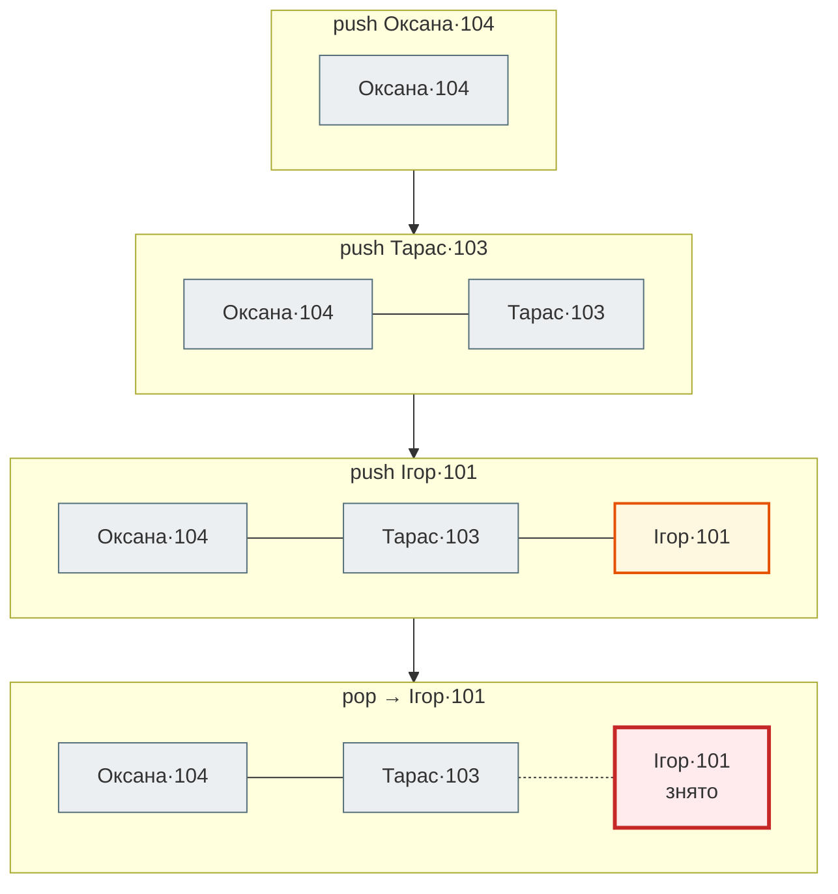
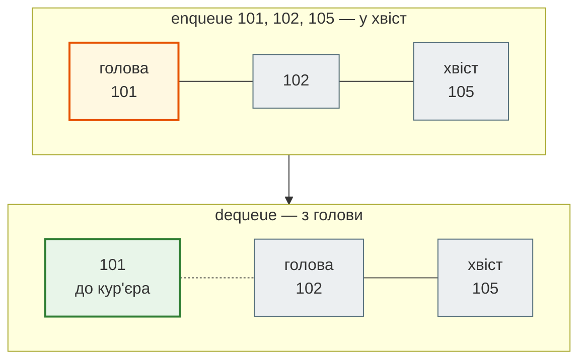
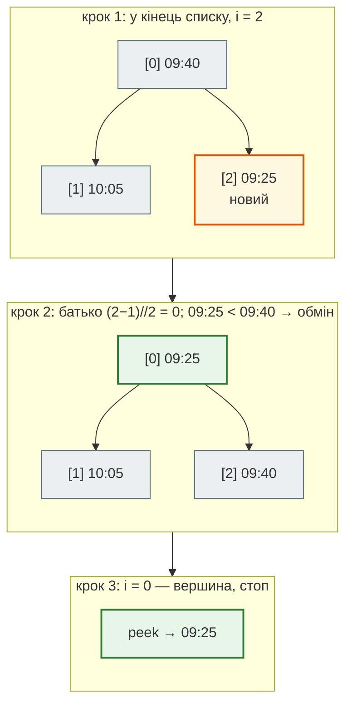
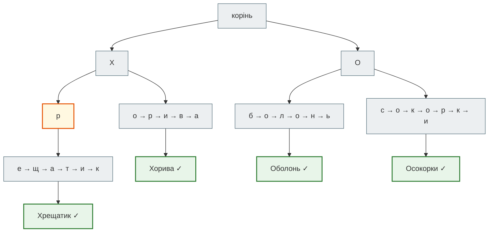
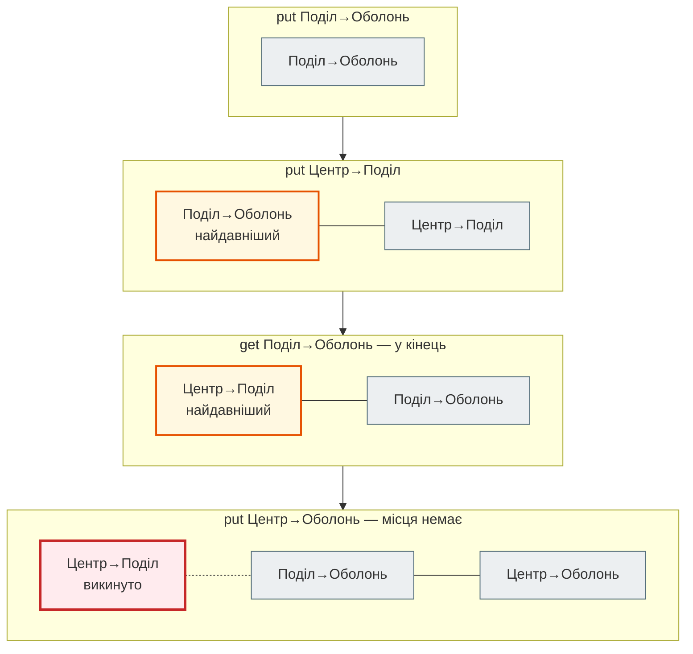
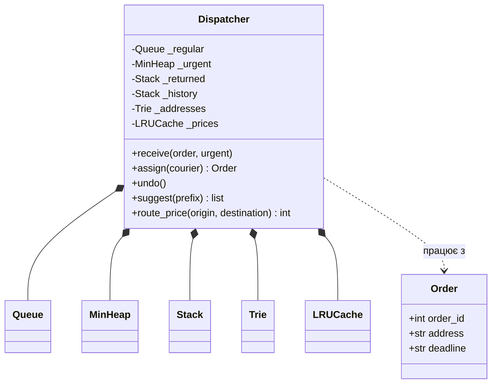

# Урок 28. Практикум П6. Stack, Queue, Heap, Trie + LRU Cache → ООП-пакет

П'ять практикумів навчили диспетчерську **оцінювати** рішення (П1), **обирати** стратегію (П2), **змінювати представлення** даних (П3), **розбивати** задачу на менші (П4) і **не рахувати двічі** (П5). Останній практикум модуля — **структури даних**: як організувати дані так, щоб потрібна операція коштувала `O(1)` чи `O(log n)`, а не `O(n)`.

Результат уроку — **пакет `dispatch`**, артефакт модуля 2. У ньому зібрано все, що ми вивчили з уроку 18: класи й композиція, інкапсуляція, dunder-методи, ітератори, `@dataclass`, тести pytest.

Диспетчерська щохвилини ставить п'ять питань — і на кожне відповідає своя структура:

| Питання диспетчерської | Структура | Головна операція | Складність |
|---|---|---|---|
| Скасувати останнє призначення | **стек** (`Stack`) | взяти останній доданий | `O(1)` |
| Хто з кур'єрів замовлення прийшов першим | **черга** (`Queue`) | взяти найстаріший | `O(1)` |
| Яке термінове замовлення найтерміновіше | **купа** (`MinHeap`) | взяти мінімальний | `O(log n)` |
| Які адреси починаються на «Хр» | **префіксне дерево** (`Trie`) | знайти за префіксом | `O(довжина префікса)` + відповідь |
| Скільки коштує маршрут, який уже рахували | **LRU-кеш** (`LRUCache`) | взяти збережене | `O(1)` |

**Що потрібно з попередніх уроків:** класи й композиція (уроки 19–21), рекурсія (урок 22), dunder-методи й `@dataclass` (урок 23), ітератори (урок 24), pytest і fixtures (урок 25), Big O і дослід подвоєння (урок 8), словник і хешування (урок 16).

**Після уроку ти зможеш:**

- пояснити принцип роботи стеку, черги, купи, префіксного дерева й LRU-кешу і обрати структуру під операцію;
- реалізувати кожну з них класом з dunder-методами (`__len__`, `__bool__`, `__iter__`, `__contains__`, `__repr__`);
- знайти відповідник у стандартній бібліотеці: `list`, `collections.deque`, `heapq`, `collections.OrderedDict`, `functools.lru_cache`;
- зібрати структури в сервіс через композицію й оформити все як пакет з тестами.

**Задача розділу.** Пакет `dispatch`: п'ять структур у підпакеті `structures` і сервіс `Dispatcher`, що ними користується. Запуск і тести — у розділі [«Практика»](#practice).

**Ноутбук заняття:** [`note_lesson_28_structures.ipynb`](https://github.com/NikoriakViktot/PY-Course-Victor-Nikoriak-22-09-2026/blob/main/module_2/lessons/lesson_28_practicum_data_structures/note_lesson_28_structures.ipynb) [](https://colab.research.google.com/github/NikoriakViktot/PY-Course-Victor-Nikoriak-22-09-2026/blob/main/module_2/lessons/lesson_28_practicum_data_structures/note_lesson_28_structures.ipynb) · **Проєкт:** [`dispatch_project/`](https://github.com/NikoriakViktot/PY-Course-Victor-Nikoriak-22-09-2026/tree/main/module_2/lessons/lesson_28_practicum_data_structures/dispatch_project)

## Пригадай

1. Яка складність у `list.append(x)` і `list.pop()`? А в `list.pop(0)`?
2. Що робить `__len__` і що — `__bool__`? Що використає `if obj:`, якщо `__bool__` немає?
3. Що зберігає `@lru_cache` з уроку 9 і коли він «забуває» результати?

??? success "Відповіді"

    1. `append` і `pop()` з кінця — `O(1)`. `pop(0)` зсуває всі наступні елементи на одну позицію — `O(n)`.
    2. `__len__` відповідає на `len(obj)`, `__bool__` — на `bool(obj)` та `if obj:`. Без `__bool__` Python використає `__len__`: нульова довжина — `False` (урок 23).
    3. Результати функції для вже бачених аргументів. З `maxsize=N` зберігає лише `N` останніх використаних, а найдавніші викидає — сьогодні ми побудуємо такий кеш самі.

Усі структури сьогодні кидають одну помилку, коли з порожньої структури пробують щось узяти:

```python
from collections import OrderedDict, deque


class EmptyError(LookupError):
    """Спроба взяти елемент з порожньої структури."""
```

`LookupError` — батько `IndexError` і `KeyError` (урок 13): хто вже ловить «не знайшов», зловить і нашу помилку.

## Стек: скасувати останнє

Диспетчер призначає замовлення кур'єрам і іноді помиляється. Кнопка «Скасувати» має відкотити **останню** дію, потім передостанню — як Ctrl+Z у редакторі. Це **стек** (LIFO, last in — first out): стос тарілок, де беруть верхню.

```python
class Stack:
    """Стек (LIFO): останнім поклали — першим узяли. Усі операції O(1)."""

    def __init__(self, items=()):
        self._items = list(items)       # вершина стеку — кінець списку

    def push(self, item):
        self._items.append(item)

    def pop(self):
        if not self._items:
            raise EmptyError("стек порожній")
        return self._items.pop()

    def peek(self):
        if not self._items:
            raise EmptyError("стек порожній")
        return self._items[-1]

    def __len__(self):
        return len(self._items)

    def __bool__(self):
        return bool(self._items)

    def __iter__(self):
        """Від вершини до дна — у тому порядку, в якому їх діставатиме pop()."""
        return reversed(self._items)

    def __repr__(self):
        return f"Stack({self._items!r})"


history = Stack()
history.push(("Оксана", 104))
history.push(("Тарас", 103))
history.push(("Ігор", 101))
print(list(history))
print("скасовуємо:", history.pop())
print(history, len(history))
```

```text
[('Ігор', 101), ('Тарас', 103), ('Оксана', 104)]
скасовуємо: ('Ігор', 101)
Stack([('Оксана', 104), ('Тарас', 103)]) 2
```



Вершина — праворуч, кінець списку: і додавання, і зняття відбуваються там, де `list` робить це за `O(1)`. Зверни увагу на **інкапсуляцію** (урок 21): список прихований у `_items`, а назовні — лише операції стеку. Взяти елемент з середини через `Stack` не вийде — і не треба.

## Черга: хто перший прийшов

Звичайні замовлення обслуговують **по черзі**: хто раніше замовив, того раніше й везуть. Це **черга** (FIFO, first in — first out).

Чому не взяти `list` і не знімати з початку через `pop(0)`? Дослід подвоєння (урок 8) на нашій машині:

| Замовлень | `list.pop(0)` для всіх | `deque.popleft()` для всіх |
|---|---|---|
| 50 000 | 0.21 с | 0.002 с |
| 100 000 | 0.83 с | 0.004 с |
| 200 000 | 3.38 с | 0.010 с |

Удвічі більше даних — у `list` учетверо довше: кожен `pop(0)` зсуває всі наступні елементи, `O(n)` на операцію. У `collections.deque` («двобічна черга») обидва кінці — `O(1)`, тож час росте лише вдвічі.

```python
class Queue:
    """Черга (FIFO): першим прийшов — першим обслужений. Усередині deque."""

    def __init__(self, items=()):
        self._items = deque(items)

    def enqueue(self, item):
        self._items.append(item)

    def dequeue(self):
        if not self._items:
            raise EmptyError("черга порожня")
        return self._items.popleft()

    def peek(self):
        if not self._items:
            raise EmptyError("черга порожня")
        return self._items[0]

    def __len__(self):
        return len(self._items)

    def __bool__(self):
        return bool(self._items)

    def __iter__(self):
        """Від голови до хвоста — у порядку обслуговування."""
        return iter(self._items)

    def __repr__(self):
        return f"Queue({list(self._items)!r})"


orders = Queue()
for number in [101, 102, 105]:
    orders.enqueue(number)
print("першим везуть:", orders.dequeue())
print(orders)
```

```text
першим везуть: 101
Queue([102, 105])
```



Стек і черга мають однакові розміри й майже однаковий код — різниця лише в тому, **з якого кінця** беремо. Саме ця одна деталь визначає, чи обслужать клієнта, який чекає найдовше, чи того, хто прийшов останнім.

## Купа: найтерміновіше замовлення

Термінові замовлення везуть за **дедлайном**: першим — те, що має бути доставлене найраніше. Черга тут не підходить: замовлення з дедлайном 09:25 могло прийти пізніше за замовлення з дедлайном 09:40.

Можна щоразу сортувати список — але кожне нове замовлення тоді коштує `O(n log n)`. **Купа** (heap) відповідає на одне питання — «який мінімальний?» — і робить це дешево: додати й зняти — `O(log n)`, подивитися — `O(1)`.

### Дерево в списку

Купа — це бінарне дерево, записане у звичайний список **по рівнях**: вершина — `items[0]`, її діти — `items[1]` і `items[2]`, діти вузла `i` — на позиціях `2*i + 1` і `2*i + 2`, батько — `(i - 1) // 2`. Єдине правило: **батько не більший за своїх дітей**. Тоді мінімум завжди на вершині, а решта впорядкована лише частково — і це дешевше за повне сортування.

- **push**: поставити новий елемент у кінець списку й **піднімати** (sift up), доки батько більший за нього;
- **pop**: забрати вершину, на її місце поставити останній елемент і **опускати** (sift down) до меншої дитини, доки та менша.

Кожен крок — один рівень дерева, а рівнів `log₂ n`.

```python
class MinHeap:
    """Купа з мінімумом на вершині: push і pop — O(log n), peek — O(1).

    key — функція, за якою порівнюємо елементи (як key у sorted).
    """

    def __init__(self, items=(), key=None):
        self._key = key if key is not None else (lambda item: item)
        self._items = []
        for item in items:
            self.push(item)

    def push(self, item):
        self._items.append(item)
        self._sift_up(len(self._items) - 1)

    def pop(self):
        if not self._items:
            raise EmptyError("купа порожня")
        top = self._items[0]
        last = self._items.pop()
        if self._items:
            self._items[0] = last
            self._sift_down(0)
        return top

    def peek(self):
        if not self._items:
            raise EmptyError("купа порожня")
        return self._items[0]

    def _less(self, i, j):
        return self._key(self._items[i]) < self._key(self._items[j])

    def _sift_up(self, i):
        """Новий елемент піднімається, доки батько більший за нього."""
        while i > 0:
            parent = (i - 1) // 2
            if not self._less(i, parent):
                break
            self._items[i], self._items[parent] = self._items[parent], self._items[i]
            i = parent

    def _sift_down(self, i):
        """Елемент на вершині опускається до меншої дитини, доки вона менша за нього."""
        n = len(self._items)
        while True:
            smallest = i
            for child in (2 * i + 1, 2 * i + 2):
                if child < n and self._less(child, smallest):
                    smallest = child
            if smallest == i:
                break
            self._items[i], self._items[smallest] = self._items[smallest], self._items[i]
            i = smallest

    def __len__(self):
        return len(self._items)

    def __bool__(self):
        return bool(self._items)

    def __repr__(self):
        return f"MinHeap({self._items!r})"


urgent = MinHeap()
for deadline in ["09:40", "10:05", "09:25"]:
    urgent.push(deadline)
    print("push", deadline, "→", urgent)
print("найтерміновіше:", urgent.pop(), "→", urgent)
```

```text
push 09:40 → MinHeap(['09:40'])
push 10:05 → MinHeap(['09:40', '10:05'])
push 09:25 → MinHeap(['09:25', '10:05', '09:40'])
найтерміновіше: 09:25 → MinHeap(['09:40', '10:05'])
```

Час у форматі `"ГГ:ХХ"` можна порівнювати як рядки: `"09:25" < "09:40"` — так само, як час. Покроково — третій `push`:



У стандартній бібліотеці купа — модуль `heapq`: функції, що працюють зі звичайним списком. Щоб купа впорядковувала замовлення за дедлайном, кладуть кортежі `(дедлайн, замовлення)`:

```python
import heapq

queue = []
for deadline, order in [("09:40", "#103"), ("09:25", "#104"), ("10:05", "#105")]:
    heapq.heappush(queue, (deadline, order))
print(heapq.heappop(queue), queue)
```

```text
('09:25', '#104') [('09:40', '#103'), ('10:05', '#105')]
```

Наш `MinHeap` робить те саме, але з `key=` замість кортежів і з інтерфейсом класу. У тестах проєкту купа перевіряється **проти `heapq` і `sorted`** на 20 випадкових наборах (урок 25: повільне й очевидне — суддя для швидкого).

## Префіксне дерево: автодоповнення адрес

Оператор набирає «Хр» — застосунок має підказати «Хрещатик, 1» і «Хрещатик, 22». Список адрес і `startswith` перевіряє **кожну** адресу: `O(n · довжина)`. На десятках тисяч адрес і кожному натисканні клавіші це відчутно.

**Префіксне дерево** (trie) зберігає слова **по літерах**: слова зі спільним початком ділять одну гілку. Щоб знайти всі слова на «Хр», досить пройти дві літери від кореня — кількість адрес у базі на це не впливає.



Пошук «Хр»: корінь → `Х` → `р` (помаранчевий вузол). Усе, що нижче, — відповідь. Позначка ✓ означає «тут закінчується ціле слово»: «Хр» — лише префікс, а не адреса.

```python
class _Node:
    __slots__ = ("children", "is_word")

    def __init__(self):
        self.children = {}      # літера -> _Node
        self.is_word = False


class Trie:
    """Префіксне дерево: пошук слова і префікса — O(довжина), незалежно від кількості слів."""

    def __init__(self, words=()):
        self._root = _Node()
        self._size = 0
        for word in words:
            self.add(word)

    def add(self, word):
        node = self._root
        for letter in word:
            node = node.children.setdefault(letter, _Node())
        if not node.is_word:
            node.is_word = True
            self._size += 1

    def _find(self, prefix):
        node = self._root
        for letter in prefix:
            node = node.children.get(letter)
            if node is None:
                return None
        return node

    def __contains__(self, word):
        node = self._find(word)
        return node is not None and node.is_word

    def starts_with(self, prefix, limit=None):
        """Усі слова з цим префіксом в алфавітному порядку (не більше limit)."""
        node = self._find(prefix)
        if node is None:
            return []
        words = []
        self._collect(node, prefix, words, limit)
        return words

    def _collect(self, node, path, words, limit):
        """Обхід у глибину (рекурсія, урок 22); літери — за алфавітом."""
        if limit is not None and len(words) >= limit:
            return
        if node.is_word:
            words.append(path)
        for letter in sorted(node.children):
            self._collect(node.children[letter], path + letter, words, limit)

    def __len__(self):
        return self._size

    def __iter__(self):
        return iter(self.starts_with(""))

    def __repr__(self):
        return f"Trie({len(self)} слів)"


addresses = Trie(["Хрещатик, 1", "Хрещатик, 22", "Хорива, 5", "Оболонська, 12", "Хрещатик, 1"])
print(addresses, addresses.starts_with("Хр"))
print("Хорива, 5" in addresses, "Хорива" in addresses)
```

```text
Trie(4 слів) ['Хрещатик, 1', 'Хрещатик, 22']
True False
```

Дубль «Хрещатик, 1» не збільшив `len`: друге додавання лише пройшло існуючою гілкою. `__slots__` у вузлі (урок 23) економить пам'ять: вузлів у дереві стільки, скільки різних префіксів, — тисячі.

## LRU-кеш: ціни маршрутів

Ціну поїздки між районами дає повільний картографічний сервіс. Ті самі маршрути питають знову й знову — результати варто **зберігати**. Але пам'ять не безмежна: у кеші поміститься лише кілька записів. Кого викидати, коли місця немає?

**LRU** (least recently used) — викинути той запис, до якого **найдовше не зверталися**. `OrderedDict` пам'ятає порядок ключів і вміє переставити ключ у кінець (`move_to_end`) і зняти найперший (`popitem(last=False)`) — обидва `O(1)`.

```python
class LRUCache:
    """Кеш на capacity записів; викидає той, до якого найдовше не зверталися."""

    def __init__(self, capacity):
        if capacity < 1:
            raise ValueError("capacity має бути хоча б 1")
        self.capacity = capacity
        self._data = OrderedDict()           # початок — найдавніший, кінець — найсвіжіший
        self.hits = 0
        self.misses = 0

    def get(self, key, default=None):
        if key not in self._data:
            self.misses += 1
            return default
        self.hits += 1
        self._data.move_to_end(key)          # щойно використаний — у кінець
        return self._data[key]

    def put(self, key, value):
        if key in self._data:
            self._data.move_to_end(key)
        self._data[key] = value
        if len(self._data) > self.capacity:
            self._data.popitem(last=False)   # найдавніший — з початку

    def __contains__(self, key):
        return key in self._data

    def __len__(self):
        return len(self._data)

    def keys(self):
        return list(self._data)

    def __repr__(self):
        return f"LRUCache(capacity={self.capacity}, keys={self.keys()!r})"


prices = LRUCache(2)
prices.put("Поділ→Оболонь", 165)
prices.put("Центр→Поділ", 105)
prices.get("Поділ→Оболонь")
prices.put("Центр→Оболонь", 195)
print(prices)
print(prices.hits, prices.misses)
```

```text
LRUCache(capacity=2, keys=['Поділ→Оболонь', 'Центр→Оболонь'])
1 0
```



Якби не `get` на кроці 3, викинули б «Поділ→Оболонь» — він був найстарішим. Звернення **оновлює** запис — у цьому різниця між LRU і простою чергою.

Для функцій кеш уже є готовий — `functools.lru_cache` з уроку 9:

```python
from functools import lru_cache

DISTANCES_KM = {frozenset({"Поділ", "Оболонь"}): 7, frozenset({"Поділ", "Центр"}): 3}


@lru_cache(maxsize=2)
def estimate_price(origin, destination):
    return 60 + 15 * DISTANCES_KM[frozenset({origin, destination})]


for route in [("Поділ", "Оболонь"), ("Центр", "Поділ"), ("Поділ", "Оболонь")]:
    print(estimate_price(*route))
print(estimate_price.cache_info())
```

```text
165
105
165
CacheInfo(hits=1, misses=2, maxsize=2, currsize=2)
```

Власний `LRUCache` потрібен, коли кешуємо не функцію, а **дані** всередині об'єкта: ключі обираємо самі, а ємність і статистику бачить сервіс.

## Збираємо пакет: Dispatcher

Структури — інструменти. Сервіс `Dispatcher` **складається** з них (композиція, урок 20): кожне поле — окрема структура з однією відповідальністю.

```python
from dataclasses import dataclass


@dataclass(frozen=True)
class Order:
    order_id: int
    address: str
    deadline: str | None = None      # лише для термінових

    def __str__(self):
        text = f"#{self.order_id} {self.address}"
        return f"{text} до {self.deadline}" if self.deadline else text


class Dispatcher:
    def __init__(self, addresses=()):
        self._regular = Queue()                                   # звичайні: FIFO
        self._urgent = MinHeap(key=lambda order: order.deadline)  # термінові: за дедлайном
        self._returned = Stack()                                  # скасовані — видаємо першими
        self._history = Stack()                                   # для undo
        self._addresses = Trie(addresses)
        self._assigned = {}                                       # кур'єр -> замовлення

    def receive(self, order, urgent=False):
        if urgent:
            if order.deadline is None:
                raise ValueError(f"термінове замовлення #{order.order_id} без дедлайну")
            self._urgent.push(order)
        else:
            self._regular.enqueue(order)

    def next_order(self):
        """Хто наступний: повернуте → найтерміновіше → найстаріше звичайне."""
        if self._returned:
            return self._returned.pop()
        if self._urgent:
            return self._urgent.pop()
        if self._regular:
            return self._regular.dequeue()
        raise EmptyError("немає замовлень")

    def assign(self, courier):
        order = self.next_order()
        self._assigned.setdefault(courier, []).append(order)
        self._history.push((courier, order))
        return order

    def undo(self):
        courier, order = self._history.pop()
        self._assigned[courier].remove(order)
        self._returned.push(order)
        return courier, order

    def suggest(self, prefix, limit=5):
        return self._addresses.starts_with(prefix, limit)

    def __len__(self):
        return len(self._returned) + len(self._urgent) + len(self._regular)


d = Dispatcher(["Хрещатик, 1", "Хрещатик, 22", "Хорива, 5", "Оболонська, 12"])
d.receive(Order(101, "Оболонська, 12"))
d.receive(Order(102, "Хорива, 5"))
d.receive(Order(103, "Хрещатик, 22", deadline="09:40"), urgent=True)
d.receive(Order(104, "Хрещатик, 1", deadline="09:25"), urgent=True)

for courier in ["Оксана", "Тарас", "Ігор"]:
    print(f"{courier} ← {d.assign(courier)}")
print("скасовано:", *d.undo())
print(f"Марія ← {d.assign('Марія')}")
print("чекають:", len(d), "| Хр… →", d.suggest("Хр"))
```

```text
Оксана ← #104 Хрещатик, 1 до 09:25
Тарас ← #103 Хрещатик, 22 до 09:40
Ігор ← #101 Оболонська, 12
скасовано: Ігор #101 Оболонська, 12
Марія ← #101 Оболонська, 12
чекають: 1 | Хр… → ['Хрещатик, 1', 'Хрещатик, 22']
```

- Термінові замовлення йдуть першими й **за дедлайном**, а не за часом надходження: #104 (09:25) раніше за #103 (09:40), хоча прийшло пізніше.
- Скасоване замовлення #101 не загубилося і не стало в кінець черги: `_returned` видає його наступним.
- У пакеті `Dispatcher` ще має `route_price` з `LRUCache`: функцію ціни він отримує **параметром** (`price_function=estimate_price`). Тести підставляють замість неї лічильник викликів і перевіряють, що повторний маршрут не рахується вдруге, — прийом «залежність параметром» з уроку 25.

## Архітектура пакета { #architecture }

```text
dispatch_project/
├── pytest.ini
├── README.md
├── dispatch/
│   ├── __init__.py          публічний інтерфейс: Order, Dispatcher
│   ├── __main__.py          python -m dispatch — демо
│   ├── models.py            Order
│   ├── pricing.py           estimate_price
│   ├── service.py           Dispatcher
│   └── structures/          Stack, Queue, MinHeap, Trie, LRUCache, EmptyError
└── tests/                   57 тестів
```



Три рішення, які роблять пакет зручним для змін:

1. **Структури нічого не знають про замовлення.** `MinHeap` отримує `key=`, `Trie` — рядки, `LRUCache` — будь-які ключі. Їх можна перенести в інший проєкт без змін, а тестувати — окремо від сервісу.
2. **Композиція замість наслідування.** `Dispatcher` не є черговою купою чи стеком — він **має** їх. Заміна `MinHeap` на `heapq` торкнеться одного поля й двох методів.
3. **Залежності параметром.** Функцію ціни передають у конструктор. Справжній API, заглушка в тестах чи інша формула — `Dispatcher` не змінюється.

Що з модуля 2 зібрано в пакеті:

| Урок | Де в пакеті |
|---|---|
| 18. Функції як об'єкти | `key=lambda order: order.deadline`, `price_function=` |
| 19–21. Класи, композиція, інкапсуляція | `Dispatcher` з полями-структурами; `_items`, `_data` приховано |
| 22. Рекурсія | `Trie._collect` — обхід дерева в глибину |
| 23. Dunder, `@dataclass`, `@property` | `__len__`, `__bool__`, `__iter__`, `__contains__`, `__repr__`; `Order(frozen=True)`; `cache_stats` |
| 24. Ітератори | `__iter__` у стеку, черзі й дереві |
| 25. pytest | fixtures, фабрика замовлень, `parametrize`, перевірка проти `heapq` і `sorted`, `capsys` |
| 26. Жадібні алгоритми | купа — інструмент жадібного вибору «найтерміновіше зараз» |

## Практика { #practice }

### Розібраний приклад: запуск проєкту

```text
$ cd module_2/lessons/lesson_28_practicum_data_structures/dispatch_project
$ python -m dispatch
Dispatcher(очікують=4, адрес=6)
Оксана ← #104 Олегівська, 3 до 09:25
Тарас ← #103 Хрещатик, 22 до 09:40
Ігор ← #101 Оболонська, 12
скасовано: Ігор ← #101 Оболонська, 12
Марія ← #101 Оболонська, 12
Оксана ← #102 Хорива, 5
Dispatcher(очікують=0, адрес=6)
Хр… → ['Хрещатик, 1', 'Хрещатик, 22']
О… → ['Оболонська, 12', 'Олегівська, 3']
Поділ → Оболонь 165 грн
Центр → Поділ 105 грн
Поділ → Оболонь 165 грн
{'hits': 1, 'misses': 2, 'size': 2}
$ python -m pytest -q
.........................................................                [100%]
57 passed in 0.20s
```

`python -m dispatch` запускає `dispatch/__main__.py` — так пакет стає програмою. Останній рядок демо — статистика кешу: маршрут «Поділ → Оболонь» удруге взято з пам'яті.

### Зміни приклад: рівні дедлайни

Два термінові замовлення з однаковим дедлайном 09:30 — хто перший? Зараз купа нічого не гарантує. Зроби так, щоб при рівному дедлайні першим видавалося замовлення з **меншим номером**.

**Критерії перевірки:**

- зміна — лише в `key=` при створенні `_urgent`;
- новий тест: замовлення #7 і #3 з дедлайном 09:30, отримані в порядку 7, 3 → видаються 3, 7;
- усі 57 старих тестів проходять.

??? tip "Підказка"
    Кортежі порівнюються поелементно: `("09:30", 3) < ("09:30", 7)`. Ключ може повертати кортеж.

### Спробуй самостійно: перевірка шаблону SMS

Шаблони повідомлень клієнтам містять дужки: `"Замовлення {id} (кур'єр: {name}) [до {time}]"`. Напиши `is_balanced(text)`, яка перевіряє, що кожна дужка `(`, `[`, `{` закрита відповідною і в правильному порядку. Використай `Stack`.

**Критерії перевірки:**

- `"Замовлення {id} (кур'єр: {name})"` → `True`;
- `"({)}"` → `False` (порядок); `"(("` → `False` (не закрито); `"())"` → `False` (зайва закривна);
- рядок без дужок → `True`.

??? tip "Підказка"
    Відкривну дужку клади в стек. Закривна має відповідати **верхній** відкривній — `pop()` і порівняй. Наприкінці стек має бути порожнім.

### Знайди помилку

Колега «спростив» `LRUCache.get`:

```python
def get(self, key, default=None):
    if key not in self._data:
        self.misses += 1
        return default
    self.hits += 1
    return self._data[key]
```

??? success "Відповідь"
    Зник `move_to_end(key)`: звернення більше не оновлює запис, і кеш викидає **найстаріший доданий**, а не **найдавніше використаний** — це FIFO, а не LRU. Популярний маршрут, який питають щохвилини, вилітатиме з кешу так само, як разовий. У проєкті це ловить тест `test_lru_evicts_least_recently_used`.

## Підсумок

| Структура | Принцип | Операції | Складність | У стандартній бібліотеці |
|---|---|---|---|---|
| Стек | LIFO | `push`, `pop`, `peek` | `O(1)` | `list`: `append`, `pop()` |
| Черга | FIFO | `enqueue`, `dequeue` | `O(1)` | `collections.deque`: `append`, `popleft` |
| Купа | мінімум на вершині | `push`, `pop` / `peek` | `O(log n)` / `O(1)` | `heapq` |
| Префіксне дерево | спільні префікси — спільні гілки | `add`, `in`, `starts_with` | `O(довжина)` | немає; близько — `dict` вкладених `dict` |
| LRU-кеш | викидати найдавніше використане | `get`, `put` | `O(1)` | `functools.lru_cache`, `OrderedDict` |

### Самоперевірка

1. Чим стек відрізняється від черги? Наведи по одному прикладу з диспетчерської.
2. Чому черга на `list` з `pop(0)` сповільнюється вчетверо, коли даних удвічі більше?
3. Чому купа не сортує всі елементи, а мінімум усе одно на вершині?
4. Де в купі діти вузла з індексом 3?
5. Навіщо префіксному дереву позначка `is_word`?
6. Чим LRU-кеш відрізняється від FIFO-кешу? Який рядок коду робить різницю?
7. Чому `Dispatcher` містить структури як поля, а не наслідується від них?

??? success "Відповіді"

    1. Стек видає останній доданий (скасування дій), черга — найперший (звичайні замовлення).
    2. Кожен `pop(0)` зсуває всі елементи — `O(n)`, а `n` таких операцій — `O(n²)`: подвоєння дає ×4.
    3. Правило купи — лише «батько не більший за дітей». Воно гарантує мінімум на вершині, але не порядок між гілками; підтримувати його дешевше, ніж повне сортування.
    4. На позиціях `2·3 + 1 = 7` і `2·3 + 2 = 8`.
    5. Щоб відрізнити ціле слово від префікса: у дереві є шлях «Хорива», але слово «Хорива» ми не додавали — додавали «Хорива, 5».
    6. LRU викидає найдавніше **використаний** запис, FIFO — найдавніше **доданий**. Різницю робить `move_to_end(key)` у `get`.
    7. Диспетчерська — не купа і не стек: вона **користується** ними. Композиція дає змогу замінити будь-яку структуру, не зачіпаючи решту, і тестувати структури окремо.

### Що далі

- Ноутбук заняття: [`note_lesson_28_structures.ipynb`](https://github.com/NikoriakViktot/PY-Course-Victor-Nikoriak-22-09-2026/blob/main/module_2/lessons/lesson_28_practicum_data_structures/note_lesson_28_structures.ipynb) [](https://colab.research.google.com/github/NikoriakViktot/PY-Course-Victor-Nikoriak-22-09-2026/blob/main/module_2/lessons/lesson_28_practicum_data_structures/note_lesson_28_structures.ipynb) — стек, черга, купа, дерево й кеш з перевірками, а потім тести пакета `dispatch` з ноутбука.
- Проєкт: [`dispatch_project/`](https://github.com/NikoriakViktot/PY-Course-Victor-Nikoriak-22-09-2026/tree/main/module_2/lessons/lesson_28_practicum_data_structures/dispatch_project) — пакет, демо, 57 тестів, розділ «Спробуй зламати» в README.
- Модуль 3 — бази даних. У уроці 30 Redis винесе ті самі ідеї за межі програми: списки Redis працюють як черги й стеки, відсортовані множини — як черга з пріоритетом, а сам Redis часто налаштовують як LRU-кеш.

## Документація і джерела

- Python: [`collections.deque`](https://docs.python.org/3/library/collections.html#collections.deque), [`collections.OrderedDict`](https://docs.python.org/3/library/collections.html#collections.OrderedDict) (`move_to_end`, `popitem`), [`heapq`](https://docs.python.org/3/library/heapq.html), [`functools.lru_cache`](https://docs.python.org/3/library/functools.html#functools.lru_cache)
- Туторіал Python: [Using Lists as Stacks](https://docs.python.org/3/tutorial/datastructures.html#using-lists-as-stacks), [Using Lists as Queues](https://docs.python.org/3/tutorial/datastructures.html#using-lists-as-queues) — чому для черги `deque`
- [TimeComplexity](https://wiki.python.org/moin/TimeComplexity) — складність операцій `list`, `deque`, `dict` у CPython
- [Python Packaging User Guide: Packaging Python Projects](https://packaging.python.org/en/latest/tutorials/packaging-projects/) — наступний крок для пакета: `pyproject.toml` і встановлення через `pip`
