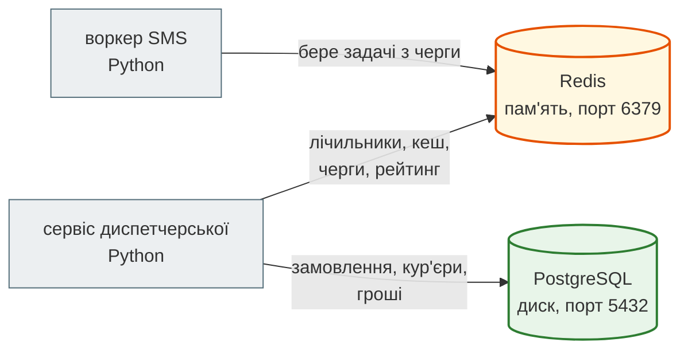
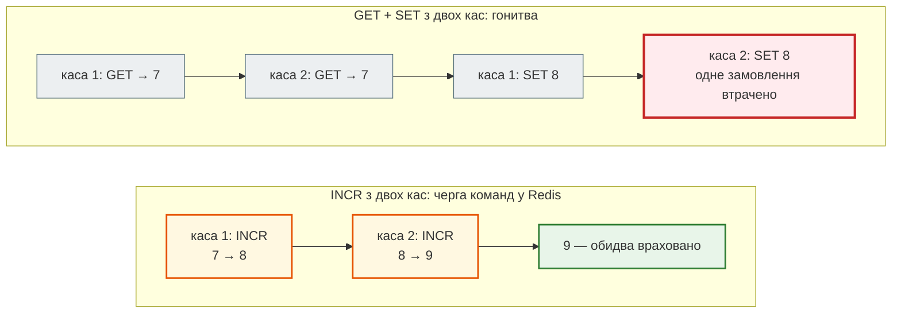
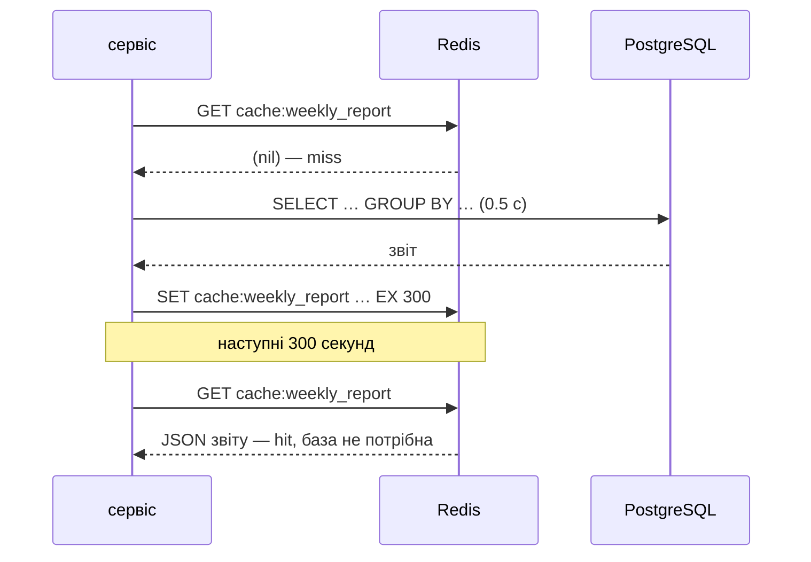
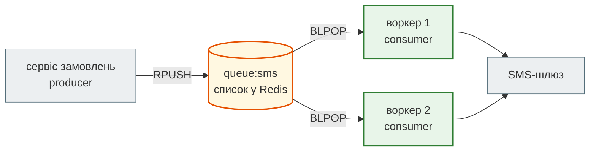
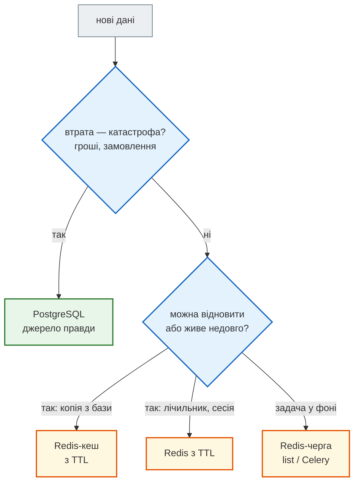

# Урок 30. Redis overview

База PostgreSQL з уроку 29 стала для диспетчерської «Смачно + Таксі» **джерелом правди**: замовлення, кур'єри й гроші не загубляться. Але сервіс росте, і з'являються питання, для яких реляційна база — не найкращий інструмент:

- лічильник «скільки замовлень за останню хвилину» оновлюється сотні разів на секунду — і нікому не потрібен завтра;
- тижневий звіт власниці рахується 2 секунди, а його відкривають десять разів на хвилину;
- SMS клієнтам треба відправляти **у фоні**: програма, що приймає замовлення, не повинна чекати SMS-шлюз;
- рейтинг кур'єрів має оновлюватися миттєво після кожної доставки.

Для таких задач поруч із PostgreSQL ставлять **Redis** — сховище «ключ → значення», яке тримає дані **в оперативній пам'яті** і відповідає за мікросекунди. Сьогодні — що вміє Redis, які в ньому структури даних (знайомі з уроку 28!) і як працювати з ним з Python.

**Що потрібно з попередніх уроків:** словник (урок 6), стан гонитви (урок 27), черга, стек, купа й LRU-кеш (урок 28), PostgreSQL і клієнт-сервер (урок 29).

**Після уроку ти зможеш:**

- пояснити, чим Redis відрізняється від PostgreSQL і для чого його ставлять поруч;
- працювати з ключами, лічильниками й часом життя (`SET`, `GET`, `INCR`, `EXPIRE`, `TTL`);
- обрати структуру Redis під задачу: список, хеш, множина, відсортована множина;
- працювати з Redis з Python через `redis-py`;
- реалізувати кеш **cache-aside**, чергу задач і обмеження частоти запитів (rate limit).

**Задача розділу.** Лічильники, кеш звітів, черга SMS і рейтинг кур'єрів для диспетчерської. Повний приклад — у розділі [«Практика»](#practice).

**Ноутбук заняття:** [`note_lesson_30_redis.ipynb`](https://github.com/NikoriakViktot/PY-Course-Victor-Nikoriak-22-09-2026/blob/main/module_3/lessons/lesson_30_redis_overview/note_lesson_30_redis.ipynb) [](https://colab.research.google.com/github/NikoriakViktot/PY-Course-Victor-Nikoriak-22-09-2026/blob/main/module_3/lessons/lesson_30_redis_overview/note_lesson_30_redis.ipynb) — зі встановленням Redis прямо в Colab.

## Пригадай

1. Чому `balance = balance + 1` з кількох потоків губить оплати (урок 27)?
2. Що викидає LRU-кеш, коли місця немає (урок 28)?
3. Що гарантує `COMMIT` у PostgreSQL (урок 29)?

??? success "Відповіді"

    1. «Прочитати» і «записати» — два кроки, між якими інший потік встигає своє. Сьогодні побачимо, як Redis робить «прочитати-додати-записати» однією неподільною командою.
    2. Запис, до якого найдовше не зверталися. Redis уміє працювати саме так, коли закінчується пам'ять.
    3. Що зміни записані на диск і переживуть навіть вимкнення сервера. Redis за замовчуванням дає слабшу гарантію — і це свідомий компроміс заради швидкості.

## Redis і PostgreSQL: навіщо двоє

**Redis** (REmote DIctionary Server) — сервер, який тримає **великий словник** в оперативній пам'яті: ключ — рядок, значення — рядок, список, хеш, множина… Клієнти підключаються до нього мережею, як до PostgreSQL, і надсилають короткі команди.



| | PostgreSQL | Redis |
|---|---|---|
| Де дані | на диску | в оперативній пам'яті (з копією на диск за бажанням) |
| Модель | таблиці, зв'язки, SQL | ключ → значення різних типів |
| Швидкість | мілісекунди | мікросекунди |
| Запити | будь-які: `JOIN`, `GROUP BY` | лише за ключем і командами структури |
| Обмеження, транзакції | сильні: `CHECK`, `FOREIGN KEY`, ACID | мінімальні |
| Для чого | **джерело правди** | швидкі тимчасові дані: кеш, лічильники, черги, сесії |

Правило просте: усе, що не можна втратити, — у PostgreSQL. Redis тримає те, що можна **відновити** (кеш) або що **живе недовго** (лічильник за хвилину, задача в черзі).

### Встановлення і підключення

=== "Docker (рекомендовано)"

    ```bash
    docker run --name smachno-redis -p 6379:6379 -d redis:7
    docker exec -it smachno-redis redis-cli
    ```

=== "Linux (Ubuntu)"

    ```bash
    sudo apt install redis-server
    redis-cli
    ```

=== "Windows / macOS"

    На Windows Redis офіційно запускають через Docker або WSL (Ubuntu всередині Windows). На macOS — Docker або `brew install redis`, потім `brew services start redis`.

=== "Google Colab"

    Colab — Ubuntu, тож Redis ставиться командою `apt-get install redis-server` і запускається `redis-server --daemonize yes`. Готова клітинка — на початку ноутбука заняття.

`redis-cli` — консольний клієнт, як `psql` для PostgreSQL. Перевірка зв'язку:

```text
$ redis-cli
127.0.0.1:6379> PING
PONG
```

## Ключі, рядки, лічильники

Найпростіше значення — рядок. `SET` записує, `GET` читає, `DEL` видаляє, `EXISTS` перевіряє:

```text
$ redis-cli --raw
127.0.0.1:6379> SET courier:1:name "Оксана"
OK
127.0.0.1:6379> GET courier:1:name
Оксана
127.0.0.1:6379> GET courier:99:name

127.0.0.1:6379> EXISTS courier:1:name courier:99:name
1
```

Redis зберігає байти й не знає про кодування. Звичайний `redis-cli` показує не-ASCII символи кодами — `GET courier:1:name` дасть `"\xd0\x9e\xd0\xba…"`. Ключ `--raw` виводить їх як є, тому далі в уроці консоль запущена саме так. У режимі `--raw` відповідь «значення немає» (nil) — порожній рядок, а числа — без позначки `(integer)`.

Назви ключів у Redis — просто рядки. Двокрапки — домовленість, а не синтаксис: `courier:1:name` читається як «кур'єр 1, ім'я». Такі «простори імен» допомагають не плутати ключі різних частин сервісу. `EXISTS` повертає, **скільки** з переданих ключів існує; `GET` неіснуючого ключа повертає nil — «немає значення», як `None` у Python.

### INCR: лічильник однією командою

```text
127.0.0.1:6379> INCR orders:today
1
127.0.0.1:6379> INCR orders:today
2
127.0.0.1:6379> INCRBY orders:today 5
7
127.0.0.1:6379> GET orders:today
7
```

`INCR` створює ключ зі значенням 0, якщо його не було, і додає 1. Головне: `INCR` — **одна атомарна команда**. Redis виконує команди по одній, тож «прочитати-додати-записати» не може перерватися іншим клієнтом — стан гонитви з уроку 27 тут неможливий.



### Час життя: EXPIRE і TTL

Лічильник «замовлень за цю хвилину» має зникнути сам. Кожному ключу можна задати **час життя** (TTL, time to live):

```text
127.0.0.1:6379> SET promo:SUMMER10 "active"
OK
127.0.0.1:6379> EXPIRE promo:SUMMER10 60
1
127.0.0.1:6379> TTL promo:SUMMER10
60
127.0.0.1:6379> SET report:week "..." EX 300
OK
127.0.0.1:6379> TTL report:week
300
127.0.0.1:6379> TTL courier:1:name
-1
127.0.0.1:6379> TTL no:such:key
-2
```

`TTL` показує, скільки секунд ключ ще житиме: `-1` — вічно (TTL не задано), `-2` — ключа немає. `SET ... EX 300` — записати й одразу задати час життя. Коли час мине, Redis видалить ключ сам — саме те, що потрібно для кешу й тимчасових лічильників.

## Структури даних Redis

Значенням ключа може бути не лише рядок. П'ять основних типів — старі знайомі з уроку 28:

| Урок 28 | Redis | Команди | Для диспетчерської |
|---|---|---|---|
| `Queue` / `Stack` | **list** — список | `LPUSH`, `RPUSH`, `LPOP`, `RPOP`, `BRPOP`, `LRANGE` | черга SMS, історія дій |
| `dict` | **hash** — словник у ключі | `HSET`, `HGET`, `HGETALL`, `HINCRBY` | картка кур'єра |
| `set` | **set** — множина | `SADD`, `SISMEMBER`, `SCARD`, `SINTER` | унікальні клієнти дня |
| `MinHeap` | **sorted set** — множина з балами | `ZADD`, `ZINCRBY`, `ZRANGE`, `ZPOPMIN` | рейтинг, черга за дедлайном |
| `LRUCache` | увесь Redis з `maxmemory-policy allkeys-lru` | налаштування сервера | кеш |

### List: черга і стек

```text
127.0.0.1:6379> RPUSH sms:queue "Анна: замовлення #101 прийнято"
1
127.0.0.1:6379> RPUSH sms:queue "Богдан: кур'єр виїхав"
2
127.0.0.1:6379> RPUSH sms:queue "Віра: замовлення доставлено"
3
127.0.0.1:6379> LRANGE sms:queue 0 -1
Анна: замовлення #101 прийнято
Богдан: кур'єр виїхав
Віра: замовлення доставлено
127.0.0.1:6379> LPOP sms:queue
Анна: замовлення #101 прийнято
127.0.0.1:6379> LLEN sms:queue
2
```

`RPUSH` додає в хвіст, `LPOP` бере з голови — черга FIFO, як `Queue` з уроку 28. `LRANGE 0 -1` — усі елементи (від першого до останнього). Для стеку беруть з того самого кінця, куди додають: `RPUSH` + `RPOP`.

### Hash: картка кур'єра

```text
127.0.0.1:6379> HSET courier:1 name "Оксана" district "Поділ" delivered 3
3
127.0.0.1:6379> HGET courier:1 district
Поділ
127.0.0.1:6379> HINCRBY courier:1 delivered 1
4
127.0.0.1:6379> HGETALL courier:1
name
Оксана
district
Поділ
delivered
4
```

Hash — словник усередині одного ключа. `HSET` повертає, скільки **нових** полів додано; `HINCRBY` — атомарний `+=` для поля.

### Set: унікальні клієнти

```text
127.0.0.1:6379> SADD customers:2026-09-21 "Анна" "Богдан" "Віра" "Анна"
3
127.0.0.1:6379> SADD customers:2026-09-22 "Анна" "Галина"
2
127.0.0.1:6379> SCARD customers:2026-09-21
3
127.0.0.1:6379> SISMEMBER customers:2026-09-21 "Галина"
0
127.0.0.1:6379> SINTER customers:2026-09-21 customers:2026-09-22
Анна
```

Друга «Анна» не додалась — множина тримає лише унікальні значення (`SADD` повернув 3, а не 4). `SINTER` — перетин, як `&` для `set` у Python (урок 5): хто замовляв обидва дні.

### Sorted set: рейтинг кур'єрів

**Відсортована множина** — множина, де в кожного елемента є **бал** (score), і Redis тримає елементи впорядкованими за ним. Ідеально для рейтингів і черг з пріоритетом.

```text
127.0.0.1:6379> ZADD rating 2130 "Оксана" 1570 "Тарас" 1040 "Ігор" 0 "Марія"
4
127.0.0.1:6379> ZINCRBY rating 390 "Марія"
390
127.0.0.1:6379> ZREVRANGE rating 0 2 WITHSCORES
Оксана
2130
Тарас
1570
Ігор
1040
127.0.0.1:6379> ZRANK rating "Марія"
0
```

Виторг кур'єрів з уроку 29 став балами. `ZINCRBY` додає до балу, `ZREVRANGE 0 2` — трійка найкращих (від більшого до меншого), `ZRANK` — місце за зростанням, починаючи з 0. Кожна зміна — `O(log n)`, як у купі з уроку 28.

## Redis з Python

Клієнт — пакет `redis` (redis-py): `pip install redis`.

```python
import redis

r = redis.Redis(host="localhost", port=6379, decode_responses=True)

print(r.ping())
r.set("courier:2:name", "Тарас")
print(r.get("courier:2:name"))
print(r.incr("orders:today"))
print(r.hgetall("courier:1"))
print(r.zrevrange("rating", 0, 2, withscores=True))
```

```text
True
Тарас
8
{'name': 'Оксана', 'district': 'Поділ', 'delivered': '4'}
[('Оксана', 2130.0), ('Тарас', 1570.0), ('Ігор', 1040.0)]
```

Кожна команда Redis — метод з тією самою назвою в нижньому регістрі. `decode_responses=True` перетворює відповіді з `bytes` на `str`; без нього `get` повертав би `b'...'`. Числа Redis зберігає як рядки, тож `get("orders:today")` поверне `'9'`, а не `9` — перетворюй через `int()`.

### Pipeline: кілька команд за один раз

Кожна команда — запит мережею й очікування відповіді. `pipeline` збирає кілька команд і відправляє їх разом:

```python
pipe = r.pipeline()
pipe.hset("courier:2", mapping={"name": "Тарас", "district": "Центр", "delivered": 2})
pipe.zincrby("rating", 450, "Тарас")
pipe.incr("orders:today")
print(pipe.execute())
```

```text
[3, 2020.0, 9]
```

`execute()` повертає відповіді всіх команд списком. За замовчуванням pipeline в redis-py ще й **транзакційний** (`MULTI` / `EXEC`): команди виконаються разом, і жоден інший клієнт не вклиниться між ними.

## Кеш: cache-aside

Звіт власниці з уроку 29 рахується довго. Замість того щоб щоразу питати PostgreSQL, результат зберігають у Redis на кілька хвилин. Найпоширеніша схема — **cache-aside** («кеш збоку»):

1. спершу шукаємо в Redis;
2. є (**hit**) — віддаємо одразу;
3. немає (**miss**) — рахуємо в базі, кладемо в Redis з TTL і віддаємо.

```python
import json
import time

database_calls = 0


def weekly_report_from_db():
    """Замість справжнього SQL-запиту з уроку 29 — повільна функція з лічильником."""
    global database_calls
    database_calls += 1
    time.sleep(0.5)
    return {"Поділ": 2730.0, "Оболонь": 2010.0}


def weekly_report():
    cached = r.get("cache:weekly_report")
    if cached is not None:                       # hit
        return json.loads(cached)
    report = weekly_report_from_db()             # miss
    r.set("cache:weekly_report", json.dumps(report, ensure_ascii=False), ex=300)
    return report


for attempt in range(1, 4):
    start = time.perf_counter()
    report = weekly_report()
    print(attempt, report, f"{time.perf_counter() - start:.1f} с")
print("звернень до бази:", database_calls, "| TTL кешу:", r.ttl("cache:weekly_report"))
```

```text
1 {'Поділ': 2730.0, 'Оболонь': 2010.0} 0.5 с
2 {'Поділ': 2730.0, 'Оболонь': 2010.0} 0.0 с
3 {'Поділ': 2730.0, 'Оболонь': 2010.0} 0.0 с
звернень до бази: 1 | TTL кешу: 300
```

Redis зберігає лише рядки, тому словник звіту перетворюємо на JSON (урок 14) і назад. Перше звернення — повільне (miss), наступні — миттєві (hit), а база працювала один раз.



!!! warning "Кеш — це копія, і вона застаріває"
    Поки кеш живий, нове замовлення в PostgreSQL у звіті не з'явиться. Тому кеш **завжди** має TTL, а коли дані змінюються — старий запис видаляють (`DEL cache:weekly_report`), щоб наступний запит порахував свіжий звіт. Скільки секунд «застарілості» допустимо — бізнес-рішення: для звіту за тиждень 5 хвилин — нормально, для балансу рахунку — ні.

## Черга задач: producer і consumer

Приймання замовлення не повинно чекати SMS-шлюз. Сервіс-**producer** кладе задачу в список Redis і одразу відповідає клієнтові; окремий процес-**consumer** (воркер) забирає задачі й відправляє SMS.

```python
def send_sms_later(phone, text):
    """Producer: покласти задачу в чергу й повернутися одразу."""
    r.rpush("queue:sms", json.dumps({"phone": phone, "text": text}, ensure_ascii=False))


def sms_worker(max_tasks):
    """Consumer: брати задачі з голови черги; чекати, якщо черга порожня."""
    for _ in range(max_tasks):
        item = r.blpop("queue:sms", timeout=1)
        if item is None:
            print("черга порожня — воркер чекав 1 с і зупинився")
            return
        _queue_name, payload = item
        task = json.loads(payload)
        print("відправлено:", task["phone"], "—", task["text"])


send_sms_later("+380501112233", "Замовлення #101 прийнято")
send_sms_later("+380672223344", "Кур'єр уже їде")
print("у черзі:", r.llen("queue:sms"))
sms_worker(max_tasks=3)
```

```text
у черзі: 2
відправлено: +380501112233 — Замовлення #101 прийнято
відправлено: +380672223344 — Кур'єр уже їде
черга порожня — воркер чекав 1 с і зупинився
```

`BLPOP` — «блокуючий» `LPOP`: якщо черга порожня, воркер **чекає**, доки задача з'явиться (або мине `timeout`). Producer і consumer можуть бути різними програмами на різних комп'ютерах — Redis між ними як поштова скринька. Так працює Celery (урок 48+): Redis — брокер, воркери — окремі процеси.



Кожну задачу отримає **рівно один** воркер: `BLPOP` атомарно знімає елемент. Більше воркерів — більше SMS за секунду.

### Pub/Sub: сповіщення «всім, хто слухає»

Черга — «одна задача одному воркеру». **Pub/Sub** — навпаки: повідомлення отримують **усі** підписники каналу, а хто не слухав — не отримає нічого.

```python
listener = r.pubsub()
listener.subscribe("dispatch:events")
listener.get_message(timeout=1)                 # підтвердження підписки

r.publish("dispatch:events", "нове термінове замовлення #104")
message = listener.get_message(timeout=1)
print(message["channel"], "→", message["data"])
listener.close()
```

```text
dispatch:events → нове термінове замовлення #104
```

Pub/Sub підходить для «живих» сповіщень: екран диспетчера, чат (урок 45). Повідомлення ніде не зберігаються — для задач, які не можна загубити, беруть чергу.

## Архітектура: що класти в Redis { #architecture }



**Чи зберігає Redis дані на диск?** Може, двома способами:

- **RDB** — знімок усієї пам'яті на диск раз на кілька хвилин. Після падіння втрачається все, що змінилося після останнього знімка;
- **AOF** — журнал кожної команди. Втрати менші, але файл більший і повільніше відновлення.

Навіть з AOF Redis не дає гарантій PostgreSQL: немає обмежень, зовнішніх ключів, складних транзакцій. Тому гроші й замовлення — у PostgreSQL.

**Що буде, коли закінчиться пам'ять?** Це вирішує налаштування `maxmemory-policy`:

```text
127.0.0.1:6379> CONFIG GET maxmemory-policy
maxmemory-policy
noeviction
127.0.0.1:6379> CONFIG SET maxmemory-policy allkeys-lru
OK
127.0.0.1:6379> CONFIG GET maxmemory-policy
maxmemory-policy
allkeys-lru
```

За замовчуванням `noeviction`: коли пам'ять заповнена, нові записи отримують помилку. `allkeys-lru` робить з усього Redis **LRU-кеш з уроку 28**: викидає ключі, до яких найдовше не зверталися. Для сервера-кешу — саме те; для черги задач — небезпечно (зникнуть задачі). Тому кеш і черги часто тримають у **різних** екземплярах Redis.

**Коли Redis не потрібен?** Коли PostgreSQL справляється: один звіт на годину, сотня замовлень на день. Кожен додатковий сервер — це ще одна річ, яка може впасти, і питання «а чи свіжий кеш?». Спершу виміряй (урок 8), потім додавай кеш.

??? note "Для допитливих: як Redis говорить мережею"
    Redis спілкується через TCP простим текстовим протоколом **RESP**. Команду можна надіслати звичайним сокетом, без бібліотеки:

    ```python
    import socket

    with socket.create_connection(("localhost", 6379)) as sock:
        sock.sendall(b"*1\r\n$4\r\nPING\r\n")
        print(sock.recv(64))
        sock.sendall(b"*2\r\n$3\r\nGET\r\n$12\r\norders:today\r\n")
        print(sock.recv(64))
    ```

    ```text
    b'+PONG\r\n'
    b'$1\r\n9\r\n'
    ```

    `*1` — масив з одного елемента, `$4` — рядок довжиною 4 байти, `\r\n` — розділювач. Відповідь `+PONG` — простий рядок, `$1\r\n9` — рядок з одного байта: значення лічильника `orders:today`. Саме це робить redis-py за тебе. Сокети й TCP докладно — в уроці 31.

## Практика { #practice }

### Розібраний приклад: не більше трьох замовлень за хвилину

Хтось скриптом надсилає сотні фейкових замовлень. Обмежимо: **не більше 3 замовлень за хвилину з одного номера телефону** (rate limit). Ключ — номер плюс поточна хвилина; значення — лічильник; TTL — 60 секунд.

```python
def allow_order(phone, minute):
    key = f"rate:{phone}:{minute}"
    count = r.incr(key)          # атомарно: +1 і повернути нове значення
    if count == 1:
        r.expire(key, 60)        # перше замовлення хвилини — ключ зникне сам
    return count <= 3


for attempt in range(1, 6):
    print(attempt, allow_order("+380501112233", "2026-09-26T12:05"))
print("інша хвилина:", allow_order("+380501112233", "2026-09-26T12:06"))
print("інший номер:", allow_order("+380672223344", "2026-09-26T12:05"))
print("TTL:", r.ttl("rate:+380501112233:2026-09-26T12:05"))
```

```text
1 True
2 True
3 True
4 False
5 False
інша хвилина: True
інший номер: True
TTL: 60
```

- Хвилина — частина ключа: нова хвилина — новий лічильник з нуля. У справжньому сервісі її беруть з `datetime.now()` (урок 12), тут вона передається параметром, щоб результат можна було перевірити.
- `INCR` атомарний: навіть якщо п'ять запитів прийдуть одночасно з різних серверів, кожен отримає своє число 1, 2, 3, 4, 5.
- Старі лічильники прибере TTL — пам'ять не забивається вчорашніми хвилинами.

### Зміни приклад: ліміт для різних дій

Узагальни `allow_order` до `allow(action, user, minute, limit)`: для `action="order"` ліміт 3, для `action="promo"` (перевірка промокоду) — 5 за хвилину. Ключ має містити дію, щоб лічильники не змішувались.

**Критерії перевірки:**

- 6 перевірок промокоду: `True` ×5, потім `False`;
- лічильники замовлень і промокодів одного користувача не впливають один на одного;
- у кожного ключа є TTL.

### Спробуй самостійно: рейтинг кур'єрів

Напиши три функції на sorted set `rating:week`:

- `add_delivery(courier, amount)` — додати суму доставки до балу кур'єра;
- `top(n)` — список `(кур'єр, сума)` від найбільшої суми;
- `place(courier)` — місце кур'єра в рейтингу **з одиниці** (перший — 1).

**Критерії перевірки:**

- після доставок Оксана 540 + 980, Тарас 1250, Ігор 760: `top(2) == [("Оксана", 1520.0), ("Тарас", 1250.0)]`;
- `place("Ігор") == 3`;
- повторна доставка Тараса на 300 піднімає його на перше місце.

??? tip "Підказка"
    `ZINCRBY`, `ZREVRANGE … WITHSCORES` і `ZREVRANK` (місце за спаданням, з нуля — додай 1).

### Знайди помилку

Колега рахує замовлення за день так:

```python
def count_order_buggy():
    current = int(r.get("orders:buggy") or 0)
    r.set("orders:buggy", current + 1)
```

Чотири сервери приймають по 500 замовлень одночасно:

```python
import threading

r.delete("orders:buggy")
threads = [threading.Thread(target=lambda: [count_order_buggy() for _ in range(500)]) for _ in range(4)]
for thread in threads:
    thread.start()
for thread in threads:
    thread.join()
print("очікували 2000, маємо:", r.get("orders:buggy"))
```

Приклад виводу (у тебе число буде іншим):

```text
очікували 2000, маємо: 698
```

??? success "Відповідь"
    `GET`, а потім `SET` — два окремі запити до Redis, і між ними інші сервери встигають прочитати те саме старе значення: стан гонитви з уроку 27, тільки між процесами, а не потоками. `Lock` з уроку 27 тут не допоможе — сервери різні. Правильно — одна атомарна команда: `r.incr("orders:today")`.

## Підсумок

| Поняття | Що запам'ятати |
|---|---|
| Redis | сервер «ключ → значення» в пам'яті; мікросекунди; поруч із PostgreSQL, а не замість |
| `SET` / `GET` / `DEL` / `EXISTS` | базові операції з ключем; nil — немає (`None` у Python) |
| `INCR` / `INCRBY` / `HINCRBY` | атомарні лічильники — без стану гонитви |
| `EXPIRE` / `TTL` / `SET … EX` | час життя ключа: `-1` вічно, `-2` немає |
| list | черга й стек: `RPUSH` / `LPOP` / `BLPOP` |
| hash | словник у ключі: `HSET` / `HGETALL` |
| set | унікальні значення: `SADD` / `SCARD` / `SINTER` |
| sorted set | впорядковано за балом: рейтинги, черги з пріоритетом |
| redis-py | `redis.Redis(decode_responses=True)`; команди — методи; `pipeline` |
| cache-aside | GET → miss → база → SET з TTL; кеш застаріває — TTL і `DEL` |
| Черга задач | producer `RPUSH`, consumer `BLPOP`; кожна задача — одному воркеру |
| Pub/Sub | повідомлення всім підписникам, без збереження |
| Персистентність | RDB-знімки, AOF-журнал; джерело правди — PostgreSQL |

### Самоперевірка

1. Чому Redis відповідає швидше за PostgreSQL і чим за це платимо?
2. Чому `INCR` не має стану гонитви, а `GET` + `SET` має?
3. Що повернуть `TTL` для ключа без часу життя і для ключа, якого немає?
4. Яку структуру Redis взяти для: черги SMS; рейтингу кур'єрів; картки кур'єра; унікальних клієнтів за день?
5. Опиши cache-aside. Чому кеш без TTL — погана ідея?
6. Чим черга на list відрізняється від Pub/Sub?
7. Що станеться із заповненим Redis за `noeviction` і за `allkeys-lru`?

??? success "Відповіді"

    1. Дані в оперативній пам'яті, команди прості й виконуються по одній. Платимо обсягом пам'яті та слабшими гарантіями збереження, немає SQL і обмежень.
    2. `INCR` — одна команда, а Redis виконує команди по черзі; між двома командами `GET` і `SET` встигають команди інших клієнтів.
    3. `-1` і `-2`.
    4. List; sorted set; hash; set.
    5. Шукаємо в Redis; немає — рахуємо в базі й кладемо в Redis з TTL. Без TTL копія житиме вічно й показуватиме застарілі дані, доки хтось не видалить її вручну.
    6. У черзі кожну задачу бере один воркер, і вона чекає в Redis, доки її заберуть. Pub/Sub розсилає повідомлення всім підписникам одразу й ніде його не зберігає.
    7. `noeviction` — нові записи отримають помилку; `allkeys-lru` — Redis викине ключі, до яких найдовше не зверталися.

### Що далі

- Ноутбук заняття: [`note_lesson_30_redis.ipynb`](https://github.com/NikoriakViktot/PY-Course-Victor-Nikoriak-22-09-2026/blob/main/module_3/lessons/lesson_30_redis_overview/note_lesson_30_redis.ipynb) [](https://colab.research.google.com/github/NikoriakViktot/PY-Course-Victor-Nikoriak-22-09-2026/blob/main/module_3/lessons/lesson_30_redis_overview/note_lesson_30_redis.ipynb) — встановлення Redis у Colab, лічильники, структури, кеш, черга й rate limit з перевірками.
- Наступний урок — 31, HTTP: `requests`, `httpx`, `aiohttp` — як програми говорять мережею.
- Redis на практиці у веб-застосунку — урок 39 «Middlewares і кешування»; Celery з Redis-брокером і Docker — уроки 48–49; Pub/Sub для чату — урок 45.

## Документація і джерела

- Redis: [Get started](https://redis.io/docs/latest/get-started/), [Data types](https://redis.io/docs/latest/develop/data-types/) (strings, lists, hashes, sets, sorted sets), [Commands](https://redis.io/docs/latest/commands/), [Key eviction](https://redis.io/docs/latest/develop/reference/eviction/), [Persistence](https://redis.io/docs/latest/operate/oss_and_stack/management/persistence/), [Pub/Sub](https://redis.io/docs/latest/develop/pubsub/), [RESP](https://redis.io/docs/latest/develop/reference/protocol-spec/)
- Python: [redis-py](https://redis.readthedocs.io/en/stable/) — [Pipelines](https://redis.readthedocs.io/en/stable/advanced_features.html) і Pub/Sub
- Встановлення: образ [redis на Docker Hub](https://hub.docker.com/_/redis)
