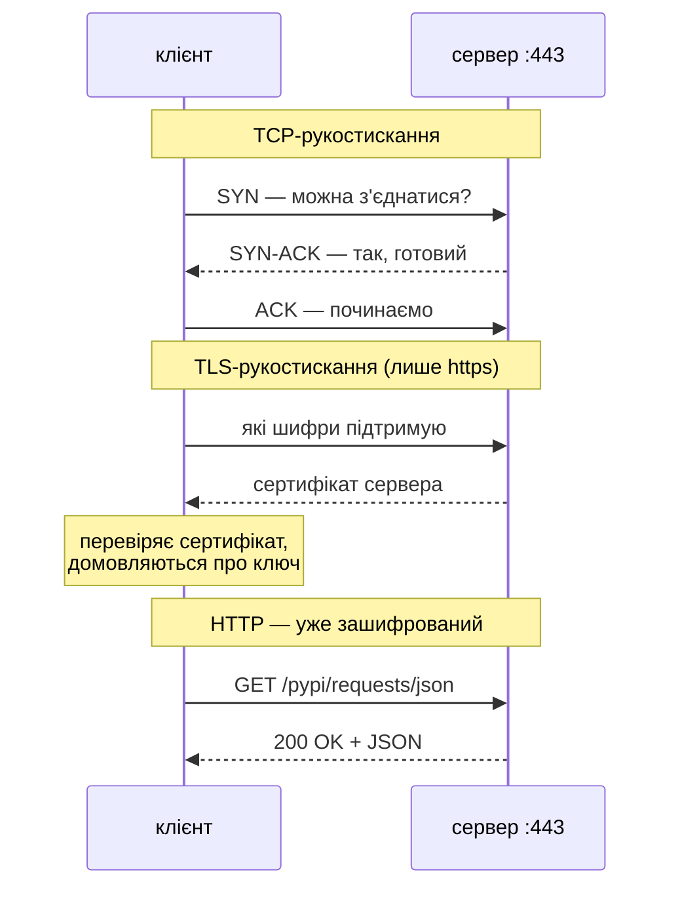
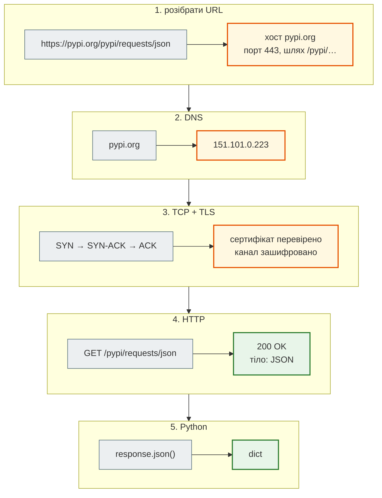
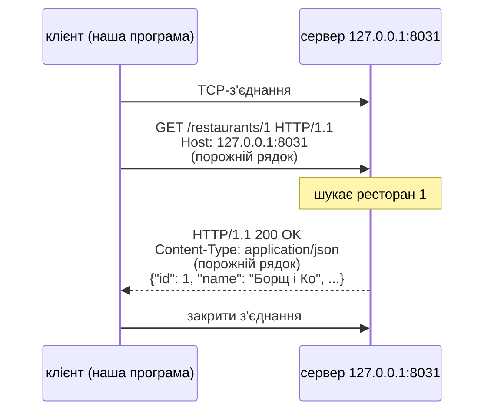
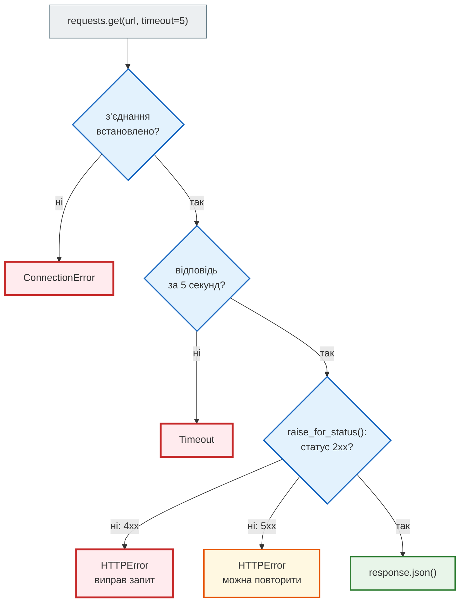
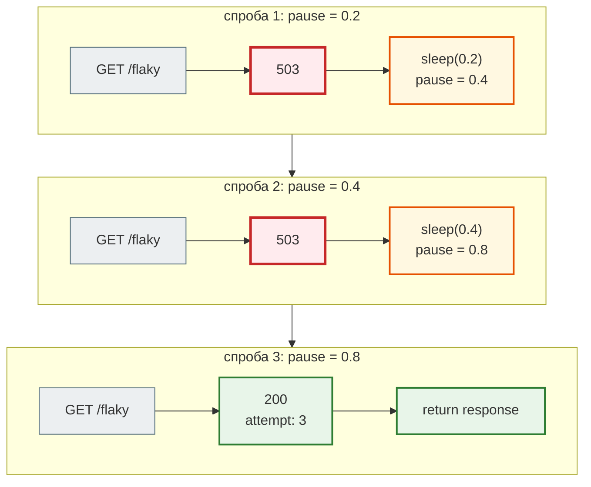
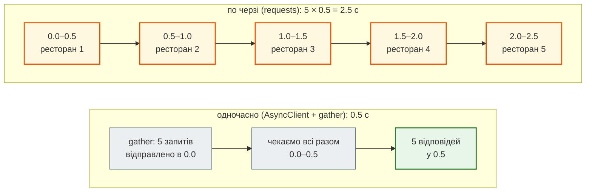
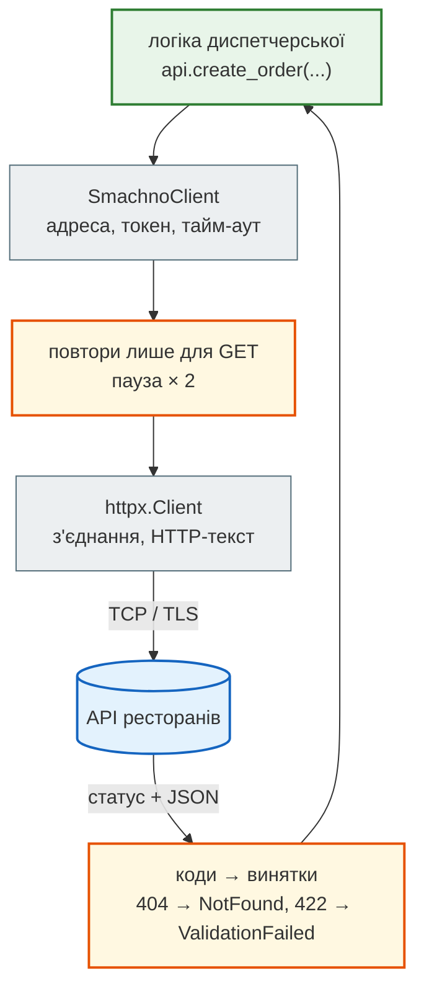
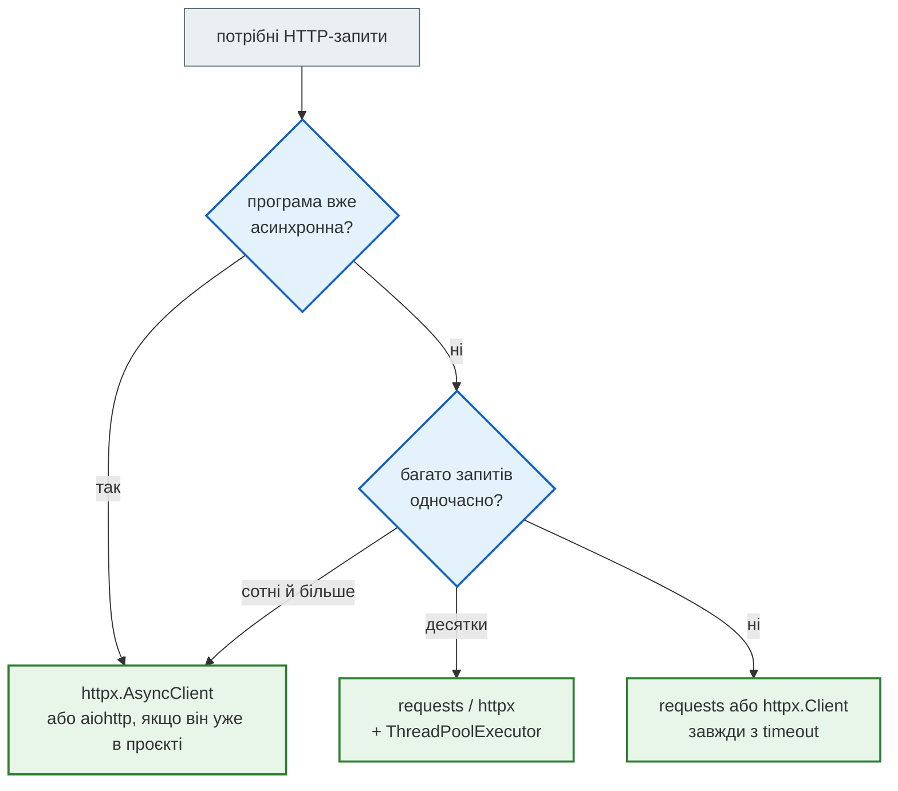

# Урок 31. HTTP: requests, httpx, aiohttp

Досі диспетчерська «Смачно + Таксі» розмовляла лише зі **своїми** серверами: PostgreSQL (урок 29) і Redis (урок 30). Але сервіс не живе сам:

- ресторани-партнери мають свої сервери: меню, «чи ми зараз відкриті», прийом замовлень;
- SMS клієнтам надсилає окремий SMS-шлюз;
- адресу на карті перевіряє сервіс карт, оплату — банк.

Усі вони говорять однією мовою — **HTTP**. Програма надсилає **запит** (request) на адресу, сервер повертає **відповідь** (response). Сторона, яка надає адреси для програм (а не сторінки для людей), називається **API**.

Сьогодні ми — **клієнт**: надсилаємо запити й обробляємо відповіді, зокрема помилки. Як написати власний сервер — з уроку 32.

**Що потрібно з попередніх уроків:** винятки (урок 13), JSON (урок 14), класи (урок 19), `asyncio` і `gather` (урок 27), сокет і протокол RESP (урок 30).

**Після уроку ти зможеш:**

- пояснити шлях запиту: URL → DNS → TCP → TLS → HTTP, і що таке IP-адреса та порт;
- прочитати HTTP-запит і відповідь: метод, шлях, заголовки, тіло, статус-код;
- надсилати GET і POST з `requests`: параметри, JSON, заголовки, токен;
- правильно обробляти помилки: тайм-аут, немає з'єднання, 4xx, 5xx;
- робити повторні спроби з паузою і пояснити, коли їх **не** можна робити;
- надсилати багато запитів одночасно з `httpx.AsyncClient` і `aiohttp`;
- загорнути чужий API у свій клас-клієнт.

**Задача розділу.** Клієнт до API ресторанів: список, статуси, створення замовлень, обробка збоїв. Повний приклад — у розділі [«Практика»](#practice).

**Ноутбук заняття:** [`note_lesson_31_http.ipynb`](https://github.com/NikoriakViktot/PY-Course-Victor-Nikoriak-22-09-2026/blob/main/module_4/lessons/lesson_31_http_requests/note_lesson_31_http.ipynb) [](https://colab.research.google.com/github/NikoriakViktot/PY-Course-Victor-Nikoriak-22-09-2026/blob/main/module_4/lessons/lesson_31_http_requests/note_lesson_31_http.ipynb) — з навчальним сервером, який запускається прямо в ноутбуці.

## Пригадай

1. Що поверне `json.loads('{"id": 1, "open": true}')` (урок 14)?
2. Скільки часу займе `asyncio.gather` з трьох корутин, кожна з яких робить `await asyncio.sleep(1)` (урок 27)?
3. Як виглядала команда `PING`, надіслана в Redis звичайним сокетом (урок 30)?

??? success "Відповіді"

    1. Словник `{'id': 1, 'open': True}`: JSON-об'єкт → `dict`, `true` → `True`.
    2. Близько 1 секунди: поки одна корутина чекає, цикл подій запускає інші. Сьогодні замість `sleep` чекатимемо на відповідь сервера.
    3. `b"*1\r\n$4\r\nPING\r\n"` — текст за правилами протоколу RESP. HTTP — теж текстовий протокол, тільки з іншими правилами.

## Навчальний сервер

Справжні API ресторанів вимагають реєстрації, змінюють дані й інколи не працюють. Тому для уроку є **навчальний API** диспетчерської — файл [`smachno_api.py`](https://github.com/NikoriakViktot/PY-Course-Victor-Nikoriak-22-09-2026/blob/main/module_4/lessons/lesson_31_http_requests/smachno_api.py). Він написаний лише на стандартній бібліотеці й запускається у фоновому потоці прямо в твоїй програмі. Як він влаштований усередині, розберемо в уроках 32–38; сьогодні це просто «той бік».

| Запит | Що робить |
|---|---|
| `GET /restaurants` | список ресторанів; `?district=Поділ` — фільтр за районом |
| `GET /restaurants/<id>` | один ресторан або 404 |
| `GET /restaurants/<id>/status?delay=0.5` | «чи відкрито?», відповідь із затримкою в секундах |
| `POST /orders` | створити замовлення; потрібен токен |
| `GET /flaky` | перші 2 запити — помилка 503, далі — успіх |
| `GET /slow` | відповідає через 3 секунди |
| `POST /reset` | скинути замовлення й лічильник `/flaky` |

Бібліотеки встановлюємо у віртуальне середовище (у Colab `requests` і `httpx` уже є):

```bash
pip install requests httpx aiohttp
```

Поклади `smachno_api.py` поруч зі своєю програмою і запусти сервер:

```python
from smachno_api import start_server

BASE = start_server()
print(BASE)
```

```text
http://127.0.0.1:8031
```

`127.0.0.1` — це «цей самий комп'ютер», `8031` — порт (як 5432 у PostgreSQL і 6379 у Redis).

## Шлях запиту: від URL до відповіді

Що відбувається між `requests.get("https://pypi.org/pypi/requests/json")` і готовим словником? Щоб розуміти помилки й тайм-аути, треба знати всі кроки.

### URL — адреса ресурсу

```python
from urllib.parse import urlsplit

url = urlsplit("https://pypi.org:443/pypi/requests/json?format=short#info")
print("схема:   ", url.scheme)
print("хост:    ", url.hostname)
print("порт:    ", url.port)
print("шлях:    ", url.path)
print("параметри:", url.query)
print("фрагмент:", url.fragment)
```

```text
схема:    https
хост:     pypi.org
порт:     443
шлях:     /pypi/requests/json
параметри: format=short
фрагмент: info
```

- **схема** — яким протоколом говорити: `http` або `https` (зашифрований HTTP);
- **хост** — ім'я комп'ютера-сервера;
- **порт** — яка програма на ньому; якщо не вказано, для `https` береться 443, для `http` — 80;
- **шлях і параметри** — що саме просимо в сервера; вони потраплять у перший рядок HTTP-запиту;
- **фрагмент** (`#info`) — на сервер **не надсилається**, це закладка для браузера.

### IP-адреса і DNS

Мережа доставляє дані не за іменем, а за **IP-адресою** — числовою адресою комп'ютера: `151.101.0.223` (IPv4, чотири числа 0–255) або довша IPv6. Ім'я в адресу перекладає **DNS** — «телефонна книга інтернету». Python робить це функцією `socket.getaddrinfo`:

```python
import socket

addresses = {info[4][0] for info in socket.getaddrinfo("pypi.org", 443, type=socket.SOCK_STREAM)}
print(sorted(addresses))
print(socket.gethostbyname("localhost"))
```

Приклад виводу (адреси у тебе можуть бути іншими):

```text
['151.101.0.223', '151.101.128.223', '151.101.192.223', '151.101.64.223', '2a04:4e42:200::223', '2a04:4e42:400::223', '2a04:4e42:600::223', '2a04:4e42::223']
127.0.0.1
```

- У `pypi.org` кілька адрес: великі сайти стоять на багатьох серверах мережі доставки (CDN), і DNS може відповідати по-різному в різних країнах.
- `localhost` — це `127.0.0.1`, адреса **самого себе** (loopback). Наш навчальний сервер живе саме там.
- Відповіді DNS кешуються — у системі, у браузері, у провайдера, — тому другий запит до того самого сайту починається швидше.

### Порт — яка програма

IP-адреса доводить дані до **комп'ютера**, а на ньому працюють десятки програм. **Порт** — номер «дверей» конкретної програми: сервер «слухає» порт, клієнт підключається до пари «IP + порт».

| Порт | Хто зазвичай слухає |
|---|---|
| 80 / 443 | вебсервер: HTTP / HTTPS |
| 22 | SSH — віддалений доступ до сервера (урок 49) |
| 53 | DNS |
| 5432 | PostgreSQL (урок 29) |
| 6379 | Redis (урок 30) |
| 8000 | Django і FastAPI під час розробки (уроки 33, 37) |
| 8031 | наш навчальний `smachno_api` |

Два сервери не можуть слухати один порт одночасно: другий отримає помилку `Address already in use`.

### TCP — надійне з'єднання

Дані в мережі йдуть **пакетами**, які можуть загубитися чи прийти не в тому порядку. **TCP** над цим надбудовує надійний «канал»: нумерує пакети, просить повторити загублені, збирає в правильному порядку. Перш ніж надсилати дані, клієнт і сервер домовляються про з'єднання — **рукостискання** в три кроки:



Кожен такий обмін — це час «туди й назад» по мережі. Тому нове з'єднання дороге, і тому `Session` (далі в уроці), яка перевикористовує з'єднання, помітно пришвидшує серію запитів.

### TLS — що додає «s» у https

Без шифрування будь-хто між тобою і сервером — Wi-Fi у кав'ярні, провайдер — бачить запит повністю, разом із токеном у заголовку. **TLS** шифрує все, що йде з'єднанням, і **сертифікатом** доводить, що сервер справді `pypi.org`, а не підробка. `requests`, `httpx` і `aiohttp` перевіряють сертифікат самі.

!!! warning "`verify=False` — не рішення"
    На помилку `SSLError: certificate verify failed` в інтернеті радять `requests.get(url, verify=False)`. Це вимикає перевірку сервера: з'єднання шифроване, але **невідомо з ким**. Причину треба виправити (застарілий сертифікат, корпоративний проксі — тоді вказують його сертифікат через `verify="шлях/до/ca.pem"`), а не вимикати захист.

### Уся картина



Кожен крок може зламатися по-своєму, і бібліотека повідомить про це різними винятками: немає такого домену або сервер не приймає з'єднання (кроки 2–3) — `ConnectionError`; сертифікат не пройшов перевірку — `SSLError`; сервер з'єднався, але не відповідає — `Timeout`; відповів з помилкою — статус 4xx/5xx (крок 4). Далі в уроці — кожен випадок у коді.

HTTP не пам'ятає попередніх запитів (**stateless**): кожен запит — сам по собі. Тому «хто ти» — токен, cookie — клієнт надсилає **в кожному** запиті. Cookies і сесії входу розберемо в уроці 40.

## HTTP — це текст

Коли TCP-з'єднання встановлене (як з Redis в уроці 30), клієнт надсилає **текст запиту** і читає **текст відповіді**. Для `http://` без TLS це буквально текст. Ось запит, надісланий звичайним сокетом, без жодної бібліотеки:

```python
import socket

request = (
    "GET /restaurants/1 HTTP/1.1\r\n"
    "Host: 127.0.0.1:8031\r\n"
    "Connection: close\r\n"
    "\r\n"
)
with socket.create_connection(("127.0.0.1", 8031)) as sock:
    sock.sendall(request.encode())
    response = b""
    while chunk := sock.recv(1024):
        response += chunk
print(response.decode())
```

Приклад виводу (дата у тебе буде інша):

```text
HTTP/1.1 200 OK
Server: SmachnoAPI/1.0 Python/3.10.20
Date: Sat, 26 Sep 2026 17:48:42 GMT
Content-Type: application/json; charset=utf-8
Content-Length: 63

{"id": 1, "name": "Борщ і Ко", "district": "Поділ"}
```



| Частина | Запит | Відповідь |
|---|---|---|
| Перший рядок | **метод**, **шлях**, версія: `GET /restaurants/1 HTTP/1.1` | версія, **статус-код**, пояснення: `HTTP/1.1 200 OK` |
| Заголовки | `Назва: значення`, по одному в рядку: `Host`, `Authorization`, `Content-Type` | `Content-Type`, `Content-Length`, `Date`, `Server` |
| Порожній рядок | `\r\n` — «заголовки скінчились» | те саме |
| Тіло | дані, які надсилаємо (у POST) | дані, які отримали: тут JSON |

`Content-Length: 63` — довжина тіла в **байтах**, а не в символах: у тілі 51 символів, але кожна українська літера в UTF-8 займає 2 байти (урок 14).

Бібліотеки `requests`, `httpx` і `aiohttp` роблять рівно це: складають такий текст, надсилають, розбирають відповідь. Плюс усе, що важко зробити руками: HTTPS-шифрування, кодування параметрів, перевикористання з'єднань.

### Методи і статус-коди

**Метод** каже, що клієнт хоче зробити:

| Метод | Що означає | Безпечний (нічого не змінює) | Ідемпотентний (повтор = той самий результат) |
|---|---|---|---|
| `GET` | отримати дані | так | так |
| `POST` | створити / виконати дію | ні | **ні**: два POST — два замовлення |
| `PUT` | замінити ресурс цілком | ні | так |
| `PATCH` | змінити частину ресурсу | ні | не обов'язково |
| `DELETE` | видалити | ні | так |

Колонка «ідемпотентний» знадобиться, коли говоритимемо про повторні спроби. Докладно про методи і дизайн API — в уроці 32.

**Статус-код** — три цифри, перша з яких означає клас відповіді:

| Клас | Значення | Коди, які сьогодні побачимо |
|---|---|---|
| `2xx` | успіх | `200 OK`, `201 Created` |
| `3xx` | перенаправлення: «шукай за іншою адресою» | бібліотеки йдуть туди самі |
| `4xx` | помилка **клієнта**: виправ запит | `400` не той формат, `401` немає доступу, `404` не знайдено, `422` дані не пройшли перевірку |
| `5xx` | помилка **сервера**: запит міг бути правильним | `500` збій у коді сервера, `503` тимчасово недоступний |

Правило, яке знадобиться далі: **4xx повторювати марно** — сервер знову скаже те саме. **5xx інколи минає**, якщо трохи почекати.

## requests: перший запит

[`requests`](https://requests.readthedocs.io/) — найпопулярніша HTTP-бібліотека Python: простий, синхронний, блокуючий (програма чекає на відповідь).

```python
import requests

response = requests.get(f"{BASE}/restaurants", timeout=5)
print(response.status_code)
print(response.headers["Content-Type"])
for restaurant in response.json():
    print(restaurant["id"], restaurant["name"], restaurant["district"])
```

```text
200
application/json; charset=utf-8
1 Борщ і Ко Поділ
2 Піца Поділ Поділ
3 Суші Оболонь Оболонь
4 Вареники 24/7 Центр
5 Шаурма Центр Центр
```

- `timeout=5` — чекати відповідь не довше 5 секунд. Чому це обов'язково — трохи нижче.
- `response.json()` — розібрати тіло як JSON: тут список словників.
- `response.headers` — словник заголовків, нечутливий до регістру: `headers["content-type"]` дасть те саме.

### Параметри запиту

Фільтр передаємо **параметрами** — частиною URL після `?`. Склеювати їх руками не треба: `requests` сам закодує кирилицю й спецсимволи.

```python
response = requests.get(f"{BASE}/restaurants", params={"district": "Поділ"}, timeout=5)
print(response.url)
print([restaurant["name"] for restaurant in response.json()])
```

```text
http://127.0.0.1:8031/restaurants?district=%D0%9F%D0%BE%D0%B4%D1%96%D0%BB
['Борщ і Ко', 'Піца Поділ']
```

`%D0%9F%D0%BE…` — це байти UTF-8 слова «Поділ», записані через `%`: у URL дозволені лише латинські літери, цифри й кілька знаків.

### Статус-коди і raise_for_status

Попросимо ресторан, якого немає:

```python
response = requests.get(f"{BASE}/restaurants/42", timeout=5)
print(response.status_code, response.ok)
print(response.json())
```

```text
404 False
{'error': 'ресторан 42 не знайдено'}
```

Зверни увагу: **`requests` не викидає винятку на 404**. Запит відбувся, відповідь прийшла — просто з кодом помилки. Якщо не перевірити статус, програма піде далі з `{'error': …}` замість ресторану й впаде пізніше в незрозумілому місці. Перевірка однією строкою — `raise_for_status()`: для 4xx і 5xx вона викидає `requests.HTTPError`, для 2xx нічого не робить.

```python
try:
    response.raise_for_status()
except requests.HTTPError as error:
    print("HTTPError:", error)
```

```text
HTTPError: 404 Client Error: Not Found for url: http://127.0.0.1:8031/restaurants/42
```

### POST: створюємо замовлення

Тіло запиту передаємо параметром `json=`: `requests` перетворить словник на JSON і сам додасть заголовок `Content-Type: application/json`. Сервер вимагає **токен** у заголовку `Authorization` — подивимось, що буде без нього, з поганими даними й правильно:

```python
order = {"restaurant_id": 1, "customer": "Олена", "total": 420}
headers = {"Authorization": "Bearer smachno-token"}

no_token = requests.post(f"{BASE}/orders", json=order, timeout=5)
print(no_token.status_code, no_token.json())

bad_data = requests.post(f"{BASE}/orders", json={"restaurant_id": 9, "total": -5}, headers=headers, timeout=5)
print(bad_data.status_code, bad_data.json())

created = requests.post(f"{BASE}/orders", json=order, headers=headers, timeout=5)
print(created.status_code, created.json())
print(created.request.headers["Content-Type"])
```

```text
401 {'error': 'потрібен заголовок Authorization: Bearer <токен>'}
422 {'errors': ['restaurant_id: такого ресторану немає', "customer: обов'язкове поле", 'total: число більше за 0']}
201 {'id': 101, 'status': 'new', 'restaurant_id': 1, 'customer': 'Олена', 'total': 420}
application/json
```

- `401` — сервер не знає, хто ти. `422` — знає, але дані не пройшли перевірку, і сервер пояснює, що саме не так. `201 Created` — замовлення створено, у відповіді — його `id`.
- `created.request` — запит, який насправді пішов на сервер; зручно дивитися, що бібліотека додала сама.
- `smachno-token` — навчальний. Справжній токен — як пароль: **ніколи** не пиши його в код і не комітиш у git. Бери зі змінної середовища: `token = os.environ["SMACHNO_TOKEN"]` (урок 12).

### Тайм-аути і збої мережі

Сервер може «зависнути». Без `timeout` `requests` чекатиме **вічно** — і твоя програма разом із ним. Endpoint `/slow` відповідає через 3 секунди, а ми готові чекати лише одну:

```python
try:
    requests.get(f"{BASE}/slow", timeout=1)
except requests.Timeout as error:
    print(type(error).__name__, "—", error)
```

```text
ReadTimeout — HTTPConnectionPool(host='127.0.0.1', port=8031): Read timed out. (read timeout=1)
```

А якщо за адресою взагалі нікого немає — сервер вимкнений або адреса з помилкою:

```python
try:
    requests.get("http://127.0.0.1:8099/restaurants", timeout=1)
except requests.ConnectionError as error:
    print(type(error).__name__)
```

```text
ConnectionError
```

Усі винятки `requests` — нащадки `requests.RequestException` (урок 13: ієрархія винятків):

| Виняток | Коли | Що робити |
|---|---|---|
| `requests.ConnectionError` | не вдалося з'єднатися: сервер вимкнений, немає мережі, неправильна адреса | повторити пізніше |
| `requests.Timeout` (`ConnectTimeout`, `ReadTimeout`) | не встигли з'єднатися або дочекатися відповіді | повторити, якщо запит ідемпотентний |
| `requests.HTTPError` | відповідь 4xx/5xx — лише після `raise_for_status()` | 4xx — виправити запит; 5xx — можна повторити |
| `requests.JSONDecodeError` | `.json()` для тіла, яке не є JSON | перевірити статус і `Content-Type` |



`timeout` можна задати парою: `timeout=(3, 10)` — 3 секунди на з'єднання і 10 на очікування відповіді.

### Повторні спроби з паузою

Сервіс інколи коротко «лежить»: перезапускається, перевантажений. Endpoint `/flaky` імітує саме це — два перші запити отримують `503`. Замість того, щоб одразу здаватися, повторимо запит, **щоразу подвоюючи паузу** (exponential backoff), щоб не добивати й так перевантажений сервер:

```python
import time

requests.post(f"{BASE}/reset", timeout=5)


def get_with_retry(url, attempts=4, pause=0.2):
    for attempt in range(1, attempts + 1):
        try:
            response = requests.get(url, timeout=2)
            if response.status_code < 500:
                return response
            print(f"спроба {attempt}: {response.status_code}, чекаю {pause} с")
        except (requests.ConnectionError, requests.Timeout) as error:
            print(f"спроба {attempt}: {type(error).__name__}, чекаю {pause} с")
        time.sleep(pause)
        pause *= 2
    raise RuntimeError(f"{url}: немає відповіді після {attempts} спроб")


response = get_with_retry(f"{BASE}/flaky")
print(response.status_code, response.json())
```

```text
спроба 1: 503, чекаю 0.2 с
спроба 2: 503, чекаю 0.4 с
200 {'ok': True, 'attempt': 3}
```



Три правила повторних спроб:

1. **Повторюй лише те, що може минути:** 5xx, тайм-аут, немає з'єднання. 4xx не повторюй — `404` за секунду не стане `200`.
2. **Обмежуй кількість спроб** і збільшуй паузу — інакше тисяча клієнтів, що без паузи повторюють запити, добиває сервер, який намагається піднятися.
3. **Не повторюй автоматично неідемпотентні запити.** Якщо `POST /orders` «впав» по тайм-ауту, замовлення могло **вже створитися** — сервер просто не встиг відповісти. Повтор — і клієнт отримає два борщі. Для таких випадків API дають ключ ідемпотентності (урок 32).

### Session: одне з'єднання на багато запитів

Кожен `requests.get(...)` відкриває нове TCP-з'єднання і закриває його. `requests.Session` **тримає з'єднання відкритим** і перевикористовує, а ще зберігає спільні заголовки — токен достатньо вказати один раз:

```python
with requests.Session() as session:
    session.headers["Authorization"] = "Bearer smachno-token"
    for customer, total in [("Андрій", 250), ("Марта", 610)]:
        response = session.post(
            f"{BASE}/orders",
            json={"restaurant_id": 4, "customer": customer, "total": total},
            timeout=5,
        )
        print(response.status_code, response.json()["id"], response.json()["customer"])
```

```text
201 101 Андрій
201 102 Марта
```

Наскільки це швидше? 200 запитів без сесії і з сесією:

```python
start = time.perf_counter()
for _ in range(200):
    requests.get(f"{BASE}/restaurants/1", timeout=5)
print(f"без Session: {time.perf_counter() - start:.2f} с")

start = time.perf_counter()
with requests.Session() as session:
    for _ in range(200):
        session.get(f"{BASE}/restaurants/1", timeout=5)
print(f"з Session:   {time.perf_counter() - start:.2f} с")
```

Приклад виводу (у тебе числа будуть іншими):

```text
без Session: 0.47 с
з Session:   0.28 с
```

Тут сервер на тому самому комп'ютері. Зі справжнім сервером через інтернет різниця ще більша: з'єднання по HTTPS — це кілька обмінів повідомленнями ще до першого байта запиту.

## Справжній API: PyPI

Той самий код працює з будь-яким сервером в інтернеті. [PyPI](https://pypi.org/) — каталог пакетів, звідки `pip` їх встановлює, — має відкритий [JSON API](https://docs.pypi.org/api/json/) без реєстрації:

```python
response = requests.get("https://pypi.org/pypi/requests/json", timeout=10)
response.raise_for_status()
info = response.json()["info"]
print(info["name"], info["version"])
print(info["summary"])
print("Python:", info["requires_python"])
```

Приклад виводу (станом на вересень 2026; версія у тебе може бути новішою):

```text
requests 2.34.2
Python HTTP for Humans.
Python: >=3.10
```

```python
response = requests.get("https://pypi.org/pypi/no-such-package-xyz-31/json", timeout=10)
print(response.status_code, response.json())
```

```text
404 {'message': 'Not Found'}
```

Адреса інша — `https://`, тобто з'єднання шифроване (TLS), — а код той самий. Інші API влаштовані так само: читаєш документацію, які там шляхи, параметри, заголовки й коди, — і пишеш запити.

## httpx: той самий requests, але вміє async

[`httpx`](https://www.python-httpx.org/) майже повторює інтерфейс `requests`, але має кілька важливих відмінностей:

- **тайм-аут за замовчуванням — 5 секунд**, а не «вічно»;
- `Client(base_url=...)` — шляхи пишемо коротко: `client.get("/restaurants")`;
- підтримує HTTP/2 (`pip install "httpx[http2]"`);
- має **асинхронний** клієнт `httpx.AsyncClient` з тим самим інтерфейсом.

```python
import httpx

with httpx.Client(base_url=BASE, timeout=5) as client:
    response = client.get("/restaurants", params={"district": "Центр"})
    print(response.status_code, response.http_version)
    print([restaurant["name"] for restaurant in response.json()])
    try:
        client.get("/restaurants/42").raise_for_status()
    except httpx.HTTPStatusError as error:
        print(type(error).__name__, error.response.status_code, error.response.json())
```

```text
200 HTTP/1.1
['Вареники 24/7', 'Шаурма Центр']
HTTPStatusError 404 {'error': 'ресторан 42 не знайдено'}
```

`httpx.Client` — аналог `requests.Session`: тримає з'єднання й спільні налаштування. Назви винятків інші: `httpx.HTTPStatusError`, `httpx.TimeoutException`, `httpx.ConnectError`; спільний предок мережевих помилок — `httpx.TransportError`.

## Багато запитів одночасно

Ранок, 8:55. Перед відкриттям диспетчерська перевіряє статус усіх п'яти ресторанів. Кожен сервер ресторану відповідає пів секунди (`delay=0.5`). По черзі:

```python
start = time.perf_counter()
statuses = []
for restaurant_id in range(1, 6):
    response = requests.get(f"{BASE}/restaurants/{restaurant_id}/status", params={"delay": 0.5}, timeout=5)
    statuses.append(response.json())
print(f"по черзі: {time.perf_counter() - start:.1f} с")
print([status["open"] for status in statuses])
```

Приклад виводу (час у тебе може трохи відрізнятися):

```text
по черзі: 2.5 с
[True, True, True, True, True]
```

2,5 секунди програма просто **чекала**: відправила запит — нічого не робить, доки не прийде відповідь. Це I/O-bound задача з уроку 27, і рішення те саме: поки чекаємо одну відповідь, відправляємо інші запити.

### httpx.AsyncClient + asyncio.gather

```python
import asyncio


async def fetch_status(client, restaurant_id):
    response = await client.get(f"/restaurants/{restaurant_id}/status", params={"delay": 0.5})
    response.raise_for_status()
    return response.json()


async def morning_check():
    async with httpx.AsyncClient(base_url=BASE, timeout=5) as client:
        tasks = [fetch_status(client, restaurant_id) for restaurant_id in range(1, 6)]
        return await asyncio.gather(*tasks)


start = time.perf_counter()
statuses = asyncio.run(morning_check())
print(f"одночасно: {time.perf_counter() - start:.1f} с")
print([status["name"] for status in statuses])
```

Приклад виводу (час у тебе може трохи відрізнятися):

```text
одночасно: 0.6 с
['Борщ і Ко', 'Піца Поділ', 'Суші Оболонь', 'Вареники 24/7', 'Шаурма Центр']
```

- `await client.get(...)` — «відправ запит і, поки чекаєш, віддай керування іншим корутинам».
- `gather` повертає результати **в тому порядку, в якому передали задачі**, а не в якому прийшли відповіді.
- У Jupyter і Colab цикл подій уже запущений, тому там замість `asyncio.run(morning_check())` пишуть просто `await morning_check()` (урок 27).



### aiohttp

[`aiohttp`](https://docs.aiohttp.org/) — старіша і дуже поширена асинхронна бібліотека: і клієнт, і сервер. Інтерфейс трохи інший: відповідь — асинхронний контекстний менеджер, тіло читаємо через `await`.

```python
import aiohttp


async def fetch_status_aiohttp(session, restaurant_id):
    url = f"{BASE}/restaurants/{restaurant_id}/status"
    async with session.get(url, params={"delay": 0.5}) as response:
        response.raise_for_status()
        return await response.json()


async def morning_check_aiohttp():
    timeout = aiohttp.ClientTimeout(total=5)
    async with aiohttp.ClientSession(timeout=timeout) as session:
        tasks = [fetch_status_aiohttp(session, restaurant_id) for restaurant_id in range(1, 6)]
        return await asyncio.gather(*tasks)


start = time.perf_counter()
statuses = asyncio.run(morning_check_aiohttp())
print(f"aiohttp: {time.perf_counter() - start:.1f} с")
print([status["id"] for status in statuses])
```

Приклад виводу (час у тебе може трохи відрізнятися):

```text
aiohttp: 0.5 с
[1, 2, 3, 4, 5]
```

!!! warning "Не надсилай тисячу запитів одночасно"
    `gather` з 10 000 задач відкриє 10 000 з'єднань — чужий сервер побачить це як атаку і заблокує тебе, а твоя програма впреться в ліміт відкритих файлів. Обмежуй одночасність: `asyncio.Semaphore(10)` (урок 27) або `httpx.AsyncClient(limits=httpx.Limits(max_connections=10))`. Публічні API ще й прямо пишуть свій ліміт запитів — як наш rate limit з уроку 30.

??? note "А без async: потоки"
    `requests` синхронний, але чекання мережі відпускає GIL, тому для кількох десятків запитів вистачає пулу потоків з уроку 27:

    ```python
    from concurrent.futures import ThreadPoolExecutor


    def fetch_status_sync(restaurant_id):
        response = requests.get(f"{BASE}/restaurants/{restaurant_id}/status", params={"delay": 0.5}, timeout=5)
        response.raise_for_status()
        return response.json()


    start = time.perf_counter()
    with ThreadPoolExecutor(max_workers=5) as pool:
        statuses = list(pool.map(fetch_status_sync, range(1, 6)))
    print(f"потоки: {time.perf_counter() - start:.1f} с")
    ```

    Приклад виводу:

    ```text
    потоки: 0.5 с
    ```

## Архітектура: свій клієнт до чужого API { #architecture }

Коли запити до API розкидані по всій програмі, кожен раз повторюється те саме: адреса, токен, тайм-аут, перевірка статусу, повтори. А коли API змінить адресу чи формат помилок — правити доведеться в двадцяти місцях. Тому роботу з API збирають в **один клас-клієнт**, а решта програми викликає його методи й отримує звичайні словники та **свої** винятки.

```python
import os


class SmachnoError(Exception):
    """Будь-яка помилка API ресторанів."""


class NotFound(SmachnoError):
    pass


class ValidationFailed(SmachnoError):
    def __init__(self, errors):
        super().__init__("; ".join(errors))
        self.errors = errors


class SmachnoClient:
    def __init__(self, base_url, token, timeout=5, retries=3, pause=0.2):
        self._http = httpx.Client(
            base_url=base_url,
            timeout=timeout,
            headers={"Authorization": f"Bearer {token}"},
        )
        self._retries = retries
        self._pause = pause

    def __enter__(self):
        return self

    def __exit__(self, *exc):
        self._http.close()

    def _request(self, method, path, **kwargs):
        can_retry = method == "GET"          # POST не повторюємо: можна створити дубль
        attempts = self._retries if can_retry else 1
        for attempt in range(1, attempts + 1):
            try:
                response = self._http.request(method, path, **kwargs)
            except httpx.TransportError as error:
                if attempt == attempts:
                    raise SmachnoError(f"{method} {path}: {type(error).__name__}") from error
            else:
                if response.status_code < 500 or attempt == attempts:
                    break
            time.sleep(self._pause * 2 ** (attempt - 1))

        if response.status_code == 404:
            raise NotFound(response.json()["error"])
        if response.status_code == 422:
            raise ValidationFailed(response.json()["errors"])
        if response.is_error:
            raise SmachnoError(f"{method} {path}: {response.status_code}")
        return response.json()

    def restaurants(self, district=None):
        params = {"district": district} if district else {}
        return self._request("GET", "/restaurants", params=params)

    def restaurant(self, restaurant_id):
        return self._request("GET", f"/restaurants/{restaurant_id}")

    def create_order(self, restaurant_id, customer, total):
        order = {"restaurant_id": restaurant_id, "customer": customer, "total": total}
        return self._request("POST", "/orders", json=order)


token = os.environ.get("SMACHNO_TOKEN", "smachno-token")
with SmachnoClient(BASE, token) as api:
    print([restaurant["name"] for restaurant in api.restaurants("Оболонь")])
    try:
        api.restaurant(42)
    except NotFound as error:
        print("NotFound:", error)
```

```text
['Суші Оболонь']
NotFound: ресторан 42 не знайдено
```



Що дає такий шар:

- **Одне місце для налаштувань.** Тайм-аут, токен зі змінної середовища, кількість повторів — у конструкторі, а не в кожному виклику.
- **Свої винятки.** Логіка диспетчерської ловить `NotFound` і `ValidationFailed` і нічого не знає про `httpx`. Замінити `httpx` на `requests` — правка в одному класі.
- **Безпечні повтори.** Рішення «що можна повторювати» ухвалене один раз і правильно: `GET` — так, `POST` — ні.
- **Легко тестувати.** У тестах (урок 25) замість справжнього клієнта підставляють підробку з тими самими методами — і тести не залежать від мережі.

Так влаштовані офіційні клієнти великих сервісів (Stripe, Telegram, OpenAI): усередині — HTTP, назовні — методи й винятки. До Telegram Bot API повернемось в уроці 47, до LLM API — в уроці 43.

### requests, httpx чи aiohttp

| | `requests` | `httpx` | `aiohttp` |
|---|---|---|---|
| Синхронний клієнт | так | так (`Client`) | ні |
| Асинхронний клієнт | ні | так (`AsyncClient`) | так (`ClientSession`) |
| Тайм-аут за замовчуванням | **немає** — чекає вічно | 5 с | 5 хвилин (`total=300`) |
| HTTP/2 | ні | так, з `httpx[http2]` | ні |
| Сервер у комплекті | ні | ні | так |
| Де зустрінеш | скрипти, навчання, більшість прикладів в інтернеті | FastAPI-проєкти, тести, сучасні SDK | старіші async-проєкти, боти |



## Практика { #practice }

### Розібраний приклад: замовлення з черги

За ніч у диспетчерську надійшли замовлення з сайту. Частина з них з помилками. Треба відправити всі в API ресторанів і скласти звіт: що створено, що відхилено і чому. Помилка в одному замовленні не повинна зупиняти решту.

```python
night_orders = [
    {"restaurant_id": 1, "customer": "Ірина", "total": 380},
    {"restaurant_id": 7, "customer": "Богдан", "total": 250},
    {"restaurant_id": 3, "customer": "", "total": 0},
    {"restaurant_id": 5, "customer": "Софія", "total": 190},
]


def send_orders(api, orders):
    created, rejected = [], []
    for order in orders:
        try:
            result = api.create_order(**order)
        except ValidationFailed as error:
            rejected.append((order["customer"] or "?", error.errors))
        else:
            created.append(result["id"])
    return created, rejected


requests.post(f"{BASE}/reset", timeout=5)
with SmachnoClient(BASE, token) as api:
    created, rejected = send_orders(api, night_orders)
print("створено:", created)
for customer, errors in rejected:
    print("відхилено:", customer, errors)
```

```text
створено: [101, 102]
відхилено: Богдан ['restaurant_id: такого ресторану немає']
відхилено: ? ["customer: обов'язкове поле", 'total: число більше за 0']
```

- `create_order(**order)` — ключі словника стають іменованими аргументами (урок 7).
- `except ValidationFailed` ловить лише «погані дані». Якщо API ресторанів упаде (`SmachnoError`), виняток полетить далі: звіт на половині даних гірший, ніж чесна помилка.
- `try / except / else` (урок 13): `else` виконується, лише якщо винятку не було.
- Після `/reset` номери замовлень знову починаються з 101 — тому результат передбачуваний.

### Зміни приклад: лише свій район

Додай у `send_orders` параметр `district=None`. Якщо район задано, отримай ресторани району **одним** запитом `api.restaurants(district)` і відправляй лише замовлення до них; решту поклади в окремий список `skipped`.

**Критерії перевірки:**

- функція повертає три списки: `created`, `rejected`, `skipped`;
- для `district="Поділ"` створено одне замовлення (Ірина), у `skipped` — замовлення до ресторанів 7, 3 і 5;
- без `district` поведінка як раніше, `skipped` порожній;
- на весь виклик — один `GET /restaurants`, а не по запиту на кожне замовлення.

### Спробуй самостійно: свіжі версії пакетів

Напиши асинхронну функцію `latest_versions(packages)`, яка **одночасно** питає PyPI про кожен пакет і повертає словник `{назва: остання версія}`. Для пакета, якого немає, значення — `None`.

**Критерії перевірки:**

- `latest_versions(["requests", "httpx", "no-such-package-xyz-31"])` повертає словник з трьома ключами;
- значення для `requests` і `httpx` — рядки з крапками (`"2.34.2"` чи новіші), для неіснуючого — `None`;
- запити йдуть одночасно (`httpx.AsyncClient` + `gather`), з тайм-аутом;
- 404 обробляється, а інші помилки (5xx, немає мережі) — ні: вони мають вилетіти винятком.

??? tip "Підказка"
    Корутина для одного пакета повертає пару `(name, version)`; `dict(await asyncio.gather(...))` складе з пар словник. Перевір `response.status_code == 404` **до** `raise_for_status()`.

### Знайди помилку

Колега написав функцію, яка повертає назву ресторану:

```python
def restaurant_name(restaurant_id):
    response = requests.get(f"{BASE}/restaurants/{restaurant_id}")
    return response.json()["name"]


print(restaurant_name(2))
print(restaurant_name(42))
```

```text
Піца Поділ
KeyError: 'name'
```

Для ресторану 2 все працює, для 42 — `KeyError`. Знайди **дві** проблеми: одну видно у виводі, друга проявиться лише в день, коли сервер ресторанів зависне.

??? success "Відповідь"
    1. **Статус не перевірено.** На 404 сервер повернув `{"error": …}`, і програма впала з `KeyError: 'name'` — повідомлення, яке нічого не каже про справжню причину. Потрібен `response.raise_for_status()` (або окрема обробка 404) **до** `.json()`.
    2. **Немає `timeout`.** Якщо сервер зависне, `requests` чекатиме вічно, і разом з ним зависне диспетчерська.

    ```python
    def restaurant_name(restaurant_id):
        response = requests.get(f"{BASE}/restaurants/{restaurant_id}", timeout=5)
        response.raise_for_status()
        return response.json()["name"]
    ```

    Тепер для 42 буде `HTTPError: 404 Client Error: Not Found for url: …` — одразу видно, що сталося.

## Підсумок

| Поняття | Що запам'ятати |
|---|---|
| URL, DNS, порт | схема, хост, порт, шлях; DNS: ім'я → IP; порт — яка програма на сервері |
| TCP / TLS | надійне з'єднання (рукостискання); TLS шифрує і перевіряє сертифікат — не вимикай `verify` |
| HTTP | stateless; текстовий протокол поверх TCP: запит (метод, шлях, заголовки, тіло) → відповідь (статус, заголовки, тіло) |
| Методи | `GET` читає; `POST` створює, **не** ідемпотентний; `PUT`/`PATCH`/`DELETE` змінюють |
| Статус-коди | 2xx успіх; 4xx помилка клієнта, не повторюй; 5xx помилка сервера, можна повторити |
| `requests.get/post` | `params=` — параметри URL, `json=` — тіло, `headers=` — заголовки |
| `timeout` | **завжди**; у `requests` без нього — вічне очікування |
| `raise_for_status()` | 4xx/5xx → `HTTPError`; сам `requests` на 404 не падає |
| Винятки | `ConnectionError`, `Timeout`, `HTTPError` — нащадки `RequestException` |
| Retry + backoff | лише 5xx і збої мережі, лише ідемпотентні запити, обмежено, пауза × 2 |
| `Session` / `Client` | одне з'єднання на багато запитів, спільні заголовки |
| `httpx` | як `requests` + тайм-аут 5 с, `base_url`, HTTP/2, `AsyncClient` |
| Одночасні запити | `AsyncClient` / `aiohttp` + `gather`; час ≈ найдовший запит; обмежуй одночасність |
| Клієнт-клас | одне місце для адреси, токена, тайм-ауту, повторів; коди → свої винятки |
| Токени | не в коді: змінні середовища |

### Самоперевірка

1. Що відбувається між `requests.get("https://pypi.org/...")` і відповіддю? Навіщо DNS і порт?
1. З яких частин складається HTTP-запит? Чим від нього відрізняється перший рядок відповіді?
2. Що поверне `requests.get(...)` для неіснуючого ресторану: виняток чи відповідь? Як перетворити 404 на виняток?
3. Чим `params=` відрізняється від `json=`?
4. Чому `requests.get(url)` без `timeout` — помилка? Який тайм-аут за замовчуванням у `httpx`?
5. Які відповіді й помилки має сенс повторювати, а які ні? Чому не можна автоматично повторювати `POST /orders`?
6. П'ять запитів по 0,5 секунди: скільки часу займуть по черзі і з `AsyncClient` + `gather`? Чому?
7. Навіщо загортати API у свій клас-клієнт, якщо `httpx` і так простий?

??? success "Відповіді"

    1. Розбір URL → DNS перекладає `pypi.org` в IP → TCP-з'єднання з портом 443 → TLS (шифрування, перевірка сертифіката) → HTTP-запит і відповідь → `json()`. DNS потрібен, бо мережа доставляє за IP, а не за іменем; порт — бо на сервері багато програм.
    1. Рядок запиту (метод, шлях, версія), заголовки, порожній рядок, тіло. У відповіді перший рядок — версія, статус-код і пояснення: `HTTP/1.1 200 OK`.
    2. Відповідь зі `status_code == 404`, без винятку. `response.raise_for_status()` викине `requests.HTTPError`.
    3. `params=` додає параметри в URL після `?` (фільтри, пошук); `json=` кладе JSON у тіло запиту й додає `Content-Type: application/json` (дані для створення).
    4. Якщо сервер зависне, програма чекатиме вічно. У `httpx` — 5 секунд.
    5. Має сенс: 5xx, тайм-аут, немає з'єднання — і лише для ідемпотентних запитів (`GET`). Не має: 4xx (запит неправильний, повтор дасть те саме). `POST` міг уже створити замовлення, навіть якщо відповідь не дійшла; повтор створить дубль.
    6. Приблизно 2,5 с по черзі і 0,5 с одночасно: запити не рахують, а чекають, і чекати можна на всі одразу.
    7. Налаштування (адреса, токен, тайм-аут, повтори) в одному місці; свої винятки замість HTTP-кодів; правильне рішення про повтори ухвалене один раз; легко підмінити в тестах і замінити бібліотеку.

### Що далі

- Ноутбук заняття: [`note_lesson_31_http.ipynb`](https://github.com/NikoriakViktot/PY-Course-Victor-Nikoriak-22-09-2026/blob/main/module_4/lessons/lesson_31_http_requests/note_lesson_31_http.ipynb) [](https://colab.research.google.com/github/NikoriakViktot/PY-Course-Victor-Nikoriak-22-09-2026/blob/main/module_4/lessons/lesson_31_http_requests/note_lesson_31_http.ipynb) — запити, помилки, повтори, одночасні запити й клієнт-клас з перевірками.
- Наступний урок — 32, «REST: принципи дизайну API»: подивимось з іншого боку — як спроєктувати шляхи, методи й коди власного API, щоб ним було зручно користуватися.
- Далі — Django (уроки 33–34) і DRF / FastAPI (урок 35): як написати сервер на кшталт `smachno_api.py` на справжньому фреймворку.

## Документація і джерела

- Мережа: [MDN — How the web works](https://developer.mozilla.org/en-US/docs/Learn_web_development/Getting_started/Web_standards/How_the_web_works), [MDN — What is a URL?](https://developer.mozilla.org/en-US/docs/Learn_web_development/Howto/Web_mechanics/What_is_a_URL), [MDN — What is a domain name?](https://developer.mozilla.org/en-US/docs/Learn_web_development/Howto/Web_mechanics/What_is_a_domain_name); стандарт TCP — [RFC 9293](https://www.rfc-editor.org/rfc/rfc9293)
- HTTP: [MDN — Overview of HTTP](https://developer.mozilla.org/en-US/docs/Web/HTTP/Guides/Overview), [методи](https://developer.mozilla.org/en-US/docs/Web/HTTP/Reference/Methods), [статус-коди](https://developer.mozilla.org/en-US/docs/Web/HTTP/Reference/Status); стандарт [RFC 9110 — HTTP Semantics](https://www.rfc-editor.org/rfc/rfc9110) (безпечні й ідемпотентні методи — розділ 9.2)
- requests: [Quickstart](https://requests.readthedocs.io/en/latest/user/quickstart/), [Advanced Usage](https://requests.readthedocs.io/en/latest/user/advanced/) (Session, тайм-аути)
- httpx: [QuickStart](https://www.python-httpx.org/quickstart/), [Async Support](https://www.python-httpx.org/async/), [Timeouts](https://www.python-httpx.org/advanced/timeouts/), [Requests compatibility](https://www.python-httpx.org/compatibility/)
- aiohttp: [Client Quickstart](https://docs.aiohttp.org/en/stable/client_quickstart.html)
- PyPI: [JSON API](https://docs.pypi.org/api/json/)
- Python: [`urllib.parse`](https://docs.python.org/3/library/urllib.parse.html), [`socket`](https://docs.python.org/3/library/socket.html), [`http.server`](https://docs.python.org/3/library/http.server.html) — на ньому написано `smachno_api.py`
