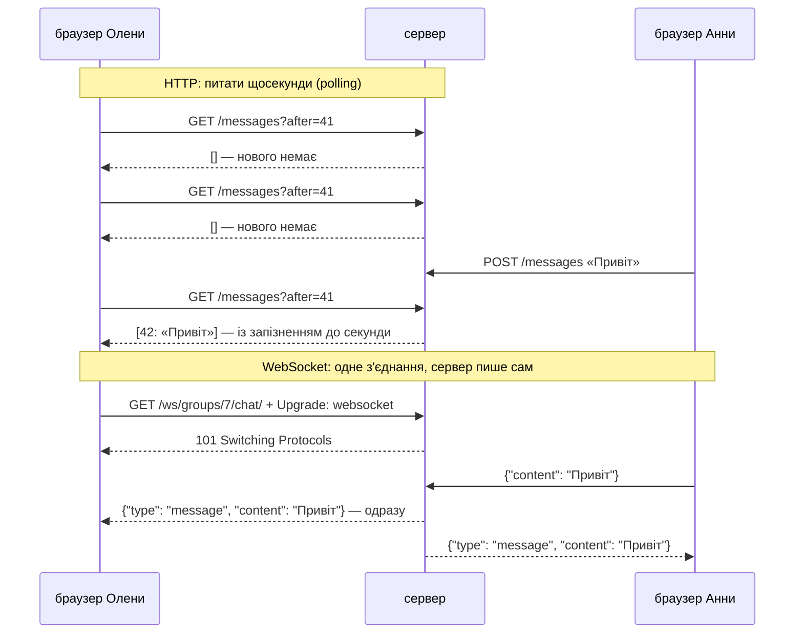
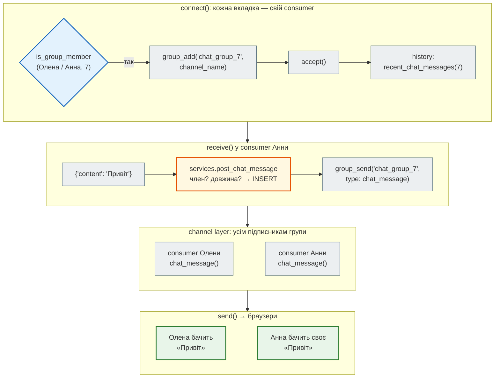
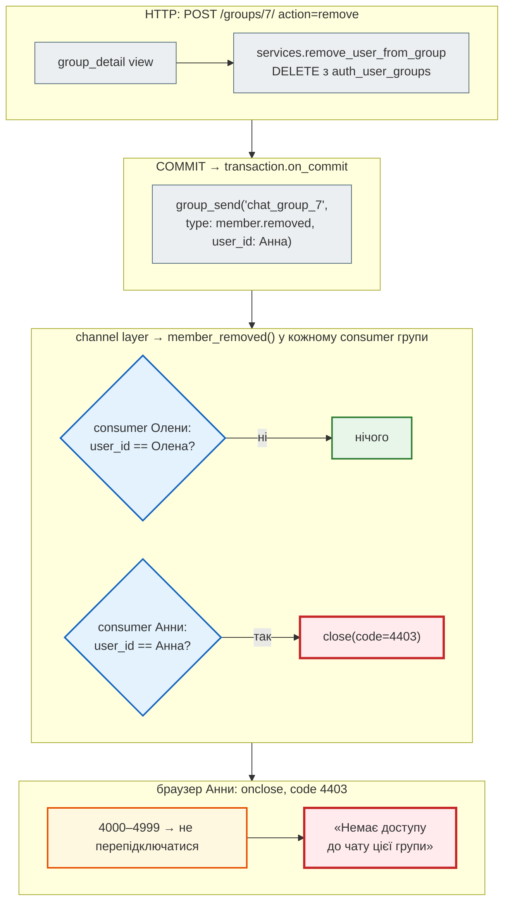
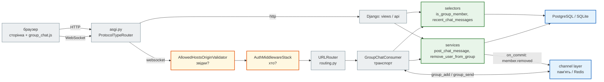

# Урок 45. WebSockets + практика: чат

У нотатках є групи: «Сім'я» бачить спільні нотатки й списки покупок (урок 40). Сьогодні група отримує **чат** — повідомлення з'являються в усіх учасників одразу, без оновлення сторінки.

HTTP так не вміє: розмову завжди починає браузер — «запитав → отримав». Щоб дізнатися про нове повідомлення, довелося б питати сервер щосекунди. **WebSocket** — постійний двосторонній канал: відкривається одним HTTP-запитом і лишається відкритим, писати в нього може і браузер, і сервер (урок 32, «WebSocket і SSE»).

Стартовий код чату — це крок 7B [Django-книги](https://nikoriakviktot.github.io/notes_chat_app/tutorials/07_async_django/): Django Channels, consumer, channel layer, JS-клієнт. Переносячи його в проєкт уроку 44, перевіряємо тим самим правилом: **consumer — ще один транспорт** над тими самими selectors і services. Дві знахідки дорогою:

- учасник, якого вилучили з групи, з відкритою вкладкою далі **читає й пише** в чат;
- будь-який сайт, відкритий у браузері учасника, може під'єднатися до чату від його імені.

| Урок | Django-гілка: застосунок нотаток | Проєкт |
|---|---|---|
| 33–35 | MVT, форми, DRF API | `crispy_notes_project` |
| 40 | групи, паролі, JWT | + групи |
| 44 | архітектура: правила доступу в selectors, CBV, PostgreSQL | + `tests_architecture.py` |
| **45** | **груповий чат на WebSocket: ASGI, Channels, consumer, channel layer (Redis)** | **+ `consumers.py`, `asgi.py`, `ChatMessage`** |
| 48–49 | Docker, деплой | — |

Проєкт: [`crispy_notes_project`](https://github.com/NikoriakViktot/PY-Course-Victor-Nikoriak-22-09-2026/tree/main/module_4/lessons/lesson_45_websocket_chat/crispy_notes_project).

**Що потрібно з попередніх уроків:** `asyncio`, `await`, цикл подій (урок 27); WebSocket і SSE серед типів API (32); Redis (30, 39); групи й правило «бачить група, змінює автор» (40); selectors / services і тест архітектури (44).

**Після уроку ти зможеш:**

- пояснити, чим WebSocket відрізняється від HTTP-запиту і коли він потрібен;
- підключити Django Channels: ASGI, `ProtocolTypeRouter`, routing, consumer;
- написати consumer як тонкий транспорт над selectors і services;
- розіслати повідомлення всім учасникам через channel layer — у пам'яті або в Redis;
- захистити WebSocket: автентифікація, права на кожне повідомлення, перевірка `Origin`;
- тестувати consumer без браузера і сервера — `WebsocketCommunicator`.

**Ноутбук заняття:** [Відкрити вправи в Colab](https://colab.research.google.com/github/NikoriakViktot/PY-Course-Victor-Nikoriak-22-09-2026/blob/main/module_4/lessons/lesson_45_websocket_chat/note_lesson_45_chat_student.ipynb){ .md-button .md-button--primary } [Переглянути розв’язки](https://github.com/NikoriakViktot/PY-Course-Victor-Nikoriak-22-09-2026/blob/main/module_4/lessons/lesson_45_websocket_chat/note_lesson_45_chat.ipynb){ .solutions-link } — чат з кількома «браузерами» прямо в ноутбуці, без сервера.

## Пригадай

1. Чому `time.sleep(2)` в `async def` зупиняє **всі** запити FastAPI-застосунку, а `await asyncio.sleep(2)` — ні (урок 37)?
2. Хто в проєкті нотаток відповідає на питання «чи учасник Анна групи 7?» — view, selector чи service (урок 44)?
3. Як браузер «пам'ятає», що ти увійшов, між запитами до Django (урок 40)?

??? success "Відповіді"

    1. Цикл подій один: `time.sleep` блокує його повністю, і жодна інша корутина не виконується. `await asyncio.sleep` віддає керування циклу — інші запити обробляються, поки ця корутина чекає.
    2. Selector (`groups_of(user)`, `get_group_with_members`): правило доступу живе в одному місці, views і API лише його викликають.
    3. Cookie `sessionid`: браузер надсилає його з кожним запитом до нашого сайту, Django за ним знаходить сесію й користувача. Сьогодні важливо: браузер надсилає цей cookie і тоді, коли запит ініціює **чужа** сторінка.

## Старт: з якого коду починаємо

| Звідки (`notes_chat_app/`) | Що там | Куди в проєкті |
|---|---|---|
| `notes_app/consumers.py` | `GroupChatConsumer`: `connect` / `receive` / `disconnect`, розсилка через channel layer | `hello_app/consumers.py` |
| `notes_project/asgi.py`, `routing.py` | `ProtocolTypeRouter`: HTTP → Django, WebSocket → `AuthMiddlewareStack` → `URLRouter` | `hello_project/asgi.py`, `routing.py` |
| `notes_app/models.py` — `ChatMessage` | повідомлення: група, автор, текст, час; індекс `(group, timestamp)` | `hello_app/models.py`, міграція `0004` |
| `group_chat.html`, `static/…/group_chat.js` | сторінка чату; клієнт на чистому JS: статус, перепідключення з backoff, `escapeHtml` | `hello_app/templates/…`, `hello_app/static/hello_app/js/` |
| `settings.py` | `daphne` першим в `INSTALLED_APPS`, `ASGI_APPLICATION`, `CHANNEL_LAYERS` (Redis за `REDIS_URL`, інакше в пам'яті) | `hello_project/settings.py` |
| `notes_app/tests/test_consumers.py` | 9 тестів `WebsocketCommunicator` | `hello_app/tests_consumers.py` — без змін, проходять |

Теорію кроку — WebSocket-протокол, ASGI-стек, налаштування Channels, consumer, JS-клієнт — книга пояснює посторінково (посилання в кінці кожного розділу). Тут — перенесення в наш проєкт і те, що з'ясувалося при перевірці.

## HTTP проти WebSocket { #http-vs-ws }



Polling робить сотні порожніх запитів і все одно запізнюється. WebSocket тримає одне з'єднання на вкладку, а сервер пише в нього, щойно є що сказати. Ціна — сервер тримає тисячі відкритих з'єднань. Потік на кожне (WSGI) цього не витримає; потрібен цикл подій — **ASGI**.

Поглиблено: [WebSocket-протокол і цикл подій](https://nikoriakviktot.github.io/notes_chat_app/tutorials/07_async_django/7b_websocket_protocol/).

## Рефакторинг 1. ASGI і Channels { #refactor-1 }

| Було (урок 44) | Стало (урок 45) | Навіщо |
|---|---|---|
| `asgi.py` — лише `get_asgi_application()` | `ProtocolTypeRouter`: `"http"` → Django, `"websocket"` → Channels | один процес обслуговує і сторінки, і WebSocket |
| `runserver` — WSGI | `daphne` першим в `INSTALLED_APPS` → `runserver` запускає ASGI | чат працює і в розробці, без окремої команди |
| — | `routing.py`: `ws/groups/<pk>/chat/` → `GroupChatConsumer` | «urls.py для WebSocket» |
| — | `CHANNEL_LAYERS`: Redis за `REDIS_URL`, інакше в пам'яті | розсилка повідомлень між з'єднаннями |

```python title="hello_project/asgi.py (фрагмент)"
os.environ.setdefault('DJANGO_SETTINGS_MODULE', 'hello_project.settings')

# get_asgi_application() ПОВИНЕН бути викликаний ДО будь-якого імпорту з hello_app (consumers, models)
django_asgi_app = get_asgi_application()

from channels.routing import ProtocolTypeRouter, URLRouter
from channels.auth import AuthMiddlewareStack
from channels.security.websocket import AllowedHostsOriginValidator
from hello_project.routing import websocket_urlpatterns


def websocket_application():
    ...
    return AllowedHostsOriginValidator(
        AuthMiddlewareStack(
            URLRouter(websocket_urlpatterns)
        )
    )


application = ProtocolTypeRouter({
    "http": ASGIStaticFilesHandler(django_asgi_app),
    "websocket": websocket_application(),
})
```

Порядок імпортів тут — не стиль, а вимога: `get_asgi_application()` запускає `django.setup()`, і лише після цього можна імпортувати моделі (через routing → consumers → selectors → models). Інакше `AppRegistryNotReady`.

Шари WebSocket-стеку — ззовні всередину: `AllowedHostsOriginValidator` (звідки прийшли — рефакторинг 4) → `AuthMiddlewareStack` (хто: `scope['user']` із cookie сесії) → `URLRouter` (куди: consumer і `group_pk`).

```python title="hello_project/settings.py (фрагмент)"
INSTALLED_APPS = [
    # Урок 45: daphne ПЕРШИМ — перевизначає runserver, щоб він запускався через ASGI (інакше WebSocket не працює)
    "daphne",
    "django.contrib.admin",
    ...
    "channels",                      # урок 45: WebSocket (consumers, channel layer)
    "hello_app",
]

ASGI_APPLICATION = "hello_project.asgi.application"   # урок 45: HTTP + WebSocket (hello_project/asgi.py)

REDIS_URL = os.environ.get("REDIS_URL")
if REDIS_URL:
    CHANNEL_LAYERS = {"default": {"BACKEND": "channels_redis.core.RedisChannelLayer",
                                  "CONFIG": {"hosts": [REDIS_URL]}}}
else:
    CHANNEL_LAYERS = {"default": {"BACKEND": "channels.layers.InMemoryChannelLayer"}}
```

Поглиблено: [ASGI-стек](https://nikoriakviktot.github.io/notes_chat_app/tutorials/07_async_django/7b_asgi_stack/), [налаштування Channels](https://nikoriakviktot.github.io/notes_chat_app/tutorials/07_async_django/7b_channels_settings/).

## Рефакторинг 2. Consumer — ще один транспорт { #refactor-2 }

Consumer — «view для WebSocket»: view обробляє один запит і завершується, consumer живе, поки відкрите з'єднання. До рефакторингу він сам ходив у базу — три власні ORM-хелпери:

```python title="notes_app/consumers.py (до рефакторингу, скорочено)"
    @database_sync_to_async
    def check_membership(self, group_pk, user):
        try:
            group = Group.objects.get(pk=group_pk)
            return group.user_set.filter(pk=user.pk).exists()
        except Group.DoesNotExist:
            return False

    @database_sync_to_async
    def load_history(self, group_pk): ...          # ChatMessage.objects… [:50]

    @database_sync_to_async
    def save_message(self, group_pk, user, content):
        return ChatMessage.objects.create(group_id=group_pk, author=user, content=content)
```

Правило «хто учасник групи» — вже вчетверте в проєкті (сторінки групи, нотатки групи, списки групи… і чат), і знову власною копією. За правилом уроку 44 consumer лише **вибирає** правило:

| Було (consumer до рефакторингу) | Стало | Де |
|---|---|---|
| `check_membership` — `Group.objects.get` + `user_set…exists()` | `selectors.is_group_member(user, group_pk)` | те саме правило, що `groups_of(user)` для сторінок |
| `load_history` — ORM у consumer | `selectors.recent_chat_messages(group_pk)` | повертає **список**, не QuerySet |
| `save_message` + перевірка довжини в `receive` | `services.post_chat_message(group_pk=…, author=…, content=…)` | правило тексту й членства — для будь-якого транспорту |

```python title="hello_app/selectors.py (фрагмент)"
def is_group_member(user, group_pk):
    """Те саме правило, що для сторінок групи: група є серед груп користувача."""
    return user.is_authenticated and groups_of(user).filter(pk=group_pk).exists()


def recent_chat_messages(group_pk, limit=50):
    """Останні `limit` повідомлень групи, від старих до нових — СПИСОК словників, а не QuerySet.

    Consumer працює в циклі подій, а ORM — синхронний: цю функцію викликають через
    database_sync_to_async, і SQL мусить виконатися всередині неї (list(...)). Лінивий QuerySet,
    повернутий у цикл подій, виконався б там — SynchronousOnlyOperation.
    """
    newest = (ChatMessage.objects.filter(group_id=group_pk)
              .order_by('-timestamp', '-id')[:limit]
              .values('id', 'author__username', 'content', 'timestamp'))
    return list(reversed(newest))
```

`.order_by('-timestamp', '-id')` — «найновіші 50», `reversed` — показати від старих до нових. Другий ключ `-id` потрібен, бо два повідомлення можуть отримати однаковий `timestamp`.

```python title="hello_app/services.py (фрагмент)"
CHAT_MESSAGE_MAX_LENGTH = 2000


def post_chat_message(*, group_pk, author, content):
    """Зберегти повідомлення чату. Одне правило для будь-якого транспорту (WebSocket, API, тест):

    - писати може лише учасник групи — перевірка на КОЖНЕ повідомлення, не лише при підключенні;
    - текст обрізаємо з країв; порожній або довший за CHAT_MESSAGE_MAX_LENGTH — ValidationError.
    """
    text = content.strip() if isinstance(content, str) else ''
    if not text:
        raise ValidationError('Порожнє повідомлення.')
    if len(text) > CHAT_MESSAGE_MAX_LENGTH:
        raise ValidationError(f'Повідомлення довше за {CHAT_MESSAGE_MAX_LENGTH} символів.')
    if not selectors.is_group_member(author, group_pk):
        raise PermissionDenied('Писати в чат може лише учасник групи.')
    return ChatMessage.objects.create(group_id=group_pk, author=author, content=text)
```

Consumer тепер — транспорт: розібрати кадр, викликати service, розіслати результат.

```python title="hello_app/consumers.py (фрагмент)"
    async def receive(self, text_data):
        try:
            content = json.loads(text_data).get('content', '')
        except (json.JSONDecodeError, AttributeError):
            return

        try:
            msg = await database_sync_to_async(services.post_chat_message)(
                group_pk=self.group_pk, author=self.user, content=content)
        except ValidationError:
            return                                   # порожнє чи задовге — ігноруємо, як і раніше
        except PermissionDenied:
            await self.close(code=CLOSE_NOT_ALLOWED)  # уже не учасник групи
            return

        await self.channel_layer.group_send(
            self.room_group_name,
            {
                'type': 'chat_message',
                'message_id': msg.id,
                'author': self.user.username,
                'content': msg.content,
                'timestamp': msg.timestamp.isoformat(),
            }
        )
```

`database_sync_to_async(f)(…)` — виконати синхронну функцію (ORM) у пулі потоків і дочекатися результату, не блокуючи цикл подій. Той самий selector чи service працює і з view (синхронно), і з consumer (через обгортку) — нічого не дублюється. `tests_architecture.py` уроку 44 тепер перевіряє й `consumers.py`: `.objects` у ньому немає.

### Життєвий цикл: два учасники, одне повідомлення

Олена й Анна відкрили чат групи 7. Анна пише «Привіт»:



`type: 'chat_message'` у `group_send` — ім'я **методу**, який channel layer викличе в кожному consumer групи (`chat.message` теж стане `chat_message`). Consumer Анни не надсилає своє повідомлення напряму — воно приходить до неї тим самим шляхом, що й до Олени, вже з `id` і часом із бази.

Поглиблено: [consumer: життєвий цикл, `database_sync_to_async`, `group_send`](https://nikoriakviktot.github.io/notes_chat_app/tutorials/07_async_django/7b_consumer/).

## Рефакторинг 3. Права — на кожне повідомлення { #refactor-3 }

Consumer до рефакторингу перевіряв членство **один раз** — у `connect()`. Далі з'єднання живе годинами. Що, якщо Анну вилучили з групи, а її вкладка лишилась відкритою? Справжній запуск стартового коду (`WebsocketCommunicator`, про нього — у розділі «Тести»):

```text
Анна в групі: False
Анна отримала: Обговорюємо подарунок для Анни
збережено від Анни: 1
```

Анна вже не учасниця, але отримує нові повідомлення й пише в чат — і її повідомлення зберігаються. Сторінка групи її вже не пустить (`404`), а відкритий WebSocket — пускає.

Правильно — дві речі:

1. **Service перевіряє членство на кожне повідомлення** (`post_chat_message` вище). Consumer отримує `PermissionDenied` і закриває з'єднання кодом `4403`.
2. **Вилучення з групи закриває відкриті чати одразу**, не чекаючи, поки людина щось напише. Service вилучення надсилає подію в channel layer — після COMMIT, коли зміна вже в базі:

```python title="hello_app/services.py (фрагмент)"
def remove_user_from_group(group, user):
    """Removes user from group. Урок 45: відкритий чат цього користувача в групі закривається."""
    group.user_set.remove(user)
    notify_chat(group.pk, {'type': 'member.removed', 'user_id': user.pk})


def notify_chat(group_pk, event):
    """Подія для всіх відкритих чатів групи — після COMMIT (раніше consumer міг би ще бачити старе членство)."""
    layer = get_channel_layer()
    if layer is not None:
        transaction.on_commit(lambda: async_to_sync(layer.group_send)(chat_group_name(group_pk), event))
```

```python title="hello_app/consumers.py (фрагмент)"
    async def member_removed(self, event):
        """services.remove_user_from_group: якщо вилучили саме нас — закрити з'єднання."""
        if event['user_id'] == self.user.pk:
            await self.close(code=CLOSE_NOT_ALLOWED)

    async def group_deleted(self, event):
        """services.delete_group: чату більше немає."""
        await self.close(code=CLOSE_NOT_ALLOWED)
```

Покроково — Олена вилучає Анну зі сторінки групи:



Подія йде **після COMMIT** з тієї ж причини, що інвалідація кешу в уроці 39: якби consumer отримав її до COMMIT і щось перевірив у базі, він побачив би старе членство.

Клієнт теж має знати про відмову. Стартовий JS при будь-якому закритті, крім 1000/1001, перепідключався з backoff до 30 секунд — безкінечно. Відмову в handshake (не учасник) браузер бачить як `1006`, так само як обрив мережі. Тепер коди `4000–4999` («застосунок відмовив») — без перепідключення, а після 5 невдалих спроб поспіль — повідомлення замість нових спроб:

```javascript title="hello_app/static/hello_app/js/group_chat.js (фрагмент)"
            if (event.code >= 4000 && event.code < 5000) {
                setStatus('forbidden');
                return;
            }
            if (event.code !== 1000 && event.code !== 1001) {
                failedAttempts += 1;
                if (failedAttempts > MAX_FAILED_ATTEMPTS) {
                    setStatus('gave_up');
                    return;
                }
                const jitter = Math.random() * 1000;
                setTimeout(connect, reconnectDelay + jitter);
                reconnectDelay = Math.min(reconnectDelay * 2, 30000);
            }
```

Налаштування клієнт бере зі сторінки: `group.pk` і ім'я — у `data-*` атрибутах прихованого `#chat-config`, без inline `<script>`. Пояснення в шаблоні — у ` … `: коментар `{# … #}` у Django лише **однорядковий**, багаторядковий потрапляє в HTML як текст. У шаблоні чату це не косметика. Слово `<script>` у такому «коментарі» браузер прочитав би як справжній тег, і все до наступного `</script>`, разом з `#chat-config`, стало б кодом JS. Тест `test_template_comments_are_not_rendered` перевіряє, що на сторінці немає `{#`.

Поглиблено: [JS-клієнт: статус, перепідключення, `escapeHtml`](https://nikoriakviktot.github.io/notes_chat_app/tutorials/07_async_django/7b_websocket_client/).

## Рефакторинг 4. Звідки прийшло з'єднання: `Origin` { #refactor-4 }

HTML-форми захищає CSRF-токен (урок 34). У WebSocket-рукостисканні токена немає, а cookie сесії браузер надсилає на наш сайт **з будь-якої сторінки**. Сайт `evil.example`, відкритий у сусідній вкладці, може виконати:

```javascript
new WebSocket("wss://notes.example/ws/groups/7/chat/")   // cookie Олени піде разом із запитом
```

…і отримає історію чату від імені Олени. Це **Cross-Site WebSocket Hijacking**. Справжній запуск стартового стеку (`AuthMiddlewareStack(URLRouter(...))`) з cookie Олени і заголовком `Origin: https://evil.example`:

```text
з evil.example: (True, None)
```

`(True, None)` — з'єднання прийнято. Браузер не дає сторінці підробити заголовок `Origin` — там завжди адреса сторінки, яка відкриває з'єднання. Тож сервер має його перевірити: `AllowedHostsOriginValidator` пускає лише `Origin` з `ALLOWED_HOSTS` (у `DEBUG` з порожнім списком — `localhost`, `127.0.0.1`, `[::1]`).

```python title="hello_app/tests_chat.py (фрагмент)"
    async def test_foreign_site_is_rejected(self):
        """Cookie сесії той самий, але сторінка — чужа: без перевірки Origin чат відкрився б."""
        self.assertFalse(await self.connect_from(b'https://evil.example'))
        self.assertFalse(await self.connect_from(b'http://localhost.evil.example'))
```

`localhost.evil.example` — перевірка того, що порівнюється весь домен, а не початок рядка (урок 41, `fakerbc.ua`).

!!! warning "На сервері — `DJANGO_ALLOWED_HOSTS`"
    Валідатор бере список з `ALLOWED_HOSTS`. Без `DJANGO_ALLOWED_HOSTS=notes.example` на сервері (`DEBUG=0`) список порожній — і чат не приймає **жодного** з'єднання. Валідатор читає налаштування один раз, при імпорті `asgi.py`; тому тести збирають стек функцією `websocket_application()` під `override_settings(ALLOWED_HOSTS=[...])`.

## Channel layer: пам'ять чи Redis { #channel-layer }

Channel layer — поштова служба між consumers: `group_add` підписує з'єднання на групу, `group_send` доставляє подію всім підписникам.

| | `InMemoryChannelLayer` | `RedisChannelLayer` |
|---|---|---|
| Де живуть групи | у пам'яті процесу | у Redis |
| Кілька процесів сервера | ні: Олена на процесі 1 не почує Анну на процесі 2 | так |
| Коли | розробка, тести, ноутбук | сервер (урок 48: кілька процесів у Docker) |
| У проєкті | без `REDIS_URL` | `REDIS_URL=redis://…` |

Ті самі 76 тестів проходять з обома шарами. Це також перевірка, що в подіях немає нічого, чого не можна передати через Redis: там лише JSON-сумісні значення (`user_id`, рядки, ISO-час), а не об'єкти моделей.

Поглиблено: [Redis і Channel Layer](https://nikoriakviktot.github.io/notes_chat_app/tutorials/09_deployment/redis/).

## Архітектура { #architecture }



- **Три транспорти — одні правила.** Сторінки, API і WebSocket викликають ті самі selectors і services. Правило «хто учасник групи» — одне, тож вилучення з групи діє скрізь одразу.
- **Consumer — тонкий.** Розібрати кадр, викликати service, розіслати результат або закрити з'єднання. ORM у ньому немає — це перевіряє `tests_architecture.py`.
- **Захист у шарах:** звідки (Origin) → хто (сесія) → чи учасник (connect) → чи ще учасник (кожне повідомлення, подія вилучення) → що бачить інший браузер (екранування на клієнті).

### Тести

| Файл | Що перевіряє | Скільки |
|---|---|---|
| `tests_consumers.py` | тести стартового проєкту без змін: підключення, відмова анонімові й чужому, розсилка, збереження, історія, ізоляція груп | 9 |
| `tests_chat.py` | service (межі тексту, членство, історія 50 з 55), сторінка чату, вилучення під час з'єднання, видалення групи, `Origin`, `escapeHtml` у Node.js | 18 |
| `tests_architecture.py` та інші з уроків 34–44 | + `consumers.py` без ORM | 49 |

`WebsocketCommunicator` — це «браузер» у тесті. Він підключається до consumer напряму, без сервера й мережі, і дає `connect()`, `send_json_to()`, `receive_json_from()`, `receive_nothing()`:

```python title="hello_app/tests_chat.py (фрагмент)"
    async def test_removed_member_is_disconnected(self):
        olena, ann = communicator_for(self.group.pk, self.olena), communicator_for(self.group.pk, self.ann)
        self.assertTrue((await olena.connect())[0])
        self.assertTrue((await ann.connect())[0])
        await database_sync_to_async(services.remove_user_from_group)(self.group, self.ann)
        closed = await ann.receive_output(timeout=1)
        self.assertEqual(closed, {'type': 'websocket.close', 'code': CLOSE_NOT_ALLOWED})
        self.assertTrue(await olena.receive_nothing(timeout=0.3))  # Олені — нічого: подія не для неї
```

Тести consumer — `TransactionTestCase`, а не `TestCase`: consumer ходить у базу з іншого потоку (`database_sync_to_async`), а транзакцію `TestCase` інший потік не бачить. Наприклад, дані з `setUp` для нього «не існують».

Справжній запуск:

```text
$ python manage.py test
............................................................................
----------------------------------------------------------------------
Ran 76 tests in 90.405s

OK
$ DATABASE_URL=postgres://… REDIS_URL=redis://localhost:6380/3 python manage.py test
...
Ran 76 tests in 92.025s

OK
```

`tests_chat.py` на стартовому коді дає 9 червоних тестів: консюмер не реагує на вилучення з групи (два тести), вилученому дозволено писати, `Origin` не перевіряється (три тести), ORM у consumer, JS перепідключається після відмови, багаторядковий `{# … #}` у шаблоні потрапляє на сторінку. 14 навмисних поломок нового коду — кожну ловить хоча б один тест.

Наживо — `runserver` (daphne) і два браузери (Playwright): повідомлення Анни з'являється в Олени без оновлення сторінки. `<b>Хліб</b>` показується як текст, а не жирним — `escapeHtml` працює. Боб (не в групі): сторінка чату — `404`, WebSocket — закрито в рукостисканні. Олена вилучає Анну на сторінці групи — у вкладці Анни статус «Немає доступу до чату цієї групи».

## Мінімальні версії залежностей { #min-versions }

```text title="requirements.txt (нове)"
channels>=4.0                        # урок 45: WebSocket — consumers, routing, channel layer
daphne>=4.0                          # урок 45: ASGI-сервер; першим в INSTALLED_APPS — runserver через ASGI
channels-redis>=4.0                  # урок 45: RedisChannelLayer (REDIS_URL); без Redis — InMemoryChannelLayer
```

Усі 76 тестів проходять на Python 3.10 з `channels` 4.0.0, `daphne` 4.0.0, `channels-redis` 4.0.0 і мінімальними версіями решти залежностей з уроку 44, а також на Python 3.13 з найновішими.

## Практика { #practice }

### Розібраний приклад: «хто зараз у чаті»

Задача: при підключенні й відключенні учасника всі в групі отримують `{"type": "presence", "user": "ann", "online": true}`.

Це подія для **транспорту**, а не бізнес-дія: у базу нічого не пишемо, правило доступу вже перевірено в `connect()`. Тож лише consumer:

```python title="hello_app/consumers.py (розв'язок)"
    async def connect(self):
        ...
        await self.accept()
        await self.channel_layer.group_send(self.room_group_name, {
            'type': 'presence', 'user': self.user.username, 'online': True})
        ...

    async def disconnect(self, close_code):
        if hasattr(self, 'room_group_name'):
            await self.channel_layer.group_send(self.room_group_name, {
                'type': 'presence', 'user': self.user.username, 'online': False})
            await self.channel_layer.group_discard(self.room_group_name, self.channel_name)

    async def presence(self, event):
        await self.send(text_data=json.dumps(event))
```

Тест — Олена підключена, Анна приходить і йде:

```python title="hello_app/tests_chat.py (розв'язок)"
    async def test_presence(self):
        olena, ann = communicator_for(self.group.pk, self.olena), communicator_for(self.group.pk, self.ann)
        await olena.connect()
        await olena.receive_json_from()                     # своя presence
        await ann.connect()
        self.assertEqual(await olena.receive_json_from(), {'type': 'presence', 'user': 'ann', 'online': True})
        await ann.disconnect()
        self.assertEqual(await olena.receive_json_from(), {'type': 'presence', 'user': 'ann', 'online': False})
        await olena.disconnect()
```

`connect` розсилає presence усій групі, куди consumer уже доданий (`group_add` вище), тож кожен отримує і **власну** presence — звідси перший `receive_json_from()` у тесті. `disconnect` розсилає `online: False` іншим і відписується з групи.

`test_presence` зелений, але разом з ним червоніють 10 наявних тестів. Справжній вивід:

```text
FAIL: test_message_broadcast_to_other_member (hello_app.tests_consumers.GroupChatConsumerMessagesTest...)
AssertionError: 'presence' != 'message'
FAIL: test_message_stays_within_group (hello_app.tests_consumers.GroupChatMultipleGroupsTest...)
AssertionError: False is not true : Carol не має отримувати повідомлення з іншої групи
...
FAILED (failures=9, errors=1)
```

Ці тести читали «наступний кадр» і чекали `message` або тиші (`receive_nothing`), а тепер першою приходить `presence`. Carol справді не отримала нічого з чужої групи — вона отримала **свою** presence. Це зміна **протоколу**: кожен клієнт, який розраховував на порядок кадрів, мусить знати про новий тип. Тести це показали. Їх оновлюють: пропускають кадри `presence`, де вони не перевіряються. JS-клієнт кадри невідомого типу пропускає (`if (data.type === 'history' || data.type === 'message')`), тож щоб показати «онлайн», йому потрібна окрема гілка в `onmessage`.

### Зміни приклад

1. Прибери `AllowedHostsOriginValidator` з `websocket_application()` (лиши `AuthMiddlewareStack(URLRouter(...))`) і запусти `python manage.py test hello_app.tests_chat hello_app.tests_consumers`. Які тести впали?
2. У `recent_chat_messages` заміни `return list(reversed(newest))` на `return newest` — QuerySet замість списку. Що станеться в consumer і чому тести це бачать?

??? success "Що покаже запуск"

    1. Червоні 3 тести, усі з `ChatOriginTests`. `test_foreign_site_is_rejected` і `test_no_origin_is_rejected`: `AssertionError: True is not false` — чужий сайт і запит без `Origin` підключились. `test_application_uses_the_origin_check`: зовнішній шар стека тепер `CookieMiddleware`, а не `OriginValidator`. Решта 24 зелені: з власної сторінки чат працює як і раніше, тож без цих тестів дірку ніхто б не помітив.
    2. `FAILED (failures=1, errors=13)`. Лінивий QuerySet повертається з `database_sync_to_async` невиконаним, а `for msg in history` у `connect()` виконує SQL уже в циклі подій — `SynchronousOnlyOperation`. Consumer падає при кожному підключенні, тому червоніють майже всі тести з WebSocket. Тест сервісу ловить ту саму помилку ще до consumer: `<QuerySet [...]> is not an instance of <class 'list'>`. А порядок у ньому від нових до старих — `reversed(...)` теж зник.

### Спробуй самостійно: «друкує…»

Коли учасник набирає текст, інші бачать «Анна друкує…». Клієнт надсилає `{"typing": true}` не частіше ніж раз на 2 секунди; consumer розсилає `{"type": "typing", "user": "ann"}` усім, **крім** автора; у базу нічого не пишеться.

**Критерії перевірки:** тест з двома `WebsocketCommunicator`: Олена отримує `typing` від Анни, Анна свого не отримує (`receive_nothing`); `{"typing": true}` від вилученого з групи учасника закриває його з'єднання кодом 4403; `tests_architecture` зелений.

### Знайди помилку { #find-bug }

Consumer з тестом — обидва з перенесеного коду, тест зелений:

```python
class GroupChatConsumer(AsyncWebsocketConsumer):
    async def connect(self):
        self.user = self.scope['user']
        self.group_pk = int(self.scope['url_route']['kwargs']['group_pk'])
        if not await self.check_membership(self.group_pk, self.user):
            await self.close()
            return
        self.room_group_name = f"chat_group_{self.group_pk}"
        await self.channel_layer.group_add(self.room_group_name, self.channel_name)
        await self.accept()

    async def receive(self, text_data):
        content = json.loads(text_data).get('content', '').strip()
        if not content or len(content) > 2000:
            return
        msg = await self.save_message(self.group_pk, self.user, content)
        await self.channel_layer.group_send(self.room_group_name, {'type': 'chat_message', ...})


async def test_non_member_rejected(self):
    outsider = await User.objects.acreate_user(username='outsider', password='pass')
    communicator = _make_communicator(self.group.pk, outsider)
    connected, _ = await communicator.connect()
    self.assertFalse(connected)
```

Хто може писати в цей чат? Відповідь — справжній вивід на цьому коді:

```text
Анна в групі: False
Анна отримала: Обговорюємо подарунок для Анни
збережено від Анни: 1
```

??? success "Відповідь"

    Членство перевіряється **один раз** — у `connect()`. WebSocket-з'єднання живе годинами. Хто був учасником у момент підключення, той лишається «учасником» для цього consumer, навіть коли його вже вилучили з групи: він отримує нові повідомлення (його канал досі в групі channel layer) і пише (у `receive` перевірки немає).

    Тест перевіряв **момент підключення**. У HTTP кожен запит — новий `connect()`, тож «перевірити при вході» достатньо. У WebSocket права треба перевіряти протягом усього з'єднання: на кожне повідомлення (`services.post_chat_message`) і за подією, коли права змінились (`member.removed` → `close(4403)`). Тест на це — `test_removed_member_is_disconnected`: вилучення **під час** відкритого з'єднання.

## Підсумок

| Поняття | Що запам'ятати |
|---|---|
| WebSocket | одне з'єднання, писати можуть обидві сторони; відкривається HTTP-запитом з `Upgrade` |
| ASGI | цикл подій тримає тисячі з'єднань; `ProtocolTypeRouter`: HTTP → Django, WebSocket → Channels |
| Consumer | «view для WebSocket», живе, поки відкрите з'єднання; тонкий транспорт над selectors/services |
| `database_sync_to_async` | ORM у пулі потоків; selector повертає список, не QuerySet |
| Channel layer | `group_add` / `group_send` / `type` → метод; пам'ять — один процес, Redis — кілька |
| Права | Origin → сесія → членство при `connect` → на кожне повідомлення → подія вилучення (`4403`) |
| XSS | сервер зберігає текст як є; екранує клієнт перед `innerHTML` (`escapeHtml`) |
| Тести | `WebsocketCommunicator` + `TransactionTestCase`; ті самі тести з обома channel layers |

### Самоперевірка

1. Чому для WebSocket потрібен ASGI, а не WSGI?
2. Навіщо `get_asgi_application()` викликати до імпорту `routing`?
3. Що станеться, якщо `recent_chat_messages` поверне QuerySet?
4. Чому перевірки членства в `connect()` недостатньо?
5. Від чого захищає `AllowedHostsOriginValidator` і чому CSRF-токен тут не допоможе?
6. Олена на процесі сервера 1, Анна — на процесі 2, channel layer у пам'яті. Що побачать вони в чаті?

??? success "Відповіді"

    1. WSGI — «запит → відповідь → кінець» і потік на запит. WebSocket-з'єднання відкрите годинами; тисяча вкладок — тисяча потоків, що чекають. ASGI обслуговує їх одним циклом подій.
    2. `get_asgi_application()` виконує `django.setup()`. `routing` імпортує consumers, ті — selectors і моделі; до `setup()` — `AppRegistryNotReady`.
    3. SQL виконається не в `database_sync_to_async`, а там, де по ньому пройдуть циклом, — у циклі подій. Django кидає `SynchronousOnlyOperation`.
    4. З'єднання живе довше за права: вилученого з групи учасника consumer і далі вважає своїм. Перевірка потрібна на кожне повідомлення плюс подія, яка закриває з'єднання, коли права змінились.
    5. Від Cross-Site WebSocket Hijacking: чужа сторінка відкриває WebSocket до нашого сайту, і браузер додає cookie сесії. У рукостисканні немає CSRF-токена, але є `Origin`, який сторінка не може підробити.
    6. Кожен бачить лише свої повідомлення: групи channel layer у пам'яті — окремі в кожному процесі. Потрібен `RedisChannelLayer` — спільні групи для всіх процесів.

### Що далі

- Ноутбук заняття: [Відкрити вправи в Colab](https://colab.research.google.com/github/NikoriakViktot/PY-Course-Victor-Nikoriak-22-09-2026/blob/main/module_4/lessons/lesson_45_websocket_chat/note_lesson_45_chat_student.ipynb){ .md-button .md-button--primary } [Переглянути розв’язки](https://github.com/NikoriakViktot/PY-Course-Victor-Nikoriak-22-09-2026/blob/main/module_4/lessons/lesson_45_websocket_chat/note_lesson_45_chat.ipynb){ .solutions-link }.
- Урок 46 — Security advanced: CSWSH і права на кожне повідомлення — частина ширшої картини.
- Уроки 48–49 — Docker і деплой: кілька процесів сервера, Redis як channel layer, `DJANGO_ALLOWED_HOSTS`.

## Документація і джерела

- Код: [`crispy_notes_project`](https://github.com/NikoriakViktot/PY-Course-Victor-Nikoriak-22-09-2026/tree/main/module_4/lessons/lesson_45_websocket_chat/crispy_notes_project) — проєкт уроку 44 + чат зі стартового `notes_chat_app`.
- Django-книга, крок 7B: [огляд кроку](https://nikoriakviktot.github.io/notes_chat_app/tutorials/07_async_django/), [WebSocket-протокол](https://nikoriakviktot.github.io/notes_chat_app/tutorials/07_async_django/7b_websocket_protocol/), [ASGI-стек](https://nikoriakviktot.github.io/notes_chat_app/tutorials/07_async_django/7b_asgi_stack/), [налаштування Channels](https://nikoriakviktot.github.io/notes_chat_app/tutorials/07_async_django/7b_channels_settings/), [consumer](https://nikoriakviktot.github.io/notes_chat_app/tutorials/07_async_django/7b_consumer/), [JS-клієнт](https://nikoriakviktot.github.io/notes_chat_app/tutorials/07_async_django/7b_websocket_client/), [чекпоінт](https://nikoriakviktot.github.io/notes_chat_app/tutorials/07_async_django/checkpoint/); [тести consumers](https://nikoriakviktot.github.io/notes_chat_app/tutorials/06_testing/test_consumers/); [Redis і Channel Layer](https://nikoriakviktot.github.io/notes_chat_app/tutorials/09_deployment/redis/).
- Django Channels: [tutorial](https://channels.readthedocs.io/en/latest/tutorial/index.html), [consumers](https://channels.readthedocs.io/en/latest/topics/consumers.html), [channel layers](https://channels.readthedocs.io/en/latest/topics/channel_layers.html), [security — `AllowedHostsOriginValidator`](https://channels.readthedocs.io/en/latest/topics/security.html), [testing — `WebsocketCommunicator`](https://channels.readthedocs.io/en/latest/topics/testing.html), [database access](https://channels.readthedocs.io/en/latest/topics/databases.html).
- Протокол: [RFC 6455 — The WebSocket Protocol](https://www.rfc-editor.org/rfc/rfc6455) (коди закриття — §7.4; 4000–4999 — для застосунків); [MDN — WebSocket API](https://developer.mozilla.org/en-US/docs/Web/API/WebSocket); [OWASP — Cross-Site WebSocket Hijacking](https://owasp.org/www-project-web-security-testing-guide/latest/4-Web_Application_Security_Testing/11-Client-side_Testing/10-Testing_WebSockets).
- Урок 27 курсу — [asyncio](../m2/lesson_27.md); урок 32 — [типи API: WebSocket і SSE](lesson_32.md); урок 44 — [архітектура](lesson_44.md).
