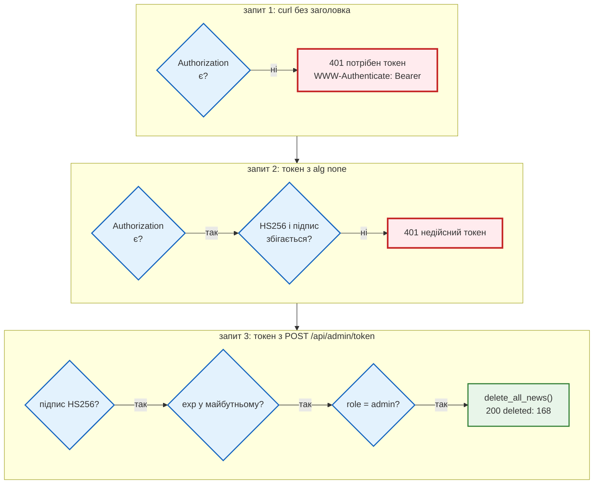
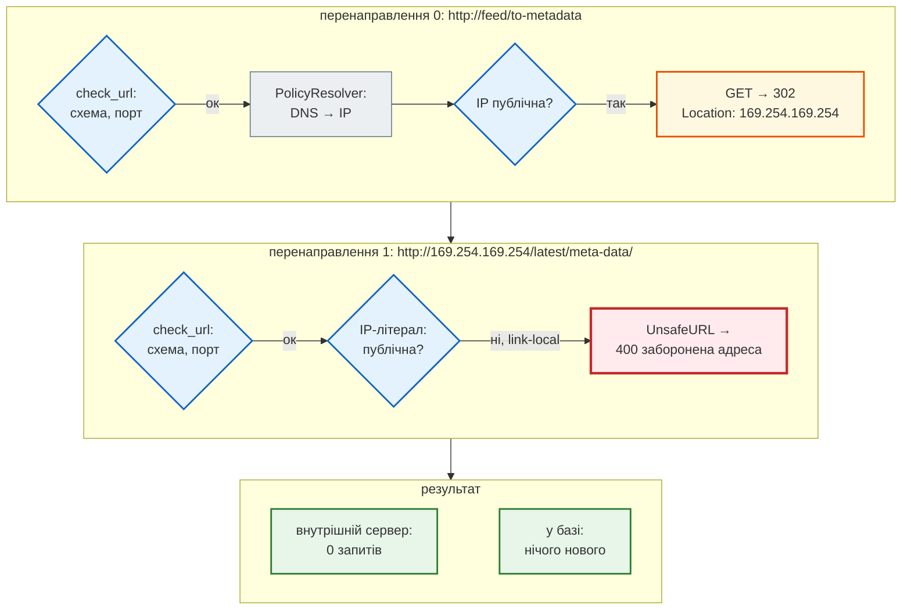
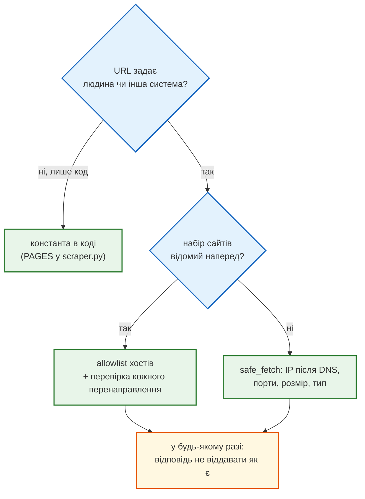
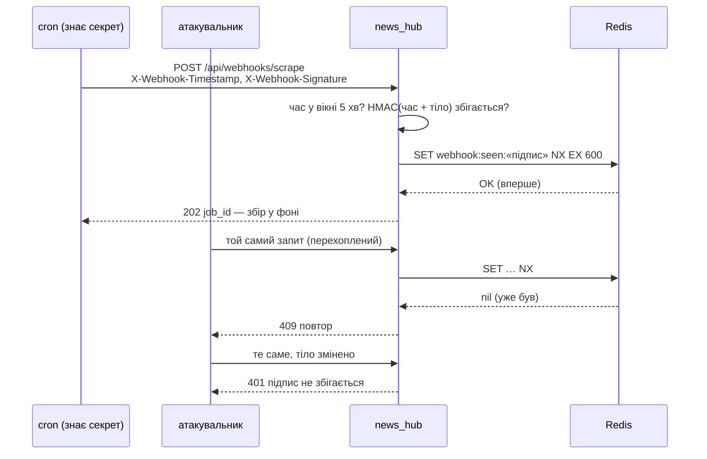
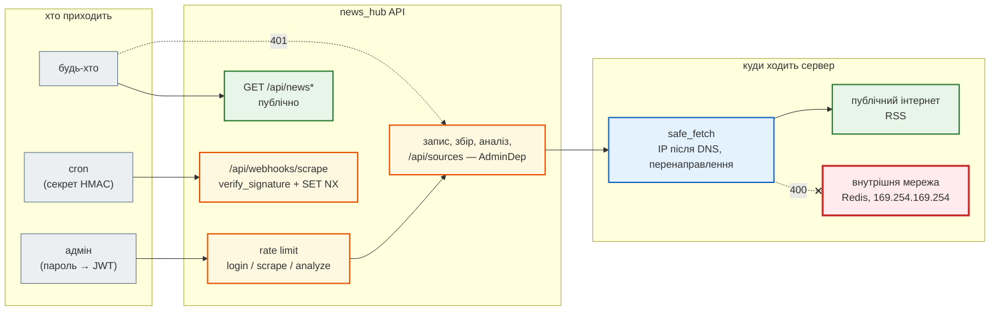

# Урок 47. Security advanced

Агрегатор уроку 44 уміє багато: збирає новини, аналізує їх платною моделлю, дає повний CRUD. Але **хто завгодно** може зробити це за нього. Справжній запуск проєкту уроку 44:

```text
$ curl -X POST http://127.0.0.1:8000/api/scrape -d '{"source": "snapshot"}'      → news_saved: 168
$ curl -X DELETE http://127.0.0.1:8000/api/news
{"deleted":168}
$ curl -X POST http://127.0.0.1:8000/api/analyze/jobs -d '{"limit": 200}'        → HTTP 202
```

Жодного пароля. Один запит стер базу, інший запустив аналіз 200 новин за наш рахунок.

В уроці 41 ми вже закрили вхід у Django-застосунок: сесії, CSRF, JWT для API, групи. Сьогодні — три загрози, які з'являються, коли API **живе в мережі серед інших систем**:

1. **Хто може писати.** Адмін отримує JWT за паролем. Кожен ендпоінт запису без токена відповідає `401`, а тест стежить, щоб новий ендпоінт не «забув» захист.
2. **Куди ходить сервер (SSRF).** Адмін додає RSS-джерело за URL, і сервер його завантажує. Але сервер стоїть **усередині** мережі: він бачить localhost, Redis, базу й адресу метаданих хмари `169.254.169.254`. URL — це прохання до сервера сходити туди від свого імені.
3. **Хто нам пише (webhook).** Зовнішній планувальник запускає збір запитом до нас. Адреса публічна, тож відрізнити справжній запит від підробленого можна лише за підписом.

Стартовий код: адмін-JWT і webhook Telegram з `production_bot`, захист від SSRF — з `OWASP_TOP_10.md`. Кожен шматок переносимо і перевіряємо тестом на атаку.

| Урок | Крок агрегатора |
|---|---|
| 36–39 | парсер і модель, FastAPI, база, Redis |
| 41–43 | тести; Claude Code і RSS-джерело; аналіз LLM |
| **46** | **безпека: запис лише адміну з JWT, RSS-джерела за URL без SSRF, підписані webhook** |
| 47 | Telegram-бот: `/news`, `/digest`, webhook Telegram |
| 48–50 | Docker, Compose, CI/CD |

Проєкт: [`news_hub`](https://github.com/NikoriakViktot/PY-Course-Victor-Nikoriak-22-09-2026/tree/main/module_4/lessons/lesson_47_security_advanced/news_hub).

**Що потрібно з попередніх уроків:** JWT — будова, підпис, `exp` (урок 41); `Depends` і `dependency_overrides` (37); Alembic (38); Redis, `SET NX`, rate limit (39); тести API й локальний aiohttp-сервер замість мережі (41); HTTP-перенаправлення й DNS (31).

**Після уроку ти зможеш:**

- закрити ендпоінти запису JWT-адміна і довести тестом, що жоден не лишився відкритим;
- зберігати пароль як bcrypt-хеш і не підказувати атакувальнику, що саме не так;
- завантажувати URL від користувача без SSRF: перевірка IP після DNS, кожного перенаправлення, розміру й типу;
- приймати webhook з підписом HMAC, вікном часу й захистом від повтору;
- відрізняти, які перевірки ловлять тести, а які — лише рецензія (порівняння секретів за сталий час).

**Ноутбук заняття:** [Відкрити вправи в Colab](https://colab.research.google.com/github/NikoriakViktot/PY-Course-Victor-Nikoriak-22-09-2026/blob/main/module_4/lessons/lesson_47_security_advanced/note_lesson_47_security_student.ipynb){ .md-button .md-button--primary } [Переглянути розв’язки](https://github.com/NikoriakViktot/PY-Course-Victor-Nikoriak-22-09-2026/blob/main/module_4/lessons/lesson_47_security_advanced/note_lesson_47_security.ipynb){ .solutions-link } — підробка токенів, SSRF на локальних серверах, підпис webhook; мережа не потрібна.

## Пригадай

1. З чого складається JWT і що саме перевіряє сервер, коли його отримує (урок 41)?
2. Чим `SET key value NX EX 60` у Redis відрізняється від `GET`, а потім `SET` (урок 40)?
3. Що робить браузер чи `requests`, коли сервер відповідає `302` з `Location` (урок 32)?

??? success "Відповіді"

    1. `header.payload.signature`, кожна частина — base64. Сервер рахує HMAC від `header.payload` своїм секретом і порівнює з підписом, потім дивиться `exp`. Payload **не зашифрований**: прочитати може будь-хто, змінити без секрету — ні.
    2. `SET NX` — одна атомарна команда «запиши, якщо ключа ще немає»; відповідь каже, чи вийшло. `GET` + `SET` — два кроки, між якими встигне інший запит.
    3. Робить новий запит на адресу з `Location` — сам, без питань. Ця адреса може вести куди завгодно, зокрема на інший хост.

## Старт: з якого коду починаємо

| Звідки | Що там | Куди в `news_hub` |
|---|---|---|
| `production_bot/backend/core/security.py` | хеш пароля, `create_access_token`, `decode_token` | `news_hub/security.py` |
| `production_bot/backend/api/deps.py`, `api/admin/auth.py` | `get_current_admin` (401 / 403), `POST /admin/auth/token` | `require_admin`, `POST /api/admin/token` |
| `production_bot/backend/core/config.py` | `JWT_SECRET`, `ADMIN_PASSWORD`, `WEBHOOK_SECRET` зі змінних середовища | `load_admin_settings`, `load_webhook_secret` |
| `production_bot/backend/api/webhook.py` | webhook Telegram: секретний шлях + заголовок | `news_hub/webhooks.py` |
| `OWASP_TOP_10.md` | A10 SSRF: «небезпечне завантаження аватара з URL» і захист | `news_hub/safe_fetch.py` |

Теорію — що таке JWT, bcrypt, OWASP Top 10 — урок 41 уже пояснив. Тут — як ці шматки поводяться в **нашому** проєкті і які атаки їх обходять.

## Рефакторинг 1. Адмін і JWT { #refactor-1 }

### Хеш пароля: bcrypt без passlib

Старий `security.py` хешує через `passlib`, а `admin/auth.py` робить це **при імпорті модуля**:

```python title="production_bot/backend/api/admin/auth.py (стартовий код)"
_ADMIN_PASSWORD_HASH = hash_password(settings.ADMIN_PASSWORD)
```

`passlib` не оновлювався з 2020 року, а `bcrypt` 5 змінив поведінку. Справжній вивід на чистій установці (`passlib 1.7.4`, `bcrypt 5.0.0`):

```text
(trapped) error reading bcrypt version
ValueError: password cannot be longer than 72 bytes, truncate manually if necessary (e.g. my_password[:72])
```

Помилка — при імпорті, тож застосунок не стартує взагалі. Тепер `bcrypt` напряму:

```python title="news_hub/security.py"
def hash_password(password: str, rounds: int = 12) -> str:
    """bcrypt: сіль у самому хеші, 2^rounds ітерацій — навмисно повільно (~0,2 с при 12)."""
    data = password.encode()
    if len(data) > BCRYPT_MAX_BYTES:
        raise ValueError(f"пароль довший за {BCRYPT_MAX_BYTES} байти: bcrypt його не прийме")
    return bcrypt.hashpw(data, bcrypt.gensalt(rounds)).decode()


def verify_password(password: str, password_hash: str) -> bool:
    data = password.encode()
    if len(data) > BCRYPT_MAX_BYTES:        # bcrypt ≥ 5 кидає ValueError — для нас це просто «не той пароль»
        return False
    return bcrypt.checkpw(data, password_hash.encode())
```

Межа 72 байти — властивість самого алгоритму bcrypt. Старші версії мовчки обрізали довший пароль, `bcrypt` 5 кидає `ValueError` і в `checkpw`. Без перевірки довжини запит на вхід з довгим паролем закінчувався б `500`. Тест `test_bad_login_is_one_answer` надсилає 100 літер «я» (200 байт) і чекає `401`.

У середовищі — **хеш**, а не пароль: `python -m news_hub.security` питає пароль і друкує рядки для `.env`.

### Налаштування: без «change-me»

```python title="production_bot/backend/core/config.py (стартовий код)"
JWT_SECRET: str = os.getenv("JWT_SECRET", "change-me-in-production")
ADMIN_PASSWORD: str = os.getenv("ADMIN_PASSWORD", "change-me")
```

`validate()` перевіряє лише «не порожній», тож значення за замовчуванням проходить. Хто прочитав код (а він публічний), той підпише токен сам. Справжній вивід:

```text
validate() пропускає: True
підроблений токен приймається: {'sub': 'admin', 'role': 'admin', 'exp': 1790577575}
```

PyJWT сам попереджає: `InsecureKeyLengthWarning: The HMAC key is 23 bytes long, which is below the minimum recommended length of 32 bytes`.

```python title="news_hub/security.py"
def load_admin_settings(env: Mapping[str, str] = os.environ) -> AdminSettings | None:
    """None — адмінку не налаштовано (ендпоінти запису → 503). Налаштовано погано — RuntimeError при старті."""
    secret, password_hash = env.get("JWT_SECRET", ""), env.get("ADMIN_PASSWORD_HASH", "")
    if not secret and not password_hash:
        return None
    if len(secret) < MIN_SECRET_LENGTH:
        raise RuntimeError(f"JWT_SECRET має бути не коротшим за {MIN_SECRET_LENGTH} символи; "
                           "згенеруй: python -m news_hub.security")
    ...
```

Три стани, і жоден не «працює з дефолтним секретом»:

- **нічого не задано** — читати можна, запис відповідає `503 адмін-доступ не налаштовано`;
- **задано погано** — застосунок не стартує;
- **задано добре** — працює.

Справжній запуск з секретом зі стартового конфігу:

```text
$ JWT_SECRET=change-me-in-production uvicorn news_hub.api:app
RuntimeError: JWT_SECRET має бути не коротшим за 32 символи; згенеруй: python -m news_hub.security
ERROR:    Application startup failed. Exiting.
```

### Токен і перевірка

| Було (`production_bot`) | Стало (`news_hub/security.py`) | Чому |
|---|---|---|
| `JWT_ALGORITHM` зі змінної середовища | `JWT_ALGORITHM = "HS256"` у коді | алгоритм — не налаштування; `decode` приймає лише його |
| `jwt.decode(token, secret, algorithms=[...])` | + `options={"require": ["exp", "sub", "role"]}` | токен без `exp` жив би вічно |
| `if body.username != settings.ADMIN_USERNAME: raise 401` — пароль уже не перевіряється | `hmac.compare_digest` для імені, bcrypt — **завжди** | інакше чуже ім'я відповідає за мілісекунду, а своє — за 200 мс: за часом видно, що ім'я вгадали |
| `HTTPBearer()` — кидає сам | `HTTPBearer(auto_error=False)` + свої 401 з `WWW-Authenticate: Bearer` | зрозумілі причини: «потрібен токен», «прострочений», «недійсний» |
| без обмеження спроб | 5 спроб входу за 5 хв з адреси → `429` | bcrypt сповільнює кожну спробу, ліміт — їхню кількість |

```python title="news_hub/security.py"
def require_admin(settings: AdminSettingsDep,
                  credentials: Annotated[HTTPAuthorizationCredentials | None, Depends(bearer_scheme)]) -> str:
    """401 — немає токена, підроблений чи прострочений; 403 — токен справжній, але не адміна."""
    if credentials is None:
        raise _unauthorized("потрібен токен: Authorization: Bearer <access_token>")
    try:
        payload = decode_token(settings, credentials.credentials)
    except jwt.ExpiredSignatureError as error:
        raise _unauthorized("токен прострочений") from error
    except jwt.InvalidTokenError as error:
        raise _unauthorized("недійсний токен") from error
    if payload["role"] != "admin":
        raise HTTPException(status.HTTP_403_FORBIDDEN, detail="потрібні права адміністратора")
    return payload["sub"]


AdminDep = Depends(require_admin)
```

Шлях запиту `DELETE /api/news` через цю залежність — покроково, на трьох запитах:



### Хто може писати — і тест, що нічого не забули

Захист — `dependencies=[AdminDep]` у декораторі: 10 наявних ендпоінтів (запис, збір, аналіз і статуси задач) і 4 нові `/api/sources` — разом 14:

```python title="news_hub/api.py (фрагмент)"
@app.delete("/api/news", tags=["news"], dependencies=[AdminDep])
async def delete_all_news(repo: RepoDep) -> dict[str, int]:
    return {"deleted": await repo.clear()}
```

Небезпека такого захисту — **забути** його на новому ендпоінті. Тому тест не перебирає ендпоінти вручну. Він обходить усі маршрути застосунку і шукає `require_admin` у дереві залежностей кожного:

```python title="tests/integration/test_admin_api.py"
# Єдині ендпоінти без токена адміна. Новий ендпоінт сюди не потрапить сам: або AdminDep, або рішення тут.
PUBLIC = {
    ("GET", "/health"), ("GET", "/api/news"), ("GET", "/api/news/search"), ("GET", "/api/news/count"),
    ("GET", "/api/news/stats"), ("GET", "/api/news/{news_id}"),
    ("POST", "/api/admin/token"),                   # вхід — пароль
    ("POST", "/api/webhooks/scrape"),               # свій захист — підпис HMAC (test_webhooks_api.py)
}


def test_every_other_endpoint_requires_admin() -> None:
    unprotected = {(method, path) for method, path, route in endpoints() if not admin_protected(route)}
    assert unprotected == PUBLIC
```

А параметризований `test_anonymous_gets_401` сам надсилає анонімний запит на кожен закритий маршрут і чекає `401`. Додав ендпоінт без `AdminDep` — червоний тест, і в повідомленні про падіння видно, який саме.

Наживо (uvicorn, `LLM_PROVIDER=fake`):

```text
$ curl -X DELETE http://127.0.0.1:8000/api/news
HTTP/1.1 401 Unauthorized
www-authenticate: Bearer
{"detail":"потрібен токен: Authorization: Bearer <access_token>"}

$ curl -X POST .../api/admin/token -d '{"username":"admin","password":"guess"}'
{"detail":"неправильне ім'я або пароль"}

$ curl -X POST .../api/scrape -H "Authorization: Bearer $TOKEN" -d '{"source":"snapshot"}'
→ news_saved: 168, news_total: 168
```

У Swagger (`/docs`) з'явилась кнопка **Authorize**: `HTTPBearer` описує схему в OpenAPI, і закриті ендпоінти позначено замком. Колекція Postman отримала запит «Вхід адміна», який зберігає `token` у змінну. `newman run … --env-var adminPassword=…` дає 19 запитів і 27 перевірок, 0 падінь.

Поглиблено: урок 41 курсу — [JWT для API](lesson_41.md); FastAPI — [OAuth2 з JWT](https://fastapi.tiangolo.com/tutorial/security/oauth2-jwt/).

## Рефакторинг 2. SSRF: куди ходить сервер { #refactor-2 }

Нова можливість: адмін додає RSS-джерело за адресою (`POST /api/sources`), сервер завантажує стрічку (`POST /api/sources/{id}/fetch`) і пропускає її через той самий `parse_pravda_rss` → `NewsItem`. Таблиця `sources` — міграція `0003`.

**SSRF** (Server-Side Request Forgery, OWASP A10): атакувальник не може дістатися внутрішньої мережі сам, але може попросити сервер. Що ховається за «внутрішніми» адресами:

| Адреса | Що там буває |
|---|---|
| `127.0.0.1`, `localhost`, `[::1]` | сам сервер: Redis без пароля, адмінки, debug-панелі |
| `10.x`, `172.16–31.x`, `192.168.x` | інші сервіси компанії |
| `169.254.169.254` | **метадані хмари** (AWS, GCP, Azure): тимчасові ключі доступу до всього акаунта |
| `0.0.0.0`, `100.64.x` | «цей хост», мережа провайдера |

### Старий захист: перевірити рядок

```python title="OWASP_TOP_10.md, A10 (стартовий код)"
ALLOWED_HOSTS_FOR_FETCH = ['i.imgur.com', 'avatars.githubusercontent.com']

def is_safe_url(url):
    parsed = urlparse(url)
    return parsed.hostname in ALLOWED_HOSTS_FOR_FETCH

def upload_avatar(request):
    url = request.POST.get('avatar_url')
    if not is_safe_url(url):
        raise PermissionDenied
    response = requests.get(url)
```

Перевірено **рядок** URL, а з'єднання йде туди, куди скаже мережа. Хто керує дозволеним сайтом (чи знайшов у ньому «відкрите перенаправлення»), відповідає `302` на внутрішню адресу, а `requests.get` іде за перенаправленням сам. Справжній вивід цього коду на двох локальних серверах («дозволений» і «внутрішній»):

```text
is_safe_url: True
фінальна адреса: http://localhost:39855/latest/meta-data/
відповідь: INTERNAL: aws_secret_access_key=...
```

Для нашого випадку allowlist ще й не підходить: адмін має додавати будь-яке RSS, а не три наперед відомі сайти.

### Нова перевірка: адреса з'єднання

`safe_fetch` перевіряє не рядок, а **IP, до якого з'єднується**:

```python title="news_hub/safe_fetch.py (фрагмент)"
def is_public_ip(ip: IPAddress) -> bool:
    """is_global: не приватна, не loopback, не link-local, не 0.0.0.0, не зарезервована, не 100.64/10."""
    ip = normalize(ip)                        # ::ffff:127.0.0.1 → 127.0.0.1
    return ip.is_global and not ip.is_multicast


class PolicyResolver(ThreadedResolver):
    """DNS + перевірка: aiohttp під'єднується лише до адрес, які повернув цей resolver."""

    async def resolve(self, host, port=0, family=socket.AF_INET):
        results = await super().resolve(host, port, family)
        for result in results:           # «0x7f.1», «localhost» — getaddrinfo дає 127.0.0.1
            check_ip(result["host"], self._policy)
        return results
```

Чому перевірка **в resolver**, а не окремо перед запитом. Якщо спершу запитати DNS «чи публічна адреса?», а потім з'єднатися, DNS-сервер атакувальника може відповісти двічі по-різному: перший раз — публічна IP, другий — `127.0.0.1` (**DNS rebinding**). Resolver з'єднання повертає aiohttp саме ті адреси, які перевірив, і між перевіркою та з'єднанням нічого не змінюється.

Решта — у `check_url` і циклі `safe_fetch`:

| Перевірка | Навіщо |
|---|---|
| схема лише `http`/`https` | `file:///etc/passwd`, `gopher://` — інші протоколи |
| порт лише 80/443 | `http://example.com:6379/` — Redis, `:22` — SSH |
| без `user:pass@` в URL | облікові дані чужого сервісу в нашому запиті |
| IP-літерал в адресі — перевірити одразу | для `http://169.254.169.254/` aiohttp **не викликає** resolver |
| перенаправлення вручну, кожне — знову через `check_url` і resolver, максимум 3 | захист до рефакторингу обходили саме так |
| тайм-аут 10 с, до 2 МБ (читаємо частинами), тип `application/rss+xml` / `xml` | повільний чи безкінечний сервер не тримає нас; відповідь — лише стрічка |
| `trust_env=False` | з `HTTP_PROXY` у середовищі з'єднання пішло б через проксі — повз наш resolver |

Покроково: `feed` — «зовнішній» сайт, `/to-metadata` відповідає `302` на адресу метаданих (тест `test_redirect_is_checked_again`):



Справжні відповіді API (uvicorn, адмін з токеном):

```text
POST /api/sources  http://169.254.169.254/latest/meta-data/
{"detail":"заборонена адреса: адреса 169.254.169.254 — link-local: сервер туди не звертається"}
POST /api/sources  http://localhost:6379/
{"detail":"заборонена адреса: порт 6379: дозволено [80, 443]"}
POST /api/sources  file:///etc/passwd
{"detail":"заборонена адреса: схема file: дозволено лише http і https"}
POST /api/sources  http://localhost/admin
{"id":1,"url":"http://localhost/admin","name":"test","created_at":"2026-09-28T05:42:00"}
POST /api/sources/1/fetch
{"detail":"заборонена адреса: адреса 127.0.0.1 — loopback: сервер туди не звертається"}
```

`http://localhost/admin` при додаванні проходить: схема й порт у нормі, а ім'я без DNS не перевірити. Зупиняє resolver при завантаженні. Так і задумано: DNS міг змінитись між «додали» і «завантажили», тож перевірка — при **кожному** з'єднанні.

Правило читання вмісту: у відповідь ендпоінт повертає **підсумок** (скільки новин знайдено, збережено, відхилено), а не тіло відповіді. Навіть якщо щось пройде, атакувальник не побачить, що там було. Такий SSRF називають «сліпим».

Дві межі, які варто знати:

- **Allowlist доменів новин** (`NewsItem.only_allowed`: rbc.ua, pravda.com.ua, epravda.com.ua) — правило **вмісту**: чиї новини ми зберігаємо. `safe_fetch` — правило **мережі**: куди сервер з'єднується. Одне не замінює іншого.
- **`scraper.py`** (урок 38) ходить лише на сторінки rbc.ua (`is_rbc_host`), але перенаправлення за ним aiohttp виконує сам. Це завдання «Спробуй самостійно» нижче.

Як обрати захист, коли сервер завантажує URL:



Поглиблено: [OWASP — SSRF Prevention Cheat Sheet](https://cheatsheetseries.owasp.org/cheatsheets/Server_Side_Request_Forgery_Prevention_Cheat_Sheet.html); Python — [`ipaddress`](https://docs.python.org/3/library/ipaddress.html); aiohttp — [Resolvers](https://docs.aiohttp.org/en/stable/client_reference.html#resolvers).

## Рефакторинг 3. Підписані webhook { #refactor-3 }

`POST /api/webhooks/scrape` — зовнішній планувальник (cron на іншому сервері, GitHub Actions за розкладом) запускає збір. JWT йому не видаємо: токен живе 30 хвилин, а cron працює роками. Натомість обидві сторони знають **спільний секрет**.

### Було: секрет у шляху і в заголовку

```python title="production_bot/backend/api/webhook.py (стартовий код)"
@router.post(settings.WEBHOOK_PATH)                       # "/webhook/{WEBHOOK_SECRET}"
async def handle_webhook(request: Request) -> dict:
    secret_header = request.headers.get("X-Telegram-Bot-Api-Secret-Token")
    if secret_header != settings.WEBHOOK_SECRET:
        raise HTTPException(status_code=403, detail="Invalid webhook secret")
```

Секрет **у шляху** URL потрапляє туди, куди потрапляють шляхи: журнали сервера, проксі, балансувальника. Справжній рядок журналу uvicorn:

```text
INFO:     127.0.0.1:40018 - "POST /webhook/s3cr3t-from-env HTTP/1.1" 200 OK
```

Заголовок з секретом кращий, але він ходить у **кожному** запиті: хто перехопив один запит, той знає секрет назавжди і може надсилати будь-що.

### Стало: підпис HMAC, час і захист від повтору

Відправник рахує підпис:

```python
X-Webhook-Timestamp: 1790574152
X-Webhook-Signature: sha256=hex(HMAC-SHA256(WEBHOOK_SECRET, "1790574152." + тіло))
```

```python title="news_hub/webhooks.py"
def verify_signature(secret: bytes, headers: Mapping[str, str], body: bytes, now: float | None = None) -> str:
    """Перевіряє час і підпис; повертає підпис (для захисту від повтору). WebhookRejected — ні."""
    signature, timestamp = headers.get(SIGNATURE_HEADER, ""), headers.get(TIMESTAMP_HEADER, "")
    if not signature or not timestamp.isdigit():
        raise WebhookRejected(f"потрібні заголовки {SIGNATURE_HEADER} і {TIMESTAMP_HEADER}")
    now = time.time() if now is None else now
    if abs(now - int(timestamp)) > TOLERANCE_SECONDS:
        raise WebhookRejected(f"запит старший за {TOLERANCE_SECONDS} с (або годинник відправника не той)")
    if not hmac.compare_digest(signature.encode(), sign(secret, int(timestamp), body).encode()):
        raise WebhookRejected("підпис не збігається")
    return signature


async def remember_delivery(redis: Redis, signature: str) -> None:
    """Той самий підпис удруге за вікно — повтор. Ключ живе вдвічі довше за вікно часу."""
    fresh = await redis.set(f"webhook:seen:{signature}", "1", nx=True, ex=2 * TOLERANCE_SECONDS)
    if not fresh:
        raise WebhookRejected("цей запит уже отримано (повтор)", status_code=409)
```

Що дає кожна частина:

| Частина | Без неї |
|---|---|
| підпис від **тіла** | перехоплений запит можна переслати зі зміненим тілом (`"source": "live"` замість `"snapshot"`) |
| підпис від **сирих байтів**, до розбору JSON | `{"a":1}` і `{"a": 1}` — той самий JSON, але інші байти й інший підпис; розбирати чужий JSON до перевірки — зайвий ризик |
| **час** у підписі + вікно 5 хв | перехоплений запит можна повторити завтра |
| **`SET NX`** на підпис | усередині 5 хвилин той самий запит можна повторити багато разів |
| `hmac.compare_digest` | `==` порівнює до першої розбіжності, тож за часом відповіді підпис можна підбирати по символу |
| секрет **не передається** | хто перехопив запит, секрету не знає |



Справжній запуск (відправник підписує `news_hub.webhooks.sign`, як це зробив би cron):

```text
підписаний        → 202 queued
той самий ще раз  → 409 цей запит уже отримано (повтор)
змінене тіло      → 401 підпис не збігається
без підпису       → 401 потрібні заголовки X-Webhook-Signature і X-Webhook-Timestamp
```

Telegram (урок 48) так не підписує: він надсилає лише заголовок `X-Telegram-Bot-Api-Secret-Token`. Для нього в `webhooks.py` є `verify_secret_token` — теж з `compare_digest`, і теж без секрету в URL.

Поглиблено: [GitHub — Validating webhook deliveries](https://docs.github.com/en/webhooks/using-webhooks/validating-webhook-deliveries); Python — [`hmac.compare_digest`](https://docs.python.org/3/library/hmac.html#hmac.compare_digest).

## Архітектура { #architecture }



| Модуль | Відповідає за |
|---|---|
| `security.py` | пароль (bcrypt), JWT, `require_admin`; налаштування з env з трьома станами |
| `safe_fetch.py` | один вихід у мережу для URL ззовні: `FetchPolicy`, `check_url`, `PolicyResolver` |
| `webhooks.py` | підпис, вікно часу, повтор; `verify_secret_token` для Telegram |
| `middleware.py` | + ліміт спроб входу |
| `api.py` | лише підключає: `dependencies=[AdminDep]`, `Depends(get_fetch_policy)`, `Depends(get_webhook_secret)` |

Кожна перевірка — окрема функція без HTTP, тож її тестують unit-тести. А тести API перевіряють, що кожен ендпоінт її справді викликає.

## Тести { #tests }

| Файл | Що перевіряє | Тестів |
|---|---|---|
| `tests/unit/test_security.py` | хеш і сіль, 72 байти, вхід, строк дії; 7 підроблених токенів (інший секрет, `alg: none`, HS512 тим самим секретом, змінений payload, без `role`, без `exp`, не JWT); налаштування з env | 16 |
| `tests/unit/test_safe_fetch.py` | 16 адрес `is_public_ip`; 14 заборонених URL; дозволені; явна політика; IPv4 всередині IPv6 | 35 |
| `tests/unit/test_webhooks.py` | підпис; 8 способів підробити (змінене тіло, інший порядок байтів, чужий секрет, старий і майбутній час, …); повтор; секрет Telegram | 11 |
| `tests/integration/test_admin_api.py` | `PUBLIC` = усі незахищені маршрути; кожен закритий без токена → 401; вхід, brute-force → 429, прострочений, `alg: none`, роль → 403, не налаштовано → 503, Swagger | 27 |
| `tests/integration/test_sources_ssrf.py` | справжній aiohttp проти двох локальних серверів: стрічка через перенаправлення; перенаправлення на внутрішній сервіс, метадані, `file://` → 400 (внутрішній сервер — 0 запитів); HTML, 2,6 МБ, петля → 502; `localhost` за DNS → 400 | 14 |
| `tests/integration/test_webhooks_api.py` | 202 без JWT; 4 × 401; повтор 409; непідписане сміття — 401, а не 422; без секрету — 503 | 8 |

Тести уроків 38–44 не змінились: фікстура `client` тепер надсилає токен адміна, а для «будь-кого» є нова фікстура `anon`. Змінились два тести: `test_openapi_lists_endpoints` — нові ендпоінти в переліку; `test_failed_commit_is_500_not_200` — його власний клієнт тепер з токеном.

Політика `safe_fetch` у тестах розширюється **явно**, параметром, а не змінною середовища: змінну можна забути на сервері, а параметр видно в коді тесту.

```python title="tests/integration/test_sources_ssrf.py (фрагмент)"
@pytest.fixture
def local_policy(feed: TestServer) -> FetchPolicy:
    policy = FetchPolicy(allow_ip=lambda ip: ip.is_loopback, allowed_ports=frozenset({feed.port}),
                         max_bytes=1_000_000)
    app.dependency_overrides[get_fetch_policy] = lambda: policy
    return policy
```

Обидва сервери на `127.0.0.1`. «Внутрішній» недосяжний, бо дозволено лише порт `feed` — як у справжній мережі, де до внутрішнього сервісу немає маршруту.

Справжній запуск:

```text
$ pytest
====================== 279 passed, 2 deselected in 14.73s ======================
$ TEST_DATABASE_URL=postgresql+asyncpg://… TEST_REDIS_URL=redis://localhost:6380/15 pytest
279 passed, 2 deselected in 19.16s
$ mypy --strict news_hub
Success: no issues found in 18 source files
```

19 навмисних поломок захисту ловить хоча б один тест кожну. Серед них: прибрати `require` з `decode`, прийняти HS512, пропустити перевірку ролі, перевіряти IP лише до DNS, не перевіряти перенаправлення, прибрати `nx=True`, розбирати JSON до підпису.

Одна поломка, яку тести **не** ловлять: замінити `hmac.compare_digest` на `!=` (див. «Зміни приклад» нижче). Функціонально обидва порівняння дають той самий результат, різниця — лише в часі. Такі речі перевіряє рецензія, а правило записано в `CLAUDE.md` проєкту для AI-асистента.

## Мінімальні версії залежностей { #min-versions }

```text title="requirements.txt (нове)"
PyJWT>=2.4             # урок 47: JWT адміна (2.4 — виправлено підміну алгоритму, CVE-2022-29217)
bcrypt>=4.0            # урок 47: хеш пароля адміна — напряму, без passlib (passlib 1.7.4 не працює з bcrypt 5)
```

Усі 279 тестів проходять на трьох наборах: Python 3.10 з `PyJWT 2.4.0`, `bcrypt 4.0.0` і мінімальними версіями решти залежностей з уроку 44; Python 3.13 з найновішими; PostgreSQL 16 + Redis 7. Міграція `0003` застосовується на SQLite і PostgreSQL, `alembic check` не бачить розбіжностей з моделями.

## Практика { #practice }

### Розібраний приклад: «хто я?»

Адмін-панелі потрібно знати, чий токен і коли він закінчиться, — щоб попередити «сесія закінчується». Ендпоінт `GET /api/admin/me`:

```python title="news_hub/api.py (розв'язок)"
class AdminMe(BaseModel):
    username: str
    expires_at: datetime


@app.get("/api/admin/me", response_model=AdminMe, tags=["admin"])
async def admin_me(settings: AdminSettingsDep,
                   credentials: Annotated[HTTPAuthorizationCredentials | None, Depends(bearer_scheme)],
                   username: Annotated[str, AdminDep]) -> AdminMe:
    """Хто я і до коли діє токен — для кнопки «Вийти» і попередження «сесія закінчується»."""
    assert credentials is not None                      # require_admin уже перевірив
    payload = decode_token(settings, credentials.credentials)
    return AdminMe(username=username, expires_at=datetime.fromtimestamp(payload["exp"], timezone.utc))
```

```python title="tests/integration/test_admin_api.py (розв'язок)"
def test_admin_me(anon: TestClient) -> None:
    token = create_access_token(_settings(), "admin")
    me = anon.get("/api/admin/me", headers=_token_headers(token)).json()
    assert me["username"] == "admin"
    assert anon.get("/api/admin/me").status_code == 401
```

Тест захисту нічого не дописує: `test_every_other_endpoint_requires_admin` знаходить `require_admin` у залежностях нового маршруту, а `test_anonymous_gets_401` сам додає для нього випадок. Було 27 тестів у файлі — стало 29. Якби `AdminDep` забули, перший тест впав би з різницею множин і показав `('GET', '/api/admin/me')`.

### Зміни приклад

1. У фікстурі `local_policy` додай `max_redirects=0` і запусти `pytest tests/integration/test_sources_ssrf.py`. Який тест впав і з яким повідомленням? Чому тести перенаправлень на внутрішній сервіс досі зелені?
2. У `verify_signature` заміни `hmac.compare_digest(...)` на `signature != sign(...)`. Скільки тестів впало?

??? success "Що покаже запуск"

    1. Червоний один — `test_fetch_rss_source`: `{'detail': 'джерело недоступне: більше 0 перенаправлень'}`. Стрічка доступна лише через `/moved → /rss`. Решта 13 зелені. Перенаправлення на внутрішній сервіс, метадані й `file://` зупиняє `check_url` **ще до** того, як цикл дійде до ліміту: адресу з `Location` перевіряють першою.
    2. Жодного: `279 passed`. Результат порівняння той самий, різниться лише **час**: `!=` зупиняється на першому неспівпадінні. Функціональний тест такого не бачить. Тому правило записане в `CLAUDE.md` і перевіряється на рецензії, а не тестом.

### Спробуй самостійно: scraper через `FetchPolicy`

`scraper.py` (урок 38) завантажує сторінки rbc.ua через `aiohttp.ClientSession()` без resolver-перевірки й з автоматичними перенаправленнями. `ScrapeRequest.pages` приймає лише `is_rbc_host`, але якщо rbc.ua перенаправить на внутрішню адресу, aiohttp піде туди.

Зроби так, щоб `scrape_all_async` і `scrape_sequential` приймали `policy: FetchPolicy = DEFAULT_POLICY` і з'єднувались через `PolicyResolver`, а перенаправлення перевіряли так само, як `safe_fetch`.

**Критерії перевірки:**

- тести `tests/integration/test_scraper_server.py` проходять з явною локальною політикою;
- новий тест: сторінка `302 → http://169.254.169.254/` дає `PageResult.error`, а не новини;
- запит до внутрішнього сервера — 0 (як `HITS` у `test_sources_ssrf.py`).

### Знайди помилку { #find-bug }

Функція із захистом від SSRF і тест до неї (з `OWASP_TOP_10.md`, тест зелений):

```python
ALLOWED_HOSTS_FOR_FETCH = ['i.imgur.com', 'avatars.githubusercontent.com']

def is_safe_url(url):
    parsed = urlparse(url)
    return parsed.hostname in ALLOWED_HOSTS_FOR_FETCH

def upload_avatar(request):
    url = request.POST.get('avatar_url')
    if not is_safe_url(url):
        raise PermissionDenied
    response = requests.get(url)
    ...


def test_internal_url_rejected():
    assert not is_safe_url("http://169.254.169.254/latest/meta-data/")
    assert not is_safe_url("http://localhost:6379/")
    assert is_safe_url("https://i.imgur.com/cat.png")
```

Як отримати відповідь внутрішнього сервісу через `upload_avatar`? Справжній вивід атаки на локальних серверах:

```text
is_safe_url: True
фінальна адреса: http://localhost:39855/latest/meta-data/
відповідь: INTERNAL: aws_secret_access_key=...
```

??? success "Відповідь"

    `is_safe_url` перевіряє **першу** адресу, а `requests.get` за замовчуванням іде за перенаправленнями: `302` з дозволеного хоста веде куди завгодно. Вистачить одного «відкритого перенаправлення» на дозволеному сайті, тобто сторінки на кшталт `/redirect?to=…`, і захист обійдено. Тест перевіряв саму функцію на рядках, а не шлях запиту, тож був зелений.

    Виправлення в `safe_fetch`: `allow_redirects=False` і кожен `Location` — знову через `check_url` і resolver, який перевіряє IP **з'єднання**. Тест на це — `test_redirect_is_checked_again`: справжній aiohttp проти локального сервера, що перенаправляє, і лічильник запитів «внутрішнього» сервісу, який має лишитися нулем.

## Підсумок

| Поняття | Що запам'ятати |
|---|---|
| JWT адміна | HS256 у коді, `require: exp, sub, role`; 401 — не автентифікований, 403 — не має прав |
| Пароль | bcrypt-хеш в env; > 72 байт — «не той пароль»; одна відповідь на чуже ім'я і чужий пароль; ліміт спроб |
| Налаштування | без значень за замовчуванням: не задано → 503, задано погано → не стартує |
| Хто може писати | `dependencies=[AdminDep]` + тест, що обходить усі маршрути і порівнює з `PUBLIC` |
| SSRF | перевіряти IP **з'єднання** (resolver), а не рядок URL; кожне перенаправлення; порти, розмір, тип; відповідь не віддавати |
| Webhook | HMAC(час + сирі байти тіла), вікно 5 хв, `SET NX` проти повтору, `compare_digest`, секрет не в URL |
| Що ловлять тести | атаки — так (підроблені токени, адреси, повтори); витік часу — ні: це рецензія |

### Самоперевірка

1. Чим `401` відрізняється від `403` у `require_admin`? Наведи запит для кожного.
2. Навіщо перевіряти пароль, коли ім'я вже неправильне?
3. Чому `http://localhost/admin` пройшов `POST /api/sources`, але не пройшов `/fetch`? Чи не краще перевіряти DNS при додаванні?
4. Навіщо в підписі webhook час, якщо є `SET NX`? І навпаки?
5. Чому підпис рахують від сирих байтів, а не від `json.loads(body)`?
6. Який захист уроку жоден тест не перевіряє і чому?

??? success "Відповіді"

    1. `401` — ми не знаємо, хто це: токена немає, підпис не збігається, строк минув (`DELETE /api/news` без заголовка). `403` — знаємо, хто, але прав немає: справжній токен з `role: user`.
    2. Інакше чуже ім'я відповідає миттєво, а своє — після bcrypt (~0,2 с). Різниця в часі підказує, що ім'я вгадано, і далі треба перебирати лише паролі.
    3. Ім'я без DNS не перевірити, а DNS можна змінити будь-коли після додавання. Перевірка при додаванні дала б хибну впевненість, тому IP перевіряє resolver при **кожному** з'єднанні.
    4. `SET NX` без часу мусив би пам'ятати підписи вічно. Час без `SET NX` дозволяє повторити запит багато разів за 5 хвилин. Разом: старе відкидає час, свіже повторення — Redis, а ключі живуть лише 10 хвилин.
    5. Відправник підписує байти, які надсилає. `json.loads` + `json.dumps` дає інші байти (пробіли, порядок ключів), і підписи не збігалися б навіть для справжнього запиту. До того ж розбирати JSON до перевірки — означає обробляти дані невідомо від кого.
    6. Порівняння секрету за сталий час (`compare_digest`): результат той самий, що в `==`, різниця лише в часі. Це правило в `CLAUDE.md` проєкту і пункт рецензії.

### Що далі

- Ноутбук заняття: [Відкрити вправи в Colab](https://colab.research.google.com/github/NikoriakViktot/PY-Course-Victor-Nikoriak-22-09-2026/blob/main/module_4/lessons/lesson_47_security_advanced/note_lesson_47_security_student.ipynb){ .md-button .md-button--primary } [Переглянути розв’язки](https://github.com/NikoriakViktot/PY-Course-Victor-Nikoriak-22-09-2026/blob/main/module_4/lessons/lesson_47_security_advanced/note_lesson_47_security.ipynb){ .solutions-link }.
- Урок 48 — Telegram-бот: webhook Telegram приходить на `news_hub` і перевіряється `verify_secret_token`; команди адміна в боті — лише для дозволених `user_id`.
- Уроки 49–51 — Docker і CI: секрети (`JWT_SECRET`, `ADMIN_PASSWORD_HASH`, `WEBHOOK_SECRET`) — у змінних середовища контейнера і секретах CI, не в образі й не в git.

## Документація і джерела

- Код: [`news_hub`](https://github.com/NikoriakViktot/PY-Course-Victor-Nikoriak-22-09-2026/tree/main/module_4/lessons/lesson_47_security_advanced/news_hub) — `security.py` з `production_bot/backend/core/security.py`, `api/deps.py`, `api/admin/auth.py`; `webhooks.py` з `api/webhook.py`; `safe_fetch.py` — розділ A10 `OWASP_TOP_10.md`.
- OWASP: [Top 10](https://owasp.org/Top10/), [SSRF Prevention Cheat Sheet](https://cheatsheetseries.owasp.org/cheatsheets/Server_Side_Request_Forgery_Prevention_Cheat_Sheet.html), [Password Storage Cheat Sheet](https://cheatsheetseries.owasp.org/cheatsheets/Password_Storage_Cheat_Sheet.html), [JSON Web Token for Java Cheat Sheet](https://cheatsheetseries.owasp.org/cheatsheets/JSON_Web_Token_for_Java_Cheat_Sheet.html) (атаки на JWT — не лише для Java).
- Бібліотеки: [PyJWT](https://pyjwt.readthedocs.io/en/stable/usage.html), [bcrypt](https://github.com/pyca/bcrypt), [aiohttp — client reference](https://docs.aiohttp.org/en/stable/client_reference.html), Python — [`hmac`](https://docs.python.org/3/library/hmac.html), [`ipaddress`](https://docs.python.org/3/library/ipaddress.html), [`secrets`](https://docs.python.org/3/library/secrets.html).
- FastAPI: [Security](https://fastapi.tiangolo.com/tutorial/security/), [OAuth2 з JWT](https://fastapi.tiangolo.com/tutorial/security/oauth2-jwt/).
- Webhook: [GitHub — Validating webhook deliveries](https://docs.github.com/en/webhooks/using-webhooks/validating-webhook-deliveries), [Telegram Bot API — setWebhook (`secret_token`)](https://core.telegram.org/bots/api#setwebhook).
- Уроки курсу: [40 — автентифікація та security basics](lesson_41.md), [39 — Redis і rate limit](lesson_40.md), [41 — тести, мок і фейк](lesson_42.md), [43 — LLM API](lesson_44.md).
