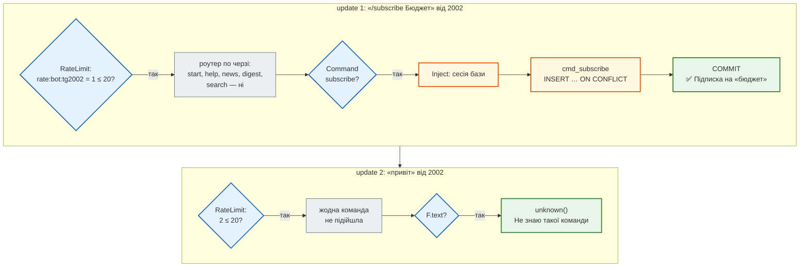
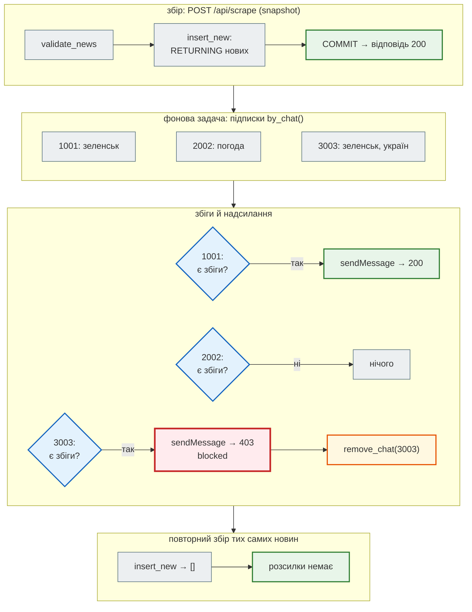
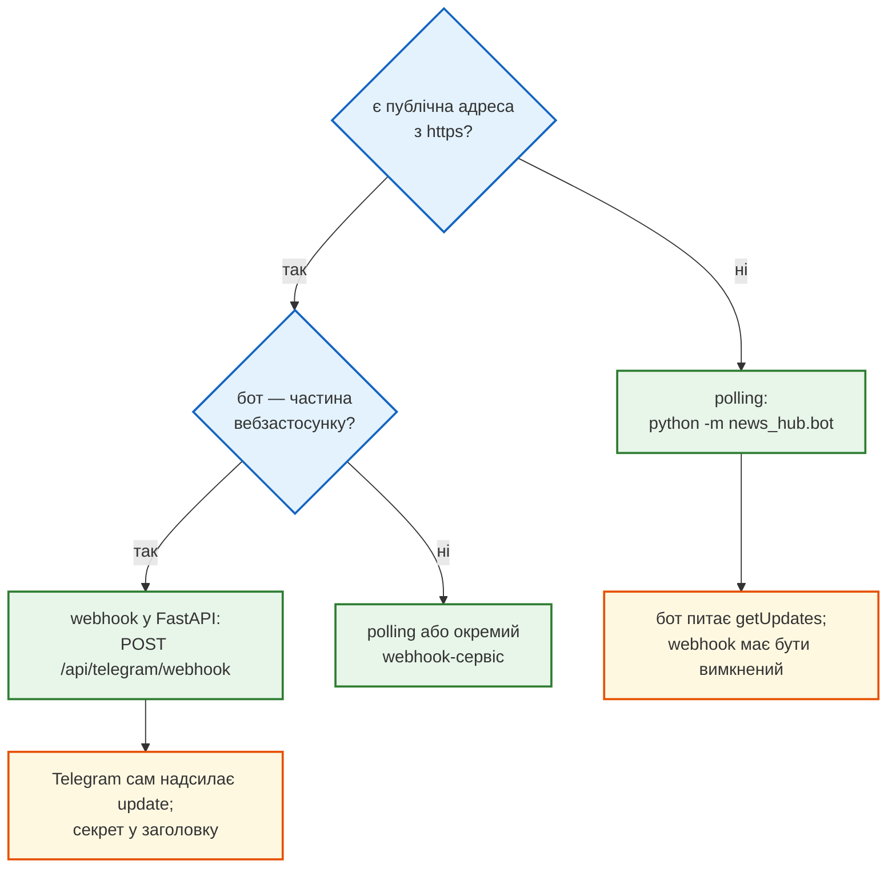
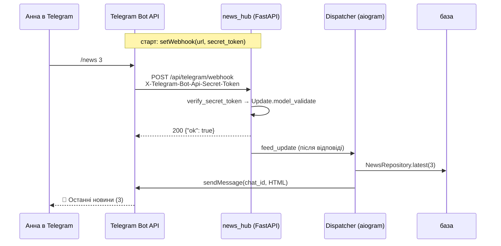
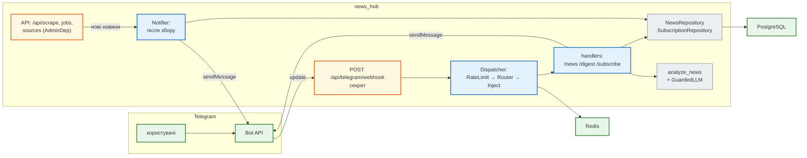

# Урок 48. Telegram Bot API

Агрегатор уже збирає новини, аналізує їх моделлю й захищає запис. Але щоб дізнатися, що нового, треба самому відкрити `GET /api/news`. Сьогодні агрегатор отримує **Telegram-бота**:

- `/news` — останні новини прямо в чаті;
- `/digest` — тема й тональність за аналізом LLM (урок 44);
- `/subscribe бюджет` — і нова новина про бюджет прийде сама, щойно агрегатор її збере.

Бот — ще один **вхід** у той самий застосунок. Він читає ту саму базу через той самий `NewsRepository`, аналізує тим самим `analyze_news`, а його webhook захищений так само, як webhook уроку 47.

Стартовий код: `echo_bot` і `ai_bot` (aiogram 3: роутери, middleware, фабрики бота), `production_bot` (webhook у FastAPI, розсилка). Переносячи його, запускаємо стартовий код без змін проти «Telegram» і дивимось, що той відповідає.

| Урок | Крок агрегатора |
|---|---|
| 36–39 | парсер і модель, FastAPI, база, Redis |
| 41–43 | тести; Claude Code і RSS; аналіз LLM |
| 46 | безпека: адмін-JWT, SSRF, підписані webhook |
| **47** | **Telegram-бот: `/news`, `/digest`, підписки й сповіщення, webhook у FastAPI** |
| 48–50 | Docker, Compose, CI/CD |

Проєкт: [`news_hub`](https://github.com/NikoriakViktot/PY-Course-Victor-Nikoriak-22-09-2026/tree/main/module_4/lessons/lesson_48_telegram_bot/news_hub).

**Що потрібно з попередніх уроків:** HTTP-запит і JSON (урок 32); `async`/`await` (27); `Depends` і `BackgroundTasks` (37, 39); rate limit на Redis (39); тести з локальним aiohttp-сервером (41); `analyze_news` (43); секрет webhook і `compare_digest` (46).

**Після уроку ти зможеш:**

- пояснити, як Telegram доставляє повідомлення боту: polling і webhook;
- написати бота на aiogram 3: роутер, фільтри команд, middleware, залежності в handler;
- безпечно відповідати в HTML: екранування і ліміт 4096 символів;
- розсилати сповіщення з урахуванням лімітів Telegram і заблокованих чатів;
- приймати webhook Telegram у FastAPI;
- тестувати бота без мережі й токена — на двійнику Telegram Bot API.

**Ноутбук заняття:** [Відкрити вправи в Colab](https://colab.research.google.com/github/NikoriakViktot/PY-Course-Victor-Nikoriak-22-09-2026/blob/main/module_4/lessons/lesson_48_telegram_bot/note_lesson_48_telegram_bot_student.ipynb){ .md-button .md-button--primary } [Переглянути розв’язки](https://github.com/NikoriakViktot/PY-Course-Victor-Nikoriak-22-09-2026/blob/main/module_4/lessons/lesson_48_telegram_bot/note_lesson_48_telegram_bot.ipynb){ .solutions-link } — бот розмовляє з двійником Telegram прямо в ноутбуці, без токена й мережі.

## Пригадай

1. Що повертає HTTP API, коли запит не вдався, і як клієнт дізнається причину (урок 32)?
2. Навіщо `BackgroundTasks` у FastAPI і коли вони виконуються (урок 40)?
3. Чому секрет webhook порівнюють `hmac.compare_digest`, а не `==` (урок 47)?

??? success "Відповіді"

    1. Код стану (4xx — помилка клієнта, 5xx — сервера) і тіло з описом. Telegram Bot API робить так само: `{"ok": false, "error_code": 403, "description": "Forbidden: bot was blocked by the user"}`.
    2. Щоб не тримати клієнта: відповідь іде одразу, задача виконується після неї, у тому ж процесі.
    3. `==` зупиняється на першому неспівпадінні, тож за часом відповіді секрет можна підбирати по символу. `compare_digest` порівнює за сталий час.

## Старт: з якого коду починаємо

| Звідки | Що там | Куди в `news_hub` |
|---|---|---|
| `ai_bot/app/bot.py` | `create_bot`, `create_dispatcher`: outer / inner middleware, порядок роутерів, `set_my_commands` | `news_hub/bot/factory.py` |
| `ai_bot/app/handlers/commands.py`, `echo_bot/app/handlers/` | `Router`, `CommandStart()`, `Command("help")`, залежності в параметрах handler | `news_hub/bot/handlers.py` |
| `ai_bot/app/middlewares/rate_limit.py`, `inject.py` | ліміт повідомлень (Redis), «впорскування» залежностей у handler | `news_hub/bot/middlewares.py` |
| `ai_bot/app/utils/text.py`, `formatter.py` | `escape_html`, `split_long_message` | `news_hub/bot/formatting.py` |
| `production_bot/backend/api/webhook.py`, `app.py` | webhook у FastAPI, `setWebhook` у lifespan, `dp.feed_update` | `POST /api/telegram/webhook`, `start_bot` в `api.py` |
| `production_bot/backend/workers/notifications.py` | розсилка `bot.send_message` у циклі | `news_hub/notify.py` |

Як Telegram спілкується з ботом — довідники стартового проєкту (`lesson_documentation.md`, `lesson_mermaid.md`) і [документація Bot API](https://core.telegram.org/bots/api). Коротко: бот — це програма, яка отримує від Telegram **update** (JSON з повідомленням користувача) і відповідає викликами HTTP API: `https://api.telegram.org/bot<TOKEN>/sendMessage`.

### «Telegram» без Telegram: двійник Bot API

`api.telegram.org` у середовищі, де писали урок, недоступний. Токена бота немає ні там, ні в Colab. Тому всі тести, ноутбук і запуск наживо працюють проти **двійника**: `tests/telegram_twin.py`. Це aiohttp-сервер, який відповідає у форматі Bot API і записує кожен виклик. aiogram уміє ходити на інший сервер (так працює й офіційний локальний Bot API server):

```python title="news_hub/bot/factory.py"
def create_bot(token: str, api_url: str | None = None) -> Bot:
    session = AiohttpSession(api=TelegramAPIServer.from_base(api_url)) if api_url else None
    return Bot(token=token, session=session, default=DefaultBotProperties(parse_mode=ParseMode.HTML))
```

Двійник — не Telegram. Він відтворює лише задокументовані правила, які потрібні урокові:

- неправильний токен → 401;
- заблокований чат → 403;
- ліміт → 429 з `retry_after`;
- у режимі HTML — лише дозволені теги, а «<», «>», «&» поза тегом дають 400 «can't parse entities»;
- текст понад 4096 символів → 400.

Зі справжнім токеном той самий код ходить на api.telegram.org — достатньо не задавати `TELEGRAM_API_URL`.

## Рефакторинг 1. Бот над `news_hub`: фабрики, роутер, залежності { #refactor-1 }

Бот з aiogram 3 складається з трьох частин:

- **`Bot`** — HTTP-клієнт Bot API: `send_message`, `set_webhook`, …;
- **`Dispatcher`** — отримує update і веде його крізь middleware до потрібного handler;
- **`Router`** — набір handler з фільтрами (`Command("news")`, `F.text`).

```python title="news_hub/bot/factory.py"
def create_dispatcher(session_factory: async_sessionmaker[AsyncSession], redis: Redis, llm: LLMClient | None,
                      admin_ids: frozenset[int] = frozenset()) -> Dispatcher:
    dp = Dispatcher()
    dp.message.outer_middleware(RateLimitMiddleware(redis, BOT_RATE_LIMIT, BOT_RATE_WINDOW))
    dp.message.middleware(InjectMiddleware(session_factory, redis, llm, admin_ids))
    dp.include_router(handlers.build_router())
    return dp
```

| Було (`ai_bot`) | Стало | Чому |
|---|---|---|
| `create_dispatcher(redis)` читає глобальний `config` | залежності — параметрами: база, Redis, LLM, адміни | ті самі фабрики збирають бота для webhook у FastAPI, для polling і для тестів |
| `router = Router(...)` — змінна модуля, handler з декоратором `@router.message(...)` | `build_router()` — новий роутер на кожен диспетчер | aiogram прив'язує Router лише до **одного** Dispatcher (див. нижче) |
| `InjectMiddleware` кладе в `data` один спільний `HistoryRepository` над Redis | на кожен update — **своя** сесія бази, COMMIT після handler | як `get_db` у FastAPI: сесію SQLAlchemy не ділять між одночасними update |
| `RateLimitMiddleware` на своєму `RateLimitRepository` | той самий `RateLimiter` (`INCR` + `EXPIRE NX`), що й rate limit API в уроці 40 | одна реалізація на весь застосунок; про ліміт — одна відповідь за вікно, далі бот мовчить |

Чому не змінна модуля. Справжній вивід стартового `ai_bot`, коли в процесі створюють другий диспетчер (а API, тести й ноутбук створюють):

```text
другий create_dispatcher: Router is already attached to <Dispatcher '0x7f3ed1ce2a50'>
```

Залежності доходять до handler через параметри. aiogram «впорскує» значення з `data` за іменем, як `Depends` у FastAPI:

```python title="news_hub/bot/middlewares.py (фрагмент)"
    async def __call__(self, handler: Handler, event: TelegramObject, data: dict[str, Any]) -> Any:
        async with self._factory() as session:
            data["news"] = NewsRepository(session)
            data["subscriptions"] = SubscriptionRepository(session)
            data["redis"] = self._redis
            data["llm"] = GuardedLLM(self._llm, CircuitBreaker(self._redis)) if self._llm else None
            data["admin_ids"] = self._admin_ids
            result = await handler(event, data)
            await session.commit()
            return result
```

```python title="news_hub/bot/handlers.py (фрагмент)"
async def cmd_news(message: Message, command: CommandObject, news: NewsRepository) -> None:
    ...
    rows = await news.latest(count)
    await answer_lines(message, [f"📰 <b>Останні новини</b> ({len(rows)})", ""] +
                       [f"• {link(row.url, row.title)} <i>{esc(row.category)}</i>" for row in rows])
```

Шлях одного update крізь диспетчер — покроково, на двох повідомленнях Анни:



Порядок має значення: aiogram перевіряє handler згори донизу і зупиняється на першому, чий фільтр підійшов. `F.text` («будь-який текст») пропускає й команди, тому він — останній.

Поглиблено: aiogram — [Router](https://docs.aiogram.dev/en/latest/dispatcher/router.html), [Middlewares](https://docs.aiogram.dev/en/latest/dispatcher/middlewares.html), [Dependency injection](https://docs.aiogram.dev/en/latest/dispatcher/dependency_injection.html).

## Рефакторинг 2. Відповідь у HTML: екранування і 4096 { #refactor-2 }

Бот відповідає з `parse_mode=HTML`: `<b>`, `<i>`, `<a href>`. Telegram розбирає розмітку сам і відхиляє повідомлення, у якому «<», «>» чи «&» стоять поза тегом.

Старий `/start`:

```python title="ai_bot/app/handlers/commands.py (стартовий код)"
    await message.answer(
        f"Привіт, <b>{user.first_name}</b>! 🤖\n\n"
        ...
```

`first_name` — те, що користувач написав у профілі. Справжній вивід стартового коду без змін (aiogram 3.15.0 з його `requirements.txt`) проти двійника:

```text
/start від 'Олена': надіслано
/start від '<Олена>': TelegramBadRequest: Telegram server says - Bad Request: can't parse entities: unexpected character at byte offset 11
/start від 'Tom & Jerry': TelegramBadRequest: Telegram server says - Bad Request: can't parse entities: unsupported entity at byte offset 15
```

Користувач із «&» в імені ніколи не отримає відповіді. Той самий ризик у кожному заголовку новини: «Бюджет & податки», «ціна < 100 грн».

```python title="news_hub/bot/formatting.py"
def esc(text: str) -> str:
    """Текст → безпечний для HTML Telegram: & < > (лапки поза атрибутом не потрібні)."""
    return html.escape(text, quote=False)


def link(url: str, title: str) -> str:
    return f'<a href="{html.escape(url, quote=True)}">{esc(title)}</a>'
```

Правило для всього проєкту: **усе, що прийшло ззовні** (ім'я, заголовок, ключове слово), іде в текст лише через `esc` або `link`. Наживо, через webhook:

```text
POST /_twin/say {"text": "/start", "first_name": "<Олена & Ко>"}
Привіт, <b>&lt;Олена &amp; Ко&gt;</b>! Я бот новинного агрегатора news_hub.
```

### Довге повідомлення: різати між рядками

Telegram приймає до 4096 символів. Старий `split_long_message` різав кожні 4000:

```python title="ai_bot/app/utils/formatter.py (стартовий код)"
    return [text[i: i + MAX_MESSAGE_LEN] for i in range(0, len(text), MAX_MESSAGE_LEN)]
```

Розріз може припасти всередину `<pre>…</pre>` чи `&amp;`. Справжній вивід на довгій відповіді AI з блоком коду (`format_ai_response` + `split_long_message`):

```text
частин: 4 | невалідних: ["Bad Request: can't parse entities: can't find end tag corres", "Bad Request: can't parse entities: can't find end tag corres"]
```

Бот складає повідомлення з **рядків**, кожен рядок — цілий HTML. Ділимо лише між ними:

```python title="news_hub/bot/formatting.py"
def split_message(lines: list[str], limit: int = MAX_MESSAGE) -> list[str]:
    """Рядки → частини ≤ limit, розріз лише між рядками. Рядок, довший за limit, обрізається як текст."""
    parts: list[str] = []
    current = ""
    for line in lines:
        if len(line) > limit:
            line = line[: limit - 1] + "…"          # лише для рядків без розмітки (ми їх такими не складаємо)
        candidate = f"{current}\n{line}" if current else line
        if len(candidate) > limit:
            parts.append(current)
            current = line
        else:
            current = candidate
    if current:
        parts.append(current)
    return parts
```

Поглиблено: Bot API — [Formatting options: HTML style](https://core.telegram.org/bots/api#html-style).

## Рефакторинг 3. Підписки і сповіщення { #refactor-3 }

`/subscribe бюджет` записує пару «чат + слово» в таблицю `subscriptions` (міграція `0004`). `chat_id` — `BigInteger`: id груп у Telegram на кшталт `-1001234567890` не вміщаються в 32 біти. Тест `test_group_chat_id_fits` з `Integer` падає на PostgreSQL.

Збіг — за **початком слова**. Українська змінює закінчення, тож точний збіг пропускав би більшість новин, а пошук підрядка будь-де давав би хибні збіги:

| Слово | Заголовок | Збіг? |
|---|---|---|
| `бюджет` | «Бюджету бракує 100 млрд» | так — інше закінчення |
| `рада` | «Верховна Рада ухвалила закон» | так |
| `рада` | «Це зрада, кажуть експерти» | ні — «рада» всередині слова |
| `газ` | «Газета вийшла вранці» | так — межа методу: початок слова ≠ корінь |

### Коли сповіщати

| Було (`workers/notifications.py`) | Стало (`notify.py`) |
|---|---|
| окремий `while True` + `sleep(3600)`, вибірка з бази щогодини | виклик **після збору**, з новинами, які щойно з'явились у базі (`NewsRepository.insert_new` — `RETURNING` лише вставлених рядків): повторний збір тих самих новин нікого не сповіщає вдруге |
| по повідомленню на кожен запис | одне повідомлення на чат з усіма збігами (частини ≤ 4096) |
| `except Exception: logger.warning` | 403 (бота заблокували) → підписки чату видаляються; 429 → чекаємо `retry_after` і пробуємо ще раз; інші помилки — у звіт, решті розсилка триває |

```python title="news_hub/notify.py (фрагмент)"
        try:
            for text in messages:
                await _send(bot, chat_id, text)
                report.sent += 1
                await asyncio.sleep(SEND_PAUSE)
        except TelegramForbiddenError:
            await subscriptions.remove_chat(chat_id)
            report.blocked.append(chat_id)
```

Розсилку запускає кожен шлях збору: `POST /api/scrape`, фонова задача `/api/scrape/jobs` (і webhook уроку 47), `/api/sources/{id}/fetch`, адмінська `/scrape` у боті. В API це фонова задача: вона йде після відповіді, тобто вже після COMMIT, і читає новини зі своєю сесією (`Notifier`).

Покроково — збір знімка (168 новин), три підписники, один заблокував бота:



Наживо: підписка в боті, збір через API з токеном адміна, сповіщення в чат:

```text
POST /_twin/say {"text": "/subscribe Зеленськ", "chat_id": 2002}   → ✅ Підписка на «зеленськ»
POST /_twin/say {"text": "/scrape snapshot", "chat_id": 2002}      → Ця команда — лише для адміністратора.
POST /api/scrape (Bearer адміна) {"source": "snapshot"}             → news_saved: 168
🔔 Нові новини за підписками (зеленськ):

• <a href="https://www.rbc.ua/rus/news/putina-obrazilisya-dozvil-zelenskogo-provesti-1778272356.html">У Путіна образилися на дозвіл Зеленського провести парад 9 травня</a>
• <a href="https://www.rbc.ua/rus/news/zelenskiy-dozvoliv-provedennya-paradu-moskvi-1778265521.html">Зеленський дозволив проведення параду в Москві 9 травня</a>
```

`/scrape` у боті — лише для `BOT_ADMIN_IDS`: бот — ще один вхід у застосунок, і правило «хто може змінювати» з уроку 47 діє й тут.

Поглиблено: Telegram — [ліміти розсилки](https://core.telegram.org/bots/faq#my-bot-is-hitting-limits-how-do-i-avoid-this); aiogram — [винятки](https://docs.aiogram.dev/en/latest/api/exceptions.html).

## Рефакторинг 4. Polling і webhook у FastAPI { #refactor-4 }

Telegram доставляє update одним із двох способів:



**Polling** — для розробки: `python -m news_hub.bot` видаляє webhook (Telegram не віддає update обома способами одночасно) і питає `getUpdates`. **Webhook** — для сервера: з `BOT_TOKEN` і `TELEGRAM_WEBHOOK_URL` застосунок у `lifespan` сам викликає `setWebhook` із секретом.

```python title="news_hub/api.py (фрагмент)"
@app.post("/api/telegram/webhook", tags=["telegram"], summary="Update від Telegram")
async def telegram_webhook(request: Request, background: BackgroundTasks) -> dict[str, bool]:
    bot, dispatcher, settings = request.app.state.bot, request.app.state.dispatcher, request.app.state.telegram
    if bot is None or dispatcher is None or settings is None or settings.webhook_secret is None:
        raise HTTPException(status.HTTP_503_SERVICE_UNAVAILABLE, detail="бот вимкнений або працює через polling")
    if not verify_secret_token(settings.webhook_secret.encode(), request.headers.get(TELEGRAM_SECRET_HEADER)):
        raise HTTPException(status.HTTP_401_UNAUTHORIZED, detail="неправильний секрет webhook")
    try:
        update = Update.model_validate(await request.json(), context={"bot": bot})
    except (ValueError, ValidationError) as error:
        raise HTTPException(status.HTTP_400_BAD_REQUEST, detail="це не update Telegram") from error
    background.add_task(dispatcher.feed_update, bot, update)
    return {"ok": True}
```

| Було (`production_bot`) | Стало | Чому |
|---|---|---|
| секрет у шляху `/webhook/{SECRET}` + заголовок, порівняння `!=` | шлях без секрету; заголовок `X-Telegram-Bot-Api-Secret-Token` через `verify_secret_token` уроку 47 | шлях потрапляє в журнали; `compare_digest` — сталий час |
| `await dp.feed_update(...)` до відповіді | відповідь 200 одразу, обробка — `BackgroundTasks` | Telegram чекає відповіді недовго і, не дочекавшись, надсилає update повторно |
| при зупинці — `await bot.delete_webhook()` | webhook лишається | під час перезапуску новий процес уже поставив webhook; старий, зупиняючись, прибрав би його, і Telegram перестав би надсилати update |
| бот створюється завжди, `settings.validate()` вимагає `BOT_TOKEN` | без `BOT_TOKEN` бота немає — API працює як в уроці 47 | один застосунок: розробка без бота, сервер з ботом |
| — | `TELEGRAM_WEBHOOK_SECRET`: 32–256 символів `A-Z a-z 0-9 _ -`, інакше застосунок не стартує | це правило самого Telegram для `secret_token`; помилка краще при старті, ніж мовчазний бот |



Наживо — uvicorn з `BOT_TOKEN`, `TELEGRAM_API_URL` на двійник і `TELEGRAM_WEBHOOK_URL`:

```text
webhook: http://127.0.0.1:8047/api/telegram/webhook          ← зареєстрував lifespan
POST /api/telegram/webhook без секрету                       → 401
(uvicorn зупинено) getWebhookInfo → http://127.0.0.1:8047/api/telegram/webhook   ← webhook лишився
python -m news_hub.bot → webhook: ''  →  /news 1 → 📰 <b>Останні новини</b> (1) …   ← polling
```

`https://` у `TELEGRAM_WEBHOOK_URL` обов'язковий: Telegram не надсилає webhook на http. Виняток — коли задано `TELEGRAM_API_URL` (двійник або локальний Bot API server).

Поглиблено: Bot API — [getUpdates](https://core.telegram.org/bots/api#getupdates), [setWebhook](https://core.telegram.org/bots/api#setwebhook), [Marvin's Patent Pending Guide to All Things Webhook](https://core.telegram.org/bots/webhooks); aiogram — [webhook](https://docs.aiogram.dev/en/latest/dispatcher/webhook.html).

## Архітектура { #architecture }



| Модуль | Відповідає за |
|---|---|
| `bot/factory.py` | `create_bot` (з `TELEGRAM_API_URL`), `create_dispatcher`, меню команд |
| `bot/handlers.py` | команди; `build_router()` — порядок перевірки |
| `bot/middlewares.py` | ліміт повідомлень (Redis), сесія бази на update |
| `bot/formatting.py` | `esc`, `link`, `split_message`, слова підписки |
| `bot/settings.py` | змінні середовища бота; правила Telegram для `secret_token` |
| `notify.py` | хто що отримує після збору; 403 / 429 |
| `api.py` | `start_bot` у lifespan, webhook, `Notifier` у збору |

Бот не має свого SQL і своєї логіки аналізу: репозиторії, `analyze_news`, `RateLimiter`, `verify_secret_token` — ті самі, що в API.

## Тести { #tests }

| Файл | Що перевіряє | Тестів |
|---|---|---|
| `tests/unit/test_bot_formatting.py` | правила HTML двійника; екранування; `link` з лапками в URL; розріз між рядками (і що розріз кожні N символів ламає розмітку); слова підписки; збіги; налаштування бота | 33 |
| `tests/integration/test_bot.py` | команди через `dp.feed_update`: ім'я з «<» і «&», `/news` (найновіші, HTML у заголовку), підписки й ліміт 10, `/digest` з LLM і без, rate limit, `/scrape` лише адміну, група з id > 32 біт | 10 |
| `tests/integration/test_notify.py` | через API: сповіщення один раз, заблокований чат (403) втрачає підписки, 429 → `retry_after`, розбиття на частини, фонова задача, без бота нічого не ламається | 6 |
| `tests/integration/test_telegram_webhook.py` | webhook: секрет, 401 (зокрема з JWT адміна), 400, 503 без бота; lifespan ставить webhook і не видаляє його | 7 |

Двійник записує кожен виклик, тож тест бачить, що саме бот «надіслав у Telegram». Він також відхиляє невалідний HTML, тож кожна відповідь, яку прийняв двійник, — ще й перевірка розмітки:

```python title="tests/integration/test_bot.py (фрагмент)"
async def test_start_escapes_user_name(telegram: BotHarness) -> None:
    """Ім'я в Telegram може містити будь-що — у HTML-повідомлення воно йде екранованим."""
    [reply] = await telegram.say("/start", first_name="<Олена & Ко>")
    assert "<b>&lt;Олена &amp; Ко&gt;</b>" in reply
```

Тест захисту з уроку 47 спрацював: новий `POST /api/telegram/webhook` без `AdminDep` зробив `test_every_other_endpoint_requires_admin` червоним. Webhook додано в `PUBLIC` свідомо, з поясненням: його захист — секретний заголовок, а JWT у Telegram немає.

Справжній запуск:

```text
$ pytest
335 passed, 2 deselected
$ TEST_DATABASE_URL=postgresql+asyncpg://… TEST_REDIS_URL=redis://localhost:6380/15 pytest
335 passed, 2 deselected
$ mypy --strict news_hub
Success: no issues found in 26 source files
```

## Мінімальні версії залежностей { #min-versions }

```text title="requirements.txt (нове)"
aiogram>=3.15           # урок 48: Telegram-бот (у стартовому коді — 3.15.0)
```

Усі тести проходять на трьох наборах:

- Python 3.10 з `aiogram 3.15.0` і мінімальними версіями решти залежностей з уроку 47 (`aiohttp 3.10.10`, `pydantic 2.9.0`, `fastapi 0.121.0`);
- Python 3.13 з найновішими (`aiogram 3.31.0`);
- PostgreSQL 16 + Redis 7.

Міграція `0004` застосовується на SQLite і PostgreSQL, `alembic check` не бачить розбіжностей з моделями.

## Практика { #practice }

### Розібраний приклад: `/search <слово>`

Пошук у заголовках уже є в API (`GET /api/news/search`, урок 39). У боті — це ще один handler над тим самим `NewsRepository.search`:

```python title="news_hub/bot/handlers.py (розв'язок)"
async def cmd_search(message: Message, command: CommandObject, news: NewsRepository) -> None:
    """/search <слово> — заголовки, що містять слово (той самий пошук, що GET /api/news/search)."""
    query = (command.args or "").strip()
    if not 2 <= len(query) <= 60:
        await message.answer("Використання: /search &lt;слово&gt; — від 2 до 60 символів")
        return
    rows = await news.search(query, limit=10)
    if not rows:
        await message.answer(f"Нічого не знайдено за «{esc(query)}»")
        return
    await answer_lines(message, [f"🔎 <b>{esc(query)}</b>: {len(rows)}", ""] +
                       [f"• {link(row.url, row.title)}" for row in rows])
```

У `build_router()` — рядок `router.message(Command("search"))(cmd_search)` перед `F.text`. Тест:

```python title="tests/integration/test_bot.py (розв'язок)"
async def test_search(telegram: BotHarness) -> None:
    await add_news(telegram, "Уряд ухвалив бюджет на рік", "Погода на вихідні: <сонячно> & тепло")
    [found] = await telegram.say("/search БЮДЖЕТ")
    assert found.startswith("🔎 <b>БЮДЖЕТ</b>: 1") and "Погода" not in found
    [found] = await telegram.say("/search сонячно")
    assert "&lt;сонячно&gt; &amp; тепло" in found
    assert await telegram.say("/search футбол") == ["Нічого не знайдено за «футбол»"]
    assert (await telegram.say("/search я"))[0].startswith("Використання: /search")
```

Нового SQL немає: регістр і `%`/`_` у слові вже обробляє `search` з уроку 39. Бот лише інакше **показує** той самий результат.

### Зміни приклад

1. У `build_router()` перенеси `router.message(F.text)(unknown)` на самий початок. Що відповість бот на `/help`, `/subscribe бюджет`, `/subscriptions`?
2. В `InjectMiddleware` прибери `await session.commit()`. Надішли `/subscribe бюджет`, потім `/subscriptions`. Що побачить користувач?

??? success "Що покаже запуск"

    1. На всі три: `['Не знаю такої команди. /help — що я вмію']`. `F.text` пропускає будь-який текст, зокрема команди, а aiogram бере **перший** handler, чий фільтр підійшов.
    2. `/subscribe бюджет` → `['✅ Підписка на «бюджет»']`, але `/subscriptions` → `['Підписок немає. Додай: /subscribe &lt;слово&gt;']`. INSERT виконався в сесії, а без COMMIT вона закрилась із ROLLBACK. Бот «пообіцяв» те, чого немає в базі. Тест `test_subscriptions` це ловить.

### Спробуй самостійно: кнопка «Відписатися»

Під сповіщенням — inline-кнопка «Відписатися від «бюджет»». Натискання приходить як `callback_query` з `callback_data`; бот видаляє підписку і відповідає `answer_callback_query`.

**Критерії перевірки:**

- `callback_data` не довше за 64 байти (обмеження Telegram) і не містить нічого, крім слова;
- натискання від **іншого** чату не видаляє чужу підписку (`callback_query.message.chat.id`);
- двійник отримує `answerCallbackQuery` (додай метод у `tests/telegram_twin.py`);
- тест у `tests/integration/test_bot.py`.

### Знайди помилку { #find-bug }

Handler зі стартового коду і його тест (тест зелений):

```python
@router.message(CommandStart())
async def cmd_start(message: Message, history_repo: HistoryRepository) -> None:
    user = message.from_user
    await history_repo.clear(user.id)
    await message.answer(
        f"Привіт, <b>{user.first_name}</b>! 🤖\n\n"
        f"Просто напиши своє запитання.",
        parse_mode="HTML",
    )


async def test_start_greets_user():
    update = make_update("/start", first_name="Олена")
    await dp.feed_update(bot, update)
    assert "Привіт, <b>Олена</b>!" in sent_messages[-1]
```

Кому бот не відповість ніколи? Справжній вивід цього коду проти двійника Telegram:

```text
/start від 'Олена': надіслано
/start від '<Олена>': TelegramBadRequest: … can't parse entities: unexpected character at byte offset 11
/start від 'Tom & Jerry': TelegramBadRequest: … can't parse entities: unsupported entity at byte offset 15
```

??? success "Відповідь"

    Ім'я вставлено в HTML без екранування. Для Telegram «<» і «&» поза тегом — зламана розмітка, і він відхиляє все повідомлення. Бот мовчить, а користувач не розуміє чому. Тест перевіряв лише «звичайне» ім'я: даних, які ламають розмітку, у ньому не було.

    Виправлення — `esc(name)` (`html.escape`) для всього, що прийшло ззовні. Тест на це — `test_start_escapes_user_name`: ім'я `<Олена & Ко>`, а двійник, як Telegram, не пропустить невалідну розмітку.

## Підсумок

| Поняття | Що запам'ятати |
|---|---|
| Bot / Dispatcher / Router | клієнт API / маршрутизація update / набір handler; роутер — новий на кожен диспетчер |
| Порядок handler | перший, чий фільтр підійшов; `F.text` — останній |
| Middleware | outer — до маршрутизації (ліміт), inner — перед handler (залежності, сесія бази, COMMIT) |
| HTML | усе ззовні — `esc` / `link`; ділити між рядками, ≤ 4096 |
| Сповіщення | лише нові новини (`insert_new`); 403 → видалити підписки; 429 → `retry_after` |
| Polling / webhook | розробка / сервер; одночасно — ні; webhook: https, секрет у заголовку, 200 одразу |
| Тести | двійник Bot API: записує виклики, відтворює правила; справжній токен не потрібен |

### Самоперевірка

1. Чому `F.text` реєструють останнім, а `CommandStart()` — першим?
2. Що станеться з update, якщо webhook відповідатиме Telegram через 2 хвилини?
3. Навіщо розсилці `insert_new`, якщо є `add_many`?
4. Користувач заблокував бота. Що буде після наступного збору, а що — після ще одного?
5. Чому бот у webhook-режимі не видаляє webhook при зупинці?
6. Що перевіряє двійник Telegram, а чого він перевірити не може?

??? success "Відповіді"

    1. aiogram бере перший handler, чий фільтр підійшов. `F.text` підходить до будь-якого тексту, зокрема до `/start`. Порядок решти команд не важливий, бо їхні фільтри не перетинаються.
    2. Telegram вважатиме доставку невдалою і надсилатиме update повторно — бот відповість кілька разів. Тому 200 — одразу, а обробка — у фоні.
    3. `add_many` повертає лише кількість. Для розсилки потрібні **які саме** новини нові, інакше повторний збір тих самих новин знову сповістив би всіх.
    4. Перший збір: `sendMessage` → 403 → підписки чату видалено. Другий: чату немає серед підписок, запитів до нього немає.
    5. Під час перезапуску новий процес уже зареєстрував webhook. Старий, видаляючи його при зупинці, залишив би бота без update.
    6. Перевіряє формат відповіді бота: метод, чат, текст, HTML за правилами документації, ліміт 4096, реакцію на 403 / 429. Не перевіряє справжню поведінку Telegram поза цими правилами: доставку на пристрої, реальні ліміти, новіші зміни API. Для цього — справжній токен і тестовий бот.

### Що далі

- Ноутбук заняття: [Відкрити вправи в Colab](https://colab.research.google.com/github/NikoriakViktot/PY-Course-Victor-Nikoriak-22-09-2026/blob/main/module_4/lessons/lesson_48_telegram_bot/note_lesson_48_telegram_bot_student.ipynb){ .md-button .md-button--primary } [Переглянути розв’язки](https://github.com/NikoriakViktot/PY-Course-Victor-Nikoriak-22-09-2026/blob/main/module_4/lessons/lesson_48_telegram_bot/note_lesson_48_telegram_bot.ipynb){ .solutions-link }.
- Уроки 49–51 — Docker, Compose, CI/CD: `news_hub`, PostgreSQL, Redis і бот у контейнерах; `BOT_TOKEN` і секрети — у змінних середовища, не в образі.

## Документація і джерела

- Код: [`news_hub`](https://github.com/NikoriakViktot/PY-Course-Victor-Nikoriak-22-09-2026/tree/main/module_4/lessons/lesson_48_telegram_bot/news_hub) — `bot/` з `ai_bot/app/` і `echo_bot/`, `notify.py` з `production_bot/backend/workers/notifications.py`, webhook — з `production_bot/backend/api/webhook.py`.
- Telegram: [Bot API](https://core.telegram.org/bots/api), [HTML style](https://core.telegram.org/bots/api#html-style), [setWebhook](https://core.telegram.org/bots/api#setwebhook), [webhooks](https://core.telegram.org/bots/webhooks), [Bots FAQ: ліміти](https://core.telegram.org/bots/faq#my-bot-is-hitting-limits-how-do-i-avoid-this), [локальний Bot API server](https://github.com/tdlib/telegram-bot-api), [@BotFather](https://core.telegram.org/bots/features#botfather).
- aiogram 3: [документація](https://docs.aiogram.dev/en/latest/), [Router](https://docs.aiogram.dev/en/latest/dispatcher/router.html), [Middlewares](https://docs.aiogram.dev/en/latest/dispatcher/middlewares.html), [Dependency injection](https://docs.aiogram.dev/en/latest/dispatcher/dependency_injection.html), [webhook](https://docs.aiogram.dev/en/latest/dispatcher/webhook.html).
- Уроки курсу: [39 — Redis і rate limit](lesson_40.md), [43 — LLM API](lesson_44.md), [46 — Security advanced](lesson_47.md).
