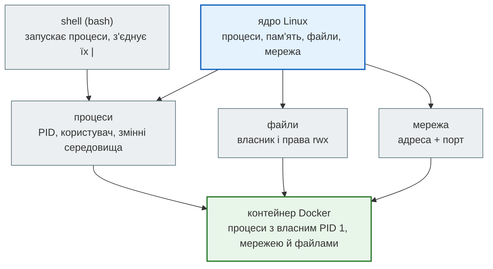
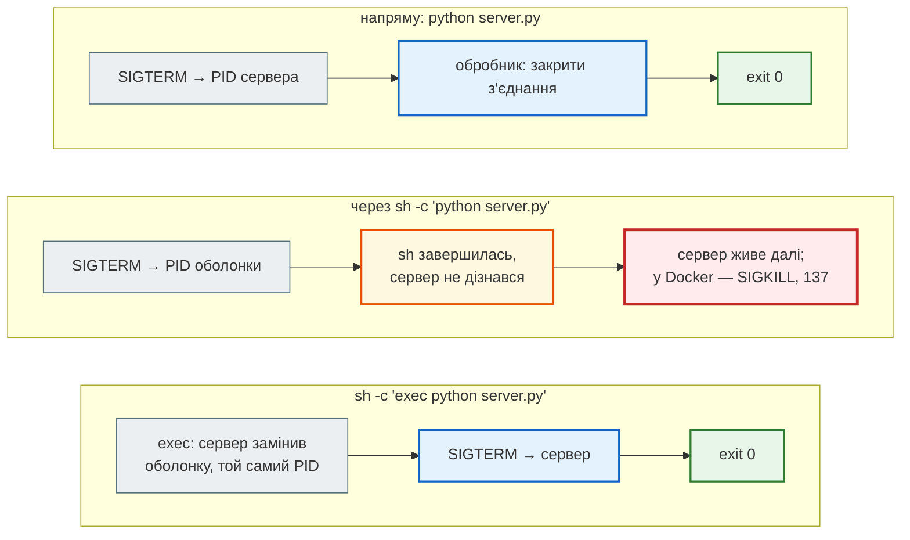
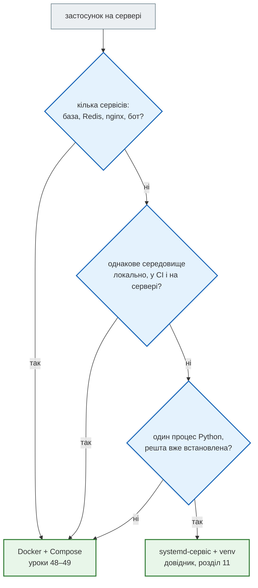

# Бонус. Linux для розробника

До цього моменту `news_hub` і проєкт нотаток жили на твоєму комп'ютері: `uvicorn --reload`, `python manage.py runserver`. Модуль 5 переносить їх туди, де працює майже кожен вебзастосунок, — на **Linux**: у контейнер Docker (урок 48), на сервер з Compose (49), у CI на GitHub Actions (50). Усі три — це Linux, і всі їхні «загадкові» поломки — звичайні речі Linux: процес не отримав сигнал, користувач не має прав на папку, сервер слухає не ту адресу, змінну середовища не передали.

Цей бонус-урок (поза нумерацією 1–52) — мінімум Linux, потрібний для уроків 48–50. Кожна тема тут — з того, на що ми справді наткнулися, переносячи `news_hub` у Docker.

| Крок | Матеріал | Що вчимо |
|---|---|---|
| 1 | [Відкрити вправи в Colab](https://colab.research.google.com/github/NikoriakViktot/PY-Course-Victor-Nikoriak-22-09-2026/blob/main/module_5/bonus/linux_devops/note_bonus_linux_devops_student.ipynb){ .md-button .md-button--primary } [Переглянути розв’язки](https://github.com/NikoriakViktot/PY-Course-Victor-Nikoriak-22-09-2026/blob/main/module_5/bonus/linux_devops/note_bonus_linux_devops.ipynb){ .solutions-link } | 9 вправ у справжньому Linux (Colab — це Ubuntu): пайплайни, коди виходу, права, процеси й сигнали, порти, змінні середовища, скрипт з `set -euo pipefail` |
| 2 | ця сторінка | ментальна модель і все, що знадобиться в уроках 48–50 |
| 3 | [довідник у 18 розділах](linux/index.md) | від «навіщо Linux» до Kubernetes: термінал, файли, права, процеси, пакети, SSH, секрети, bash, Makefile, деплой Django, nginx, журнали, Docker, Compose, DevOps |

Довідник перевірено: команди запущено в контейнерах Ubuntu, Debian і `python:3.12-slim`, конфігурації nginx і Compose — перевірені інструментами.

**Що потрібно з попередніх уроків:** запуск Python-скриптів і `pip` (М1), `subprocess` і процеси (урок 27), HTTP і порти (31), змінні середовища й секрети (43, 46).

**Після уроку ти зможеш:**

- зібрати з маленьких команд пайплайн, що відповідає на питання про журнал;
- читати коди виходу й писати скрипти, які падають вчасно;
- пояснити права `644`, `600`, власника файлу і навіщо застосунку окремий користувач;
- знайти процес, надіслати йому сигнал і написати коректну зупинку;
- пояснити, чому сервер у контейнері слухає `0.0.0.0`;
- передати процесу змінну середовища — і не зіпсувати значення з `$`.

## Linux за хвилину



Контейнер Docker — не віртуальна машина. Це **звичайні процеси Linux**, яким ядро показує окрему файлову систему, окрему мережу й окрему нумерацію процесів. Тому все нижче працює і на сервері, і в контейнері, і в CI:

```text
$ docker top api
UID      PID    PPID   C    STIME   TTY   TIME       CMD
10001    3068   3043   41   08:50   ?     00:00:10   /usr/local/bin/python3.12 /usr/local/bin/uvicorn news_hub.api:app --host 0.0.0.0 --port 8000
```

На сервері це PID 3068 користувача 10001, а всередині контейнера той самий uvicorn — PID 1 користувача `app`.

## Пайплайни й коди виходу { #pipes }

Команда Linux робить одну річ і пише результат у **stdout**, помилки — у **stderr**. `|` передає stdout однієї команди на stdin наступної. Хто найчастіше звертається до сервера (журнал nginx, урок 49):

```text
$ cut -d' ' -f1 access.log | sort | uniq -c | sort -rn | head -3
     35 10.0.0.5
     20 172.18.0.4
      9 192.168.1.20
```

Кожна програма завершується **кодом виходу**: `0` — успіх, інше — помилка. На ньому тримається автоматизація: `a && b` запускає `b`, лише якщо `a` вдалась; CI позначає крок червоним, якщо код не 0 (урок 50). Код **пайплайна** — код його **останньої** команди:

```text
true                                 → код 0
false                                → код 1
false | true                         → код 0
set -o pipefail; false | true        → код 1
```

Скрипт, що працює без людини (деплой, бекап, CI), починають рядком:

```bash
set -euo pipefail    # -e: зупинитись на помилці; -u: незадана змінна — помилка; pipefail: пайплайн падає, якщо впала будь-яка команда
```

Детальніше — [термінал і shell](linux/02_terminal_and_shell.md), [bash-скрипти](linux/09_bash_scripts.md).

## Користувачі й права { #permissions }

```text
$ stat -c '%a %U %n' app/api.py data .env
644 root app/api.py
755 student data
600 root .env
```

`644` = `rw-` власнику, `r--` групі, `r--` решті (`r=4, w=2, x=1`). Хто що може:

| Дія від імені `student` | Результат | Чому |
|---|---|---|
| `cat app/api.py` | так | `r` для всіх |
| `echo x >> app/api.py` | ні | писати може лише власник (root) |
| `touch data/news_hub.db` | так | власник папки `data` — `student` |
| `cat .env` | ні | `600`: лише власник |

Саме так побудовано образ уроку 48: застосунок працює від користувача `app` (UID 10001); код належить root і доступний лише для читання — зламаний процес не перепише власний код; у `/data` (база SQLite) писати можна. `root` у контейнері — це той самий root ядра, тому застосунок від root — зайвий ризик.

Детальніше — [права доступу й користувачі](linux/04_files_permissions_users.md).

## Процеси й сигнали { #signals }

Процес зупиняють **сигналом**:

| Сигнал | Номер | Хто надсилає | Процес може |
|---|---|---|---|
| `SIGINT` | 2 | Ctrl+C | перехопити й завершитись акуратно |
| `SIGTERM` | 15 | `kill PID`, `systemctl stop`, `docker stop` | перехопити й завершитись акуратно |
| `SIGKILL` | 9 | `kill -9`, `docker stop` через 10 с | нічого: ядро знищує процес |

Процес, убитий сигналом N, має код виходу `128 + N`: `143` після `SIGTERM`, `137` після `SIGKILL`. Акуратна зупинка вебсервера — дочекатися поточних запитів, закрити з'єднання з базою й Redis. У FastAPI це частина lifespan після `yield`, у bash — `trap`:

```bash
trap 'echo cleanup done >> worker.log; rm -f worker.lock; exit 0' TERM
```

Сигнал отримує лише той процес, якому його надіслали. Якщо сервер запущено через оболонку (`sh -c "uvicorn …"`), `SIGTERM` дістанеться оболонці, а не серверу:



Справжній запуск з ноутбука:

```text
напряму (exec-форма CMD)   {'сервер = перший процес': True, 'журнал': "SIGTERM: закриваю з'єднання", 'сервер пережив SIGTERM': False}
sh -c (shell-форма CMD)    {'сервер = перший процес': False, 'журнал': '', 'сервер пережив SIGTERM': True}
sh -c exec …               {'сервер = перший процес': True, 'журнал': "SIGTERM: закриваю з'єднання", 'сервер пережив SIGTERM': False}
```

У контейнері `docker stop` надсилає `SIGTERM` процесу з PID 1. Тому в `Dockerfile` пишуть exec-форму `CMD ["uvicorn", …]`: з shell-формою `news_hub` зупинявся 10.2 с з кодом 137, з exec-формою — 1.8 с з кодом 0 ([урок 48](lesson_48.md#refactor-4)).

Детальніше — [процеси, порти, сервіси](linux/05_processes_ports_services.md).

## Порти: `127.0.0.1` чи `0.0.0.0` { #ports }

Сервер слухає **адресу й порт**. `127.0.0.1` (loopback) приймає з'єднання лише з тієї ж машини, `0.0.0.0` — з усіх мережевих інтерфейсів:

```text
$ python3 -m http.server 8765 --bind 127.0.0.1 &   python3 -m http.server 8766 --bind 0.0.0.0 &
порт 8765, з'єднання на 127.0.0.1       → True
порт 8765, з'єднання на 192.0.2.2       → False
порт 8766, з'єднання на 127.0.0.1       → True
порт 8766, з'єднання на 192.0.2.2       → True
```

`192.0.2.2` — адреса машини в мережі (`hostname -I`).

У контейнера власна мережа: «та сама машина» для нього — він сам. Звідси два правила уроку 48:

- сервер у контейнері слухає `0.0.0.0`, інакше `-p 8000:8000` не допоможе;
- `localhost` у `REDIS_URL` усередині контейнера — сам контейнер; інші контейнери — за іменем у спільній мережі (`redis://redis:6379`).

На сервері навпаки: PostgreSQL і Redis **не** відкривають назовні — лише в мережі Compose (урок 49), а назовні слухає тільки nginx на 80/443.

Детальніше — [процеси, порти, сервіси](linux/05_processes_ports_services.md), [nginx, gunicorn, uvicorn](linux/12_nginx_gunicorn_uvicorn.md).

## Змінні середовища { #env }

Процес отримує змінні середовища від батька. Змінна shell без `export` дочірнім процесам не передається, а `NAME=value команда` задає змінну лише цій команді (у виводі — початок кожного рядка скрипта):

```text
SECRET=abc; python3 -c   → None
export SECRET=abc; pyt   → abc
SECRET=abc python3 -c    → abc
```

Так `news_hub` отримує `DATABASE_URL`, `REDIS_URL` і секрети — і так їх передає Docker (`-e`, `--env-file`) та Compose (`environment`, `env_file`). Пастка — `$` у значенні. bcrypt-хеш пароля адміна (урок 46) — `$2b$12$…`, а в bash `$2` у подвійних лапках — «другий аргумент»:

```text
у подвійних лапках: b2
з .env.admin:       $2b$12$eBDJbnUjhmlfW0bqlm9n1u
```

Одинарні лапки — «усе буквально». Але кожен інструмент читає `.env` по-своєму: `source` у bash знімає лапки й підставляє змінні, Compose знімає лапки, а `docker run --env-file` бере значення **разом з лапками** ([урок 48](lesson_48.md#refactor-3)).

Детальніше — [змінні середовища й секрети](linux/08_environment_variables_and_secrets.md).

## Знайди помилку { #find-bug }

Нічний бекап бази: `pg_dump` → `gzip` → файл. Пароль до бази змінився, скрипт відпрацював з кодом 0, файл з'явився. Скрипт (`pg_dump` замінено функцією, що падає, як з неправильним паролем):

```bash
#!/usr/bin/env bash
set -e
pg_dump() { echo "pg_dump: error: connection failed: password authentication failed" >&2; return 1; }
pg_dump news_hub | gzip > backup.sql.gz
echo "бекап готовий: $(stat -c %s backup.sql.gz) байт"
```

```text
бекап готовий: 20 байт
pg_dump: error: connection failed: password authentication failed
код: 0
```

??? success "Відповідь"

    Код пайплайна — код **останньої** команди. `gzip` успішно стиснув порожній вхід (20 байт — лише заголовок gzip), тож `set -e` помилки не побачив. `set -eo pipefail` — і скрипт завершується з кодом 1, не друкуючи «бекап готовий». Такий самий бекап PostgreSQL з контейнера буде в уроці 49 — з `set -euo pipefail`.

## Як обрати: systemd чи Docker { #how-to-choose }

Довідник показує два способи тримати застосунок запущеним на сервері: сервіс **systemd** ([деплой Django на Linux](linux/11_deploy_django_on_linux.md)) і **контейнер** (уроки 48–49).



Обидва спираються на те саме: процес від окремого користувача, зупинка сигналом `SIGTERM`, налаштування — у змінних середовища, журнали — у stdout (`journalctl` чи `docker logs`). У курсі — Docker: `news_hub` і проєкт нотаток мають по кілька сервісів, і CI (урок 50) збирає той самий образ, що й сервер.

## Довідник { #reference }

| № | Розділ | Коли знадобиться |
|---|---|---|
| 1 | [Ментальна модель Linux](linux/01_linux_mental_model.md) | навіщо Linux веброзробнику, що таке сервер |
| 2 | [Термінал і shell](linux/02_terminal_and_shell.md) | stdin/stdout/stderr, коди виходу, пайплайни |
| 3 | [Файлова система](linux/03_filesystem_navigation.md) | `/etc`, `/var/log`, навігація, пошук файлів |
| 4 | [Права доступу й користувачі](linux/04_files_permissions_users.md) | `chmod`, `chown`, `sudo`; користувач `app` в образі (урок 48) |
| 5 | [Процеси, порти, сервіси](linux/05_processes_ports_services.md) | `ps`, `kill`, `systemd`, хто слухає порт |
| 6 | [Пакетні менеджери](linux/06_package_managers_and_software.md) | `apt` проти `pip`, venv |
| 7 | [SSH і сервер](linux/07_ssh_and_remote_server.md) | ключі, підключення, `scp`, `rsync` — деплой (урок 49) |
| 8 | [Змінні середовища й секрети](linux/08_environment_variables_and_secrets.md) | `.env`, що не можна комітити |
| 9 | [Bash-скрипти](linux/09_bash_scripts.md) | `set -euo pipefail`, аргументи, функції |
| 10 | [Makefile](linux/10_makefile_basics.md) | короткі команди для проєкту |
| 11 | [Деплой Django на Linux](linux/11_deploy_django_on_linux.md) | без Docker: venv, gunicorn, systemd, nginx |
| 12 | [Nginx, Gunicorn, Uvicorn](linux/12_nginx_gunicorn_uvicorn.md) | reverse proxy, WSGI і ASGI (урок 49) |
| 13 | [Журнали й дебаг](linux/13_logs_monitoring_debugging.md) | `journalctl`, `tail -f`, «сайт не відкривається» |
| 14 | [Docker basics](linux/14_docker_basics.md) | образ, контейнер, порти — перед уроком 48 |
| 15 | [Docker Compose](linux/15_docker_compose.md) | кілька сервісів однією командою — перед уроком 49 |
| 16 | [DevOps workflow](linux/16_devops_workflow.md) | CI/CD, staging, production — перед уроком 50 |
| 17 | [Kubernetes: огляд](linux/17_kubernetes_overview.md) | що далі після Compose |
| 18 | [Roadmap](linux/18_roadmap_next_steps.md) | куди рухатись далі |

## Підсумок

| Поняття | Що запам'ятати |
|---|---|
| пайплайн | `a \| b`: stdout → stdin; код пайплайна — код останньої команди, якщо немає `pipefail` |
| код виходу | `0` — успіх; `128 + N` — убитий сигналом N (143, 137) |
| права | `644` код, `600` секрети; застосунок — не від root |
| сигнали | `SIGTERM` можна обробити (lifespan, `trap`), `SIGKILL` — ні; сигнал отримує лише адресат |
| порти | `127.0.0.1` — лише ця машина (у контейнері — сам контейнер), `0.0.0.0` — усі інтерфейси |
| змінні середовища | передаються дочірнім процесам після `export`; `$` у значенні — в одинарних лапках |

### Самоперевірка

1. Чому `false | true` завершується з кодом 0 і що з цим робить `pipefail`?
2. Що означає `600` для `.env` і хто його прочитає?
3. Процес завершився з кодом 137. Що сталось?
4. Чому `python -m http.server --bind 127.0.0.1` у контейнері недоступний з `-p 8000:8000`?
5. Чому `ADMIN_PASSWORD_HASH="$2b$12$…"` у bash псує хеш?

??? success "Відповіді"

    1. Код пайплайна — код останньої команди (`true` → 0). З `pipefail` — код останньої з тих, що впали (тут 1).
    2. Читати й писати може лише власник файлу (і root); група й решта — нічого.
    3. 128 + 9: процес убито `SIGKILL` — наприклад, `docker stop`, коли процес не завершився за 10 с після `SIGTERM`, або ядро через брак пам'яті.
    4. `127.0.0.1` усередині контейнера — сам контейнер; з'єднання через проброшений порт приходять на інший інтерфейс контейнера.
    5. У подвійних лапках bash підставляє змінні: `$2` і `$1` — аргументи скрипта (порожні), `$eBD…` — незадана змінна. Лишається `b2`.

## Документація і джерела

- Довідник — 18 розділів + зміст ([Linux для розробника](linux/index.md)).
- Bash: [GNU Bash manual](https://www.gnu.org/software/bash/manual/bash.html) — [The Set Builtin](https://www.gnu.org/software/bash/manual/bash.html#The-Set-Builtin) (`-e`, `-u`, `pipefail`), [Quoting](https://www.gnu.org/software/bash/manual/bash.html#Quoting), [Exit Status](https://www.gnu.org/software/bash/manual/bash.html#Exit-Status).
- Сигнали: `man 7 signal` ([man7.org](https://man7.org/linux/man-pages/man7/signal.7.html)); права: `man 1 chmod`; порти: `man 8 ss`.
- Docker: [docker stop](https://docs.docker.com/reference/cli/docker/container/stop/) (SIGTERM, потім SIGKILL).
