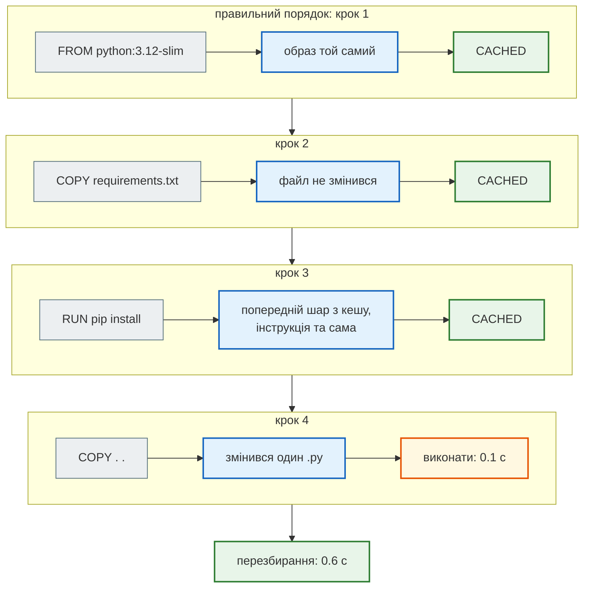
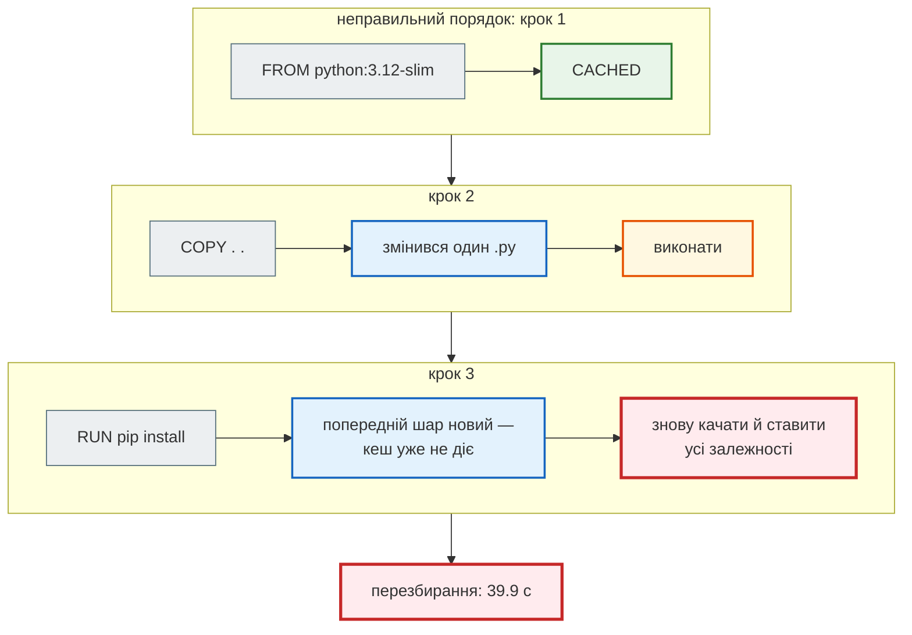
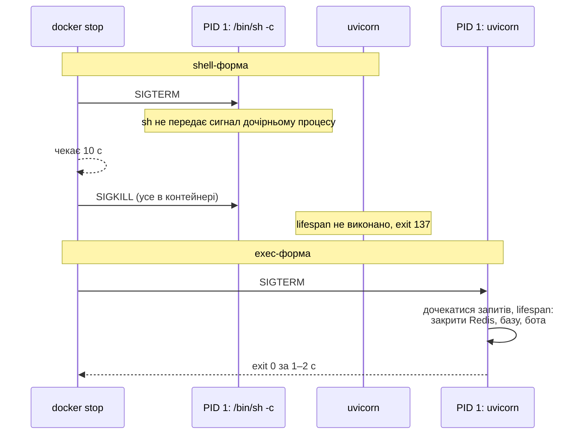
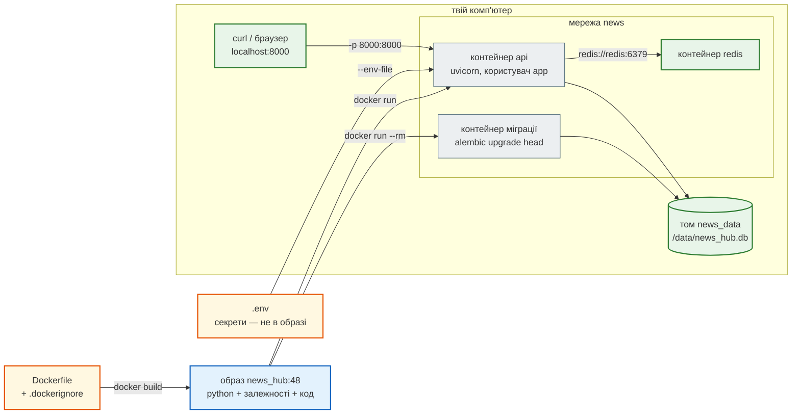
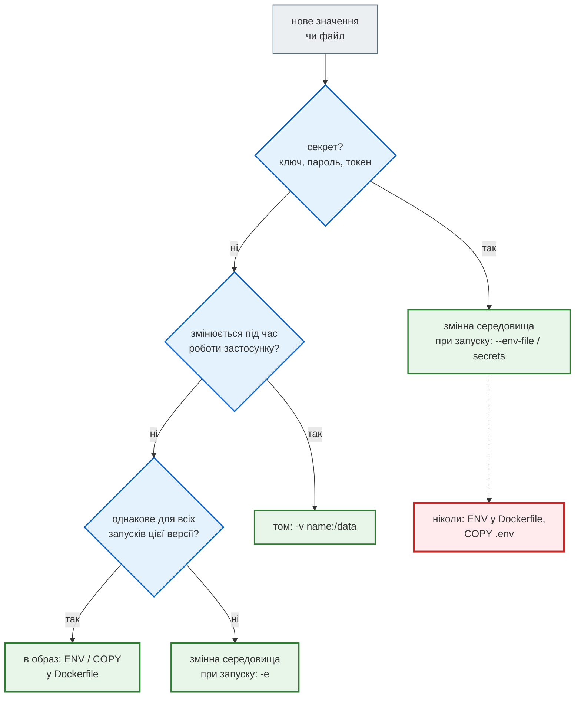

# Урок 48. Docker

Агрегатор `news_hub` уже вміє все: збирає новини, зберігає їх у базі, кешує в Redis, аналізує моделлю, захищає запис і має Telegram-бота. Але запускається він «у мене на комп'ютері»: потрібен правильний Python, `pip install`, змінні середовища, `alembic upgrade`. На сервері, у колеги чи в CI все це треба повторити — і десь неодмінно буде інша версія чогось.

Сьогодні агрегатор стає **образом Docker**. Це один файл-рецепт (`Dockerfile`), з якого на будь-якій машині з Docker виходить той самий застосунок з тими самими бібліотеками.

Основа — `Dockerfile` зі стартового `production_bot`. Ми збираємо його над `news_hub` без змін, дивимось, що потрапило в образ, скільки він важить і як зупиняється. Потім виправляємо крок за кроком.

| Урок | Крок агрегатора |
|---|---|
| 36–39 | парсер і модель, FastAPI, база, Redis |
| 41–43 | тести; Claude Code і RSS; аналіз LLM |
| 46–47 | безпека; Telegram-бот |
| **48** | **Docker: образ застосунку, тести образу** |
| 49 | Compose: API, міграції, PostgreSQL, Redis, nginx, бот — однією командою; деплой |
| 50 | CI/CD: тести й збірка образу на кожен PR |

Проєкт: [`news_hub`](https://github.com/NikoriakViktot/PY-Course-Victor-Nikoriak-22-09-2026/tree/main/module_5/lessons/lesson_48_docker/news_hub).

**Що потрібно з попередніх уроків:** змінні середовища і секрети (уроки 43, 46); Alembic (38); Redis (39); `/health` і lifespan FastAPI (37, 47). Процеси, сигнали й права файлів — у [бонус-уроці Linux](bonus_linux.md): контейнер — це процес Linux.

**Після уроку ти зможеш:**

- пояснити, чим образ відрізняється від контейнера, а шар — від тому;
- написати `Dockerfile`, який швидко перезбирається і не несе в собі секретів;
- запустити застосунок, базу й Redis у контейнерах і з'єднати їх мережею;
- розрізнити «процес живий» і «готовий приймати запити» (liveness / readiness);
- пояснити, чому `docker stop` зупиняє один контейнер за секунду, а інший — за десять;
- перевірити образ тестами.

**Ноутбук заняття:** [Відкрити вправи в Colab](https://colab.research.google.com/github/NikoriakViktot/PY-Course-Victor-Nikoriak-22-09-2026/blob/main/module_5/lessons/lesson_48_docker/note_lesson_48_docker_student.ipynb){ .md-button .md-button--primary } [Переглянути розв’язки](https://github.com/NikoriakViktot/PY-Course-Victor-Nikoriak-22-09-2026/blob/main/module_5/lessons/lesson_48_docker/note_lesson_48_docker.ipynb){ .solutions-link }. У Colab немає Docker, тому в ноутбуці — те, що можна перевірити без нього: `.dockerignore`, кеш шарів, змінні середовища, сигнали. Команди Docker — з реальним виводом, щоб повторити локально.

## Пригадай

1. Де `news_hub` бере адресу бази й Redis і що буде, якщо змінну не задано (уроки 38–39)?
2. Чому секрет не можна класти в код чи в git (урок 46)?
3. Що робить lifespan FastAPI при зупинці застосунку (уроки 37, 47)?

??? success "Відповіді"

    1. `DATABASE_URL` і `REDIS_URL`. Без них — SQLite-файл `news_hub.db` у поточній папці та Redis на `localhost:6379`.
    2. Усе, що потрапило в git чи в код, бачить кожен, хто має копію, — і назавжди, навіть після видалення (історія). Секрети — лише в змінних середовища.
    3. Після `yield` — закриває сесію бота, клієнт LLM, з'єднання з Redis і пул бази. Якщо процес вбити, ця частина не виконається.

## Старт: з якого коду починаємо

```dockerfile title="production_bot/Dockerfile (стартовий код)"
FROM python:3.12-slim

WORKDIR /app

# Залежності — окремий шар (кешується)
COPY requirements.txt .
RUN pip install --no-cache-dir -r requirements.txt

# Код
COPY . .

# Не запускаємо як root
RUN adduser --disabled-password --gecos "" appuser
USER appuser

# uvicorn: 4 worker процеси, 0.0.0.0 для Docker networking
CMD ["uvicorn", "backend.app:app", "--host", "0.0.0.0", "--port", "8000", "--workers", "4"]
```

Багато чого тут уже правильно: невеликий базовий образ `slim`, залежності окремим шаром перед кодом, користувач без root, `CMD` у формі JSON-масиву. Це й лишаємо.

### Docker за хвилину

| Слово | Що це | У `news_hub` |
|---|---|---|
| **образ** (image) | незмінний знімок файлової системи + команда запуску; збирається з `Dockerfile` | `news_hub:48` |
| **шар** (layer) | результат однієї інструкції `Dockerfile`; образ — стос шарів, спільні шари не дублюються | `pip install` — 192 МБ, код — 336 кБ |
| **контейнер** | запущений з образу процес зі своєю файловою системою, мережею й користувачем | `api`, `redis` |
| **том** (volume) | каталог, що живе окремо від контейнера: контейнер видалили — дані лишились | `news_data` → `/data` |
| **мережа** | контейнери в одній мережі бачать одне одного за іменем | `news`: `redis://redis:6379` |
| **реєстр** | сховище образів (Docker Hub, GHCR) | урок 50 |

Встановлення: [Docker Desktop](https://docs.docker.com/get-started/get-docker/) (Windows, macOS) або Docker Engine (Linux). Перевірка — `docker run --rm hello-world`.

### Старий Dockerfile над `news_hub`

Беремо Dockerfile без змін (лише шлях до застосунку: `news_hub.api:app`) і збираємо в папці проєкту — такій, як у студента після уроку 47: поруч лежать `.env` з ключами й `.venv`.

```text
$ docker build --progress=plain -t news_hub:old .
#5 transferring context: 1.17GB 27.1s done
…
real    3m7.728s

$ docker images
news_hub:old   2.2GB

$ docker run --rm news_hub:old cat /app/.env
JWT_SECRET=local-dev-secret-do-not-ship-xxxxxxxxxxxxxxxxxxxx
GEMINI_API_KEY=AIza-FAKE-KEY-FOR-LESSON

$ docker run --rm news_hub:old pip list | grep -E "^(pytest|mypy|fakeredis) "
fakeredis          2.38.0
mypy               2.3.1
pytest             9.1.1
```

Що бачимо:

- **секрети в образі.** `.env` скопіювався разом з кодом. Хто отримає образ (реєстр, колега, CI), той отримає й ключі;
- **образ 2.2 ГБ**, з них 1.31 ГБ — шар `COPY . .`: туди потрапив локальний `.venv`, зібраний під іншу ОС і для контейнера марний;
- **27 секунд лише на передачу контексту**: `docker build` спершу пакує всю папку й віддає її Docker;
- **pytest і mypy в образі**: `requirements.txt` спільний для застосунку й тестів.

## Рефакторинг 1. Що потрапляє в образ: `.dockerignore` і два файли залежностей { #refactor-1 }

`COPY . .` копіює **контекст збірки** — усю папку, крім того, що перелічено в `.dockerignore`. `.gitignore` Docker не читає.

```text title=".dockerignore (скорочено)"
# секрети: .env читає Compose/docker run (--env-file), в образ він не йде ніколи
.env
.env.*
!.env.example

# локальне оточення й кеші — сотні МБ, і вони під іншу ОС
.venv/
**/__pycache__
**/*.py[cod]
**/.mypy_cache
**/.pytest_cache

# локальні дані
**/*.db
**/dump.rdb

# розробка: тести, IDE, git, документація
tests/
.git/
.claude/
requirements-dev.txt
pytest.ini
```

Шаблон рахується **від кореня контексту**, як у `.gitignore` з `/` на початку: `__pycache__` прибирає лише `./__pycache__`, а `news_hub/__pycache__` і `news_hub/bot/__pycache__` доїдуть в образ. У будь-якій папці — `**/__pycache__`. Перевірка — `docker run --rm news_hub:48 find /app -name __pycache__` має нічого не показати (і так перевіряє тест, див. [Тести](#tests)).

Правило: **в образ — лише те, що потрібно застосунку для роботи.** Тому залежності розділено на два файли:

```text title="requirements.txt → requirements.txt + requirements-dev.txt"
# requirements.txt — лише залежності роботи; вони й ідуть в образ
fastapi>=0.121
uvicorn[standard]>=0.30
…
aiogram>=3.15

# requirements-dev.txt — розробка й тести
-r requirements.txt
fakeredis>=2.26
pytest>=8
pytest-asyncio>=0.24
pytest-cov>=5
mypy>=1.10
```

Локально тепер ставимо `pip install -r requirements-dev.txt` — застосунок разом з інструментами.

| Що | Старий Dockerfile | Стало |
|---|---|---|
| контекст збірки | 1.17 ГБ | 328 кБ (35 файлів) |
| шар коду `COPY . .` | 1.31 ГБ | 336 кБ |
| шар залежностей | 289 МБ | 192 МБ |
| образ | 2.2 ГБ | 415 МБ |
| `.env` в образі | є | немає |

!!! warning "Видалити секрет пізніше — не допоможе"
    `RUN rm .env` у наступному рядку Dockerfile прибере файл з останнього шару, але не з попереднього: образ — стос шарів, і кожен можна дістати (`docker save`, `docker history`). Секрет не має потрапляти в жоден шар. Те саме з `ENV API_KEY=…` у Dockerfile: `docker history` і `docker inspect` покажуть його кожному (див. [Знайди помилку](#find-bug)).

## Рефакторинг 2. Шари й кеш: порядок інструкцій { #refactor-2 }

Docker виконує `Dockerfile` згори донизу. Для кожної інструкції він перевіряє, чи є в кеші шар, зібраний з **тих самих вхідних даних** (та сама інструкція, ті самі файли для `COPY`) поверх **того самого** попереднього шару. Є — бере готовий (`CACHED`). Немає — виконує інструкцію, і кеш для **всіх наступних** інструкцій уже не використовується.

Тому порядок: від того, що змінюється рідко (базовий образ, залежності), до того, що змінюється щодня (код). Змінили один `.py`:



А тепер `COPY . .` **перед** `pip install`:



Виміряно на `news_hub` (додали коментар в один файл і перезібрали):

```text
COPY . . перед pip install:   real 0m39.923s
COPY . . після pip install:   real 0m0.602s
```

Старий Dockerfile вже мав правильний порядок — так і лишаємо. Нове — лише те, що `.dockerignore` не дає «шуму» (кеші `**/__pycache__`, `.pytest_cache`) інвалідувати шар коду щоразу після запуску тестів.

## Рефакторинг 3. Користувач, дані й змінні середовища { #refactor-3 }

```dockerfile title="Dockerfile (news_hub, урок 48)"
FROM python:3.12-slim

ENV PYTHONDONTWRITEBYTECODE=1 \
    PYTHONUNBUFFERED=1 \
    PIP_DISABLE_PIP_VERSION_CHECK=1 \
    PIP_ROOT_USER_ACTION=ignore

WORKDIR /app

COPY requirements.txt .
RUN pip install --no-cache-dir -r requirements.txt

RUN useradd --uid 10001 --no-create-home --shell /usr/sbin/nologin app \
    && mkdir /data && chown app /data

COPY . .

USER app

ENV DATABASE_URL=sqlite+aiosqlite:////data/news_hub.db

EXPOSE 8000

HEALTHCHECK --interval=30s --timeout=5s --start-period=30s --retries=3 \
    CMD ["python", "-c", "import urllib.request; urllib.request.urlopen('http://127.0.0.1:8000/health', timeout=4)"]

CMD ["uvicorn", "news_hub.api:app", "--host", "0.0.0.0", "--port", "8000"]
```

| Було | Стало | Чому |
|---|---|---|
| `adduser … appuser` (UID — який випаде) | `useradd --uid 10001 … app` | фіксований UID: права на томі однакові після перезбирання й на іншій машині |
| код скопійовано до створення користувача | те саме, власник коду — root | `app` не може змінити код застосунку, навіть якщо його зламали |
| база — `news_hub.db` у `/app` | `DATABASE_URL=…////data/news_hub.db`, `/data` належить `app` | у `/app` користувач без root писати не може; дані — на томі, а не в контейнері |
| — | `PYTHONUNBUFFERED=1` | `print` одразу в `docker logs`, а не блоками по 8 кБ |
| — | `PYTHONDONTWRITEBYTECODE=1` | `.pyc` не пишуться: `/app` лише для читання, та й файлова система контейнера тимчасова |
| `--workers 4` | один процес; `WEB_CONCURRENCY` за потреби | див. [Рефакторинг 4](#refactor-4) |

### Том: дані переживають контейнер

```text
$ docker run --rm -v news_data:/data news_hub:48 alembic upgrade head
INFO  [alembic.runtime.migration] Running upgrade  -> 0001, news table — таблиця новин агрегатора (урок 38)
…
INFO  [alembic.runtime.migration] Running upgrade 0003 -> 0004, subscriptions — підписки чатів Telegram на ключові слова (урок 47)
```

Контейнер з міграцією завершився й видалився (`--rm`), а таблиці лишились у томі `news_data`. Збираємо новини, видаляємо контейнер API, запускаємо новий:

```text
{"source":"snapshot", … "news_saved":168, "news_total":168, "rejected":[]}
{"count":168}
після нового контейнера:
{"count":168}
```

### `localhost` у контейнері — це сам контейнер

Запускаємо API, а Redis працює окремо — «на `localhost`», як на уроці 39:

```text
$ docker run -d --name api -p 8000:8000 -v news_data:/data news_hub:48
$ curl localhost:8000/health/ready
{"status":"unavailable","checks":{"database":"ok","redis":"ConnectionError"}} 503
$ docker logs api
WARNING news_hub: readiness: Redis недоступний: Error 111 connecting to localhost:6379. Connection refused.
```

У контейнера своя мережа: `localhost` — це він сам, а Redis там немає. Контейнери бачать одне одного за **іменем** у спільній мережі:

```bash
docker network create news
docker run -d --name redis --network news redis:7-alpine
docker run -d --name api --network news -p 8000:8000 -v news_data:/data \
    -e REDIS_URL=redis://redis:6379/0 --env-file .env news_hub:48
```

```text
$ curl localhost:8000/health/ready
{"status":"ok","checks":{"database":"ok","redis":"ok"}} 200
```

`-p 8000:8000` відкриває порт контейнера для твого комп'ютера. Саме тому uvicorn слухає `0.0.0.0`, а не `127.0.0.1`: на `127.0.0.1` усередині контейнера до нього не достукався б ніхто ззовні.

### `--env-file` бере значення буквально

`python -m news_hub.security` (урок 46) друкує рядки для `export` у shell — з одинарними лапками, бо в bcrypt-хеші є `$`. `docker run --env-file` лапок не знімає:

```text
$ cat .env
ADMIN_PASSWORD_HASH='$2b$12$eBDJbnUjhmlf…'
$ docker run --env-file .env … news_hub:48
RuntimeError: ADMIN_PASSWORD_HASH — bcrypt-хеш ($2b$…), а не пароль; згенеруй: python -m news_hub.security
$ docker ps -a
… Exited (3)
```

Добре, що застосунок **впав одразу** (fail fast, урок 46), а не мовчки працював без адмінки. Рядки для `--env-file` — без лапок:

```text
$ docker run --rm -it news_hub:48 python -m news_hub.security --env-file
Пароль адміністратора:
ADMIN_PASSWORD_HASH=$2b$12$UG14SaBxaUyX/tnjj1…
JWT_SECRET=ctJCjB8JBYTDGwJEBi1YTa2FCwjKDyJwVD…
```

Compose (урок 49) читає `.env` інакше: там лапки знімаються.

## Рефакторинг 4. Здоров'я і зупинка { #refactor-4 }

### Два питання: «живий?» і «готовий?»

| Ендпоінт | Питання | Хто питає | Не так — що робити |
|---|---|---|---|
| `GET /health` | процес відповідає? | `HEALTHCHECK` образу | перезапустити контейнер |
| `GET /health/ready` | база й Redis доступні? | балансувальник, Compose (урок 49) | не слати запитів, почекати |

Чому не одна перевірка: якщо впала база, перезапуск API не допоможе — лише створить хвилю перезапусків. Тому `/health` бази не торкається, а `/health/ready` каже, чого саме бракує, — без адреси бази й тексту помилки (вони лише в журналі):

```python title="news_hub/api.py"
@app.get("/health/ready", tags=["system"], summary="База й Redis доступні (readiness)",
         responses={503: {"description": "база чи Redis недоступні"}})
async def ready(db: SessionDep, redis: RedisDep) -> JSONResponse:
    """Назовні — лише «ok»/назва винятку: адреса бази й текст помилки лишаються в журналі."""
    checks: dict[str, str] = {}
    try:
        await db.execute(text("SELECT 1"))
        checks["database"] = "ok"
    except Exception as error:
        logger.warning("readiness: база недоступна: %s", error)
        checks["database"] = type(error).__name__
    try:
        await redis.ping()
        checks["redis"] = "ok"
    except Exception as error:
        logger.warning("readiness: Redis недоступний: %s", error)
        checks["redis"] = type(error).__name__
    ok = all(value == "ok" for value in checks.values())
    return JSONResponse({"status": "ok" if ok else "unavailable", "checks": checks},
                        status_code=200 if ok else 503)
```

`HEALTHCHECK` у Dockerfile — через `python`, бо `curl` у `python:3.12-slim` немає (`which curl` → нічого). `--start-period=30s`: імпорт aiogram, google-genai і anthropic займає кілька секунд, і перші невдалі перевірки в цей час не рахуються.

```text
$ docker ps
NAMES   STATUS
api     Up 44 seconds (healthy)
```

### `docker stop`: SIGTERM, а через 10 секунд — SIGKILL

`docker stop` надсилає процесу з **PID 1** сигнал `SIGTERM` і чекає 10 секунд. Не завершився — `SIGKILL`, без жодного шансу прибрати за собою. Хто ж PID 1, залежить від форми `CMD`:

```dockerfile
CMD ["uvicorn", "news_hub.api:app", "--host", "0.0.0.0", "--port", "8000"]   # exec-форма: PID 1 — uvicorn
CMD uvicorn news_hub.api:app --host 0.0.0.0 --port 8000                      # shell-форма: PID 1 — /bin/sh -c
```

```text
$ docker top api-shell-form
PID     COMMAND
6320    /bin/sh -c uvicorn news_hub.api:app --host 0.0.0.0 --port 8000
6344    /usr/local/bin/python3.12 /usr/local/bin/uvicorn news_hub.api:app --host 0.0.0.0 --port 8000
```



```text
--- exec-форма:
real    0m1.800s
INFO:     Shutting down
INFO:     Waiting for application shutdown.
INFO:     Application shutdown complete.
INFO:     Finished server process [1]
exit=0
--- shell-форма:
real    0m10.238s
exit=137
```

137 = 128 + 9 (`SIGKILL`). Детальніше про сигнали й PID 1 — у [бонус-уроці Linux](bonus_linux.md#signals).

### `--workers 4` в контейнері

```text
$ docker stats --no-stream
old1 (--workers 4)   969.2MiB
api1 (1 процес)      251.5MiB
```

Кожен worker — окремий процес з усіма бібліотеками. У контейнері краще **один процес на контейнер**, а масштаб — кількістю контейнерів (урок 49): тоді ліміт пам'яті, перезапуск і журнал стосуються одного процесу. Якщо все ж треба кілька — `-e WEB_CONCURRENCY=2` (uvicorn читає цю змінну сам), без перезбирання образу.

## Архітектура { #architecture }



| Що | Де живе | Коли змінюється |
|---|---|---|
| Python, бібліотеки, код | образ | при збиранні нової версії |
| налаштування й секрети | змінні середовища (`-e`, `--env-file`) | при запуску; той самий образ — у тестах і на сервері |
| дані | том | під час роботи; переживають контейнер і нову версію образу |

Один образ — кілька ролей: API (`CMD` за замовчуванням), міграції (`alembic upgrade head`), бот у режимі polling (`python -m news_hub.bot`, див. [Практика](#practice)).

## Тести { #tests }

Образ — теж код, і його перевіряють тестами. `tests/docker/test_image.py` збирає образ з копії проєкту, куди навмисно покладено `.env` з «секретом», `.venv` і файл бази, і запускає справжні контейнери:

| Тест | Що перевіряє |
|---|---|
| `test_local_files_are_not_in_the_image` | `.env`, `.venv`, `tests`, `*.db` немає в `/app`, `__pycache__` — ні в корені, ні в підпапках; «секрету» немає в `docker history` |
| `test_dev_dependencies_are_not_installed` | `import pytest` / `mypy` / `fakeredis` в образі падає |
| `test_runs_as_non_root_and_cannot_change_code` | UID 10001; змінити `/app/news_hub/api.py` не можна, писати в `/data` можна |
| `test_healthcheck_reports_healthy` | статус контейнера стає `healthy` |
| `test_docker_stop_is_graceful` | `docker stop` < 8 с, код 0, «Application shutdown complete» у журналі |
| `test_migrations_run_on_a_volume` | `alembic upgrade head` у контейнері на томі → `alembic current` показує `(head)` |

```bash
pytest -m docker          # 6 passed in 44.73s — лише коли Docker є; без нього тести пропускаються
pytest                    # 340 тестів застосунку — як і раніше, без Docker
```

Старий Dockerfile проти цих тестів — 6 з 6 червоні. Кожну поломку нового Dockerfile (shell-форма `CMD`, без `USER app`, без `.env` у `.dockerignore`, HEALTHCHECK на інший порт) ловить принаймні один тест.

У `tests/integration/test_health.py` — ще 3 тести для `/health/ready`: усе доступне → 200; база недоступна → 503, але `/health` — 200 і шлях до бази не потрапляє у відповідь; Redis недоступний → 503.

## Куди що класти { #how-to-choose }



Приклади з `news_hub`: `GEMINI_API_KEY`, `BOT_TOKEN` → при запуску (секрет); `data/rbc_news_snapshot.json`, `migrations/` → в образ; `news_hub.db` → том; `REDIS_URL`, `WEB_CONCURRENCY` → `-e` (на ноутбуці й на сервері різні).

## Практика { #practice }

### Розібраний приклад: бот з того самого образу

Бот у режимі polling (урок 47) — інший процес того самого застосунку. Новий образ не потрібен: перевизначаємо команду. Двійник Telegram запускаємо на своєму комп'ютері, а бот — у контейнері:

```bash
python -m tests.telegram_twin --host 0.0.0.0 --port 8081     # «Telegram» на твоєму комп'ютері

docker run -d --name bot --network news -v news_data:/data \
    --add-host host.docker.internal:host-gateway \
    -e REDIS_URL=redis://redis:6379/0 \
    -e BOT_TOKEN=123456:TEST-TOKEN -e TELEGRAM_API_URL=http://host.docker.internal:8081 \
    news_hub:48 python -m news_hub.bot

curl -X POST localhost:8081/_twin/say -d '{"text": "/news 3", "chat_id": 1001}'
curl 'localhost:8081/_twin/sent?chat_id=1001'
```

```text
INFO aiogram.dispatcher: Run polling for bot @news_hub_bot id=123456 - 'news_hub'

📰 <b>Останні новини</b> (3)

• <a href="https://www.rbc.ua/ukr/news/katar-vryatue-peregovori-ssha-ta-iranu-vens-1778281213.html">Катар спасет переговоры США и Ирана? …</a> <i>Новини</i>
• …
```

Три деталі, кожна — з цього уроку:

- `host.docker.internal` — ім'я твого комп'ютера зсередини контейнера (`localhost` був би сам контейнер). На Linux його додає `--add-host …:host-gateway`, Docker Desktop — сам;
- двійник слухає `0.0.0.0`: з `--host 127.0.0.1` бот отримував `Cannot connect to host host.docker.internal:8081`. Для двійника це нова опція `--host` (урок 48);
- новини — ті самі, що зібрав API: обидва контейнери бачать том `news_data`. Для SQLite це прийнятно лише на заняттях — два процеси, що пишуть в один файл, заважають одне одному. У уроці 49 обидва ходять у PostgreSQL.

### Зміни приклад

1. Запусти бота **без** `--network news`. Що покаже `docker logs bot`, коли прийде `/news`?
2. Запусти API з `-e WEB_CONCURRENCY=2`. Скільки процесів покаже `docker top api`?

??? success "Що покаже запуск"

    1. Бот стартує (`Run polling for bot @news_hub_bot`): до Telegram він ходить через `host.docker.internal`, а не через мережу `news`. Але на **кожне** повідомлення, навіть `/start`, у журналі — `redis.exceptions.ConnectionError: Error -2 connecting to redis:6379. Name or service not known.`, а двійник не отримує жодної відповіді (`/_twin/sent` → `[]`). Rate limit — outer middleware (урок 47): він звертається до Redis раніше за будь-який handler. Ім'я `redis` відоме лише в мережі `news`.
    2. Чотири процеси Python: головний uvicorn (PID 1), `multiprocessing.resource_tracker` і два worker (`spawn_main`). Пам'ять — 503 МіБ проти 251 МіБ з одним процесом: кожен worker імпортує всі бібліотеки.

### Спробуй самостійно: образ на Python 3.13

Зроби версію Python параметром збірки:

```dockerfile
ARG PYTHON_VERSION=3.12
FROM python:${PYTHON_VERSION}-slim
```

**Критерії перевірки:**

- `docker build --build-arg PYTHON_VERSION=3.13 -t news_hub:48-py313 .` збирається;
- `pytest -m docker` зелений для обох образів (фікстура `image` у `tests/docker/test_image.py` може брати версію зі змінної середовища);
- `docker run --rm news_hub:48-py313 python --version` → `Python 3.13.…`.

У уроці 50 CI збиратиме саме так — матрицею версій.

### Знайди помилку { #find-bug }

Dockerfile працює: образ збирається, `curl /health` відповідає `{"status":"ok"}`. Але в ньому три проблеми.

```dockerfile
FROM python:3.12-slim
WORKDIR /app
COPY . .
RUN pip install --no-cache-dir -r requirements.txt
RUN useradd --uid 10001 app
USER app
ENV GEMINI_API_KEY=AIzaSyD-course-demo-key-not-real-0000000
CMD uvicorn news_hub.api:app --host 0.0.0.0 --port 8000
```

Реальний вивід:

```text
$ echo "# x" >> news_hub/models.py && time docker build -q -t findbug .
real    0m43.050s

$ docker history findbug --format '{{.CreatedBy}}' | grep GEMINI
ENV GEMINI_API_KEY=AIzaSyD-course-demo-key-n…

$ time docker stop fb
real    0m10.262s
$ docker inspect -f '{{.State.ExitCode}}' fb
137
```

??? success "Відповідь"

    1. **`COPY . .` перед `pip install`.** Зміна будь-якого файлу інвалідує шар залежностей — 43 с на кожне перезбирання замість долі секунди. Спершу `COPY requirements.txt .` і `pip install`, потім `COPY . .`.
    2. **Ключ в образі.** `ENV` у Dockerfile записується в метадані образу: `docker history` і `docker inspect` покажуть його кожному, хто має образ. Ключ — при запуску: `--env-file .env` чи `-e`, а в Compose — `env_file` / secrets.
    3. **Shell-форма `CMD`.** PID 1 — `/bin/sh`, він не передає `SIGTERM` uvicorn: `docker stop` чекає 10 с і вбиває (`137`), lifespan не виконується. Exec-форма: `CMD ["uvicorn", "news_hub.api:app", "--host", "0.0.0.0", "--port", "8000"]`.

    `curl /health` цього не показує: усі три проблеми — не в тому, **чи** працює застосунок, а в тому, як його збирають, що в ньому лежить і як він зупиняється. Тому образ перевіряють окремими тестами (`tests/docker/`).

## Підсумок

| Поняття | Що запам'ятати |
|---|---|
| образ / контейнер | рецепт і знімок / запущений процес; один образ — багато контейнерів і ролей |
| `.dockerignore` | в образ — лише потрібне для роботи; `.env`, `.venv`, тести, бази — ні |
| шари й кеш | від рідкісних змін до частих: залежності → код |
| секрети | лише при запуску; `ENV` у Dockerfile і `COPY .env` видно в образі назавжди |
| користувач | не root, фіксований UID; код належить root, дані — користувачу |
| дані | том; контейнер можна видаляти будь-коли |
| мережа | `localhost` — сам контейнер; інші — за іменем у спільній мережі; слухати `0.0.0.0` |
| здоров'я | `/health` — живий (HEALTHCHECK), `/health/ready` — готовий (база, Redis) |
| зупинка | exec-форма `CMD`: PID 1 — застосунок, `SIGTERM` → lifespan → exit 0 |

### Самоперевірка

1. Чому `RUN rm .env` після `COPY . .` не прибирає секрет з образу?
2. Змінився лише `requirements.txt`. Які шари перезбереться, а які — з кешу?
3. Навіщо `/data` окремо, якщо контейнер і так має свою файлову систему?
4. Чим `/health` відрізняється від `/health/ready` і чому HEALTHCHECK питає саме `/health`?
5. Що означає код виходу 137 і як його уникнути?
6. Чому uvicorn у контейнері слухає `0.0.0.0`?

??? success "Відповіді"

    1. Образ — стос шарів. `COPY` створив шар з `.env`, `RUN rm` — новий шар, де файлу немає, але попередній шар лишився в образі й дістається `docker save`.
    2. `FROM`, `WORKDIR` — з кешу; `COPY requirements.txt`, `RUN pip install` і все після них — заново (попередній шар змінився).
    3. Файлова система контейнера зникає разом з ним. Том живе окремо: нова версія образу, новий контейнер — ті самі дані.
    4. `/health` — процес відповідає; `/health/ready` — ще й база з Redis доступні. Якщо HEALTHCHECK питав би про базу, падіння PostgreSQL робило б API «unhealthy» і (в оркестраторі) змушувало б його перезапускати — а перезапуск базу не полагодить.
    5. 128 + 9: процес убито `SIGKILL`, бо на `SIGTERM` за 10 с він не завершився. Найчастіше — shell-форма `CMD`: сигнал отримує `/bin/sh`, а не застосунок.
    6. `127.0.0.1` усередині контейнера — сам контейнер; з'єднання ззовні (через `-p` чи з іншого контейнера) приходять на інший інтерфейс.

### Що далі

- Ноутбук заняття: [Відкрити вправи в Colab](https://colab.research.google.com/github/NikoriakViktot/PY-Course-Victor-Nikoriak-22-09-2026/blob/main/module_5/lessons/lesson_48_docker/note_lesson_48_docker_student.ipynb){ .md-button .md-button--primary } [Переглянути розв’язки](https://github.com/NikoriakViktot/PY-Course-Victor-Nikoriak-22-09-2026/blob/main/module_5/lessons/lesson_48_docker/note_lesson_48_docker.ipynb){ .solutions-link }.
- Урок 49: мережа, том, порядок запуску (спершу база, потім міграції, потім API) і nginx — в одному `docker-compose.yml`; той самий підхід для Django-проєкту нотаток; деплой на сервер.

## Документація і джерела

- Код: [`news_hub`](https://github.com/NikoriakViktot/PY-Course-Victor-Nikoriak-22-09-2026/tree/main/module_5/lessons/lesson_48_docker/news_hub) — `Dockerfile` зі стартового `production_bot`.
- Docker: [Dockerfile reference](https://docs.docker.com/reference/dockerfile/), [build cache](https://docs.docker.com/build/cache/), [.dockerignore](https://docs.docker.com/build/concepts/context/#dockerignore-files), [best practices](https://docs.docker.com/build/building/best-practices/), [HEALTHCHECK](https://docs.docker.com/reference/dockerfile/#healthcheck), [shell і exec форми](https://docs.docker.com/reference/dockerfile/#shell-and-exec-form), [volumes](https://docs.docker.com/engine/storage/volumes/), [networking](https://docs.docker.com/engine/network/), [`docker run --env-file`](https://docs.docker.com/reference/cli/docker/container/run/#env).
- Python-образи: [python на Docker Hub](https://hub.docker.com/_/python) (варіанти `slim`, `alpine`).
- uvicorn: [deployment](https://www.uvicorn.org/deployment/), [налаштування](https://www.uvicorn.org/settings/) (`--workers`: «Defaults to the $WEB_CONCURRENCY environment variable if available, or 1»). FastAPI: [FastAPI in Containers](https://fastapi.tiangolo.com/deployment/docker/).
