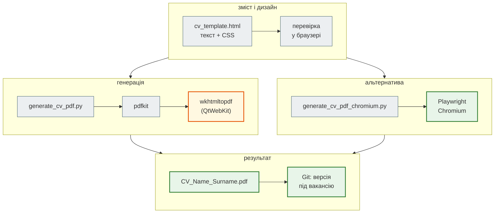
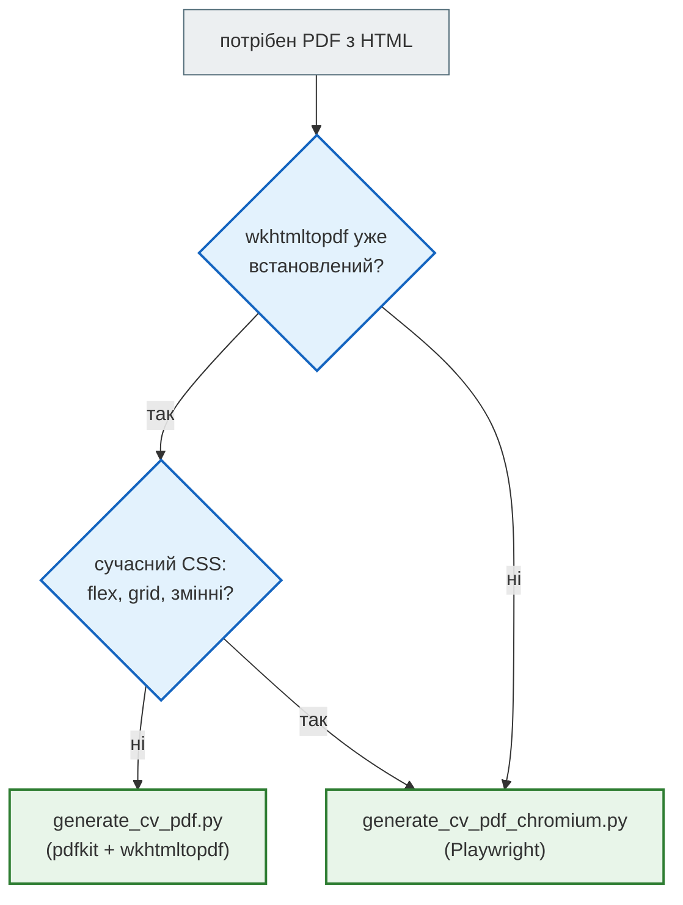

# Бонус. CV розробника: HTML → PDF

Курс закінчується фінальним проєктом (уроки 52–53), а після нього — пошук роботи чи стажування. Перше, що побачить рекрутер, — не код, а **CV**. Цей бонус-урок (поза нумерацією 1–52) — про дві речі:

1. **що** писати: як з «я робив» зробити «я створив цінність» — туторіал;
2. **як** робити CV інженерно: зміст і дизайн у HTML, PDF — однією командою, версії — у Git.

Стартовий код — `CV_maker`: HTML-резюме викладача, скрипт `generate_cv_pdf.py` (`pdfkit` → `wkhtmltopdf`), README з інструкціями і туторіал.

| Крок | Матеріал | Що там |
|---|---|---|
| 1 | [довідник «Сильне CV»](cv/cv_tutorial.md) | Professional Summary, формула пункту, сильні дієслова, чесні метрики, порядок проєктів, Skills, розриви сторінок, адаптація під вакансію, ATS |
| 2 | [`cv_maker/`](https://github.com/NikoriakViktot/PY-Course-Victor-Nikoriak-22-09-2026/tree/main/module_6/bonus/cv_maker) | `cv_template.html` — шаблон для свого CV; `generate_cv_pdf.py` і `generate_cv_pdf_chromium.py`; README |
| 3 | [Відкрити вправи в Colab](https://colab.research.google.com/github/NikoriakViktot/PY-Course-Victor-Nikoriak-22-09-2026/blob/main/module_6/bonus/cv_maker/note_bonus_cv_maker_student.ipynb){ .md-button .md-button--primary } [Переглянути розв’язки](https://github.com/NikoriakViktot/PY-Course-Victor-Nikoriak-22-09-2026/blob/main/module_6/bonus/cv_maker/note_bonus_cv_maker.ipynb){ .solutions-link } | 6 вправ: перевірка пунктів CV, лише чесні числа, CV як дані → HTML з екрануванням, PDF |

**Після уроку ти зможеш:**

- написати пункт CV за формулою «дієслово + що + чим + яка цінність» про свої проєкти курсу;
- відрізнити чесну метрику від вигаданої;
- зібрати CV з HTML-шаблону в PDF і тримати версії під різні вакансії.

## Як це працює



```bash
cd module_6/bonus/cv_maker
pip install pdfkit                               # + wkhtmltopdf (README: Windows, macOS, Linux)
python generate_cv_pdf.py                        # CV викладача
python generate_cv_pdf.py cv_template.html CV_Name_Surname.pdf
```

```text
PDF created: …/module_6/bonus/cv_maker/CV_Viktor_Nikoriak_GeoAI.pdf     ← 5 сторінок
PDF created: /tmp/CV_Template.pdf                                          ← шаблон: 1 сторінка
```

Шаблон `cv_template.html` — той самий CSS, що в CV викладача (кольори, розриви сторінок, `keep-together`), а замість змісту — поля в `[дужках]` і підказка з формулою пункту. Розділ, для якого нічого написати, видаляй цілком: порожній розділ гірший за відсутній.

## `wkhtmltopdf` чи Chromium { #how-to-choose }

`wkhtmltopdf` рендерить HTML старим рушієм QtWebKit, а сам проєкт архівований і більше не розвивається. Тому поруч — `generate_cv_pdf_chromium.py`: той самий HTML через Chromium (Playwright), тобто так, як сторінку бачить Chrome.

```text
                         wkhtmltopdf 0.12.6   wkhtmltopdf --disable-smart-shrinking   Chromium (Playwright)
CV викладача             5 сторінок            6 сторінок                               6 сторінок
cv_template.html         1 сторінка            2 сторінки                               2 сторінки
```

Різниця — не помилка: `wkhtmltopdf` за замовчуванням трохи зменшує вміст, щоб він вмістився (smart shrinking). Без цього він дає ті самі сторінки, що Chromium. Для CV на одну сторінку в Chromium — скороти текст або зменш `font-size` у CSS, а не покладайся на стиснення.



## Що писати: коротко з туторіалу

Повний туторіал — у [довіднику](cv/cv_tutorial.md). Головне:

| Слабко | Сильно |
|---|---|
| перелік ролей у Summary | роль + досвід + спеціалізація + доказ + технології |
| «Responsible for…», «Worked on…» | сильне дієслово + що + чим + яка цінність |
| «improved by 70%» без вимірювання | лише числа, які можеш пояснити на співбесіді |
| список з 30 технологій | карта компетенцій: Backend, Data, Infrastructure, Quality |

Проєкти курсу — готовий матеріал. Приклад пунктів, що спираються лише на справжні факти з уроків 37–51:

```text
Built a news aggregator API with FastAPI, PostgreSQL and Redis, covered by 343 pytest tests.
Containerized a FastAPI news aggregator with Docker and Compose: nginx, PostgreSQL, Redis and one-shot Alembic migrations.
Automated testing with GitHub Actions: 6 jobs per pull request, including pytest on 2 Python versions and mypy --strict.
```

## Практика { #practice }

### Спробуй самостійно: своє CV

Скопіюй `cv_template.html` у `cv_<ім'я>.html` і заповни.

**Критерії перевірки:**

- кожен пункт проходить `weak_reasons` з ноутбука (дієслово дії, інструменти, до 30 слів);
- кожне число — з твого коду чи вимірювання (`unverified_numbers` порожній для твоїх фактів);
- щонайменше два пункти — про проєкти курсу або фінальний проєкт, з посиланням на репозиторій;
- PDF з `generate_cv_pdf.py` або `generate_cv_pdf_chromium.py` — 1–2 сторінки.

### Знайди помилку { #find-bug }

CV генерується з даних Python-функцією, яка вставляє текст у HTML «як є». У Skills записано `C++ & Rust <basics>`. PDF виглядає акуратно — але що саме в ньому написано?

??? success "Відповідь"

    `<basics>` браузер сприймає як тег і не показує: у PDF лише «C++ & Rust ». Ноутбук відтворює це на `html.parser`, як браузер. Текст, що вставляється в HTML, — через `html.escape` (так само, як ім'я користувача в боті уроку 48).

## Документація і джерела

- Код: [`cv_maker`](https://github.com/NikoriakViktot/PY-Course-Victor-Nikoriak-22-09-2026/tree/main/module_6/bonus/cv_maker) — README, туторіал, HTML-CV викладача, `generate_cv_pdf.py`.
- [pdfkit](https://pypi.org/project/pdfkit/), [wkhtmltopdf](https://wkhtmltopdf.org/), [Playwright для Python: `page.pdf()`](https://playwright.dev/python/docs/api/class-page#page-pdf).
- CSS для друку: [`break-inside` / `page-break-inside`](https://developer.mozilla.org/en-US/docs/Web/CSS/break-inside).
