# Урок 52. Робота над фінальним проєктом

За 50 уроків ти пройшов шлях від `print("Hello")` до двох систем, які запускаються однією командою `docker compose up` і перевіряються CI на кожен pull request. Перш ніж починати власний проєкт, варто зупинитися й подивитися на весь курс **одним зрізом**:

- що з кожного модуля реально працює в проєктах;
- як влаштовані бази даних обох проєктів і де вони почнуть гальмувати;
- як влаштовані самі застосунки: шари, залежності, стан;
- що з цього взяти у фінальний проєкт, а чого уникнути.

Урок — це **аудит**: ми не читаємо код «на око», а міряємо. Для цього в папці уроку є три інструменти, і кожне число на сторінці отримане ними або `EXPLAIN ANALYZE` на справжній PostgreSQL 16.

| Інструмент | Що робить |
|---|---|
| [`architecture_audit.py`](https://github.com/NikoriakViktot/PY-Course-Victor-Nikoriak-22-09-2026/blob/main/module_6/lessons/lesson_52_final_project/architecture_audit.py) | граф імпортів пакета через `ast`: рядки, fan-in / fan-out, цикли (алгоритм Тар'яна), діаграма Mermaid |
| [`db_audit.sql`](https://github.com/NikoriakViktot/PY-Course-Victor-Nikoriak-22-09-2026/blob/main/module_6/lessons/lesson_52_final_project/db_audit.sql) | розміри таблиць, зайві й невикористані індекси, повні перегляди таблиць |
| [`query_count.py`](https://github.com/NikoriakViktot/PY-Course-Victor-Nikoriak-22-09-2026/blob/main/module_6/lessons/lesson_52_final_project/query_count.py) | скільки SQL-запитів робить кожна сторінка Django при 10 і 40 записах (N+1) |
| [`patches/news_hub_search_index.patch`](https://github.com/NikoriakViktot/PY-Course-Victor-Nikoriak-22-09-2026/blob/main/module_6/lessons/lesson_52_final_project/patches/news_hub_search_index.patch) | перевірена міграція за результатами аудиту: trigram-індекс для пошуку, мінус зайвий індекс |

| Урок | Що робимо |
|---|---|
| **51** | **зріз курсу, аудит баз і застосунків, рекомендації; вибір і старт фінального проєкту** |
| 52 | випускний: презентація фінального проєкту |

**Що потрібно з попередніх уроків:** увесь курс; найбільше — SQL та індекси (29), Redis (30), шари й патерни (44), Compose (49) і CI (50).

**Після уроку ти зможеш:**

- пояснити, як пов'язані теми курсу, на прикладі двох готових систем;
- прочитати схему бази й план запиту, знайти зайвий індекс і запит, якому індекс не допоможе;
- знайти в проєкті «вузли» (модулі, від яких залежить усе) і цикли імпортів;
- перевірити, де живе стан застосунку і чи переживе він кілька реплік;
- обрати тему фінального проєкту й скласти його мінімальний план.

**Ноутбук заняття:** [Відкрити вправи в Colab](https://colab.research.google.com/github/NikoriakViktot/PY-Course-Victor-Nikoriak-22-09-2026/blob/main/module_6/lessons/lesson_52_final_project/note_lesson_52_final_project_student.ipynb){ .md-button .md-button--primary } [Переглянути розв’язки](https://github.com/NikoriakViktot/PY-Course-Victor-Nikoriak-22-09-2026/blob/main/module_6/lessons/lesson_52_final_project/note_lesson_52_final_project.ipynb){ .solutions-link } — аудит архітектури власноруч: граф імпортів, цикли, keyset-пагінація і `EXPLAIN` на SQLite, чек-лист фінального проєкту.

## Пригадай

1. Що таке індекс у базі і чому він не безкоштовний (урок 30)?
2. Що зберігає `news_hub` у Redis, а не в пам'яті процесу, і навіщо (уроки 40, 50)?
3. Яке правило шарів перевіряє `tests_architecture.py` у проєкті нотаток (урок 45)?

??? success "Відповіді"

    1. Окрема впорядкована структура (B-tree, GIN…), за якою база знаходить рядки без перегляду всієї таблиці. Ціна — місце на диску й повільніший запис: кожен `INSERT`/`UPDATE` оновлює всі індекси таблиці.
    2. Кеш стрічки, лічильники rate limit, статуси фонових задач, кеш аналізу LLM, стан circuit breaker. Процесів API може бути кілька (`--scale api=2`) — стан, який бачить лише один процес, для інших не існує.
    3. У views, API і consumers немає звернень до ORM: читання — лише через `selectors`, зміни — лише через `services`. Тест розбирає код через `ast` — так само, як `architecture_audit.py` сьогодні.

## Зріз курсу { #slice }

Шість модулів — не шість окремих тем. Кожен наступний стоїть на попередньому, і в двох великих проєктах курсу видно майже все.

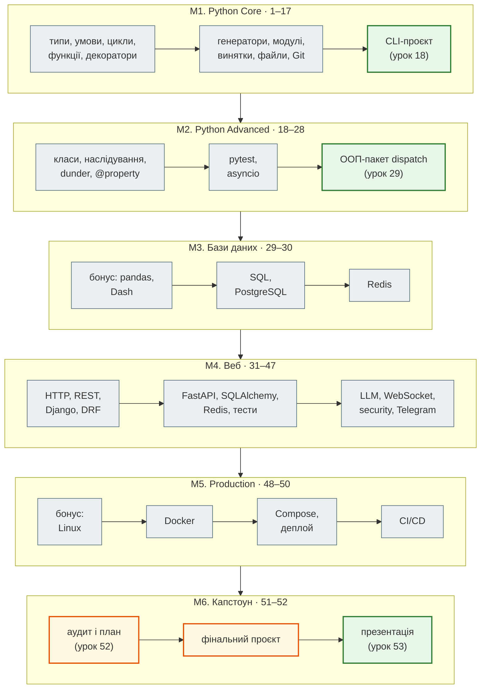

### Модулі й артефакти

| Модуль | Що вмієш | Артефакт |
|---|---|---|
| М1. Python Core | писати й розбирати програми: типи, колекції, функції, декоратори, генератори, винятки, файли, JSON; Git і PR | CLI-проєкт з тестами ([урок 18](../m1/lesson_18.md)) |
| М2. Python Advanced | проєктувати класи і пакети, тестувати pytest, писати асинхронний код; алгоритми практикумів (пошук, рекурсія, DP, купа, trie) | пакет `dispatch` ([урок 29](../m2/lesson_29.md)) |
| М3. Бази даних | аналізувати дані в pandas; проєктувати таблиці, писати SQL, користуватися Redis | ноутбуки SQL і Redis; дашборд Dash (бонус) |
| М4. Веб | HTTP-клієнти; REST API на Django/DRF і FastAPI; ORM, міграції, кеш, middleware, auth, тести, LLM, WebSocket, бот | `crispy_notes_project` і `news_hub` |
| М5. Production | запакувати застосунок в образ, підняти систему з кількох сервісів, перевіряти кожну зміну автоматично | Dockerfile, Compose, nginx, workflows |
| М6. Капстоун | аудит, план, власний проєкт, презентація | фінальний проєкт |

### Як росли два проєкти

`news_hub` почався в уроці 37 з парсера й однієї моделі Pydantic. Проєкт нотаток — з `hello_project` уроку 34. Рядки — код пакета без тестів і міграцій, тести — функції `test_…` (з параметрами pytest і Django їх збирають більше — див. останній рядок).

| Урок | `news_hub`: що додано | рядків | тестів |
|---|---|---:|---:|
| 36 | `NewsItem` (Pydantic), парсер rbc.ua | 231 | 9 |
| 37 | FastAPI, скрапер aiohttp | 527 | 17 |
| 38 | SQLAlchemy async, Alembic, CRUD | 756 | 27 |
| 39 | кеш Redis, middleware, rate limit, фонові задачі | 1092 | 36 |
| 41 | тести: unit / integration, фікстури, фейкова мережа | 1122 | 61 |
| 42 | RSS, написаний Claude Code за тестом-специфікацією | 1212 | 72 |
| 43 | LLM: Gemini / Anthropic, circuit breaker | 1853 | 121 |
| 46 | JWT адміна, захист від SSRF, підписані webhooks | 2481 | 159 |
| 47 | бот aiogram, підписки, розсилка | 3140 | 189 |
| 48–50 | образ, Compose, CI | 3220 | 202 функції → **351** зібраний тест |

| Урок | Проєкт нотаток: що додано | рядків | тестів |
|---|---|---:|---:|
| 33 | `hello_project`: модель `Note`, admin | 249 | 3 |
| 34 | форми, crispy, Bootstrap | 1863 | 6 |
| 35 | DRF API над services/selectors | 1994 | 16 |
| 40 | групи, скидання пароля, JWT, throttle | 2360 | 29 |
| 44 | CBV, правила доступу лише в selectors, PostgreSQL | 2468 | 49 |
| 45 | чат: Channels, consumers | 2912 | 59 |
| 49–50 | Docker, health, `check --deploy` | 3008 | 64 функції → **81** тест (`manage.py test`) |

Тести росли швидше за код: у `news_hub` на кожні 10 рядків пакета — понад один тест. Це не випадковість: кожен урок М4 додавав функцію **разом** з тестами, які її фіксують, і жодна зміна не зливалась з червоним CI.

### Навички → де вони працюють

| Тема курсу | Де в проєктах |
|---|---|
| декоратори (9, 18) | `@app.get`, `@asynccontextmanager` (lifespan), `@login_required`, `@pytest.fixture` |
| генератори, `yield` (10, 24) | `lifespan` FastAPI, `get_db` (сесія на запит), фікстури з прибиранням |
| модулі й пакети (12) | `news_hub.bot`, `hello_app.selectors`; `python -m news_hub.bot` |
| винятки (13) | `HTTPException`, `LLMError` → 502/503, повтор при 429 Telegram |
| JSON (14) | Pydantic-моделі, `model_dump_json` у кеші Redis |
| Git і PR (15) | кожен урок — гілка і PR з CI |
| хешування (16) | ключі кешу `sha256` від параметрів, HMAC webhooks, bcrypt паролів |
| класи, композиція (19–23) | репозиторії, `NewsCache`, `CircuitBreaker`, моделі Django, CBV з mixins |
| pytest (25, 41) | 351 + 81 тест, маркери, фікстури, двійник Telegram |
| asyncio (27) | скрапер aiohttp, async SQLAlchemy, бот, WebSocket |
| SQL, індекси (29) | `UNIQUE (url)`, складені індекси, `INSERT … ON CONFLICT … RETURNING` |
| Redis (30) | кеш, лічильники, статуси задач, channel layer чату |

## Архітектура баз даних { #databases }

### Схеми

Схеми зібрано з моделей (`tables.py`, `models.py`) і перевірено на базі, яку створили міграції.

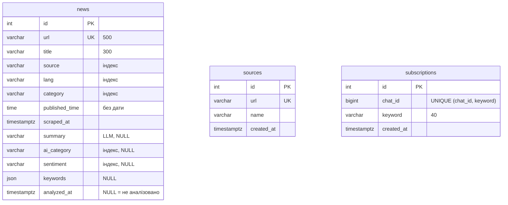

У `news_hub` три таблиці **без зовнішніх ключів**: новина зберігає `source` як текст (домен), підписка — `chat_id` Telegram. Для агрегатора це свідоме рішення: новини приходять з будь-якого сайту, не лише з таблиці `sources`, а чат живе в Telegram, не в нашій базі.

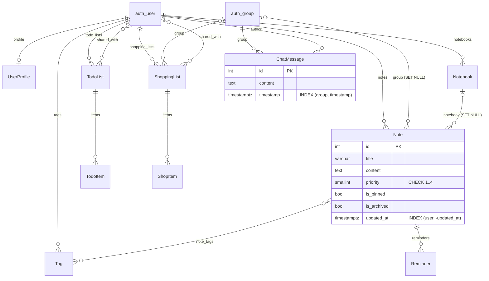

Проєкт нотаток — навпаки, **сильно зв'язана** схема: усе належить користувачеві (`CASCADE`), групи й блокноти — необов'язкові (`SET NULL`: видалили групу — нотатка лишилась, але стала особистою). Правила «хто що бачить» живуть не в схемі, а в `selectors.py` (урок 45).

### Аудит індексів

`db_audit.sql` лише читає системні каталоги. База `news_hub` для аудиту — 302 400 новин і 200 000 підписок (заголовки зі знімка rbc.ua, розмножені), база нотаток — після `migrate`.

```bash
psql "$DATABASE_URL" -f db_audit.sql
```

```text
== 1. Розмір таблиць та їхніх індексів
     таблиця     | рядків (оцінка) |    дані    | індекси
-----------------+-----------------+------------+---------
 news            |          302400 | 83 MB      | 105 MB
 subscriptions   |          200000 | 13 MB      | 14 MB

== 2. Зайві індекси: їхні стовпці — початок іншого індексу тієї ж таблиці
    таблиця    |      зайвий індекс       |        покриває його         | розмір
---------------+--------------------------+------------------------------+---------
 subscriptions | ix_subscriptions_chat_id | uq_subscription_chat_keyword | 2304 kB
```

Індексів у `news` більше, ніж самих даних (105 MB проти 83 MB), і це нормально для таблиці, яку читають частіше, ніж пишуть. А от `ix_subscriptions_chat_id` не потрібен зовсім. Унікальний індекс `(chat_id, keyword)` упорядкований спершу за `chat_id` — як телефонна книга за прізвищем, а потім за ім'ям: знайти всіх з прізвищем «Коваль» можна в ній самій, окрема книга лише за прізвищами не потрібна. Перевіримо — план запиту `for_chat()`, і з цим індексом, і без нього:

```text
EXPLAIN (ANALYZE) SELECT keyword FROM subscriptions WHERE chat_id = 1000155 ORDER BY keyword;

 Index Only Scan using uq_subscription_chat_keyword on subscriptions (actual time=0.132..0.133 rows=5 loops=1)
   Index Cond: (chat_id = 1000155)
   Heap Fetches: 0
 Execution Time: 0.199 ms
```

PostgreSQL навіть за наявності `ix_subscriptions_chat_id` бере унікальний індекс: він дає і пошук, і готовий порядок `ORDER BY keyword`, і самі значення без читання таблиці (`Index Only Scan`). Зайвий індекс нічим не допомагає читанню, але кожна підписка оновлює його при записі.

На базі нотаток той самий запит знаходить 11 таких пар, з них 4 — у таблицях самого Django (`auth_*`):

```text
 hello_app_note        | hello_app_note_user_id_800d50af         | cnote_user_updated_idx
 hello_app_note        | hello_app_note_user_id_800d50af         | cnote_user_pinned_idx
 hello_app_tag         | hello_app_tag_user_id_6b0e20c4          | hello_app_tag_user_id_name_ceaf4ab8_uniq
 hello_app_chatmessage | hello_app_chatmessage_group_id_f68fffe4 | chat_group_ts_idx
 …
```

Django створює індекс на **кожен** `ForeignKey`. Коли в `Meta.indexes` є складений індекс, що починається з того самого поля, індекс FK стає зайвим — його вимикають `db_index=False`. Для M2M-таблиць і `auth_*` це не варто чіпати: їх створює Django, а виграш — кілобайти.

!!! warning "Чому запит 2 порівнює ще й клас операторів"
    Django для кожного `CharField` з `unique=True` створює **два** індекси: звичайний і `*_like` (`varchar_pattern_ops`). Другий — не дубль: лише він допомагає `LIKE 'abc%'`, коли collation бази не `C`. Тому `db_audit.sql` вважає індекси однаковими, лише якщо збігаються і стовпці, і класи операторів.

### Пошук: індекс, який не працює

`NewsRepository.search()` шукає підрядок у заголовку: `NewsRow.title.icontains(q)`. На PostgreSQL SQLAlchemy перетворює це на `lower(title) LIKE '%' || lower(q) || '%'`. Звичайний B-tree тут безсилий — `%` на початку означає «будь-де в рядку». Для такого пошуку є **trigram-індекс** (`pg_trgm`, GIN): він розбирає рядок на трійки символів і шукає за ними.

Три прогони одного запиту на 302 400 новинах (слово, якого немає в жодному заголовку, — найгірший випадок):

```text
-- 1. без індексу
 ->  Parallel Index Scan using news_pkey on news
       Filter: (lower((title)::text) ~~ '%кременчук%'::text)
       Rows Removed by Filter: 100800
 Execution Time: 372.430 ms

-- 2. CREATE INDEX … USING gin (title gin_trgm_ops)
 ->  Parallel Index Scan using news_pkey on news
       Filter: (lower((title)::text) ~~ '%кременчук%'::text)
 Execution Time: 319.704 ms

-- 3. CREATE INDEX … USING gin (lower(title) gin_trgm_ops)
 ->  Bitmap Index Scan on ix_news_title_lower_trgm
       Index Cond: (lower((title)::text) ~~ '%кременчук%'::text)
 Execution Time: 0.144 ms
```

Індекс на `title` (прогін 2) існує, займає 59 MB — і **не використовується**: запит питає про `lower(title)`, а це інший вираз. Індекс допомагає, лише коли вираз у запиті збігається з виразом в індексі. Прогін 3 — у 2600 разів швидше. Ціна: ще 59 MB і 16 секунд на побудову.

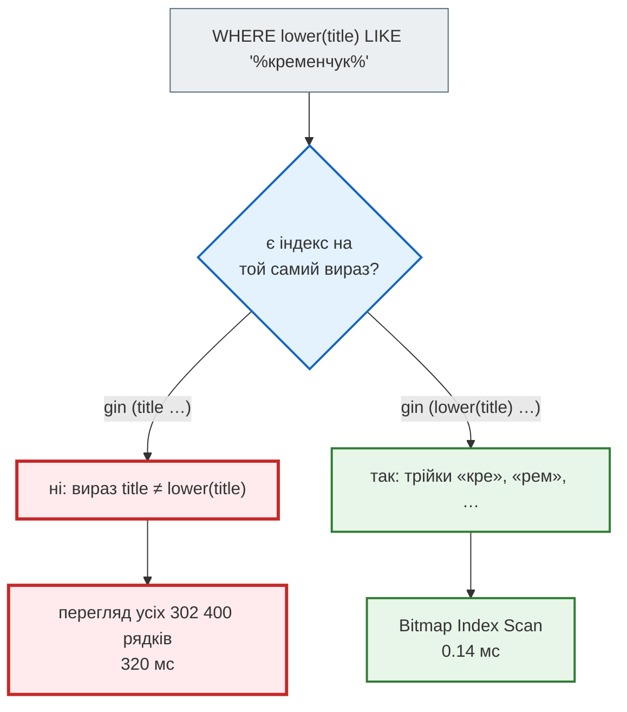

Для частого слова картина інша. «Гришин» є в 3600 заголовках: з індексом база знаходить усі 3600, сортує за `id` і віддає 20 перших — 36 мс. Без індексу — 16–19 мс: перші 20 збігів трапляються вже на початку перегляду за `id`, і база зупиняється. Індекс — не чарівна кнопка, а ще один варіант для планувальника, і він не завжди обирає найкращий. Міряй на своїх даних — і на рідкісних, і на частих значеннях.

Готова міграція — [`patches/news_hub_search_index.patch`](https://github.com/NikoriakViktot/PY-Course-Victor-Nikoriak-22-09-2026/blob/main/module_6/lessons/lesson_52_final_project/patches/news_hub_search_index.patch) для `news_hub` уроку 51 (застосовується `git apply`):

```python
def upgrade() -> None:
    # (chat_id) — початок UNIQUE (chat_id, keyword): пошук за chat_id іде по унікальному індексу
    op.drop_index("ix_subscriptions_chat_id", table_name="subscriptions")
    if op.get_bind().dialect.name != "postgresql":                # SQLite (тести): звичайний індекс
        op.create_index("ix_news_title_lower_trgm", "news", [sa.text("lower(title)")])
        return
    op.execute("CREATE EXTENSION IF NOT EXISTS pg_trgm")
    with op.get_context().autocommit_block():
        op.execute("CREATE INDEX CONCURRENTLY IF NOT EXISTS ix_news_title_lower_trgm "
                   "ON news USING gin (lower(title) gin_trgm_ops)")
```

Три деталі, кожну з яких виявив прогін, а не читання:

1. **Індекс треба оголосити і в моделі** (`__table_args__` у `NewsRow`). Інакше job `postgres` з уроку 51 впаде на `alembic check`: база має індекс, якого модель не знає → `New upgrade operations detected: [('remove_index', …)]`.
2. **Розширення потрібне й тестам.** Тести на PostgreSQL створюють схему через `create_all`, а не міграціями: без `pg_trgm` — `operator class "gin_trgm_ops" does not exist`. Тому в `tables.py` — слухач `before_create`, що виконує `CREATE EXTENSION IF NOT EXISTS pg_trgm`.
3. **`CONCURRENTLY`** будує індекс, не блокуючи запис у таблицю (на великій таблиці — хвилини), але не працює в транзакції — звідси `autocommit_block()`.

Перевірено: 343 тести на SQLite і на PostgreSQL, `alembic upgrade` / `downgrade` / `check` на обох, `mypy --strict`.

### Пагінація: OFFSET і keyset

`GET /api/news?skip=…&limit=50` робить `ORDER BY id OFFSET skip LIMIT limit`. Щоб віддати сторінку 6001, база **читає й викидає** 300 000 рядків:

```text
EXPLAIN (ANALYZE) SELECT id, title FROM news ORDER BY id OFFSET 300000 LIMIT 50;
 Limit (actual time=263.595..263.626 rows=50 loops=1)
   ->  Index Scan using news_pkey on news (actual time=0.034..250.172 rows=300050 loops=1)
 Execution Time: 263.658 ms

EXPLAIN (ANALYZE) SELECT id, title FROM news WHERE id > 300000 ORDER BY id LIMIT 50;
 Limit (actual time=0.023..0.053 rows=50 loops=1)
   ->  Index Scan using news_pkey on news (actual time=0.021..0.047 rows=50 loops=1)
         Index Cond: (id > 300000)
 Execution Time: 0.081 ms
```

**Keyset-пагінація** (курсор) замість «пропусти N» каже «дай наступні після id = X». Клієнт отримує `next_after` — `id` останньої новини сторінки — і передає його в наступному запиті.

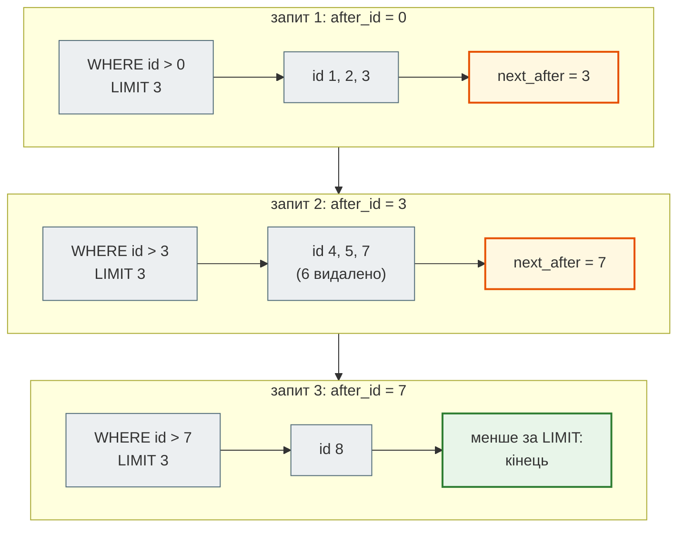

Друга перевага — **стабільність**. Якщо між запитами 1 і 2 додалась або видалилась новина, `OFFSET` зсуне сторінки (одна новина покажеться двічі чи зникне), а `id > 3` завжди продовжує рівно з того місця, де зупинився клієнт. Ціна — не можна перейти одразу на сторінку 6001; для стрічки новин і нескінченного скролу це й не потрібно.

```python
async def find(self, *, after_id: int = 0, limit: int = 50) -> list[NewsRow]:
    stmt = select(NewsRow).where(NewsRow.id > after_id).order_by(NewsRow.id).limit(limit)
    return list((await self._session.scalars(stmt)).all())
```

Для сортування не за `id` (наприклад, за `scraped_at`) курсор — пара `(scraped_at, id)`: `WHERE (scraped_at, id) > (:t, :id)` і індекс на обидва стовпці.

### N+1 у Django

`query_count.py` відкриває кожну сторінку проєкту нотаток при 10 і 40 записах у кожному списку:

```bash
cd module_5/lessons/lesson_51_ci_cd/crispy_notes_project
python manage.py shell < ../../../../module_6/lessons/lesson_52_final_project/query_count.py
```

```text
/notes/        N=10: 8 SQL (HTTP 200)  N=40: 8 SQL (HTTP 200)
/notebooks/    N=10: 7 SQL (HTTP 200)  N=40: 7 SQL (HTTP 200)
/shopping/     N=10: 8 SQL (HTTP 200)  N=40: 8 SQL (HTTP 200)
/todo/         N=10: 8 SQL (HTTP 200)  N=40: 8 SQL (HTTP 200)
/api/notes/    N=10: 4 SQL (HTTP 200)  N=40: 4 SQL (HTTP 200)
```

Кількість запитів не залежить від кількості записів — N+1 немає. Це заслуга `selectors.py` (урок 45): кожен селектор одразу робить `select_related` / `prefetch_related` для того, що покаже шаблон. Такий тест варто мати і у фінальному проєкті: `assertNumQueries` у Django або підрахунок запитів через подію `before_cursor_execute` у SQLAlchemy.

### Типи і зв'язки: що варто знати

| Місце | Як зараз | Що варто знати для свого проєкту |
|---|---|---|
| `news.keywords` | `JSON` | у PostgreSQL є `json` (текст) і `jsonb` (розібраний, з індексами GIN і `@>`). Шукати новини за ключовим словом у `json` — лише перебором; `JSONB` у SQLAlchemy — `sqlalchemy.dialects.postgresql.JSONB` |
| `news.published_time` | `time` без дати | «23:50» — це вчора чи сьогодні? Для сортування і фільтрів за періодом потрібна `timestamptz`; `scraped_at` уже така |
| `news.source` | текст, без FK на `sources` | свідомо (новини з будь-якого сайту); ціна — назву джерела не можна змінити в одному місці |
| `Note.priority` | `PositiveSmallIntegerField` + `CheckConstraint 1..4` | правило «1–4» — у базі, а не лише у формі: API, admin і shell не обійдуть його |
| `UNIQUE (url)` у `news` | 31 MB з 105 MB індексів | унікальність гарантує база — саме на ній тримається `INSERT … ON CONFLICT` і «лише нові новини» в розсилці |

### Redis: карта ключів

Redis — друге сховище стану. Кожен ключ має власника і термін життя; ключ без TTL — кандидат на витік пам'яті.

| Ключ | Хто пише | TTL |
|---|---|---|
| `news:version` | `NewsCache.invalidate()` після COMMIT | без TTL: лічильник версій |
| `news:v{версія}:{list\|stats}:{sha256}` | кеш стрічки й статистики | 60 с |
| `rate:{scrape\|analyze\|login}:{IP}` | `RateLimiter` API | вікно: 60 с, login — 300 с |
| `rate:bot:tg{user_id}` | middleware бота | 60 с |
| `job:{id}` | фонові задачі збору й аналізу | 24 год |
| `llm:analysis:{sha256}` | кеш аналізу LLM | 7 днів |
| `cb:llm:failures`, `cb:llm:open` | circuit breaker | 300 с |
| `webhook:seen:{підпис}` | захист від повтору webhook | 600 с |
| `asgi:*` (проєкт нотаток) | channel layer чату | керує `channels_redis` |
| `:1:throttle_login_{IP}` (проєкт нотаток) | throttle DRF через кеш Django | 60 с |

`news:version` — єдиний ключ без TTL, і це правильно: він один і маленький, а старі версії кешу (`news:v41:…`) зникнуть самі за 60 секунд. Замість пошуку й видалення ключів за шаблоном (`KEYS news:*` блокує Redis) — нова версія в імені.

## Архітектура застосунків { #architecture }

### Граф залежностей

`architecture_audit.py` розбирає кожен файл пакета через `ast` (без запуску й встановлення залежностей) і будує граф «хто кого імпортує». Fan-in — скільки модулів залежать від цього, fan-out — від скількох залежить він.

```bash
python architecture_audit.py ../../../module_5/lessons/lesson_51_ci_cd/news_hub/news_hub
```

```text
модуль                             рядків fan-in fan-out
news_hub.llm                          304      7       0
news_hub.repository                   189      5       4
news_hub.analysis                     133      4       1
news_hub.cache                         64      4       0
news_hub.db                            60      4       0
news_hub.models                       119      4       1
news_hub.parser                       137      4       0
…
news_hub.bot.handlers                 166      1       8
news_hub.jobs                         139      1       6
news_hub.api                          770      0      18
news_hub.bot.__main__                  36      0       5

цикли імпортів: немає
```

Як читати таблицю:

- **Високий fan-in, fan-out 0** (`llm`, `cache`, `db`, `parser`) — фундамент: від них залежать, вони — ні від кого. Саме такі модулі мають бути найстабільнішими й найкраще протестованими.
- **Fan-in 0** (`api`, `bot.__main__`) — точки входу: їх запускають, а не імпортують.
- **Циклів немає** — залежності йдуть в один бік, від точок входу до фундаменту.

#### Як шукаються цикли

Цикл імпортів — модулі, що через ланцюжок імпортів залежать самі від себе. `cycles()` шукає **сильно зв'язані компоненти** алгоритмом Тар'яна: один обхід у глибину, і кожен модуль отримує `index` (коли обхід уперше до нього дійшов) і `low` (найменший `index`, до якого з нього можна повернутися по ребрах у модулі, що ще на стеку). Модуль з `low == index` — корінь компоненти: зі стеку знімається все до нього включно. Понад один модуль — цикл.

Приклад з `test_architecture_audit.py`: `orders → users → payments → orders`, а `utils → orders`.

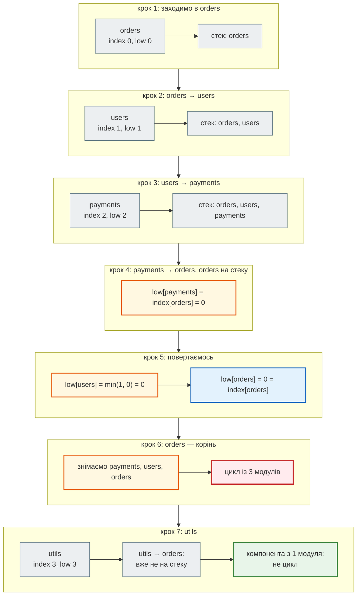

```text
$ python -c "from architecture_audit import cycles; print(cycles({'orders': {'users'}, 'users': {'payments'}, 'payments': {'orders'}, 'utils': {'orders'}}))"
[['orders', 'payments', 'users']]
```

`utils` залежить від циклу, але сам у ньому не бере участі: з `orders` до `utils` дороги немає.

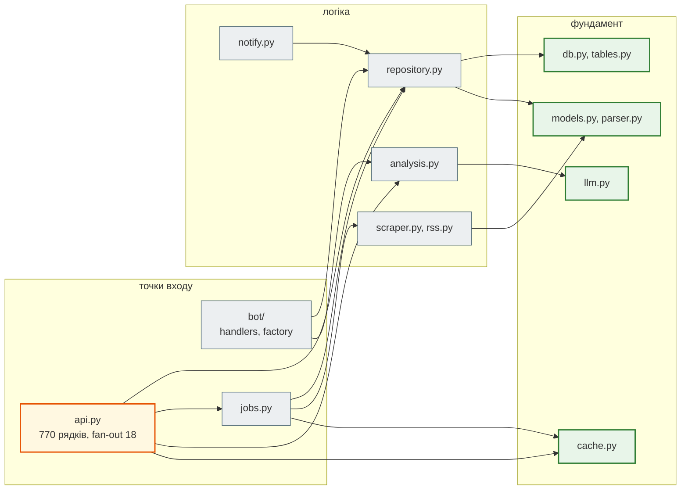

Проєкт нотаток:

```text
модуль                             рядків fan-in fan-out
hello_app.models                      278      7       0
hello_app.selectors                   257      5       1
hello_app.services                    317      3       2
hello_app.api                         117      1       3
hello_app.consumers                   176      1       2
hello_app.forms                       491      1       1
hello_app.views                       722      1       4
…
цикли імпортів: немає
```

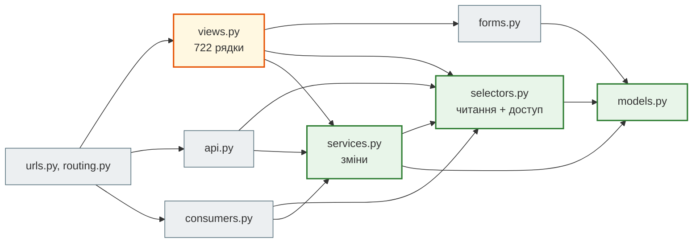

Три транспорти (HTML-сторінки, REST API, WebSocket) ходять в одні `selectors` і `services`. Тому правило «хто бачить нотатку» написане один раз, і чат не може показати повідомлення групи, до якої користувач не належить.

### Що показав аудит

| Знахідка | Чому це важливо | Що зробити |
|---|---|---|
| `api.py`: 770 рядків, 24 ендпоінти, fan-out 18 | будь-яка зміна API — в одному файлі; конфлікти злиття; щоб прочитати один ендпоінт, треба прокрутити решту | `APIRouter` на кожну область (нижче) |
| `views.py`: 722 рядки | те саме для Django | пакет `views/` з модулями `notes.py`, `lists.py`, `groups.py`; `urls.py` не змінюється, якщо `views/__init__.py` реекспортує класи |
| `llm.py`: fan-in 7 | від нього залежать API, бот, задачі; зміна інтерфейсу `LLMClient` зачепить усіх | інтерфейс (`Protocol`) не міняти без потреби; `FakeLLM` у тестах уже гарантує, що решта коду не знає про конкретного провайдера |
| циклів немає в жодному проєкті | цикл імпорту — ознака, що два модулі насправді один, або відповідальність розмита | тримати так: `architecture_audit.py` у CI падати на цикл |

`api.py` за тегами ендпоінтів уже поділений логічно — news 9, admin 5, analyze 3, scrape 3, system 2, telegram 1, webhooks 1. Цей поділ і стає структурою пакета:

```text
news_hub/api/
├── __init__.py      ← create_app(): FastAPI, lifespan, middleware, app.include_router(...)
├── deps.py          ← get_db, get_cache, AdminDep — спільні залежності
├── news.py          ← router = APIRouter(prefix="/api/news", tags=["news"])
├── admin.py, analyze.py, scrape.py, system.py, telegram.py, webhooks.py
```

Шляхи, схема OpenAPI і тести не змінюються: `APIRouter` лише розкладає ті самі ендпоінти по файлах. Рефакторинг безпечний рівно настільки, наскільки добрі тести, — а їх 351.

### Стан і репліки

Найважливіше архітектурне питання для сервісу з кількома процесами: **де живе стан?** Усе, що зберігається в пам'яті процесу, бачить лише цей процес.

| Стан | `news_hub` | Проєкт нотаток |
|---|---|---|
| дані | PostgreSQL | PostgreSQL |
| кеш | Redis (`news:v…`) | Redis (`CACHES`, коли є `REDIS_URL`) |
| rate limit / throttle | Redis (`rate:…`) | Redis (кеш Django) |
| фонові задачі | Redis (`job:…`) | — |
| WebSocket-групи | — | Redis (channel layer) |
| сесії, JWT | JWT без стану | сесії в PostgreSQL; JWT без стану |

У проєкті нотаток throttle DRF (5 спроб входу за хвилину, урок 41) рахує спроби в **кеші Django**. Типовий кеш Django — пам'ять процесу. Перевірка — стек уроку 50 з однією і двома репліками, 12 спроб входу поспіль через nginx:

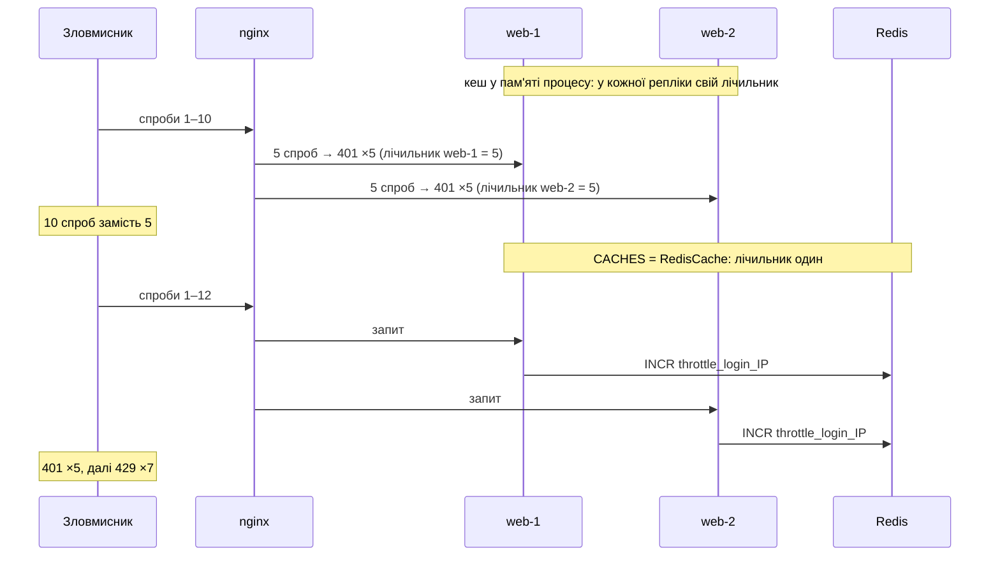

| Кеш Django | 1 репліка | 2 репліки |
|---|---|---|
| пам'ять процесу (типовий) | `401×5, 429×7` | `401×10, 429×2` |
| Redis (`CACHES`, урок 50) | `401×5, 429×7` | `401×5, 429×7` |

З N репліками ліміт у пам'яті процесу — це 5·N спроб. На одній репліці різниці не видно, тому такі помилки знаходять лише тестом з кількома процесами. Правило для фінального проєкту: **усе, що має бути спільним, — у базі чи Redis; у пам'яті процесу — лише те, що можна втратити й порахувати заново.**

### Система цілком

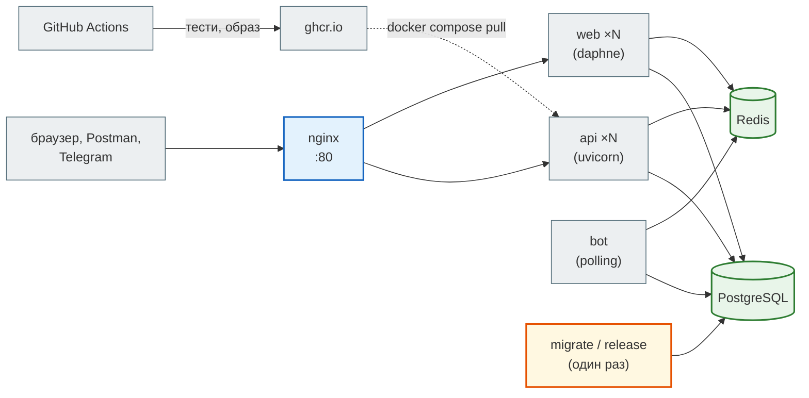

Кожна частина цієї схеми — окремий урок: nginx і репліки (49), міграції одним сервісом (49), образ (48), CI (50). Фінальному проєкту не обов'язково мати їх усі — але мати `Dockerfile`, `docker-compose.yml` і CI варто з першого дня: додати їх у кінці завжди важче.

## Фінальний проєкт { #final-project }

### Вимоги

| | Обов'язково | Бажано |
|---|---|---|
| код | Python 3.10+, пакет з модулями за відповідальністю (не один файл), типи в публічних функціях | `mypy --strict` |
| дані | PostgreSQL або SQLite + міграції (Alembic / Django migrations); обмеження в схемі (`UNIQUE`, `CHECK`, FK) | Redis для кешу чи лічильників |
| інтерфейс | REST API (FastAPI / DRF) **або** веб-сторінки Django **або** бот | два інтерфейси над однією логікою |
| тести | pytest / `manage.py test`: логіка + API; тест, що ловить помилку, яку ти справді зробив | покриття ключових модулів; тест кількості запитів |
| запуск | `README.md`: як запустити за 5 хвилин; `.env.example` без секретів | `Dockerfile` + `docker-compose.yml` |
| CI | workflow: тести на кожен PR | образ + smoke-тест у CI |
| Git | історія комітів, робота через PR | опис PR з тим, що і навіщо змінено |
| безпека | секрети лише зі змінних середовища; паролі — хеш; перевірка доступу до чужих даних | rate limit на вхід; SSRF-захист, якщо є завантаження з URL |

### Як обрати тему

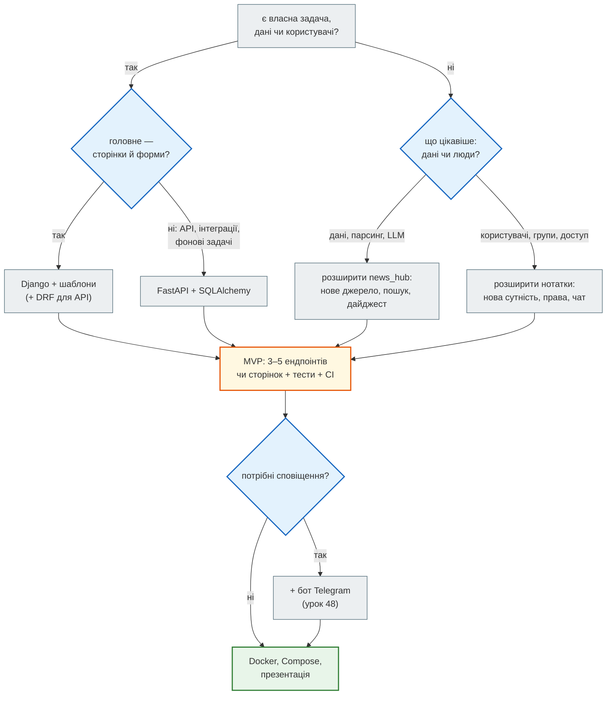

Розширювати проєкт курсу — не «легкий шлях», а нормальна робота розробника: у реальній команді майже весь час пишеш код у чужому проєкті. Оцінюється не з нуля написаний код, а **твої** рішення: що додав, як перевірив, що виміряв.

Приклади тем, які добре лягають на курс:

- **трекер витрат сім'ї** — Django, групи (як у нотатках), звіт за місяць, експорт CSV;
- **монітор цін** — FastAPI + скрапер + Redis-кеш, бот зі сповіщенням про знижку;
- **дайджест новин за темою** — `news_hub` + нове RSS-джерело, trigram-пошук, щоденний дайджест LLM у Telegram;
- **метеостанція** — API уроку 33 + PostgreSQL + графік Dash (бонус М3);
- **запис до спеціаліста** — Django, слоти часу, `UNIQUE (слот)`, щоб двоє не записались на той самий час.

### План роботи

| Етап | Результат | Перевірка |
|---|---|---|
| 1. ідея | README: проблема, користувач, 3–5 функцій MVP | можна пояснити за 30 секунд |
| 2. скелет | репозиторій, пакет, `pyproject`/`requirements`, перший тест, CI | зелена галочка на першому PR |
| 3. дані | моделі, міграції, обмеження | `alembic check` / `makemigrations --check` у CI |
| 4. функції MVP | ендпоінти чи сторінки, кожна — з тестом | тести в CI |
| 5. запуск | `Dockerfile`, `docker-compose.yml`, `.env.example` | `docker compose up --wait` на чистій машині |
| 6. аудит | `architecture_audit.py`, `db_audit.sql`, підрахунок запитів | немає циклів; немає N+1; індекси під справжні запити |
| 7. презентація | 5–7 хвилин, демо | урок 53 |

### Презентація на уроці 53

Коротко — нижче; повністю, як питч-дек із шаблоном і прикладом, — в [уроці 53](lesson_53.md).


1. **Проблема** (30 с): для кого і навіщо.
2. **Демо** (2–3 хв): справжній сценарій користувача, не перелік екранів. Підготуй дані заздалегідь.
3. **Архітектура** (1 хв): одна діаграма — компоненти і де живе стан.
4. **Одне рішення, яким пишаєшся** (1 хв): і як ти перевірив, що воно працює (тест, `EXPLAIN`, вимір).
5. **Що далі** (30 с): чого не встиг і як би зробив.

## Практика { #practice }

### Розібраний приклад: аудит власного пакета

```bash
python module_6/lessons/lesson_52_final_project/architecture_audit.py my_project/my_package --mermaid
```

Вивід `--mermaid` вставляється в README як є — GitHub малює діаграми Mermaid. Щоб аудит працював у CI і падав на цикл:

```python
from pathlib import Path
from architecture_audit import collect, cycles

def test_no_import_cycles() -> None:
    graph, _ = collect([Path("my_package")])
    assert cycles(graph) == []
```

### Зміни приклад

1. Додай на початок `news_hub/db.py` рядок `from .repository import NewsRepository`, запусти аудит, а потім `python -c "import news_hub.api"`.
2. Запусти `EXPLAIN ANALYZE` запиту `search()` після патча, але з `ILIKE` замість `lower(…) LIKE`: `WHERE title ILIKE '%кременчук%'`. Який індекс він візьме?

??? success "Що покаже запуск"

    1. `цикли імпортів: [['news_hub.db', 'news_hub.repository', 'news_hub.tables']]` — не лише `db ↔ repository`: `tables` імпортує `db`, `repository` — `tables`, тож у цикл потрапляє все на шляху між двома модулями. А Python відмовляється імпортувати:
       `ImportError: cannot import name 'Base' from partially initialized module 'news_hub.db' (most likely due to a circular import)`. Аудит знаходить цикл без запуску коду. `ast.walk` бачить і імпорти всередині функцій: такий відкладений імпорт Python не зламає, але залежність лишається залежністю — аудит покаже і її.
    2. Жодного — повний перегляд, 431 мс: `title ILIKE …` — інший вираз, ніж `lower(title) LIKE …`, і індекс на `lower(title)` йому не підходить. На базі аудиту з індексом `gin (title gin_trgm_ops)` той самий `ILIKE` виконувався за 0.38 мс через `Bitmap Index Scan on ix_news_title_trgm`. Індекс будують під той вираз, який справді генерує код.

### Знайди помилку { #find-bug }

Студент додав keyset-пагінацію, але клієнт скаржиться: «друга сторінка починається з останньої новини першої».

```python
async def find(self, *, after_id: int = 0, limit: int = 50) -> list[NewsRow]:
    stmt = select(NewsRow).where(NewsRow.id >= after_id).order_by(NewsRow.id).limit(limit)
    return list((await self._session.scalars(stmt)).all())
```

??? success "Відповідь"

    `>=` замість `>`. Клієнт передає `after_id` = `id` **останньої показаної** новини, тож умова має її виключати: `NewsRow.id > after_id`. Із `>=` кожна сторінка починається з повтору, а якщо `limit=1` — клієнт застрягає на одній новині назавжди. Тест, що ловить це: пройти всі сторінки з `limit=2` і перевірити, що зібрані `id` — без повторів і збігаються з повним списком.

Ще одна: у `settings.py` нового проєкту кеш налаштовано так, а сервіс запускається в Compose з `--scale web=3`.

```python
CACHES = {"default": {"BACKEND": "django.core.cache.backends.locmem.LocMemCache"}}
REST_FRAMEWORK = {"DEFAULT_THROTTLE_RATES": {"login": "5/min"}}
```

??? success "Відповідь"

    `LocMemCache` — пам'ять одного процесу. Три репліки — три незалежні лічильники: 15 спроб входу на хвилину замість 5. Потрібен спільний кеш: `django.core.cache.backends.redis.RedisCache` з адресою Redis.

### Спробуй самостійно

1. Запусти `db_audit.sql` на базі свого проєкту (або `news_hub` після `alembic upgrade head`). Для кожного зайвого індексу поясни, який індекс його покриває.
2. Напиши тест `test_pages_are_constant_in_queries` для свого Django-проєкту: `assertNumQueries` на сторінці списку при 5 і 20 записах.
3. Розбий `api.py` свого FastAPI-проєкту (чи `news_hub`) на `APIRouter` за тегами; тести мають пройти без змін.

## Підсумок

| Поняття | Що запам'ятати |
|---|---|
| аудит | міряти, а не читати на око: граф імпортів, `EXPLAIN ANALYZE`, кількість запитів |
| індекс | допомагає лише виразу, під який побудований; зайвий індекс не пришвидшує читання, а сповільнює запис |
| зайвий індекс | стовпці — початок іншого індексу з тим самим класом операторів |
| пошук підрядка | `LIKE '%…%'` → trigram (`pg_trgm`, GIN) на тому самому виразі, що в запиті |
| пагінація | глибокий `OFFSET` читає все попереднє; keyset (`id > after`) — сталий час і стабільні сторінки |
| N+1 | кількість запитів не має залежати від кількості записів |
| шари | точки входу → логіка → фундамент; без циклів; великий файл з високим fan-out — перший кандидат на поділ |
| стан | спільне — у базі чи Redis; пам'ять процесу — лише те, що можна втратити |
| фінальний проєкт | MVP + тести + CI з першого дня; Docker і Compose; аудит перед презентацією |

### Самоперевірка

1. Чому індекс `gin (title gin_trgm_ops)` не допоміг запиту `search()`?
2. Як зрозуміти, що індекс `(chat_id)` зайвий, не видаляючи його?
3. Що з'явиться у виводі `architecture_audit.py`, якщо модуль A імпортує B, B — C, а C — A?
4. Чим keyset-пагінація краща за `OFFSET` крім швидкості?
5. Чому помилку з throttle у пам'яті процесу не видно в звичайних тестах?

??? success "Відповіді"

    1. Запит порівнює `lower(title)`, а індекс побудований на `title`. Для бази це різні вирази.
    2. `db_audit.sql` показує, що `(chat_id)` — початок `UNIQUE (chat_id, keyword)`; `EXPLAIN` запиту за `chat_id` показує, що база й так бере унікальний індекс.
    3. `цикли імпортів: [['A', 'B', 'C']]` — один сильно зв'язаний компонент з трьох модулів.
    4. Сторінки не зсуваються, коли між запитами додають чи видаляють записи.
    5. Тести запускають один процес. Ліміт «ламається» лише з кількома репліками — тому урок 50 перевіряє стек з `--scale`.

### Що далі

- Ноутбук заняття: [Відкрити вправи в Colab](https://colab.research.google.com/github/NikoriakViktot/PY-Course-Victor-Nikoriak-22-09-2026/blob/main/module_6/lessons/lesson_52_final_project/note_lesson_52_final_project_student.ipynb){ .md-button .md-button--primary } [Переглянути розв’язки](https://github.com/NikoriakViktot/PY-Course-Victor-Nikoriak-22-09-2026/blob/main/module_6/lessons/lesson_52_final_project/note_lesson_52_final_project.ipynb){ .solutions-link }.
- [Бонус. CV розробника](bonus_cv.md): як описати фінальний проєкт у CV.
- [Урок 53](lesson_53.md) — випускний: презентація фінального проєкту як питч-дек.

## Документація і джерела

- Код уроку: [`lesson_52_final_project`](https://github.com/NikoriakViktot/PY-Course-Victor-Nikoriak-22-09-2026/tree/main/module_6/lessons/lesson_52_final_project); проєкти, що аналізуються, — [`lesson_51_ci_cd`](https://github.com/NikoriakViktot/PY-Course-Victor-Nikoriak-22-09-2026/tree/main/module_5/lessons/lesson_51_ci_cd).
- PostgreSQL: [`EXPLAIN`](https://www.postgresql.org/docs/16/using-explain.html), [індекси за виразами](https://www.postgresql.org/docs/16/indexes-expressional.html), [класи операторів](https://www.postgresql.org/docs/16/indexes-opclass.html), [`pg_trgm`](https://www.postgresql.org/docs/16/pgtrgm.html), [`CREATE INDEX CONCURRENTLY`](https://www.postgresql.org/docs/16/sql-createindex.html#SQL-CREATEINDEX-CONCURRENTLY), [статистика `pg_stat_user_indexes`](https://www.postgresql.org/docs/16/monitoring-stats.html), [`json` і `jsonb`](https://www.postgresql.org/docs/16/datatype-json.html).
- SQLAlchemy: [індекси за виразами й `postgresql_ops`](https://docs.sqlalchemy.org/en/20/dialects/postgresql.html#operator-classes), [події DDL](https://docs.sqlalchemy.org/en/20/core/ddl.html). Alembic: [`autocommit_block`](https://alembic.sqlalchemy.org/en/latest/api/runtime.html#alembic.runtime.migration.MigrationContext.autocommit_block), [`alembic check`](https://alembic.sqlalchemy.org/en/latest/autogenerate.html).
- Django: [кеш і бекенди](https://docs.djangoproject.com/en/5.2/topics/cache/), [`db_index`](https://docs.djangoproject.com/en/5.2/ref/models/fields/#db-index), [`assertNumQueries`](https://docs.djangoproject.com/en/5.2/topics/testing/tools/#django.test.TransactionTestCase.assertNumQueries). DRF: [throttling і кеш](https://www.django-rest-framework.org/api-guide/throttling/). FastAPI: [`APIRouter`, великі застосунки](https://fastapi.tiangolo.com/tutorial/bigger-applications/).
- Python: [`ast`](https://docs.python.org/3/library/ast.html). Алгоритм Тар'яна: [Tarjan, 1972](https://doi.org/10.1137/0201010).
