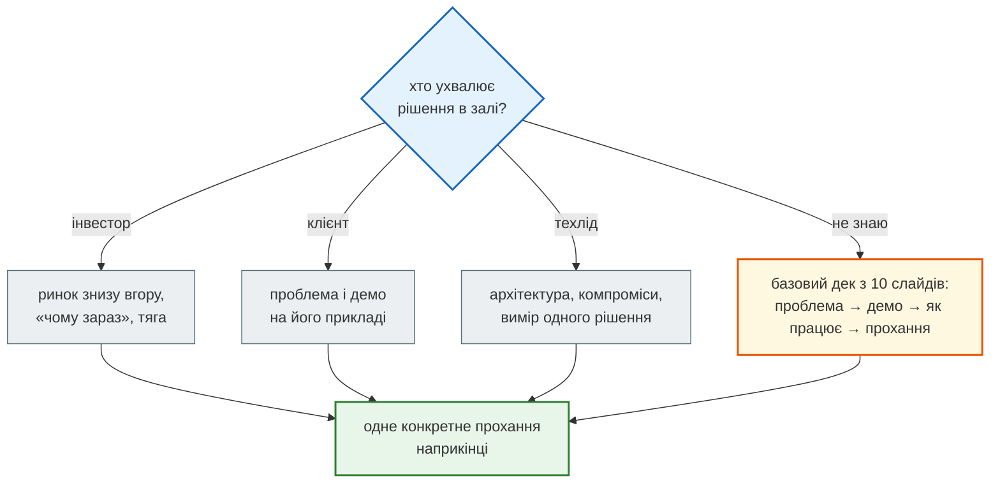
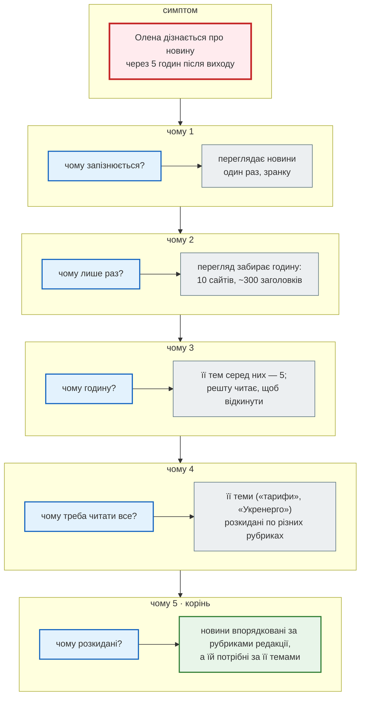
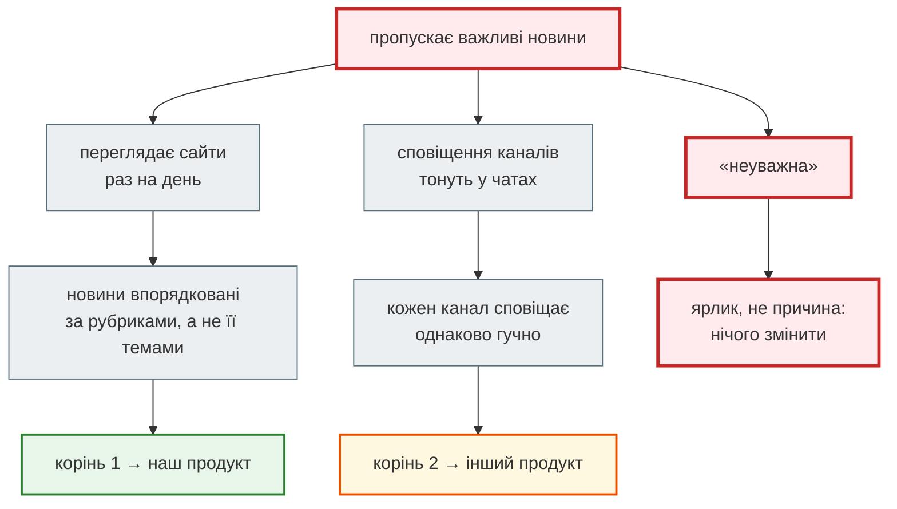
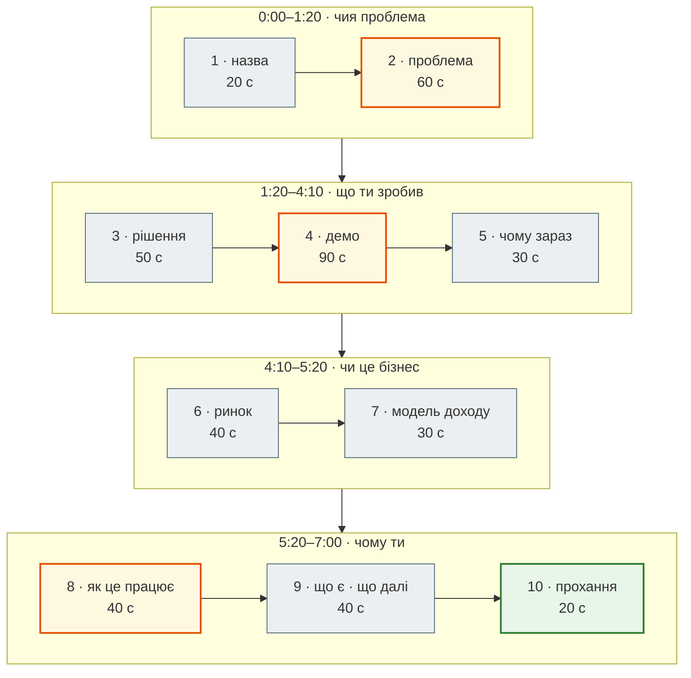

# Урок 53. Випускний: презентація фінального проєкту

Випускна презентація — це **не звіт** про те, що ти зробив. Це **питч**: за 5–7 хвилин ти продаєш свою ідею людям, які мають ухвалити рішення. Уяви, що в залі сидять:

- **інвестор** з венчурного фонду — вирішує, чи дати гроші;
- **клієнт** — вирішує, чи платити і чи впроваджувати у своїй команді;
- **техлід**, який наймає, — вирішує, чи кликати тебе на співбесіду.

Жоден з них не прийшов слухати, як влаштований твій `models.py`. Кожен хоче зрозуміти три речі: **чия це проблема**, **чому твоє рішення працює** і **чому саме ти** його зробиш. Слайди, які допомагають у цьому, називають **pitch deck** (питч-дек).

Урок 52 закінчився вимогами до проєкту і планом. Сьогодні — як про нього розповісти.

| Файл | Що це |
|---|---|
| [`pitch_deck_template.md`](https://github.com/NikoriakViktot/PY-Course-Victor-Nikoriak-22-09-2026/blob/main/module_6/lessons/lesson_53_graduation_pitch/pitch_deck_template.md) | шаблон на 10 слайдів для Marp: слайди — Markdown, нотатки доповідача — у коментарях |
| [`example_news_digest_deck.md`](https://github.com/NikoriakViktot/PY-Course-Victor-Nikoriak-22-09-2026/blob/main/module_6/lessons/lesson_53_graduation_pitch/example_news_digest_deck.md) і [PDF](https://github.com/NikoriakViktot/PY-Course-Victor-Nikoriak-22-09-2026/blob/main/module_6/lessons/lesson_53_graduation_pitch/example_news_digest_deck.pdf) | приклад: питч «Тема дня» на основі `news_hub` з повним текстом виступу |
| [`pitch_check.py`](https://github.com/NikoriakViktot/PY-Course-Victor-Nikoriak-22-09-2026/blob/main/module_6/lessons/lesson_53_graduation_pitch/pitch_check.py) | перевірка деку: кількість слайдів, текст на слайді, час виступу, обов'язкові розділи, забуті заготовки |

**Що потрібно з попередніх уроків:** фінальний проєкт і план з уроку 52; Docker Compose (49) — для демо; вимірювання з уроку 52 — для технічного слайда.

**Після уроку ти зможеш:**

- знайти корінь проблеми методом «5 чому» і перевірити його розмовою з людьми, а не власною вірою;
- скласти питч-дек за структурою, яку використовують венчурні фонди, і пристосувати його до слухача;
- порахувати ринок знизу вгору і чесно позначити, що є фактом, а що — припущенням;
- показати демо, яке не зламається на сцені, і відповісти на незручні питання.

**Ноутбук заняття:** [Відкрити вправи в Colab](https://colab.research.google.com/github/NikoriakViktot/PY-Course-Victor-Nikoriak-22-09-2026/blob/main/module_6/lessons/lesson_53_graduation_pitch/note_lesson_53_pitch_student.ipynb){ .md-button .md-button--primary } [Переглянути розв’язки](https://github.com/NikoriakViktot/PY-Course-Victor-Nikoriak-22-09-2026/blob/main/module_6/lessons/lesson_53_graduation_pitch/note_lesson_53_pitch.ipynb){ .solutions-link } — 5 «чому» як дерево причин, питання за The Mom Test, ринок знизу вгору, розбір і перевірка деку, бюджет часу на слайди.

## Пригадай

1. Яке одне технічне рішення свого проєкту ти можеш підкріпити виміром (урок 52)?
2. Що з проєкту ти покажеш одним сценарієм від початку до кінця?
3. Хто користувач твого проєкту — конкретна людина, а не «всі»?

??? success "Підказка"

    1. Наприклад: `EXPLAIN ANALYZE` до і після індексу, кількість SQL-запитів сторінки, час відповіді API, тест, що ловить справжню помилку.
    2. Сценарій — це дія людини: «підписалась → отримала сповіщення → відкрила дайджест», а не «ось сторінка налаштувань, ось сторінка профілю».
    3. Якщо відповідь «усі, кому цікаво» — питч ще не готовий. Почни з розділу про 5 «чому».

## Кому ти продаєш { #audience }

Та сама ідея продається різним людям по-різному. Слайди майже ті самі — змінюються акценти й прохання наприкінці.

| Слухач | Що вирішує | Головне питання | На що зробити акцент | Прохання |
|---|---|---|---|---|
| інвестор (венчурний фонд) | дати гроші за частку в компанії | чи виросте це у великий бізнес? | ринок, «чому зараз», команда, тяга | сума і на що підуть гроші |
| клієнт | платити і впроваджувати | чи розв'яже це **мою** проблему дешевше, ніж зараз? | проблема, демо, ціна, ризики впровадження | пілот, перший контракт |
| техлід, що наймає | запросити на співбесіду | чи вміє ця людина робити рішення і перевіряти їх? | архітектура, компроміси, тести, виміри | співбесіда, код-рев'ю |



На уроці 53 у залі всі троє одночасно: викладач, група і, можливо, гості. Тому базовий дек з цього уроку покриває всі три питання, а акцент ти обираєш сам.

## Проблема: 5 «чому» { #five-whys }

Більшість слабких питчів починаються з рішення: «я зробив бота, який…». Сильні починаються з проблеми, і не з першої-ліпшої, а з **кореневої**. Тоді рішення здається очевидним.

Найпростіший інструмент пошуку кореня — **5 «чому»** (Five Whys). Метод з'явився в Toyota: його приписують засновнику Toyota Industries Сакічі Тойоді, а в систему виробництва Toyota (TPS) його вбудував інженер Тайічі Оно. Його порада: **«Питай "чому" п'ять разів про кожну справу»** — тоді стає зрозумілою і природа проблеми, і її розв'язок. П'ять — не закон, а спостереження: зазвичай стільки кроків вистачає, щоб дійти від симптому до причини.

### Покроково: продуктова проблема

Олена, PR-менеджерка з прикладу, «пропускає важливі новини».



Перевірка кореня — **зворотне читання**: «новини впорядковані за рубриками редакції, а не за її темами → тому її теми розкидані → тому треба читати все → тому це година → тому лише раз на день → тому запізнення на 5 годин». Якщо кожне «тому» звучить правдоподібно — ланцюжок зв'язний.

Корінь описує **причину у світі**, а не твій продукт: невідповідність між тим, як новини впорядковує редакція, і тим, як їх потребує читач. З нього вже випливає рішення — відбирати новини за словами читача, а не за рубриками — і що перевірити в інтерв'ю: чи справді теми людини перетинають рубрики.

!!! warning "Пастка: корінь = «немає мого продукту»"
    «Чому новини не приходять самі? — Бо немає бота, який їх приносить» — це не корінь, а рішення, переодягнене в причину. Таке «чому» нічого не пояснює: так можна «довести» потребу в будь-якому продукті. Перевірка: якщо в корені є «немає інструмента / додатка / бота» чи назва твого рішення — повернись на крок назад і спитай, **що у світі** змушує людину страждати. Рішення має випливати з кореня, а не бути ним.

### Покроково: технічна проблема

Той самий метод працює і для помилок у коді. Урок 52 знайшов: з двома репліками вебсервера ліміт входу пропускав 10 спроб замість 5.

| Крок | Питання | Відповідь |
|---|---|---|
| симптом | — | зловмисник має 10 спроб входу замість 5 |
| чому 1 | чому 10? | кожна з двох реплік рахує свої 5 спроб |
| чому 2 | чому свої? | лічильник throttle DRF лежить у кеші Django |
| чому 3 | чому кеш не спільний? | типовий кеш Django — пам'ять процесу (`LocMemCache`) |
| чому 4 | чому ніхто не помітив? | тести запускають один процес — там усе правильно |
| чому 5 · корінь | чому немає перевірки з репліками? | стек з кількома процесами ніхто не перевіряв на ліміти |

Виправлення симптому — «поставити ліміт 3 замість 5». Виправлення кореня — кеш у Redis і перевірка стеку з `--scale web=2` (урок 50). Різниця між ними — і є сенс методу.

### Межі методу

Навіть у самій Toyota метод критикували. Теруюкі Мінора, колишній керівник глобальних закупівель Toyota, називав його занадто простим для глибокого аналізу. Три пастки, які варто знати:

1. **Зупинитись на симптомі.** «Олена неуважна» — не корінь, а ярлик. Корінь — те, що можна змінити.
2. **Один ланцюжок замість дерева.** На кожне «чому» буває кілька відповідей. Олена пропускає новини ще й тому, що сповіщення 10 Telegram-каналів тонуть одне в одному. Це окрема гілка — і, можливо, окремий продукт.
3. **Дедукція замість спостереження.** Відповідь на «чому» треба **побачити**, а не вигадати за столом. У Toyota це називають *genchi genbutsu* — «піди й подивись сам». Для питчу це означає: поговорити з людьми.



## Перевірити проблему: The Mom Test { #mom-test }

5 «чому» дають **гіпотезу**. Перевіряють її розмовою з людьми, які мають цю проблему. Пастка: люди ввічливі. Спитай маму, чи гарна твоя ідея, — вона скаже «так». Звідси назва книжки Роба Фіцпатріка *The Mom Test*. Її три правила:

1. **Говори про їхнє життя, а не про свою ідею.** Щойно ти описав рішення, людина знає, яку відповідь ти хочеш почути.
2. **Питай про конкретне минуле, а не про загальне чи майбутнє.** Що людина *робила* — важить, що вона *зробила б* — ні.
3. **Менше говори, більше слухай.** Ти прийшов вчитися, а не продавати.

| ✗ Погане питання | Чому погане | ✓ Краще |
|---|---|---|
| «Вам сподобався б бот із новинами?» | майбутнє + твоя ідея: «так» нічого не коштує | «Як ви дізналися про останню важливу новину своєї галузі?» |
| «Ви б платили 99 грн на місяць?» | обіцянка без зобов'язань | «За які сервіси для роботи ви вже платите? Скільки?» |
| «Це ж проблема — пропускати новини?» | навідне питання | «Коли востаннє ви дізналися про новину запізно? Що сталося потім?» |
| «Скільки часу ви б зекономили?» | фантазія | «Скільки часу вчора пішло на перегляд новин?» |

Найсильніший доказ проблеми — людина **вже** витрачає на неї час чи гроші: має таблицю, платить за моніторинг, просить колегу пересилати новини. На слайді «Проблема» один такий факт важить більше, ніж десять «цікава ідея».

## Структура деку { #deck }

Готових структур кілька, і вони майже збігаються. Найвідоміші:

| Sequoia Capital, «Writing a Business Plan» | Y Combinator, seed deck | Гай Кавасакі, «The Only 10 Slides You Need» |
|---|---|---|
| мета компанії (одне речення) | назва й опис одним рядком | назва і контакти |
| проблема | проблема | проблема / можливість |
| рішення | рішення | ціннісна пропозиція |
| чому зараз | тяга (метрики, прогрес) | «магія» під капотом (технологія, демо) |
| потенціал ринку | ринок | бізнес-модель |
| конкуренти | продукт | вихід на ринок |
| бізнес-модель | бізнес-модель | конкуренти |
| команда | команда | команда |
| фінанси | | прогнози й ключові метрики |
| бачення | | стан, план, використання грошей |

Правило Кавасакі: **10 слайдів, 20 хвилин, шрифт не менший за 30 пунктів**. Десять — бо більше ідей за раз людина не утримає; 30 пунктів — бо великий шрифт не дає перетворити слайд на текст для читання. Y Combinator додає три принципи дизайну: **розбірливість** (темний текст на світлому тлі, великий шрифт), **простота** (одна ідея на слайд) і **очевидність** (слайд зрозумілий без доповідача за кілька секунд). І головне: інвестують у людей, а не в слайди — дек лише робить ідею зрозумілішою.

### Дек курсу: 10 слайдів за 7 хвилин

Для випускного — та сама логіка, стиснута в 5–7 хвилин, з обов'язковим демо і технічним слайдом:



Помаранчеві слайди — ті, де вирішується доля питчу: проблема, демо і технічна частина. На них — більше часу.

| # | Слайд | Що на ньому | Типова помилка |
|---|---|---|---|
| 1 | назва | продукт + одне речення про зміну в житті користувача | «Фінальний проєкт з Python» |
| 2 | проблема | одна людина, її ситуація, ціна проблеми; корінь з 5 «чому» | «Багато людей мають проблему з новинами» |
| 3 | рішення | 3 кроки користувача | список технологій |
| 4 | демо | один сценарій наживо | екскурсія по всіх сторінках |
| 5 | чому зараз | що змінилось у світі, з джерелом | «ІІ зараз популярний» |
| 6 | ринок | формула знизу вгору, позначені припущення | «ринок медіа — 5 млрд доларів» |
| 7 | модель доходу | хто платить, скільки, головні витрати | «потім придумаємо монетизацію» |
| 8 | як це працює | одна діаграма; одне рішення з виміром | 12 блоків архітектури дрібним шрифтом |
| 9 | що є · що далі | чесна тяга і вимірювані наступні кроки | «планую підкорити світ» |
| 10 | прохання | одне конкретне прохання до цієї аудиторії | «Дякую за увагу» замість прохання |

!!! tip "Lean Canvas — підготовка до деку"
    Перш ніж робити слайди, заповни **Lean Canvas** Еша Маур'ї — бізнес-план на одній сторінці з 9 блоків: проблема, сегменти клієнтів, унікальна ціннісна пропозиція, рішення, канали, джерела доходу, структура витрат, ключові метрики, нечесна перевага. Порядок заповнення: проблема разом із сегментами → пропозиція → рішення → канали → доходи й витрати → метрики → перевага. Блок «нечесна перевага» (те, що не можна просто скопіювати) краще лишити порожнім, ніж вигадати. Майже кожен блок — готовий слайд деку.

### Ринок: рахуємо знизу вгору

Слабкий слайд ринку бере велике число з чужого звіту: «ринок медіа — мільярди доларів, нам вистачить одного відсотка». Сильний рахує **знизу вгору**: скільки конкретних людей мають проблему × скільки кожен заплатить.

- **TAM** (total addressable market) — усі, хто має проблему;
- **SAM** (serviceable available market) — ті, кого твій продукт може обслужити (мова, країна, канал);
- **SOM** (serviceable obtainable market) — ті, кого ти реально досягнеш за рік.

Дохід = SOM × ціна × 12 місяців. Кожне число — з джерелом або з позначкою «припущення». Інвестор знає, що припущення неточні; він дивиться, чи ти вмієш рахувати і чи чесно розрізняєш знання та здогадки. У ноутбуці заняття — функція, що рахує це з позначеними припущеннями.

### Демо, яке не зламається

- **Один сценарій** від дії користувача до результату. Не екскурсія по сторінках.
- **Дані підготовлені заздалегідь**: фікстури, знімок сайту (урок 37), двійник Telegram (урок 48). Жодних «зараз зареєструюсь».
- **Стек запущено до виступу**: `docker compose up --wait` (урок 50) і перевірка smoke-скриптом (урок 51).
- **Запасний план** — відео того самого сценарію. Мережа в залі падає саме тоді, коли вона найпотрібніша.
- **Великий шрифт** у терміналі й браузері: зал не бачить дрібного тексту.

### Технічний слайд

Одна діаграма з уроку 52 (компоненти і де живуть дані) і **одне рішення з доказом**: як ти його виміряв. «У мене 351 тест» — факт; «пошук у заголовках займав 372 мс, після індексу на `lower(title)` — 0.14 мс, виміряно `EXPLAIN ANALYZE` на 302 тисячах новин» — історія, яку запам'ятають. Для техліда це головний слайд виступу.

### Питання після виступу

Підготуй відповіді заздалегідь — питання майже завжди ті самі:

1. Хто вже користується? Скільки людей ви опитали?
2. Чим це краще за те, що люди роблять зараз?
3. Хто конкуренти і чому вони цього не зроблять?
4. Скільки коштує один користувач (сервер, виклики LLM)?
5. Що буде, якщо сайт-джерело змінить верстку чи закриє RSS?
6. Що було найважчим у розробці і як ти це розв'язав?
7. Як ти знаєш, що код працює? Що саме перевіряють тести?
8. Що ти зробив би інакше, якби починав з нуля?

Структура відповіді: коротка пряма відповідь → один факт → що ти зробиш далі. «Не знаю, але перевірю так-то» — сильна відповідь. Вигадана цифра — слабка: її перевірять.

## Приклад: «Тема дня» { #example }

Питч `news_hub` як продукту для людей, що щоранку стежать за новинами своєї галузі. Олена — вигаданий персонаж для прикладу. Факти в деку — справжні: 351 тест, виміри з уроку 52, опитування Internews про Telegram. Усе непідтверджене позначене як гіпотеза чи припущення: інтерв'ю в прикладі ще попереду, користувачів немає — і дек так і каже.

Фрагмент: слайд «Проблема» і те, що доповідач говорить уголос (нотатки в коментарі Marp).

```markdown
# Проблема

- PR-менеджерка стежить за 8–10 сайтами щоранку
- витрачає ~1 год, і все одно пропускає згадки
- агрегатори показують **усе**, а не її теми

> Гіпотеза з 5 «чому» — перевіряємо інтерв'ю

<!--
Почну з однієї людини. Олена — PR-менеджерка енергетичної компанії. …
Скажу чесно: це гіпотеза. Ми поговорили з однією людиною, а треба щонайменше з п'ятьма.
-->
```

На слайді — 30 слів, які читаються за секунди. У нотатках — 124 слова, які кажуть уголос. Слайд підтримує доповідача, а не замінює його.

Перевірка деку:

```text
$ python pitch_check.py example_news_digest_deck.md
example_news_digest_deck.md: 10 слайдів, виступ ≈ 4.1 хв
  ✓ готово до репетиції

$ python pitch_check.py pitch_deck_template.md
pitch_deck_template.md: 10 слайдів, виступ ≈ 0.9 хв
  ✗ слайд 1 «[Назва продукту]»: лишилась заготовка [..] чи TODO
  …
  ✗ виступ ≈ 0.9 хв за нотатками, треба 4–7
  11 зауважень
```

4.1 хвилини — лише мова. Демо (дії на екрані) і паузи додають ще 1–2 хвилини: разом якраз 5–7.

Перша версія прикладу мала в нотатках конспект: «60 секунд. Історія однієї людини…». Скрипт порахував 1.7 хвилини — бо конспект не той текст, який кажуть уголос. Нотатки треба писати так, як говориш: тоді репетиція показує справжній час.

## Інструменти: Marp { #marp }

[Marp](https://marp.app/) перетворює Markdown на слайди: `---` розділяє слайди, `<!-- … -->` — нотатки доповідача. Дек живе в Git поруч з кодом, і його можна перевіряти скриптом, як код.

```bash
npx @marp-team/marp-cli example_news_digest_deck.md --pdf --pdf-notes   # PDF з нотатками
npx @marp-team/marp-cli example_news_digest_deck.md --pptx              # PowerPoint
npx @marp-team/marp-cli example_news_digest_deck.md --images png        # слайди картинками
npx @marp-team/marp-cli -s .                                            # сервер з переглядом наживо
```

Marp шукає встановлений Chrome, Edge чи Chromium; якщо не знаходить — шлях задають змінною `CHROME_PATH`. Для VS Code є розширення «Marp for VS Code» з переглядом поруч з текстом. Зручніше Google Slides, PowerPoint чи Canva — теж добре: структура і правила ті самі, а `pitch_check.py` тоді замінить чек-лист нижче.

## Як оцінюємо на уроці 53 { #rubric }

| Критерій | Балів | Що означає «максимум» |
|---|---:|---|
| проблема | 20 | конкретна людина; корінь з 5 «чому»; хоча б один факт з розмови чи джерела |
| рішення і демо | 25 | один сценарій наживо без збоїв; зрозуміло без пояснень |
| технічна глибина | 25 | одна діаграма; одне рішення з виміром; тести й CI працюють |
| чесність і план | 10 | факти відділені від припущень; вимірювані наступні кроки |
| подача | 20 | 5–7 хвилин; ≤ 12 слайдів, великий шрифт; конкретне прохання; відповіді на питання |

## Практика { #practice }

### Розібраний приклад

Проганяємо свій дек перевіркою, як тести перед комітом:

```bash
cp module_6/lessons/lesson_53_graduation_pitch/pitch_deck_template.md my_deck.md
# заповнюємо слайди і нотатки
python module_6/lessons/lesson_53_graduation_pitch/pitch_check.py my_deck.md
```

Дві репетиції вголос із секундоміром — обов'язково. Перша завжди довша, ніж здається.

### Зміни приклад

1. Прибери з прикладу слайд «Демо» (разом з роздільником `---`) і запусти `pitch_check.py`. Що він скаже?
2. Перенеси весь текст нотаток слайда «Проблема» на сам слайд. Що зміниться у звіті?

??? success "Що покаже запуск"

    1. Два зауваження: `немає слайда «демо»` і `виступ ≈ 3.7 хв за нотатками, треба 4–7` — разом з демо зникла й розповідь під час нього. Слайдів 9 — це ще в межах 8–12.
    2. Три: `слайд 2 «Проблема»: 154 слів на слайді — перенеси в нотатки`, `немає нотаток — що ти скажеш?` і `виступ ≈ 3.1 хв`. Текст на слайді скрипт не вважає мовою: слайд перетворився на абзац, який зал читає замість слухати тебе.

### Знайди помилку { #find-bug }

Слайд «Ринок» — типова перша чернетка:

```markdown
# Ринок

Світовий ринок новинних агрегаторів оцінюється в мільярди доларів
і щороку зростає. Якщо ми займемо лише 1% ринку, то наш дохід
складе десятки мільйонів доларів на рік, що дозволить масштабуватися.
```

??? success "Відповідь"

    1. **Згори вниз замість знизу вгору**: «1% ринку» не означає нічого — хто ці люди і чому саме вони прийдуть?
    2. **Число без джерела** («мільярди»): інвестор спитає, звідки, і довіра до решти слайдів впаде.
    3. **Світовий ринок** для продукту, що читає українські сайти: SAM — лише ті, кому потрібні українські новини в Telegram.
    4. **Абзац тексту**: 29 слів суцільним текстом, які зал читатиме, а не слухатиме.

    Краще: таблиця TAM → SAM → SOM з позначеними припущеннями і формула доходу, як у прикладі.

### Спробуй самостійно

1. Запиши 5 «чому» для свого проєкту. Знайди хоча б одне «чому», на яке є дві відповіді, — намалюй дерево.
2. Напиши 5 питань для розмови з користувачем за правилами The Mom Test і поговори хоча б з двома людьми до уроку 53.
3. Заповни шаблон, доведи `pitch_check.py` до «готово до репетиції» і відрепетируй двічі з секундоміром.

## Підсумок

| Поняття | Що запам'ятати |
|---|---|
| питч | ти продаєш ідею людям, які ухвалюють рішення; прохання наприкінці — обов'язкове |
| 5 «чому» | від симптому до кореня; корінь — те, що можна змінити; перевіряти спостереженням |
| The Mom Test | про їхнє життя, а не твою ідею; про минуле, а не майбутнє; більше слухати |
| структура | проблема → рішення → демо → чому зараз → ринок → гроші → як працює → що далі → прохання |
| 10/20/30 | ~10 слайдів, коротко, великий шрифт; одна ідея на слайд |
| ринок | знизу вгору: люди × ціна; факти з джерелами, припущення позначені |
| демо | один сценарій, підготовлені дані, запущений стек, запасне відео |
| технічний слайд | одна діаграма й одне рішення з виміром |

### Самоперевірка

1. Чим питч відрізняється від звіту про роботу?
2. Чому «Олена неуважна» — поганий корінь у 5 «чому»?
3. Чому «Ви б користувались таким ботом?» — погане питання для інтерв'ю?
4. Що означає SOM і чому з нього, а не з TAM, рахують дохід?
5. Що зробити, якщо на демо впала мережа?

??? success "Відповіді"

    1. Звіт розповідає, що зроблено. Питч веде слухача до рішення: дати гроші, купити, найняти. Тому він починається з проблеми слухача і закінчується проханням.
    2. Це ярлик, не причина: його неможливо змінити продуктом. Корінь — причина у світі, на яку можна вплинути: новини впорядковані за рубриками редакції, а не за темами читача.
    3. Питання про майбутнє і про твою ідею: відповісти «так» нічого не коштує. Треба питати, що людина вже робила.
    4. Serviceable obtainable market — кого ти реально досягнеш найближчим часом. TAM показує стелю, а не твій дохід.
    5. Увімкнути запасне відео того самого сценарію і продовжити — спокійно, без вибачень на хвилину.

### Що далі

- Ноутбук заняття: [Відкрити вправи в Colab](https://colab.research.google.com/github/NikoriakViktot/PY-Course-Victor-Nikoriak-22-09-2026/blob/main/module_6/lessons/lesson_53_graduation_pitch/note_lesson_53_pitch_student.ipynb){ .md-button .md-button--primary } [Переглянути розв’язки](https://github.com/NikoriakViktot/PY-Course-Victor-Nikoriak-22-09-2026/blob/main/module_6/lessons/lesson_53_graduation_pitch/note_lesson_53_pitch.ipynb){ .solutions-link }.
- [Бонус. CV розробника](bonus_cv.md): як описати фінальний проєкт у CV тими самими фактами, що й у питчі.

## Документація і джерела

- 5 «чому»: [Five whys — Wikipedia](https://en.wikipedia.org/wiki/Five_whys) (Сакічі Тойода, Тайічі Оно, критика Теруюкі Мінори); [Teruyuki Minoura talks about problems with 5-Whys](https://taproot.com/teruyuki-minoura-toyota-exec-talks-about-problems-with-5-whys/); Taiichi Ohno, *Toyota Production System: Beyond Large-Scale Production* (1988).
- Структура деку: Sequoia Capital, [Writing a Business Plan](https://sequoiacap.com/article/writing-a-business-plan); Aaron Harris (Y Combinator), [How to build your seed round pitch deck](https://www.ycombinator.com/library/2u-how-to-build-your-seed-round-pitch-deck); Guy Kawasaki, [The 10/20/30 Rule of PowerPoint](https://guykawasaki.com/the_102030_rule/) і [The Only 10 Slides You Need in Your Pitch](https://guykawasaki.com/the-only-10-slides-you-need-in-your-pitch/).
- Розмови з користувачами: Rob Fitzpatrick, *The Mom Test* ([сайт книжки](https://www.momtestbook.com/)). Lean Canvas: Ash Maurya, *Running Lean* ([leanfoundry.com](https://www.leanfoundry.com/)).
- Факт у прикладі: Internews, [дослідження медіаспоживання українців 2025](https://internews.ua/en/opportunity/media_trust_consumption_2025_release) (Telegram як джерело новин).
- Слайди з Markdown: [Marp](https://marp.app/), [Marp CLI](https://github.com/marp-team/marp-cli).
