# Алгоритмічне мислення у Python — Урок 5: зміна в кафе

> Схеми до розповіді заняття [`konspekt_lesson_05_cafe_story.ipynb`](konspekt_lesson_05_cafe_story.ipynb) і книги ([урок 5](https://nikoriakviktot.github.io/PY-Course-Victor-Nikoriak-22-09-2026/modules/m1/lesson_05/)). Тільки `list`, `tuple` (+ `NamedTuple`), `set` і цикл `while`. План заняття — [`agenda.md`](agenda.md).

## Завдання

Кафе закриває день. Власниця хоче знати: що замовив столик і що з того вже винесли; скільки чеків закрили, який виторг, який найбільший чек; у які дні працювали, хто з офіціантів виходив, хто з гостей приходив двічі.

**Проблема, яку вирішуємо.** Змінна з уроку 4 пам'ятає одне значення — нове затирає попереднє. Щоб відповісти на запитання власниці, програма має зберігати **багато значень** і зберігати їх **правильно**: одні дані змінюються (замовлення), інші — ні (закритий чек), для третіх важлива лише наявність (дні, гості).

**Рішення.** Три контейнери, кожен під свій тип даних, і один алгоритм проходу — `while` з індексом.

```text
дані  →  структура  →  алгоритм  →  результат
чеки     list / tuple    while + if    звіт для власниці
         NamedTuple      накопичувач
         set             поточний чемпіон
                         множина
```

---

# 1. Архітектура: які структури даних потрібні

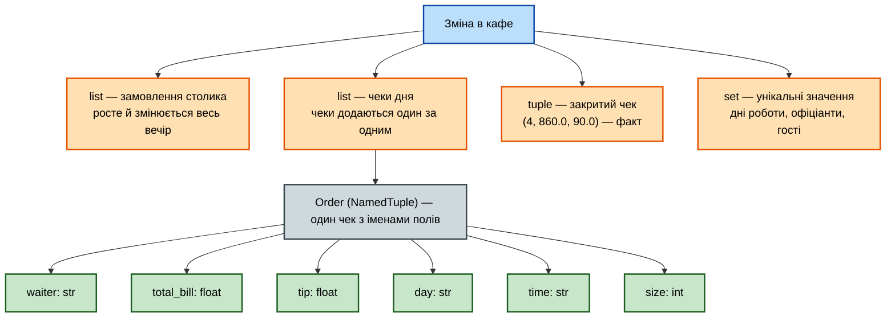

```text
orders — list (змінний)            ──► Order — tuple з іменами (незмінний)
['Тарас' 540.0 50.0 'пт' 'вечеря' 2]        .waiter .total_bill .tip .day .time .size
```

Два рівні: **набір** чеків росте протягом дня, а **кожен чек** після закриття не змінюється.

---

# 2. Список: що вміє і як обирати метод

Кожна подія вечора — один метод. Схема читається як питання «що я хочу зробити з набором?».

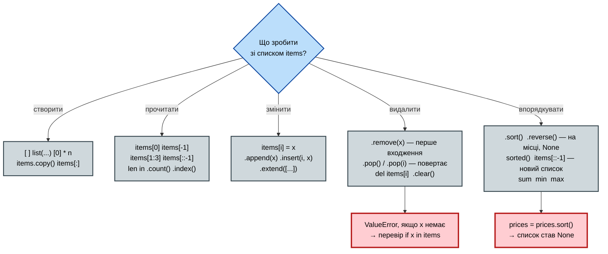

### Два імені — один список

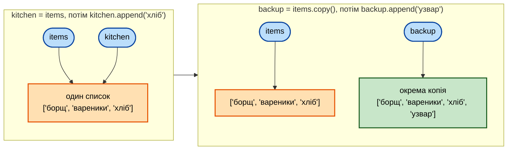

`b = a` для списку **не копіює** — прив'язує друге ім'я до того самого об'єкта. Копія — `.copy()`, `a[:]` або `list(a)`.

---

# 3. Кортеж і NamedTuple: життя закритого чека

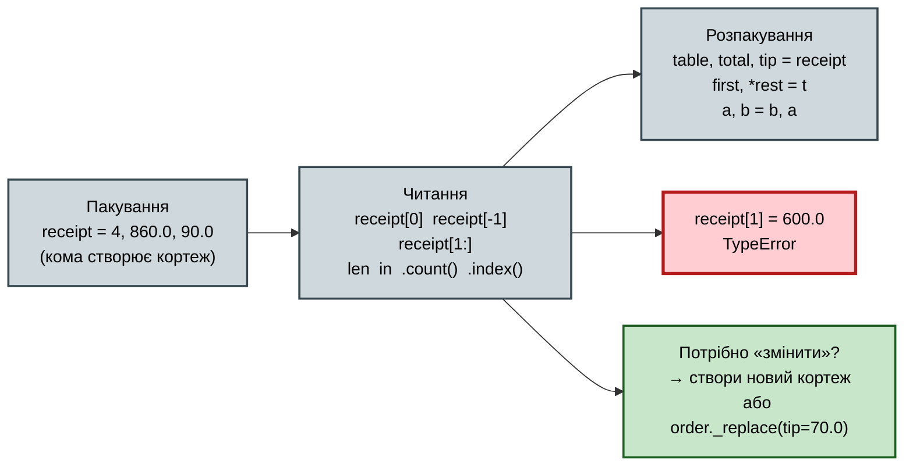

### Який контейнер для запису?

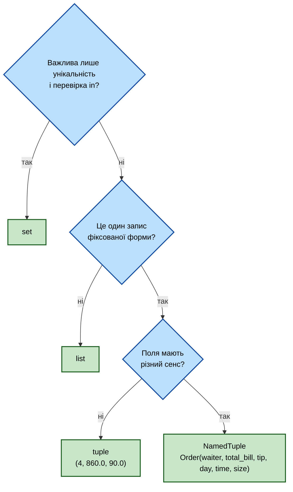

```text
   Order( waiter , total_bill , tip , day , time , size )
            [0]       [1]       [2]   [3]   [4]    [5]
          .waiter  .total_bill  .tip  .day  .time  .size     ← імена замість індексів
   isinstance(order, tuple) → True;   Order._fields  order._asdict()  order._replace(...)
```

---

# 4. Множина: унікальність і порівняння наборів

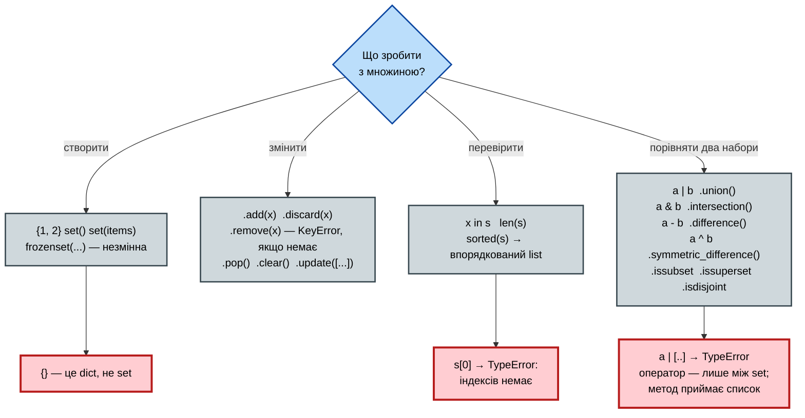

### Гості двох днів

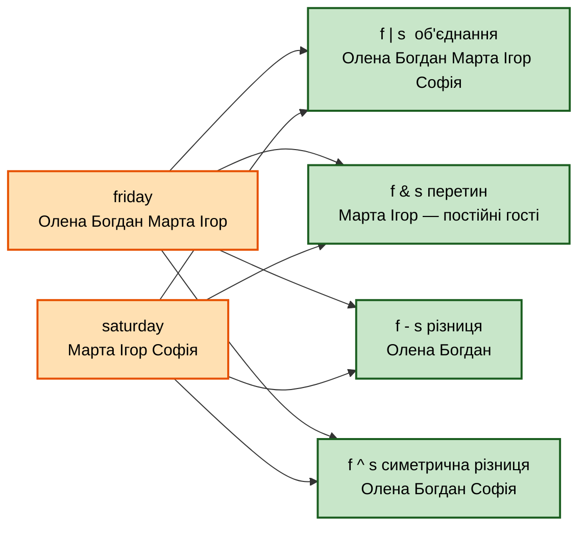

```text
   list → set → sorted(list):   друзі з повторами → унікальні → впорядкований вивід
   ["кава", "чай", "кава"]  →  {"кава", "чай"}  →  ["кава", "чай"]
```

---

# 5. Алгоритми на `while`

## 5.1 Прохід з індексом — основа всього

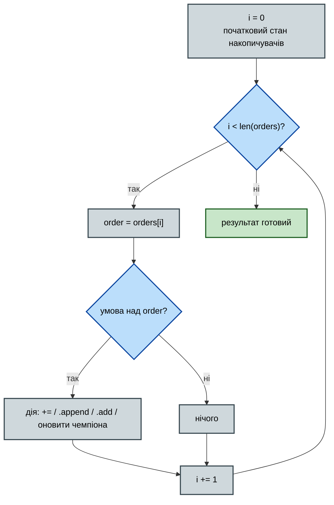

Без `i += 1` цикл нескінченний; з `i <= len(...)` — `IndexError` на останньому кроці.

## 5.2 Чотири форми одного циклу

| Форма | Початковий стан | Дія в тілі | Приклад у кафе |
|---|---|---|---|
| накопичувач | `total = 0` | `total += order.total_bill` | виторг, чайові |
| лічильник | `count = 0` | `if …: count += 1` | скільки вечерь |
| фільтр | `new = []` | `if …: new.append(order)` | великі столи — у **новий** список |
| унікальні | `seen = set()` | `seen.add(order.day)` | дні роботи, офіціанти |

## 5.3 «Поточний чемпіон» — найбільший чек

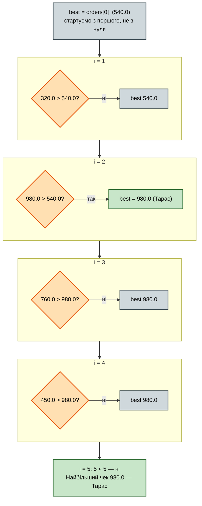

Чому старт з `orders[0]`, а не з `0`: якби всі чеки були поверненнями (від'ємні), нуль став би «максимумом», якого немає в даних.

## 5.4 Фільтр — завжди в новий список

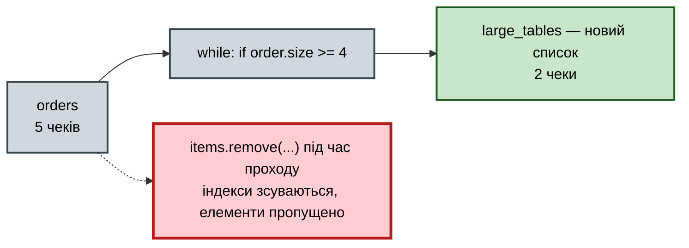

---

# 6. Повний потік: звіт за день

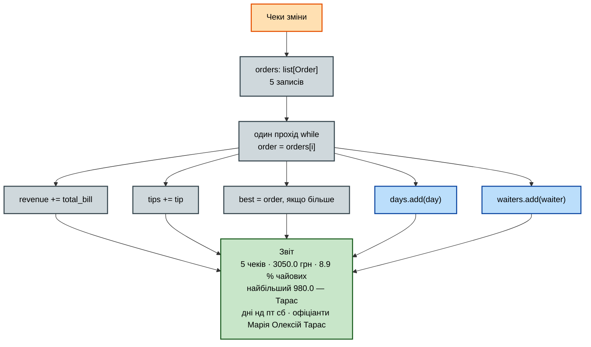

---

# 7. Відповідність алгоритму і Python

| Алгоритм | Python | У звіті кафе |
|---|---|---|
| послідовність, що росте | `list` | `orders`, `items` |
| запис, що не змінюється | `tuple` / `NamedTuple` | `receipt`, `Order` |
| унікальні значення | `set` | `days`, `waiters`, гості |
| цикл | `while i < len(orders)` | прохід чеками |
| умова | `if order.total_bill > best.total_bill` | поточний чемпіон |
| накопичення | `+=`, `.append()`, `.add()` | виторг, фільтр, унікальні |
| результат | `print()` | звіт для власниці |

```text
ДАНІ → СТРУКТУРА → ЦИКЛ + УМОВА → НАКОПИЧЕННЯ → РЕЗУЛЬТАТ
```

## Питання без відповіді

«А чайові **кожного офіціанта окремо**?» — `tips` знає скільки, `waiters` знає хто, і жоден з них не зв'язує ім'я з числом. Структура «ім'я → число» — **словник**, урок 6: той самий `orders`, той самий звіт плюс один рядок.

---

# Головна ідея уроку

Програмування — це не написання коду, а **вибір структури під дані**: «цей набір росте» (`list`), «цей запис не зміниться» (`tuple`), «тут важлива лише наявність» (`set`). Алгоритм — один і той самий прохід `while` — не змінюється, коли чеків стає 244 замість 5.
